备注：1-6，8BEP，14，25，108-111attention机制，116-127-129编码器，130-136解码器
pass：7英文分词，9-13,15-24，112-115案例

# 0 NLP 导论
如何让计算机理解、生成和处理人类语言，从而实现人与机器之间的交互。       
## 0.1 按功能划分的任务                 
- **文本分类**：对整段文本进行判断或归类，比如垃圾邮件分类、情感分析等。
- **序列标注**：对文本中的每个元素token进行标注，比如命名实体识别、词性标注等。
- **文本生成**：根据输入文本生成新的文本，比如文本摘要、对话系统等。
- **信息抽取**：从文本中提取结构化信息，比如关系抽取、事件抽取等，会预测答案的起始位置和结束位置。
- **文本转换**：将文本从一种形式转换为另一种形式，比如机器翻译、文本摘要等。

## 0.2 技术演进
- **机器学习**阶段：逻辑回归、支持向量机等，特征工程最为关键，词袋模型完全忽略了文本的语序和上下文信息，引入n-gram即将相邻的n个词作为一个整体来建模，保留一部分词序信息。
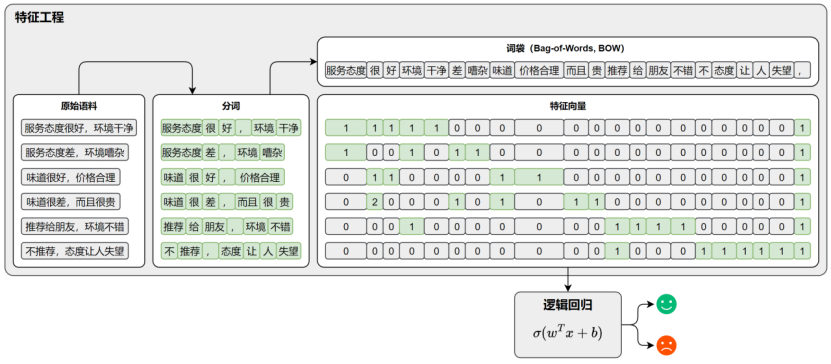                  
- **深度学习**阶段：基于神经网络的RNN、LSTM、GRU等模型，能够捕捉文本的上下文信息，但存在长距离依赖问题。随后的Transformer模型引入了自注意力机制，能够更好地捕捉长距离依赖关系，并且支持并行计算，大大提升了模型的效率和性能。预训练语言模型如BERT和GPT通过在大规模文本数据上进行预训练，学习了丰富的语言知识和上下文信息，在各种NLP任务中取得了显著的效果。

# 1 文本表示

文本表示的第一步是**分词**和**词表构建**。              
*分词Tokenization*是将文本分割成一个个单独的词或子词的过程。                         
*词表Vocabulary*是一个包含所有可能出现的词或子词的列表，每个词或子词都对应一个唯一的索引。

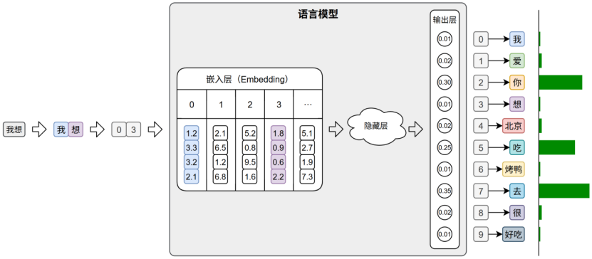

模型会首先对输入文本进行分词，再通过词表将每个 token 映射为其对应的 ID。接着，这些 ID 会被输入嵌入层（Embedding Layer），转换为低维稠密的向量表示（即词向量），输出层会针对词表中的每个 token 生成一个概率分布，表示其作为下一个词的可能性。系统通常选取具有最大概率的ID，并通过词表查找对应的 token，从而逐步生成最终的输出文本。

## 1.1 分词
[BPE算法介绍](https://hf-mirror.com/learn/llm-course/chapter6/5?fw=pt)             
> **BPE训练**                      
首先计算语料库中使用的唯一词集（在完成归一化和预分词步骤之后），然后通过提取用于书写这些词的所有符号来构建词汇表。                    
在获得基础词汇表后，我们通过学习*合并规则*来添加新的词元，直到达到所需的词汇量。合并规则是将现有词汇表中的两个元素合并成一个新元素的规则。因此，在训练初期，这些合并规则会生成包含两个字符的词元，随着训练的进行，会生成更长的子词。              
在分词器训练的任何步骤中，BPE 算法都会搜索出现频率最高的现有词元对（这里的“词元对”指的是单词中两个连续的词元）。出现频率最高的词元对将被合并，然后我们重复此过程进行下一步直到达到期望的词汇量。  

> **tokenization**             
完成训练之后就可以对新的输入 tokenization 了，从某种意义上说，新的输入会依照以下步骤对新输入进行 tokenization：标准化 → 预分词 → 将单词拆分为单个字符 → 根据学习的合并规则，按顺序合并拆分的字符。

## 1.2 词表示
### 1.2.1 词表示概述
在分词完成之后，文本被转换为一系列的 token（词、子词或字符），为了让模型能够理解和处理文本，必须将这些 token 转换为计算机可以**识别和操作的数值形式**，这一步就是所谓的词表示（word representation）。                 
词表示的发展经历了从稀疏的**one-hot编码**，到稠密的语义化**词向量**，再到近年来的**上下文相关**的词表示。不同的词表示方法在表达能力、语义建模、上下文适应性等方面存在显著差异。

### 1.2.2 One-hot编码
最早期的词向量表示方式是 One-hot 编码：它将词汇表中的每个词映射为一个**稀疏向量**，向量的长度等于整个词表的大小。该词在对应的位置为 1，其他位置为 0。

one-hot 虽然实现简单、直观易懂，但它无法体现词与词之间的语义关系，且随着词表规模的扩大，<u>向量维度会迅速膨胀</u>，导致计算效率低下。因此，在实际自然语言处理任务中，one-hot 表示已经很少被直接使用.

### 1.2.3 语义化词向量
传统的one-hot表示虽然结构简单，但它无法反映词语之间的语义关系，也无法衡量词与词之间的<u>相似度</u>。为了解决这个问题，研究者提出了Word2Vec模型，它通过对大规模语料的学习，为每个词生成一个具有语义意义的稠密向量表示。这些向量能够在连续空间中表达词与词之间的关系，使得“意思相近”的词在空间中距离更近。

### 1.2.4 上下文相关的词表示
虽然像Word2Vec这样的模型已经能够为词语提供具有语义的向量表示，但是它只为每个词分配一个<u>固定的向量</u>表示，不论它在句中出现的语境如何。这种表示被称为静态词向量（static embeddings）。然而，语言的表达极其灵活，一个词在不同上下文中可能有完全不同的含义。

**上下文相关词表示**（Contextual Word Representations），是指词语的向量表示会根据它所在的句子上下文动态变化，从而更好地捕捉其语义。一个具有代表性的模型是——ELMo。
该模型全称为 Embeddings from Language Models，发表于2018年2月。其基于LSTM 语言模型，使用上下文动态生成每个词的表示，每个词的向量由其前文和后文共同决定，是第一个被广泛应用于下游任务的上下文词向量模型。

# 2 传统序列模型

# 3 seq2seq模型

# 4 attention机制      

传统的 Seq2Seq 模型中，编码器在处理源句时，无论其长度如何，最终都只能将整句信息压缩为一个<u>固定长度</u>的上下文向量，用作解码器的唯一参考。这种设计存在两个显著问题：
1. 信息压缩困难：固定向量难以完整表达长句或复杂语义，容易丢失关键信息；
2. 缺乏动态感知：解码器在每一步生成中都只能依赖同一个上下文向量，难以根据不同位置的生成需要灵活提取信息。       
                    

为了解决上述问题，研究者引入了**Attention 机制**。其核心思想是：     
解码器在生成目标序列的每一步时，不再依赖于一个静态的上下文向量，而是根据当前的解码状态，<u>动态地从编码器各时间步的隐藏状态中选取最相关的信息</u>，以辅助当前步的生成。
这种机制赋予模型“对齐”能力，使其能够自动判断源句中哪些位置对当前的目标词更为重要，从而有效缓解信息瓶颈问题，提升生成质量与表达能力。

## 4.1 工作原理

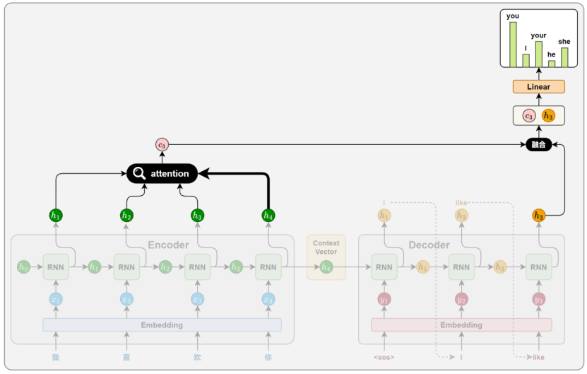

### 4.1.1 相关性计算           
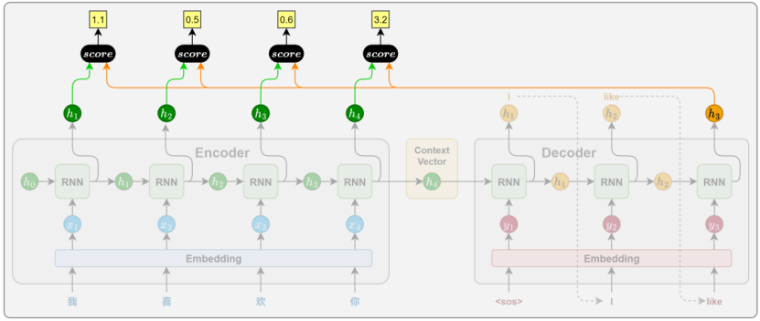

在目标序列生成的每一步，解码器都会计算当前时间步的隐藏状态与编码器各个时间步输出之间的相关性。这些相关性衡量了<u>源句中每个位置对当前生成内容的重要程度</u>，从而决定模型应将多少注意力分配给不同的源位置。                       

相关性的计算依赖于特定的函数，通常被称为注意力评分函数（attention scoring function）。常见的评分函数实现方式将在下一节中详细介绍。

### 4.1.2 注意力权重            
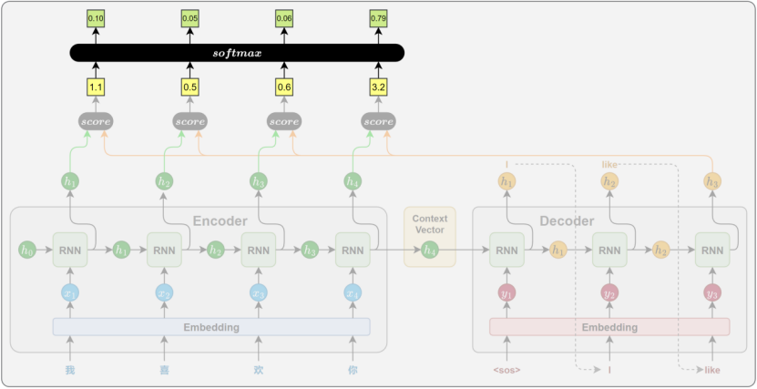

得到所有源位置的注意力评分后，使用**Softmax 函数**将其归一化为概率分布，作为注意力权重。得分越高的位置，其对应的权重越大，代表模型在当前生成中更关注该位置的信息。                        

### 4.1.3 上下文向量计算     
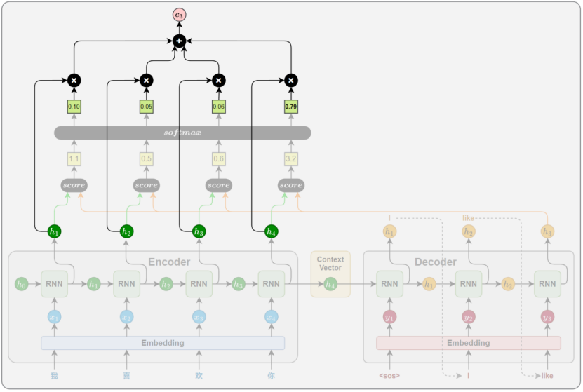

将所有编码器输出按照注意力权重进行加权求和，得到一个上下文向量。这个向量就表示当前时间步，模型从源句中提取出的关键信息。

### 4.1.4 解码信息融合
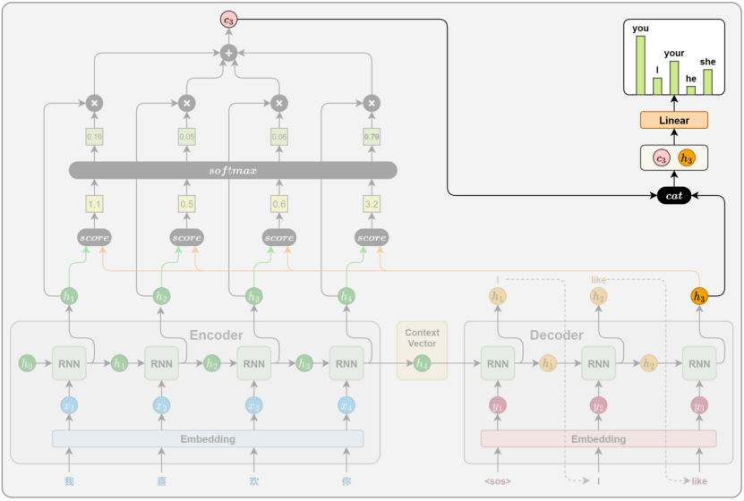     

在得到上下文向量后，解码器将其与当前时间步的隐藏状态进行拼接，以融合两者信息，最终通过**线性变换和 Softmax**，生成当前时间步目标词的<u>概率分布</u>。

## 4.3 注意力评分函数
注意力评分函数有多种实现方式。本节将介绍三种常见的计算方法：点积评分（Dot）、通用点积评分（General）和拼接评分（Concat）。它们虽然在结构上各有差异，但本质上都是用于衡量解码器当前隐藏状态与编码器各时间步隐藏状态之间的相关性，并据此分配注意力权重。                                                  

### 4.3.1 点积评分(Dot)
**点积评分**是注意力机制中最简单、最直接的一种相关性评分方法。它通过计算解码器当前时间步的隐藏状态与编码器每个时间步的隐藏状态的点积，来衡量二者之间的相关性：          
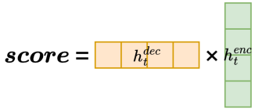             
其含义可以理解为：如果两个向量方向越一致（即越接近），它们的<u>点积就越大，表示相关性</u>越强，模型应当给予更多注意力。

### 4.3.2 通用点积评分(General)
通用点积评分在点积的基础上引入了一个**可学习的权重矩阵W**，用于先对编码器隐藏状态进行线性变换，再与解码器隐藏状态进行点积：                 
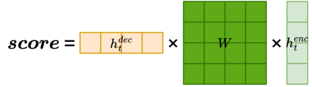                
该方法的设计动机主要是为了解决编码器和解码器隐藏状态维度不一致的问题。通过引入权重矩阵W，不仅实现了**维度对齐**，也增强了模型对编码器输出的适应能力，从而提升了注意力机制的表达能力。

### 4.3.3 拼接评分(concat)
拼接评分是一种表达能力更强的相关性评分方法。它的核心思想是：将解码器当前隐藏状态与编码器每个时间步的隐藏状态拼接为一个长向量，经过线性变换$W_1$和非线性激活，最后用一个向量$W_2$进行投影，得到最终打分值：              
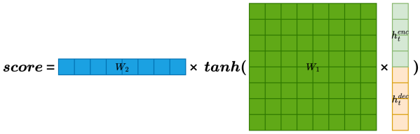                  
相比前两种方法，Concat 评分方式在建模能力上更强。其中的线性变换是通过学习的得到的。它不仅考虑了两个状态的数值关系，还引入**非线性变换**，能够捕捉更复杂的交互模式，更适合处理对齐关系复杂的任务场景。           

   这是使用 CSS 控制的首行缩进段落。

# 5 transformer模型    

此前的Seq2Seq模型通过注意力机制取得了一定提升，但由于
整体结构仍<u>依赖 RNN</u>，依然存在计算效率低、难以建模长距离依赖等结构性限制。               

为了解决这些问题，Google在2017 年发表一篇论文《Attention Is All You Need》，提出了一种全新的模型架构——Transformer。该模型完<u>全摒弃了 RNN 结构，转而使用注意力机制直接建模序列中各位置之间的关系</u>。通过这种方式，Transformer不仅显著提升了训练效率，也增强了模型对长距离依赖的建模能力。           

在机器翻译任务中，它首次超越了 RNN 模型的表现，并成为后续各类预训练语言模型的基础框架，如 BERT、GPT 等。这些模型推动 NLP 进入了<u>“预训练 + 微调”</u>的新时代，极大地提升了模型在多种任务上的通用性与性能。            

## 5.1 整体结构

### 5.1.1 核心思想
               
在 Seq2Seq 模型中，注意力机制的引入显著增强了模型的表达能力。它允许解码器在生成每一个目标词时，<u>根据当前解码状态动态选择**源序列**中最相关的位置，并据此融合信息</u>。  有效缓解了将整句信息压缩为<U>固定向量</u>所带来的信息瓶颈。        

注意力机制不仅是信息提取的工具，其本质是在<u>每一个目标位置上，显式建模该位置与**源序列**中各位置之间的依赖关系</u>。                  

与此同时，循环神经网络（RNN）作为 Seq2Seq 模型的核心结构，其作用也在于建模序列中的依赖关系。通过<u>隐藏状态的递归传递</u>，RNN 使当前位置的表示能够整合前文信息，从而隐式捕捉上下文依赖。从功能角度看，RNN 与注意力机制完成的是同一类任务：**建立序列中不同位置之间的依赖联系**。                   

相比 RNN，注意力机制在结构上具备明显优势：<u>无需顺序计算，便于并行处理</u>；任意位置间可直接建立联系，更适合捕捉长距离依赖。

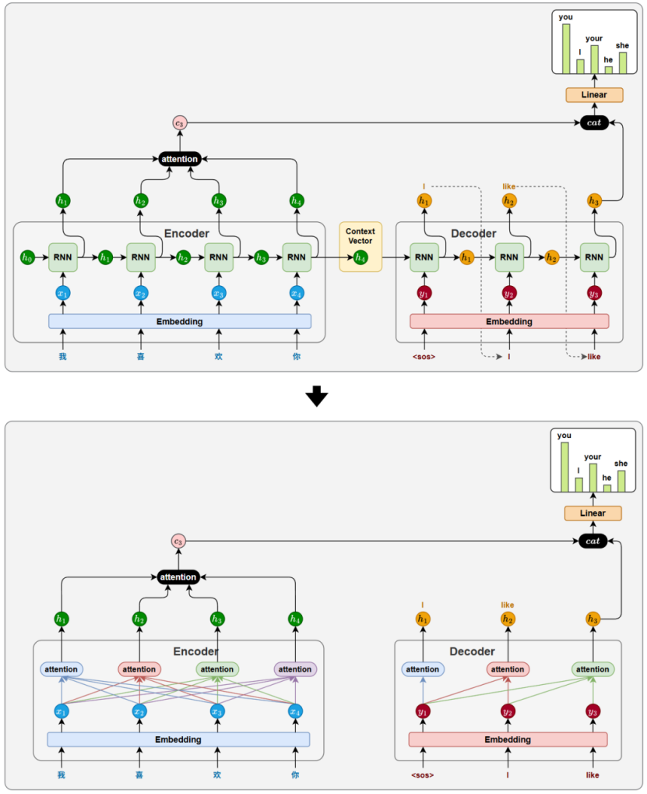

Transformer 它摒弃了传统的循环结构，仅依靠注意力机制完成输入序列和输出序列中所有位置之间的依赖建模任务。这一结构上的彻底变革，也正是论文标题 Attention is All You Need 所体现的核心理念。

### 5.1.2 整体结构
Transformer 的整体结构延续了 Seq2Seq 模型中**编码器-解码器**的设计理念。编码器（Encoder）负责对输入序列进行<u>理解和表示</u>，而解码器（Decoder）则根据编码器的输出<u>逐步生成目标序列</u>。                  

【注意】：Transformer 的 **Encoder** 在训练和推理时都可以并行；**Decoder** 在训练时也可以通过 causal mask 并行计算所有位置，但在推理生成时，由于**自回归依赖**，不能并行生成所有 token，只能逐 token 生成。     

下图为Transformer**推理**阶段：

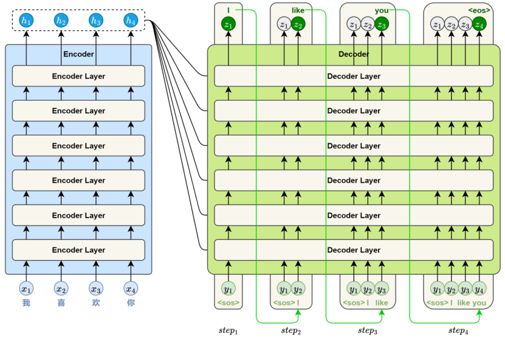         

与基于 RNN 的 Seq2Seq 模型一样，Transformer 的解码器采用**自回归方式**生成目标序列。不同之处在于，每一步的输入是<u>此前已生成的全部词</u>，模型会输出一个与输入长度相同的序列，但我们只取最后一个位置的结果作为当前预测。这个过程不断重复，直到生成结束标记``<eos>``。

此外，Transformer 的编码器和解码器模块分别<u>由多个结构相同的层堆叠而成</u>。通过层层堆叠，模型能够逐步提取更深层次的语义特征，从而增强对复杂语言现象的建模能力。标准的 Transformer 模型通常包含 6个编码器层和 6 个解码器层。

## 5.2 编码器
编码器用于理解输入序列的语义信息，并生成每个token的上下文表示，为解码器生成目标序列提供基础。  编码器由多个结构相同的编码器层（Encoder Layer）堆叠而成。                              

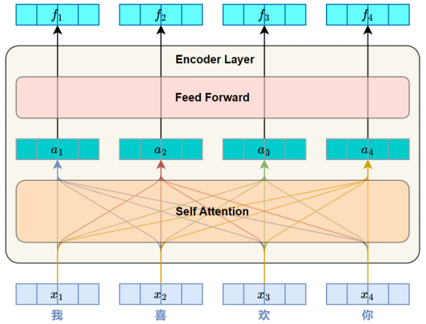

每个 Encoder Layer的主要任务都是对其输入序列进行上下文建模，使每个位置的表示都能融合来自整个序列的全局信息。每个 Encoder Layer都包含两个子层（**sublayer**）:
- **自注意力Self-Attention**用于捕捉序列中各位置之间的依赖关系。
- **前馈神经网络Feed-Forward**用于对每个位置的表示进行<u>非线性变换</u>，从而提升模型的表达能力。

### 5.2.1 自注意力层
“自”注意力，是因为模型在计算每个位置的表示时，所参考的信息<u>全部来自同一个输入序列本身</u>，而不是来自另一个序列。          

自注意力的核心思想是：<u>每个位置用**自身**的 Query 向量，与整个序列中**所有位置**的 Key 向量进行相关性计算</u>，从而得到注意力权重，并据此对<u>对应的 Value 向量加权汇总</u>，形成新的表示。这包含了它自己和上下文的信息！

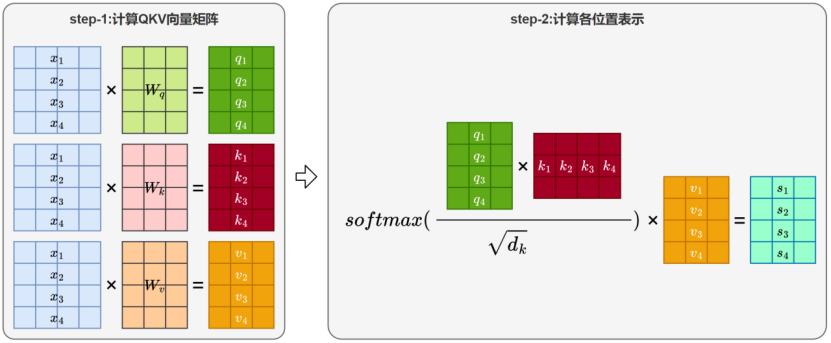

1. <big>**生成Query、Key、Value向量**</big>             
将输入序列中的<u>每个位置</u>表示映射为三个不同的向量：               
   - **查询Query**
     > 表示当前词的用于发起注意力匹配的向量——我想找什么信息；
   - **键Key**     
     > 表示序列中每个位置的内容标识，用于与 Query 进行匹配——我有什么特征可以与别人匹配；
   - **值Value**    
     > 表示该位置携带的信息，用于加权汇总得到新的表示——我被关注后能提供什么信息。              

    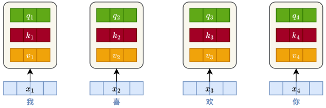

    三个向量的计算如下：                     
    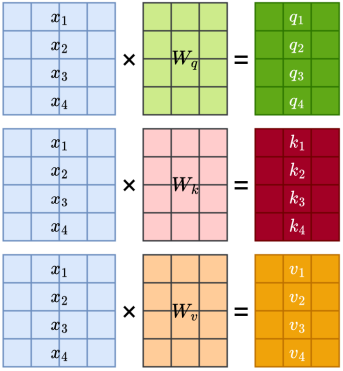

    其中$x_i$是第i个Token的初始向量，整个蓝色矩阵$X$就是所有 Token 的初始向量<u>按行拼成</u>的矩阵， 且$W_q$,$W_k$,$W_v$均为可学习的参数矩阵。             
        
    原论文中输入的Token即$x_i$为$521$维，$QKV$向量为$64$维。

1.  <big>**计算位置相关性**</big>         
    完成 Query、Key、Value 向量的生成后，模型会使用<u>每个位置的 Query 向量与所有位置的 Key 向量</u>进行相关性评分。
    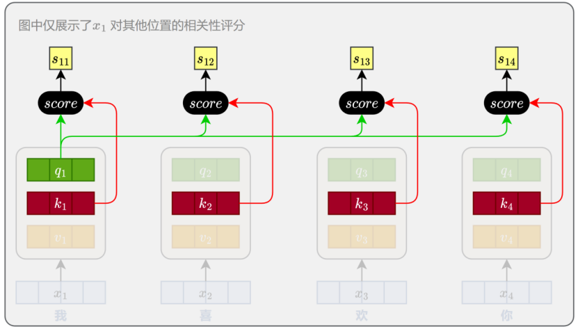

    评分函数采用**向量点积形式**。由于在高维空间中，点积的数值可能过大，会<u>影响 softmax 的稳定性，也会导致梯度消失</u>，因此在实际计算中对结果进行了缩放。最终的评分函数为：
    $$ 
    score(i,j)=\frac{q_i∙k_j}{\sqrt{d_k} }
    $$
                          
    其中$d_k$是key向量的维度，用于缩放点积的幅度。这个分数越大，<u>表示第 $i$ 个位置越应该关注第 $j$ 个位置的信息</u>。                

	对于整个序列，可以通过矩阵运算一次性计算所有位置之间的评分，计算公式如下图所示：
    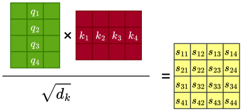

2. <big>**计算注意力权重**</big>              
   在得到每个位置与所有位置之间的相关性评分后，模型会使用 softmax 函数进行归一化，<u>确保每个位置对所有位置的关注程度之和为 1</u>，从而形成一个有效的加权分布。 

   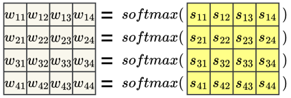      

   对于整个序列，模型要做的是对之前得到的注意力评分矩阵的每一行进行softmax归一化。

3. <big>**加权汇总生成输出**</big>         
    最后，模型会根据注意力权重对<u>所有位置的 Value 向量</u>进行加权求和，得到每个位置融合全局信息后的新表示。         
    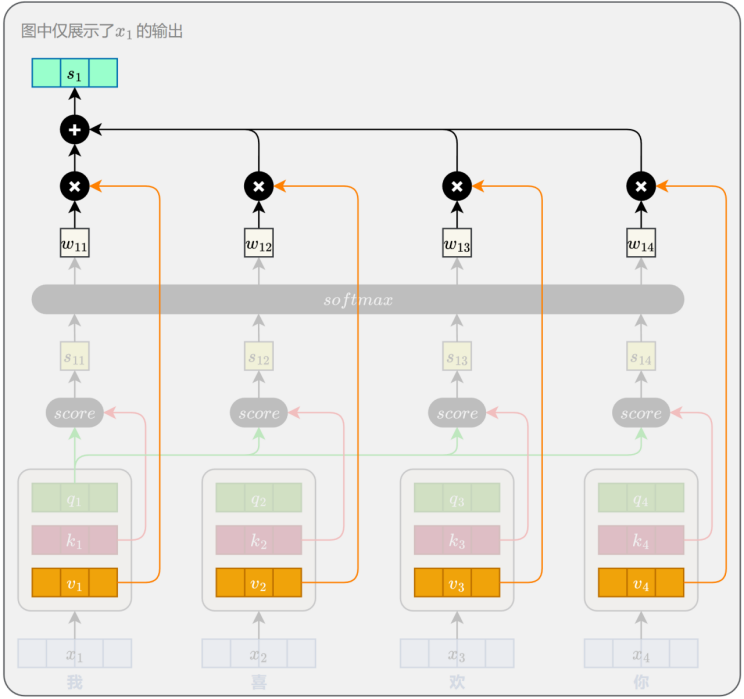   
    对于整个序列，同样可以通过矩阵运算一次性计算所有位置的输出，如下图所示
    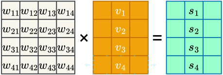
    
5. <big>**多头注意力**</big>                       
   自然语言本身具有高度的**语义复杂性**，一个句子往往同时包含多种类型的语义关系，模型需要<u>同时识别并建模多种层次和类型的依赖关系</u>。但这些信息很难通过单一视角或一套注意力机制完整捕捉。             
      
   为此，Transformer 引入了**多头注意力机制（Multi-Head Attention）**。其核心思想是通过多组**独立**的 Query、Key、Value 投影，让不同注意力头分别专注于不同的语义关系，最后将各头的输出**拼接融合**。                        

   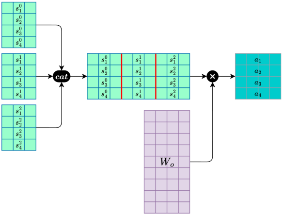
   - （1）分别计算各头注意力：每个 Self-Attention Head 独立计算一套注意力输出。
   - （2）合并多头注意力：多个输出矩阵<u>按维度拼接</u>，再乘以$W_o$得到最终多头注意力的输出。       
  
    【注意】为什么需要线性变换保证多头注意力输出的维度和输入的token维度即$d_{model}$一样它把多个独立头的信息，通过线性变换融合起来；同时校准维度和分布，让结果适配后续的残差连接和层归一化？

### 5.2.2 前馈神经网络层

前馈神经网络（**Feed-Forward Network，简称 FFN**）紧接在多头注意力子层之后。它通过对每个位置的表示进行<u>逐位置、非线性的特征变换</u>，进一步提升模型对复杂语义的建模能力。
  
一个标准的 FFN 子层包含**两个线性变换和一个非线性激活函数**，中间通常使用ReLU激活。其计算公式如下：
$$
FFN(x)=Linear_2(ReLU(Linear_1(x)))=max(0, W_1 x+b_1)·W_2+b_2
$$

【注意】：FFN输出的维度依然要和**词向量**的维度保持一致，即$n*d_{model}$。

### 5.2.3 残差连接与层归一化
在 Transformer 的每个编码器层中，每个子层，包括自注意力子层和前馈神经网络子层，其输出都要经过 **残差连接Residual Connection** 和 **层归一化Layer Normalization** 处理。这两者是深层神经网络中常用的结构，用于缓解模型训练中的<u>梯度消失、收敛困难</u>等问题，对于Transformer能够堆叠多层至关重要。         

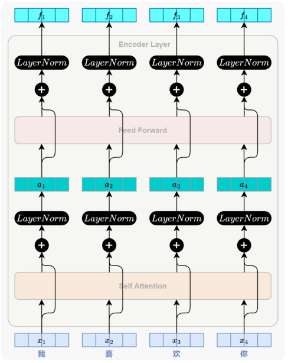

1. <big>**残差连接**</big>                  
    残差连接（Residual Connection，也称“**跳跃连接**”或“**捷径连接**”）最初在计算机视觉领域被提出，用于缓解深层神经网络中的<u>梯度消失问题</u>。        
    其核心思想是：                 
    将子层的输入直接与其输出相加，形成一条跨越子层的“捷径”，
    $$
    y = x + SubLayer(x)
    $$
    残差连接确保反向传播时，<u>梯度至少有一条稳定通路</u>可回传，是深层网络可稳定训练的关键结构。

2. <big>**层归一化**</big>                     
    每个子层在残差连接之后都会进行层归一化（Layer Normalization，简称 LayerNorm）。它的主要作用是<u>规范输入序列中**每个token**的特征分布</u>（某个token的表示可能在不同维度上有较大数值差异），提升模型训练的稳定性。             
    该操作会将每个token的向量调整为<u>均值为 0、方差为 1 的规范分布</u>。            
    - 均值计算：
        $$
        \mu = \frac{1}{d} \sum_{i=1}^{d} x_i
        $$
    - 方差计算：
        $$
        \sigma^2 = \frac{1}{d} \sum_{i=1}^{d} (x_i - \mu)^2
        $$
    - 归一化：
        $$
        x_{norm} = \frac{x - \mu}{\sqrt{\sigma^2 + \epsilon}}
        $$
        $\epsilon$为一个小的常数，防止出现除以0的情况。
    - **缩放和平移**：                     
        让模型可以学习在归一化后的基础上进行适当的调整，保证归一化不会限制模型的表示能力。其中$\gamma$ 和 $\beta$ 是<u>可学习的参数</u>。         
        $$
        LayerNorm(x) = \gamma \cdot x_{norm} + \beta
        $$

   

### 5.2.4 位置编码 ???
Transformer 模型完全摒弃了 RNN 结构，意味着它<u>不再按顺序处理序列</u>，而是可以并行处理所有位置的信息。尽管这带来了显著的计算效率提升，但在没有额外机制的情况下，Transformer 无法区分“猫吃鱼”和“鱼吃猫”这类语序不同但词汇相同的句子。                  

为了解决这一问题，Transformer 引入了一个关键机制——**位置编码（Positional Encoding）**。该机制为每个词引入一个<u>表示其位置信息的向量</u>，并将其与对应的<u>词向量相加</u>，作为模型输入的一部分。这样一来，模型在处理每个词时，既能获取词义信息，也能感知其在句子中的位置，从而具备对基本语序的理解能力。                

<small>               

- 最直接的方式是<u>使用绝对位置编号</u>来表示每个词的位置，虽然简单但———越靠后的 token 位置编码就越大，若直接与词向量相加，会造成数值倾斜，让模型更关注位置，而忽视词义。 
- 为缓解这一问题，可以考虑将<u>位置编号归一化为$[0, 1]$区间</u>，虽然使数值范围更平稳，但——
相同位置的词在不同长度句子中的位置编码不再一致，会导致模型难以形成稳定的位置感知能力。               
</small>                 

理想的做法是：每个位置都拥有一个**唯一且一致**的编码，与句子长度无关。

为了解决上述问题，Transformer 使用了一种基于正弦（sin）和余弦（cos）函数的位置编码方式，具体定义如下：

$$PE_{(pos, 2i)} = sin(\frac{pos} {10000^{2i/d_{model}}}) 
$$

$$
PE_{(pos, 2i+1)} = cos(\frac{pos} {10000^{2i/d_{model}}})
$$         

式中：$pos$为位置，$i$为维度索引。也就是说，位置编码的每一维都对应一个正弦曲线。选择这个函数是因为我们假设它可以让模型很容易地通过相对位置来学习，因为对于任何固定的偏移量$k$，$PE_{(pos + k)}$可以表示为$PE_{(pos)}$的线性函数。

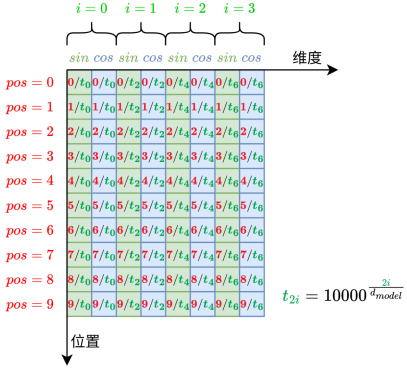       

**优势**如下：
- 所有值都在[−1,1]范围内，数值稳定；
- 编码方式固定、可预计算，无需训练；
- 相同位置的编码在不同句子中保持一致；
- 编码之间具有数学规律，便于模型在注意力机制中感知词语之间的相对位置关系。
  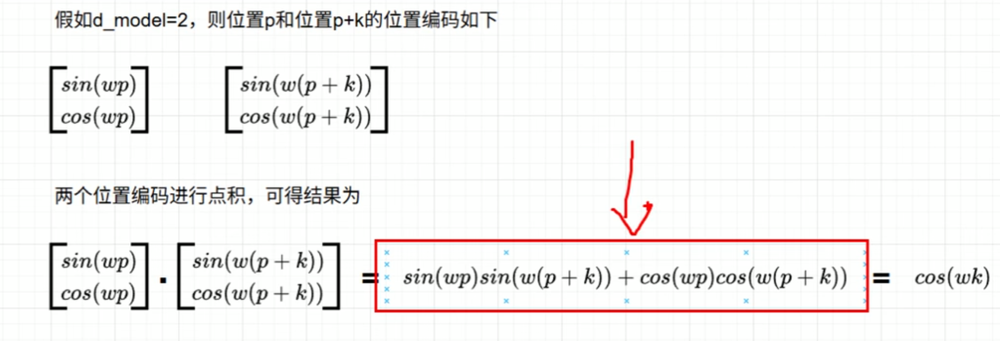

### 5.2.5 小结
Transformer **编码器**通过多个结构一致的编码器层堆叠构成，每一层由两个核心子层组成：
- 自注意力子层（Self-Attention）：             
通过 Query、Key、Value 向量机制计算全序列中各位置之间的相关性，提取全局上下文信息，使每个词的表示能够融合整个序列的信息。
- 前馈神经网络子层（Feed-Forward Network）：                  
对每个位置独立进行非线性特征变换，增强模型的表示能力。

另外，在这两个子层之后，Transformer 引入了两个关键结构：                   
- 残差连接（Residual Connection）：缓解深层网络中的梯度消失问题；
- 层归一化（Layer Normalization）：规范向量分布，提升训练稳定性。             
-              
最后，为弥补模型并行结构下缺乏顺序感的缺陷，Transformer 使用基于正余弦函数的位置编码来提供序列中每个词的位置信息。

## 5.3 解码器      

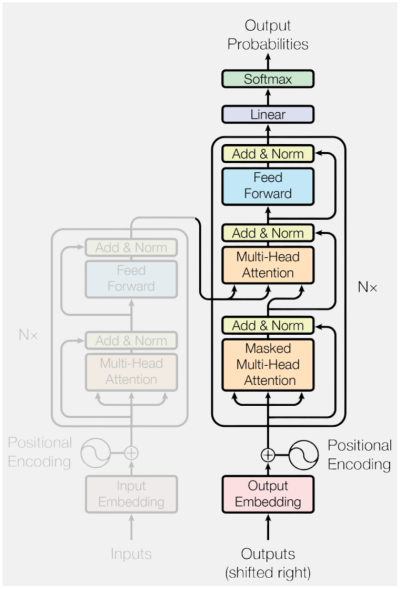
根据编码器的输出，逐步生成【推理】目标序列中的每一个词。其生成方式采用**自回归机制**（autoregressive）：                   
- 每一步的输入由<u>此前已生成的所有词组成</u>，模型将输出一个与当前输入<u>长度相同</u>的序列表示;
- 只取最后一个位置的输出，作为当前步的预测结果;
- 这一过程会不断重复，直到生成特殊的结束标记 ``<eos>``，表示序列生成完成。       

 （下图为推理阶段）   
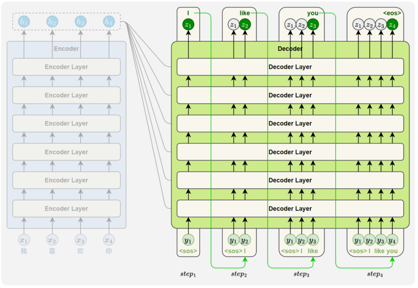

### 5.3.1 Masked自注意力子层
该子层的主要作用是——建模目标序列中当前位置与前文之间的依赖关系，为当前词的生成提供<u>上下文语义支持</u>。                             

此外，从结构上看，编解码器都具有一个典型特性——输入多少个词，就输出多少个表示。                   
- **推理阶段**只使用解码器最后一个位置的输出作为当前步的预测结果，如下图所示：
    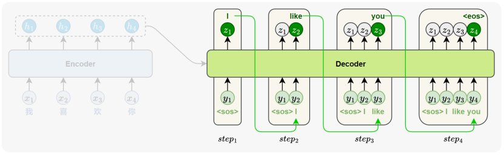

- **训练阶段**为提升效率，Transformer 采用并行训练策略——一次性输入完整目标序列，同时预测每个位置的词。如下图 [训练时解码器] 所示：        
    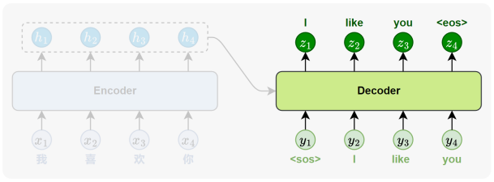         

    但若不加限制，会让模型在训练每个位置时提前访问未来信息，<u>破坏生成任务的因果结构</u>。如下图 [不加MASK的自注意力子层] 所示：                      
    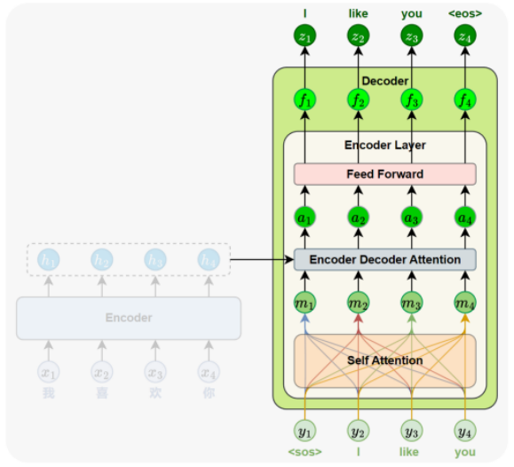

    $Mask$机制会在计算注意力时，阻止模型访问当前位置之后的词，只允许它依赖自身及前文的信息，从而保持训练与推理阶段的一致性。如下图 [Masked自注意力子层] 所示：                     
    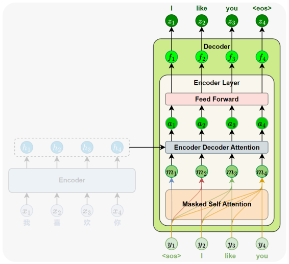        

    **Mask的实现**非常简单：将注意力得分矩阵中<u>当前位置对其后续位置的评分设置为$-\infty$</u>。再经过 $softmax$运算后，这些位置的<u>权重会趋近于 0</u>。最终在加权求和时，未来位置的信息几乎不会参与计算，从而实现了“当前词只能看到它前面的词”的约束。如下图所示：
    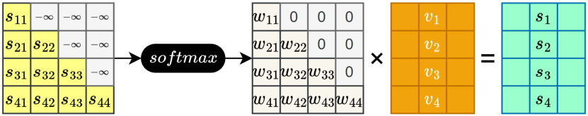

### 5.3.2 编码器-解码器注意力子层
该子层的主要作用——建模<u>当前解码位置与源语言序列中各位置</u>之间的依赖关系，帮助模型在生成目标词时有效地<u>参考输入内容</u>，编码器-解码器注意力的核心机制与前面讲过的自注意力机制完全一致，区别仅在于：                    
$Query$ 来自**解码器**当前的输入表示，注意力机制会根据 $Query$ 与所有来自**编码器**的$Key$ 的<u>相似度</u>，为每个源位置分配一个<u>权重</u>，然后用这些权重<u>对来自**编码器**的 $Value$ 进行加权求和</u>，得到当前生成词所需的上下文信息。

### 5.3.3 小结

- **Masked自注意力子层**（Masked Self Attention）                            
用于建模当前位置与前文词之间的依赖关系。为了在训练时模拟逐词生成的过程，引入Mask，限制每个位置<u>只能关注它前面的词</u>。
- **编码器-解码器注意力子层**（Encoder-Decoder Attention）                   
用于建模当前解码位置与源序列各位置之间的依赖关系。通过注意力机制，模型能够根据当前状态<u>从编码器的输出中提取相关上下文信息</u>。             
- **前馈神经网络子层**（Feed-Forward Network）                     
与编码器中结构完全一致，对每个位置的表示进行<u>非线性变换</u>，增强模型的表达能力。               
- 每个子层后也都配有**残差连接与层归一化**（Layer Normalization）            
  结构设计与编码器保持一致，确保训练的稳定性和效率。           
- 解码器在输入端同样需要加入**位置编码**（Positional Encoding），用于提供序列中的位置信息，其计算方式与编码器中相同。                   
- 在输出端，解码器的隐藏向量会送入一个**线性变换层**（Linear），映射为词表大小的向量，并通过 **Softmax** 生成一个概率分布，用于预测当前应输出的词。                     

# 6 预训练
解码器结构gpt
编码器结构Bert

