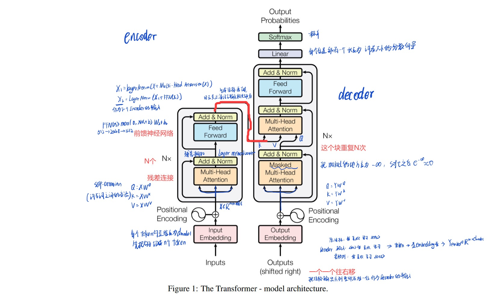
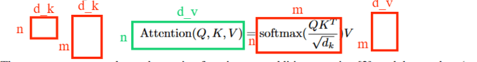
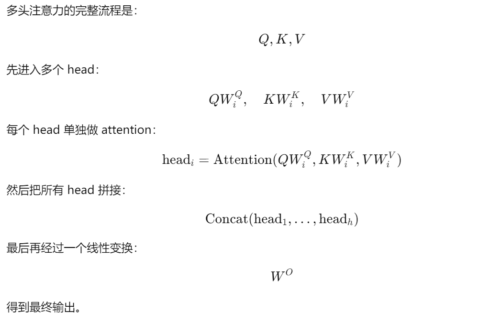
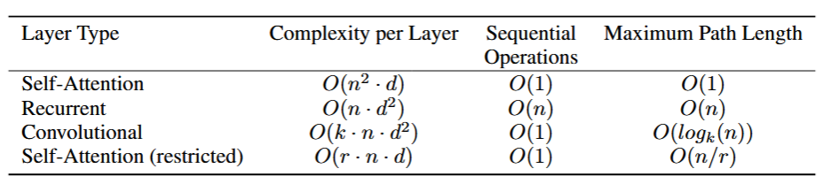

# 2 摘要
在主流的**序列转导模型**是基于复杂的循环或卷积神经网络，包括编码器和解码器。表现最好的模型还通过**注意力机制**将编码器和解码器连接起来。我们提出了一种新的简单的网络结构，Transformer，它**完全**基于注意力机制，不需要递归和卷积。在两个机器翻译任务上的实验表明，这些模型在性能上更胜一筹，同时具有更高的可并行性，需要的训练时间也显著减少。我们的模型在WMT 2014英德翻译任务达到了28.4的BLEU，比现有的最佳结果提高了2个BLEU以上。在WMT 2014英法翻译任务上，我们的模型建立了一个新的**单模型**，在8个GPU上训练了3.5天，其BLEU值达到了41.8。~~训练成本的一小部分来自文献中最好的模型~~。我们通过将Transformer成功地应用于大量和有限训练数据的英语成分句法分析，表明Transformer可以很好地**推广到其他任务中**。

> 【序列转录模型】机器翻译，给一句英文翻译出中文。                 
【注意力机制】在翻译过程中，模型会根据输入的不同部分给予不同的权重，从而更好地理解和生成翻译结果。             
【BELU】一种评估机器翻译质量的指标，数值越高表示翻译结果越接近人类翻译。

# 3 结论
在这项工作中，我们提出了Transformer，这是第一个完全基于注意力的序列转导模型，用**多头自注意力**取代了编码器-解码器架构中最常用的循环层。                 
对于翻译任务，Transformer的训练速度明显快于基于循环或卷积层的架构。在WMT 2014英译德和WMT 2014英译法的翻译任务上，我们都达到了一个新的水平。在前一个任务中，我们的最佳模型甚至优于所有先前报道的集成。                                
我们对基于注意力的模型的未来感到兴奋，并计划将其应用到其他任务中。我们计划将Transformer扩展到涉及除文本以外的输入和输出模态的问题，并研究局部的、受限制的注意力机制，以有效地处理图像、音频和视频等大的输入和输出。使得生成不那么时序化是我们的另一个研究目标。                              
我们用于训练和评估模型的代码可在https://github. com / tensorflow / tensor2tensor上获得。

# 4 导言 Introduction
RNN递归神经网络，特别是长短期记忆神经网络[13]和门控递归神经网络[7]，已经被确定为序列建模和转导问题的最先进方法，例如语言建模和机器翻译[35、2、5]。此后，大量的工作继续推动循环语言模型和编码器-解码器架构[38、24、15]的边界。                     
RNN模型通常沿着输入和输出序列的符号位置进行因子计算。将位置与计算时间中的步对齐，它们生成一个隐藏状态序列$h_t$，作为前一个隐藏状态$h_{t-1}$的函数和位置$t$的输入。这种固有的顺序特性**限制了**训练样本内的并行化，这在较长的序列长度下变得至关重要，因为内存约束限制了跨样本的批处理。最近的工作通过因子分解技巧[21]和条件计算[32]在计算效率上取得了显著的提高，同时在后者的情况下也提高了模型性能。然而，顺序计算的基本约束依然存在。                   
注意力机制已经成为各种任务中令人信服的序列建模和转导模型的组成部分，允许在输入或输出序列[2、19]中建模依赖关系而不考虑它们之间的距离。然而，除了少数情况外[ 27]，这些注意力机制都与循环网络结合使用。                  
我们提出了一个完全基于注意力机制的模型架构，称为Transformer，来解决序列转导问题。Transformer不使用任何递归或卷积结构，而是**完全依赖于注意力机制**来捕捉输入和输出之间的全局依赖关系。Transformer允许更多的并行化，并且可以在8个P100 GPU上训练12小时后达到翻译质量的最新水平。

> 【递归神经网络】一种神经网络结构，适用于处理序列数据，如文本或时间序列数据。它通过递归地处理输入序列中的每个元素来捕捉上下文信息。              
【长短期记忆神经网络】一种特殊的递归神经网络，能够更好地捕捉长期依赖关系，解决了传统递归神经网络在处理长序列时的梯度消失问题。                              
【门控递归神经网络】一种递归神经网络，通过引入门控机制来控制信息流动，进一步提高了模型的性能和稳定性。                              
【循环语言模型】一种基于递归神经网络的语言模型，通过递归地处理输入序列来预测下一个词或符号。            
【编码器-解码器架构】一种神经网络架构，通常用于序列转导任务，编码器将输入序列编码成一个固定长度的向量，而解码器则根据这个向量生成输出序列。

# 5 相关工作Background
      
减少顺序计算的目标也构成了Extended Neural GPU  16]，ByteNet [18]和ConvS2S [9]的基础，它们都使用卷积神经网络作为基本构建模块，并行地计算所有输入和输出位置的隐藏表示。在这些模型中，将来自两个**任意输入或输出位置的**信号相关联所需的操作数在位置之间的距离上呈线性增长，对于Conv S2S则呈线性增长，而对于Byte Net则呈对数增长。这使得**学习远距离位置**之间的依赖关系变得更加困难[12]。 在Transformer中，这被简化为一个常量的操作，尽管**这是以平均注意力加权位置而降低有效分辨率**为代价的，正如第3.2节所述，我们抵消了**多头注意力**的影响。             
**自注意力**，有时也称为帧内注意力，是一种将单个序列的不同位置联系起来以计算序列表示的注意力机制。自注意力已经成功地应用于多种任务中，包括阅读理解、抽象概括、文本蕴含和学习与任务无关的句子表征[4、27、28、22]。                      
端到端的记忆网络基于循环注意力机制而不是序列对齐的循环，已经被证明在简单语言问答和语言建模任务上表现良好[34]。                       
然而，据我们所知，Transformer是第一个完全依靠自注意力来计算其输入和输出的表示的转导模型，而不使用序列对齐的RNN或卷积。在接下来的章节中，我们将描述Transformer，激发自注意力，并讨论其相对于[17、18]和[9]等模型的优势。

> 和你论文相关的论文有哪些，联系是什么，和他们的区别又是什么

  

> 【多头注意力】一种注意力机制，通过将输入分成多个子空间并在每个子空间上独立计算注意力来捕捉不同类型的依赖关系，从而提高模型的表达能力，模拟卷积多通道。             
【自注意力和注意力的区别】自注意力是指在**同一序列**内部计算注意力，即一个序列的不同位置之间的关系；而一般的注意力机制可以是**跨序列**的，例如在编码器-解码器架构中，解码器对编码器输出的注意力。

# 6 模型Model Architecture
大多数有竞争力的神经序列转导模型都具有编码器-解码器结构[5、2、35]。在这里，编码器将符号表示的输入序列$( x_1 , ... , x_n)$ **映射 为连续表示** 的序列$z = ( z_1 , ... , z_n)$。给定$z$，解码器**每次生成一个**符号为一个元素的输出序列 $( y_1 , ... , y_m)$。在每一步，模型都是自回归的[10]，在生成下一个符号时，消耗先前生成的符号作为额外的输入。                       

Transformer遵循这种整体架构，使用堆叠的自注意力和逐点的全连接层，用于编码器和解码器，分别显示在图1的左半和右半。

> 【自回归】指模型在生成序列时，每次生成一个元素，并将之前生成的元素作为输入，以此类推，直到生成完整的序列。这种方式使得模型能够捕捉到序列中的依赖关系，但也限制了并行化的能力。

## 3.1 Encoder and Decoder Stacks

**编码器**： 由N = 6个**相同层的堆栈**组成。每层有两个子层sub-layer。第一个是多头自注意力机制，第二个是简单的、位置式的全连接前馈网络【MLP】。我们在两个子层的周围采用**残差连接**[11]，然后进行**层归一化**[1]。即每个子层的输出为$LayerNorm( x +Sublayer( x) )$，其中子层( x )为子层自身实现的函数。为了方便这些残差连接，模型中的所有子层以及嵌入层都会产生**维度**为$d_model = 512$的输出。
> 这里有两个超参数，一个是堆了几块，一个是固定的维度

> 【残差连接】一种神经网络结构，通过在每个层的输出中添加输入来缓解深层网络中的**梯度消失**问题，如果某一层学不到有用信息，就直接跳过它，让输出等于输入。                 
【捷径分支】是让输入 x 绕过中间层，直接传到后面，与主分支输出 F(x) 相加的那条路。

> 【**BatchNorm**】的核心思想是对一个batch中的**同一通道**的所有特征进行标准化处理，训练时保存均值和方差，测试时使用，这样不同图片的同一通道的特征相对关系保留，使得不同图片的同一通道的特征是可以比较的。但同一图片的不同通道特征之间则失去了可比性。             【**LayerNorm**】则是将一个样本中的**所有特征**视为一个分布，并进行标准化。这意味着同一句子中的词义向量的相对大小保留，而不同句子的词义向量之间则失去了可比性。在NLP任务中，一个词的含义往往由上下文决定，因此同一句子中的词义向量需要保持可比性，而不同句子之间的词义特征则不应具有可比性。

解码器：解码器同样由N = 6个相同层的堆栈组成。除了每个编码器层中的两个子层外，解码器中插入了第三个子层，该子层对编码器堆栈的输出进行多头注意力。与编码器类似，我们在每个子层周围使用残差连接，然后进行层归一化。我们还修改了解码器堆栈中的自注意力子层，以防止位置对后续位置的关注。这种掩蔽，结合输出嵌入被一个位置所抵消的事实，确保了对位置i的预测**只能依赖于小于i**位置的已知输出。

## 3.2 Attention
注意力函数可以描述为将一个查询和一组键值对映射到一个输出，其中查询、键、值和输出都是**向量**。输出计算为查询与键的兼容函数的加权和，其中权重由查询和键之间的兼容函数计算得出。

### 3.2.1 Scaled Dot-Product Attention
我们使用缩放点积注意力作为我们的兼容函数。输入包括维度为$d_k$的query和key，以及维度为$d_v$的value。我们计算query和每个key的内积，并将结果除以$\sqrt{d_k}$，然后对结果应用softmax函数以获得权重。最后，我们使用这些权重对value进行加权求和以获得输出。                       
在实际中，我们同时计算一组queries
上的注意力函数，打包成一个矩阵$Q$，键和值也打包成矩阵$K$和$V$。计算输出的矩阵为：                 
$Attention(Q, K, V) = softmax(\frac{QK^T}{\sqrt{d_k}})V$

最常用的两种注意力函数是加性注意力[2]和点积(乘性)注意力。Dot - product注意力与我们的算法相同，只是缩放因子为$\sqrt{d_k}$。加性注意力使用具有单隐层的前馈网络来计算兼容函数。虽然两者在理论复杂度上相似，但点积注意力在实际应用中**速度更快**，空间效率更高，因为它可以使用高度优化的矩阵乘法编码来实现。

当$d_k$的值较小时，两种机制的性能相似，当$d_k$的值较大时，加性注意力优于点积注意力而无需缩放[3]。我们猜想，对于大的$d_k$值，点积增长的幅度很大，将softmax函数推向梯度极小的区域。为了抵消这种影响，我们对点积进行√1dk的标度。

> - $Q$和$K$的内积被缩放是因为当$d_k$较大或小时，内积的值可能会两极分化，从而导致softmax函数的梯度变得非常小，影响模型的训练。通过将内积除以$\sqrt{d_k}$，我们可以保持数值稳定性，使得softmax函数的梯度更合理，从而提高模型的训练效率。               
> - softmax函数对每行进行归一化，使得每行的权重和为1，这样可以将注意力权重解释为概率分布，表示查询与每个键的相关程度。

### 3.2.2 Multi-Head Attention
与其使用$d_{model}$维度的key、value和query执行单一的注意力函数，不如将它们分别用不同的、学习过的线性投影到dk、dk和dv维上进行h次线性投影。
在这些查询、键和值的每个投影版本上，我们并行地执行注意力函数，产生dv维输出值。这些被串接并**再次投影**，从而得到最终的值，如图2所示。             

多头注意力允许模型在不同位置共同关注来自不同表示子空间的信息。在单个注意力头的情况下，平均化**抑制了**这一点。                     
在这项工作中，我们采用了h = 8的并行注意力层或头。对于每一个参数，我们用$d_k$ = $d_v$ = $d_{model}/h$ = 64。由于每个头的维度降低，总的计算成本与全维度的单头注意力相似。 

> 第 i 个头不是直接使用原始的 $Q$,$K$,$V$，而是先分别乘上自己的可学习的投影矩阵。

## 3.2.3 Applications of Attention in our Model(48:00)
Transformer采用3种不同方式的多头注意力：                      
- 在"编码器-解码器注意力"层中，query来自前一个解码器层，key和value来自编码器的输出。这使得解码器中的每个位置都可以参与输入序列中的所有位置。这模仿了[38、2、9]等序列到序列模型中典型的编码器-解码器注意力机制。
- 编码器包含自注意力层。在一个自注意力层中，所有的key、value和query都来自同一个地方，在这种情况下，编码器中前一层的输出。编码器中的每个位置都可以顾及到编码器前一层中的所有位置。
- 类似地，解码器中的自注意力层允许解码器中的每个位置关注解码器中的所有位置，**直到并包括**该位置。我们需要在解码器中防止向左的信息流，以保持自回归特性。我们通过掩盖softmax输入中所有与非法连接对应的(设置为-∞)值来实现缩放点积注意力的内部。见图2。

## 3.3 Position-wise Feed-Forward Networks
除了注意力子层之外，我们的编码器和解码器中的每一层都包含一个全连接的前馈网络，**分别且完全相同**地应用于每个词。这包括两个线性变换，ReLU激活介于两者之间。         
虽然不同位置的线性变换是相同的，但它们使用不同的参数。另一种描述方式是将其描述为两个核大小为1的卷积。输入层和输出层的维数$d_
{model}$ = 512，内层的维数$d_{ff}$ = 2048。

> 单隐藏层的MLP

## 3.4 Embeddings and Softmax
与其他序列转导模型类似，我们使用学习到的嵌入将输入tokens和输出tokens转换为维度$d_{model}$的向量。我们还使用通常学习的线性变换和softmax函数将解码器输出转换为预测的下一个token概率。在我们的模型中，我们在两个嵌入层和pre - softmax线性变换之间共享相同的权重矩阵，类似于[30]。在嵌入层，我们将这些权重乘以$sqrt d_{model}$。

## 3.5 Positional Encoding
由于我们的模型不包含递归和卷积，为了使模型能够利用**序列的顺序**，我们必须注入一些关于token在序列中的相对或绝对位置的信息。为此，我们在编码器和解码器堆栈底部的**输入embeddings**中加入"位置编码"。位置编码与嵌入具有相同的维数$d_{model}$，因此可以将两者**求和**。有许多位置编码的选择，学习和固定[9].         
在这项工作中，我们使用不同频率的正弦和余弦函数：

$PE_{(pos, 2i)} = sin(pos / 10000^{2i/d_{model}}) \\
PE_{(pos, 2i+1)} = cos(pos / 10000^{2i/d_{model}})$          

式中：$pos$为位置，$i$为维度。也就是说，位置编码的每一维都对应一个正弦曲线。波长从2 π到10000 · 2 π形成几何级数。我们选择这个函数是因为我们假设它可以让模型很容易地通过相对位置来学习，因为对于任何固定的偏移量$k$，$PE_{(pos + k)}$可以表示为$PE_{(pos)}$的线性函数。

我们还使用学习到的位置嵌入[9]进行了实验，发现两个版本产生了几乎相同的结果 (见表3行( E) )。我们选择了正弦版本，因为它可能允许模型外推到比训练时遇到的序列长度更长的序列。

# 4 why self attention

表1为不同层类型的最大路径长度、每层复杂度和最小序列运算次数，n为序列长度，d为表示维度，k为卷积核大小，r为受限自注意力中邻域的大小。

# 5 实验

## 5.1 Training Data and Batching
我们在标准的WMT 2014英德文数据集上进行了训练，该数据集包含约4.5百万句对。句子采用字节对编码[3]，共享的源目标词表约37000个词符。对于英语-法语，我们使用了明显较大的WMT 2014英语-法语数据集，该数据集由36M个句子组成，并将标记拆分为32000个词块词汇[38]。句子对通过近似的序列长度分批聚集在一起。每个训练批次包含一组包含约25000个源标记和25000个目标标记的句子对。
## 5.2 Hardware and Schedule
我们在一台8块NVIDIA P100 GPU的机器上训练了我们的模型。对于我们的基模型，使用整个论文中描述的超参数，每个训练步大约取0.4s。我们对基础模型进行了10万步或12小时的训练。对于我们的大模型，(在表3的底线上描述)，步长时间为1.0秒。对大模型进行了30万步( 3.5天)的训练。

## 5.3 Optimizer

## 5.4 Regularization
**Residual Dropout**我们将dropout [33]应用到每个子层的**输出**中，然后将其添加到子层输入中并进行归一化。此外，我们将dropout应用于编码器和解码器栈中的embedding和position encoding的和。对于基准模型，我们取Pdrop = 0.1.                     
**标签平滑**在训练过程中，我们采用了$ε_{ls} = 0.1的标签平滑[36]。这损害了模型不确信度，因为模型学习更不确定，但提高了准确性和BLEU分数.

# 7 Conclusion
在这项工作中，我们提出了Transformer，这是第一个完全基于注意力的序列转导模型，用多头自注意力取代了编码器-解码器架构中最常用的循环层。              
对于翻译任务，Transformer的训练速度明显快于基于循环或卷积层的架构。在WMT 2014英译德和WMT 2014英译法的翻译任务上，我们都达到了一个新的水平。在前一个任务中，我们的最佳模型甚至优于所有先前报道的集成。               
我们对基于注意力的模型的未来感到兴奋，并计划将其应用到其他任务中。我们计划将Transformer扩展到涉及除文本以外的输入和输出模态的问题，并研究局部的、受限制的注意力机制，以有效地处理图像、音频和视频等大的输入和输出。减少生成序列是我们的另一个研究目标。

