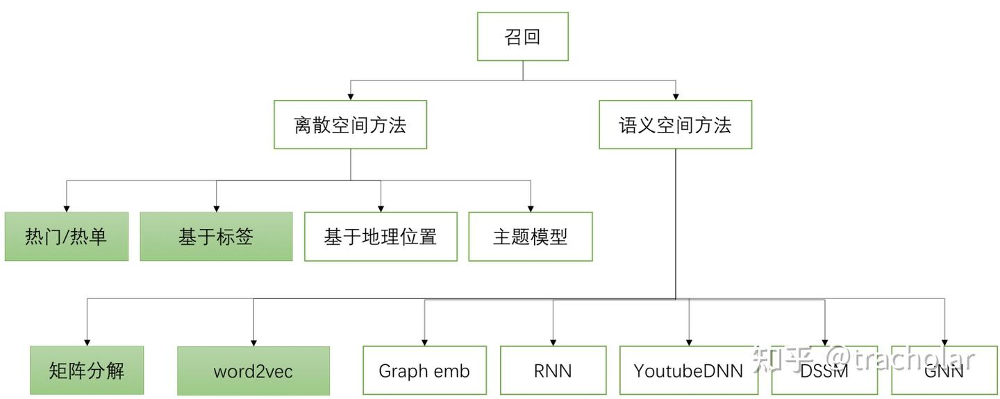

# OTTO 项目

## 必背高频点
- **项目介绍**：业务背景 + 项目动机 + 技术方案 + 产出结果
- **三类共现矩阵**：分别解释 clicks、carts-orders、buy2buy 捕捉的关系
- **为什么多目标**：点击、加购、下单的业务价值和数据分布不同
- **数据泄漏**：按 session 分组划分和 GroupKFold，避免同一 session 进入不同折
- **召回与排序**：召回决定上限，排序决定 Top20 内部质量
- **负样本**：未发生目标行为的候选，不等于用户绝对不喜欢
- **为什么 XGBoost**：结构化特征强、稳定、可解释、资源成本可控
- **优化方向**：召回扩展、序列建模、多任务学习、线上 A/B 指标

## 一、项目介绍与业务理解

我这个项目是基于 OTTO 电商行为数据做的一个多目标推荐任务。数据里每条日志包含用户当前 session、商品 ID、行为时间戳和行为类型，行为类型包括 clicks、carts、orders 三类。我的目标不是简单判断某个商品是否会被点击，而是针对每个 session，分别预测用户后续最可能点击、加购和下单的商品，并最终为每个 session 输出 Top20 推荐结果。

**session:同一个用户，在一段连续、无长时间间隔的浏览、点击、加购、下单行为，整体打包为一个 Session。**

从业务理解上看，clicks、carts、orders 代表用户意图强度逐渐增强的三个阶段：clicks 更多表示浏览兴趣，carts 表示更强的购买意图，orders 最接近最终转化和商业价值。因此我没有把三类行为混成一个任务，而是分别构建 clicks、carts、orders 三个目标的推荐模型，最后对三类任务进行加权评估。

整个项目比较典型的 “召回 + 排序” 两阶段流程来设计。
- 第一阶段是候选召回，目的是从大规模商品集合中先找出每个 session 可能感兴趣的一批候选商品；
- 第二阶段是排序模型，利用更丰富的商品特征、session 特征和 session-aid 交互特征，对候选商品重新打分排序，最终取 Top20。

### 1. 数据处理部分怎么介绍

在数据处理阶段，我主要处理了约 6014 万条训练日志、208 万条验证日志和 45 万个 session。原始日志中行为类型是字符串形式的 clicks、carts、orders，我把它们映射成 0、1、2，便于后续做行为权重计算、共现矩阵构造和内存压缩。时间戳也统一从毫秒级转换成秒级，并压缩成 int32，行为类型压缩成 int8，减少大规模表格计算时的内存压力。

因为这个数据规模比较大，所以 notebook 里没有一次性把所有中间结果都放在内存里，而是大量使用 parquet 文件保存中间结果，包括训练行为数据、验证行为数据、验证标签、共现矩阵、候选商品、特征表和预测结果。这样做的好处是，一方面 parquet 对表格数据读取和压缩更友好，另一方面每个阶段可以拆开运行，避免 Kaggle 或 GPU 内存爆掉。

验证集构造上，我是以 session 为基本单位 组织数据，而不是随机按日志行切分。原因是同一个 session 内的行为高度相关，如果随机按行切分，就可能出现同一个 session 的一部分行为在训练里，另一部分行为在验证里，这会导致信息泄漏，验证指标虚高。后续排序模型做交叉验证时，我也继续以 session 作为 group，保证同一个 session 下的候选商品不会同时出现在训练和验证 fold 中。

### 2. 召回阶段怎么介绍

召回阶段我使用的是 Item-to-Item 共现召回。核心思想是：如果两个商品经常在同一个 session 内被用户连续浏览、加购或购买，那么它们之间就可能存在关联。当用户当前 session 中出现了某些商品时，就可以通过这些商品的共现商品来扩展候选集。

但我没有只构造一个统一的共现矩阵，而是根据 clicks、carts、orders 三类行为的业务含义，设计了三类共现矩阵：

第一类是 clicks 共现矩阵。这一类主要用来捕捉用户短期浏览兴趣。它使用所有行为参与统计，但更强调最近发生的行为，因为在 session 推荐里，用户最近点击或浏览的商品往往更能代表当前兴趣。对 <u>clicks 共现加入了时间权重，让越新的行为贡献越大</u>。

第二类是 carts-orders 共现矩阵。这一类更关注加购和下单相关的商品关系。构造时使用了行为权重，比如 **click 权重较低，cart 和 order 权重更高**，因为加购和下单比普通点击更能反映用户购买意图。这里的设计逻辑是：点击可能只是随便浏览，但加购和下单说明用户对商品有更强兴趣，所以它们在共现关系里应该有更高权重。

第三类是 buy2buy 共现矩阵。这一类只保留 carts 和 orders 行为，用来捕捉更强购买意图下的商品关联。它和 carts-orders 的区别是，buy2buy 更聚焦于购买链路中的强行为，过滤掉了点击这种噪声较大的弱行为，并且使用更长的时间窗口，适合捕捉购买相关商品之间更稳定的关系。

在构造共现矩阵时，我做了几个关键处理：首先，每个 session 只保留最近 30 条行为，一方面是因为最近行为更能代表当前兴趣，另一方面也是因为共现矩阵需要做商品两两配对，如果 session 太长，self-merge 后计算量会爆炸。其次，同一 session 内通过两两配对生成 aid_x 到 aid_y 的商品关联，并去掉 aid_x 等于 aid_y 的无效共现。最后，对每个商品只保留 Top50 共现商品，控制召回规模和存储成本。

### 3. 候选生成怎么介绍

有了三类共现矩阵之后，我分别为 clicks、carts、orders 三个任务设计了不同的候选生成策略，而不是三类任务共用同一套候选。

对于 clicks 任务，我更重视用户最近交互过的商品和 **clicks 共现商品**。因为点击目标偏兴趣探索，用户刚刚浏览过什么、和这些商品经常一起被浏览的商品，通常是比较有效的候选来源。

对于 carts 任务，我融合了 **clicks 共现和 carts-orders 共现**。原因是加购行为既可能来自用户刚刚浏览的兴趣商品，也可能来自与加购、购买行为强相关的商品。因此 carts 任务不能只看点击共现，还要引入更强购买意图的共现关系。

对于 orders 任务，我更关注用户历史中的 carts 和 orders 行为，并融合**carts-orders 共现和 buy2buy 共现**。因为下单是最强的转化目标，相比普通点击，用户已经加购或购买过的商品更能反映真实购买意图，buy2buy 也更适合补充订单相关候选。

另外，对于一些较短 session 或候选不足的 session，我还使用全局热门商品作为兜底，比如 top_clicks、top_carts、top_orders。这样可以保证每个 session 都能生成足够数量的候选，避免后续排序阶段没有可排的商品。最终每类任务先生成较多候选，再截取 Top50 进入特征工程和排序阶段。

这一部分我觉得比较重要，因为它体现了一个推荐系统里的关键思想：召回阶段不是追求模型复杂，而是追求高覆盖率和合理的业务先验。如果真实商品在召回阶段没有被召回来，后面的排序模型再强也无法补救。

### 4. 特征工程怎么介绍

排序阶段我没有只依赖共现分数，而是构造了比较完整的排序特征。整体上分成三类：商品侧特征、session 侧特征、session-aid 交互侧特征，再加上候选召回阶段的 candidate_rank，一共构造了约 37 维特征。

商品侧特征主要描述商品整体热度和转化能力，包括商品总行为次数、出现过该商品的 session 数、商品最早和最晚出现时间、平均出现时间，以及商品被点击、加购、下单的次数。除此之外，我还构造了加购率、下单率、从加购到下单的转化率等特征，比如 item_cart_per_click、item_order_per_click、item_order_per_cart。这类特征的作用是衡量商品本身是不是热门、是不是容易转化。

session 侧特征主要描述当前用户在这个 session 里的行为强度和购买意图，包括 session 的行为次数、不同商品数、开始时间、结束时间、时间跨度、点击次数、加购次数、下单次数，以及加购比例、下单比例、商品多样性比例等。比如一个 session 如果加购比例很高，说明用户当前购买意图比较强；如果 session 很短，可能更多依赖热门兜底和最近行为；如果 session 很长，则可以利用更多历史行为判断兴趣。

session-aid 交互侧特征是最个性化的一类特征，用来描述当前 session 和某个候选商品之间的关系。比如这个商品在当前 session 里出现过几次、第一次出现时间、最后一次出现时间、第一次出现位置、最近一次出现距离 session 结束有多远，以及该商品在当前 session 内被点击、加购、下单的次数。这类特征非常关键，因为推荐排序不是只看商品整体热不热门，而是要看当前 session 对这个商品有没有明确兴趣。

另外，我把候选商品在召回阶段的 candidate_rank 也作为特征输入排序模型。因为召回 rank 本身就是一个强先验：如果一个商品在共现召回里排名很靠前，说明它和当前 session 历史行为有较强关联，排序模型可以继续学习这个信号。

### 5. 样本构造怎么介绍

排序样本是由候选商品和验证标签 merge 得到的。对于某一类任务，比如 orders，如果一个候选 aid 出现在这个 session 的真实 orders label 里，就标记为正样本；如果没有出现在 label 中，就标记为负样本。

这里需要注意的是，这些负样本不是严格意义上的“用户不喜欢”，而是隐式反馈场景下的近似负样本。也就是说，一个商品没有出现在 label 中，只能说明用户在当前预测窗口内没有点击、加购或下单它，并不能证明用户永远不喜欢它。这一点在面试时可以说出来，说明你理解推荐系统里的隐式反馈和负样本噪声问题。

由于候选样本规模很大，正负样本也不均衡，所以训练时我没有直接把所有负样本都丢进去训练，而是保留全部正样本，对负样本按 session 做采样。这样一方面控制训练数据规模，另一方面避免模型被大量负样本主导。同时，我只保留至少有一个正样本的 session 参与训练，因为完全没有正样本的 session 对 pairwise ranking 的学习价值比较有限。

### 6. 排序模型怎么介绍

排序模型我使用的是 XGBoost rank:pairwise，并且分别为 clicks、carts、orders 三个目标训练三个模型。

选择 XGBoost 的原因是，这个项目里的输入主要是结构化统计特征，比如商品热度、session 统计、session-aid 交互、召回 rank 等。XGBoost 对这类表格特征效果比较稳定，能够自动学习非线性关系和特征交互，训练成本也比深度模型低，适合作为强 baseline。

使用 rank:pairwise 的原因是，OTTO 的目标不是预测某个商品是不是正样本这么简单，而是在同一个 session 下，把更可能点击、加购或下单的候选商品排到前 20。所以这里更像一个排序问题，而不是普通二分类问题。pairwise ranking 会学习同一个 session 内正负候选之间的相对顺序，更贴近 Recall@20 这个最终指标。

交叉验证时，我用的是 GroupKFold，并且 group 设置为 session。这样可以避免同一个 session 下的候选商品被拆到不同 fold，造成 session 信息泄漏。每个任务训练 5 折模型，预测时对 5 个 fold 模型的得分取平均，然后每个 session 按分数排序取 Top20。

### 7. 评估指标怎么介绍

最终评估指标是 Weighted Recall@20。它不是简单计算一个总体 Recall，而是分别计算 clicks、carts、orders 三个任务的 Recall@20，然后按照权重加权：

clicks 权重是 0.10，carts 权重是 0.30，orders 权重是 0.60。

这个权重设计也符合电商业务逻辑：点击只是兴趣，加购代表强购买意图，下单最接近真实转化和商业价值，所以 orders 的权重最高。

Recall@20 的计算逻辑是：对每个 session 取模型预测的前 20 个商品，看其中有多少命中了真实 ground truth，然后除以 min(真实商品数量, 20)。最终我的本地验证集 Weighted Recall@20 达到 0.5410，其中 orders 任务 Recall@20 达到 0.6234。

### 8. 请介绍一下你这个 OTTO 推荐项目。

这个项目是**基于 OTTO 电商匿名 session 行为日志**，预测用户接下来可能点击、加购和下单的商品。业务背景是电商平台希望在用户会话过程中更早识别兴趣商品，<u>把更可能转化的商品推荐到前面，从而提升加购率和下单转化</u>。     
我的整体方案是：先做会话级数据处理和验证集构造，再用多路 Item-to-Item 共现做召回，然后构造商品侧、session 侧和 session-aid 交互侧特征，最后分别训练 clicks、carts、orders 三类排序模型。最终本地 Weighted Recall@20 达到 0.5410，其中 orders Recall@20 达到 0.6234。

### 9. 这个项目的业务动机是什么？为什么值得做？

电商推荐不是简单预测“用户会不会点”，而是要尽量把用户真正可能加购、下单的商品排到前面。**clicks 反映兴趣，carts 反映更强购买意图，orders 直接对应交易价值**，所以多目标建模能更贴近业务漏斗。     
这个项目的价值在于：利用用户短期行为序列快速捕捉兴趣迁移，并把<u>低价值的浏览行为和高价值的购买行为</u>区分开。

### 10. clicks、carts、orders 三个目标分别代表什么？

clicks 表示用户点击商品，通常样本最多、噪声也最大，更多代表兴趣曝光或浏览意图。carts 表示用户加购，数量比点击少，但购买意图更强。orders 表示用户下单，是最接近业务收入的目标，因此在评估指标里权重最高。

### 11. 为什么要把 clicks、carts、orders 分开建模，而不是做一个模型？

三个行为的业务含义和数据分布不一样：点击高频但噪声大，订单低频但价值高，如果混在一个模型里，模型容易被点击样本主导，无法充分优化加购和下单。     
分开建模可以**让每个模型学习对应目标的排序规律**，比如 orders 更依赖历史加购、购买共现，而 clicks 更依赖近期浏览兴趣。最后再按照官方 Weighted Recall 进行综合评估。

### 12. 这个项目的整体技术路线是什么？

可以概括为 **召回 + 特征 + 排序 + 评估** 四步。
- 第一步是处理大规模 session 日志并构造训练/验证数据；
- 第二步通过多种商品共现关系生成候选集；
- 第三步围绕商品、session 和 session-aid 交互构造排序特征；
- 第四步使用 XGBoost 学习候选商品在每个 session 内的相对排序，并用 Recall@20 评估。

### 13. 这个项目对应真实推荐系统里的哪几个环节？

- Item-to-Item 共现候选生成更接近**召回**阶段，目标是<u>从海量商品中快速找出一批可能相关的商品</u>。
- XGBoost 排序模型更接近**粗排**或轻量精排阶段，目标是在召回结果中把更可能发生目标行为的商品排到前面。         
<u>如果上线，还需要考虑实时特征、延迟、去重、多样性、库存和业务规则等问题。</u>

## 二、方案选择与核心做法

### 14. 为什么选择 Item-to-Item 共现召回？

OTTO 数据是匿名 session 行为，<u>缺少用户长期画像和商品丰富属性，因此很适合从短期行为序列里学习商品之间的关系</u>。     
Item-to-Item 共现的直觉是：如果两个商品经常在同一 session 或相近时间被连续浏览、加购或购买，它们就可能满足相似或互补需求。     
相比复杂深度模型，共现召回实现简单、可解释性强、计算效率高，是大规模推荐里很常见的强 baseline。

### 15. 你为什么设计三类共现矩阵？

因为**不同目标需要不同颗粒度的商品关系**。               
**clicks 共现**主要捕捉用户短期浏览兴趣，适合补充点击候选，更偏向“用户看过什么、还可能看什么”；；**carts-orders 共现**更强调强意图行为，更偏向“用户准备买什么”，适合加购和下单候选；     
**buy2buy 共现**只关注购买相关行为，更偏向“买了某类商品的人还可能买什么”，适合<u>挖掘订单目标里的替代品或搭配品</u>。      
三类矩阵融合后，比只用一种共现更能覆盖完整的行为漏斗。

### 16. 为什么要给不同行为设置权重？

点击、加购、下单对用户意图的强弱不同，直接把它们等权相加会让<u>高频点击淹没低频但更有价值的加购和订单</u>。       
行为权重的作用是让强意图行为在共现统计中影响更大，使召回结果更偏向可能加购和下单的商品。       
这个权重不是理论固定值，而是根据**业务直觉和验证集效果**做的经验选择，后续可以通过调参来优化。

### 17. 为什么加购行为有时会给得比订单更高？

订单行为很稀疏，如果权重过高但样本太少，可能导致共现关系不稳定；加购比点击更强、又比订单更丰富，能提供更**稳定**的购买意图信号。

### 18. 为什么要加入时间因素？

session 推荐更关注用户当前兴趣，<u>越靠近当前时刻的行为通常越能反映即时需求</u>。      
比如用户刚刚连续浏览某类商品，下一步点击或加购同类商品的概率往往更高。     
加入时间权重可**以让近期行为对候选生成和排序贡献更**大，降低较早行为对当前兴趣的干扰。

### 19. 为什么不只用热门商品兜底？

**冷启动**就是<u>样本行为数据缺失导致模型无法精准预测的问题</u>，分用户、物品、系统三类；一般借助静态属性、内容信息、热门策略、大模型表征、少样本学习来解决
- 用户冷启动：新注册用户，几乎没有点击、浏览、消费任何行为。
  - 问题：没有时序行为特征，DIN、XGB、大模型都提取不到兴趣，没法预测他会不会留存、未来 LTV 是多少。
  - 常用解法：      
    1）属性特征兜底：性别、年龄、地域、设备、注册渠道这类静态信息；        
    2）人群粗分：把新用户匹配到相似老用户群体，用群体均值做预估；       
    3）热门内容试探：先推送全站热门商品，快速收集少量行为，跳出冷启动.

热门商品虽然可以解决**短 session 或冷启动下候选不足**的问题，但它缺少**个性化**，容易把所有用户都推荐成相似列表。      
优先用用户当前 session 的<u>历史行为和共现关系</u>召回，只有候选不足时才用热门商品补齐。这样既保证覆盖率，又不会完全牺牲个性化。

## 三、数据、样本和验证严谨性

### 20. 这个项目中数据处理最大的难点是什么？

最大难点是**日志规模大**，直接全量加载和反复合并很容易内存爆炸。我的思路是<u>存储中间结果，控制数值类型，分块处理</u>。这样既减少内存压力，也方便后续特征工程和模型训练复用。

### 21. (数据泄露)为什么要按 session 构造验证，而不是随机按日志切分？

推荐任务的基本预测单位是 session，一个 session 内的多条行为高度相关。       
若随机按日志切分，同一个 session 的历史行为可能同时出现在训练和验证里，<u>模型会间接看到验证信息，导致指标虚高</u>。按 session 切分可以更接近真实场景：给定一个会话历史，预测该会话后续可能发生的行为。

### 22. 为什么排序训练要按 session 分组？

因为排序模型<u>学习的是同一个 session 内候选商品之间的相对顺序</u>。       
如果同一个 session 的候选商品被拆到不同 fold，模型可能通过 session 级统计特征记住验证样本，造成泄漏。按 session 分组后，验证集中的 session 对模型是真正未见过的，评估更可信。

### 23. 正负样本是怎么定义的？

在某个目标任务下，**候选商品如果出现**在该 session 对应的真实标签中，就定义为正样本；没有出现在标签中的候选商品作为负样本。                
这里的负样本更准确地说是“未观察到目标行为的候选”，不一定代表用户绝对不喜欢，只是在当前验证窗口内没有发生对应行为。这个定义符合离线推荐评估的常见做法。

### 24. 为什么需要负样本采样？

候选样本规模很大，而且正负样本极不均衡，如果把所有负样本都用于训练，计算成本高，也容易让模型被大量简单负样本主导。      
<u>负采样可以降低训练规模，让模型更多关注有区分度的候选</u>。关键是正样本要尽量保留，负样本采样比例要通过验证集效果控制。

### 25. 你的验证集和线上测试有什么差别？

本地验证集是用历史数据模拟线上预测，能帮助我们比较方案优劣，但它仍然是离线环境。线上推荐还会受到<u>曝光位置、用户实时反馈、库存、价格、运营策略和流量分布变化影响</u>。因此真正上线还需要 A/B 实验验证 CTR、加购率、转化率和 GMV 等业务指标。

**A/B 测试**是将线上流量随机拆分为对照组与实验组，仅改动单一变量并行对照，通过**假设检验**验证新策略指标是否显著提升，用来验证算法离线模型能否落地上线，规避全量迭代风险

## 四、模型训练与多目标排序

### 26. 排序模型是如何训练的？

排序阶段不是从全量商品中直接预测，而是在召回候选集上训练。     
对每个 session，会有一组<u>候选商品及其特征</u>，模型学习哪些候选更接近该任务的真实标签。clicks、carts、orders 三个任务分别训练模型，因为三类行为的样本分布、业务含义和有效特征权重不同。

### 27. 为什么使用 XGBoost？

这个项目的排序特征主要是**结构化统计特征**，**树模型**对这类表格特征很强。     
XGBoost 训练稳定、调参成本相对可控，并且能处理非线性特征组合。<u>相比直接上深度模型，它更适合作为大规模推荐排序的强 baseline</u>。

### 28. 为什么使用排序目标，而不是普通二分类？

最终评估关注的是每个 session 的 Top20 排序质量，而不是单个候选商品的绝对分类准确率。普通二分类会把每个样本独立看待，但推荐排序更关心<u>同一 session 内正样本能不能排到负样本前面</u>。使用排序目标可以让训练目标和最终 Recall@20 更一致。

### 29. 如果训练一个多任务模型可以吗？

可以，这是后续优化方向之一。多任务模型可以**共享底层表示**，同时为 clicks、carts、orders 建立不同输出头，理论上能利用任务之间的相关性。     
但在这个项目中，先使用三个独立模型更稳妥，便于定位每个目标的召回和排序问题，也更容易验证不同策略对各目标的影响。

### 30. 为什么不用 Transformer 或深度序列模型？

Transformer 确实适合建模 session 序列，但它需要更复杂的数据组织和训练资源。<u>当前数据缺少丰富商品属性</u>，且目标是先建立一个可解释、可复现的推荐 baseline，因此我优先使用**共现召回和 XGBoost 排序**。后续如果继续优化，可以把 Transformer/session encoder 作为召回或排序特征来源。

### 31. 为什么不用双塔模型？

双塔更适合大规模召回，通过**用户塔和商品塔**学习 embedding 后做**近邻检索**。但 OTTO 是匿名 session 数据，缺少稳定长期用户画像，短期行为共现反而更直接有效。     
双塔可以作为后续优化方向，尤其是在引入商品属性、用户长期行为或线上实时召回时更有价值。

## 五、指标、结果和业务解释

### 32. Weighted Recall@20 是怎么理解的？

Weighted Recall@20 是对 clicks、carts、orders 三个任务的 Recall@20 做加权汇总。      
权重体现业务价值差异：clicks 权重较低，orders 权重最高，因为下单更接近平台收入。这个指标不是平均看三个任务，而是更鼓励模型提升高价值行为的召回。

### 33. 为什么 orders 权重最高？

从业务漏斗看，点击只是兴趣，加购是购买意图，下单才是真实交易结果。     
电商推荐最终通常希望提升交易转化，因此订单行为的业务价值最高。指标给 orders 更高权重，可以<u>引导模型不要只追求容易提升的点击，而要关注更有商业价值的目标</u>。

### 34. 如果 clicks 指标下降但 orders 指标上升，你怎么判断？

要**结合业务目标判断**。如果当前业务更看重成交和 GMV，orders 提升可能比 clicks 小幅下降更重要；但如果点击下降太多，也可能影响流量承接和用户体验。    
离线可以看 Weighted Recall 的综合变化，线上则需要同时观察 CTR、加购率、转化率、GMV、停留时长和负反馈。

## 六、项目中遇到的问题与解决方式

### 35. 召回阶段遇到的主要问题是什么？

主要问题是**候选覆盖率和候选数量之间的平衡**。     
如果候选太少，真实目标商品可能没有被召回，排序模型无法补救；如果候选太多，训练和预测成本会明显上升，且噪声候选会干扰排序。      
我的解决方式是<u>多路共现融合，并对每一路召回保留 TopK，再用热门商品兜底保证短 session 的覆盖</u>。

### 36. 排序阶段遇到的主要问题是什么？

排序阶段的问题主要是样本量大、正负样本不均衡，以及不同 session 的候选数量差异较大。我通过按 session 组织样本、保留正样本、对负样本采样来控制训练规模。同时使用分组交叉验证，保证评估时 session 不泄漏。

### 37. 如果模型效果不好，你会怎么排查？

我会按链路拆开排查：先看**召回覆盖率**，如果真实商品根本不在候选中，就优先改召回；如果候选覆盖足够但 Top20 排序差，就检查**特征、负样本和排序模型**。还会分别看 clicks、carts、orders 的表现，因为不同目标的问题可能不一样。

### 38. 如何解释“召回没有召到，排序无法补救”？

排序模型只在候选集内部重新排序，它不能凭空生成候选集之外的商品。如果真实下单商品没有进入候选，排序模型无论多强都不可能把它排进 Top20。因此推荐系统里召回阶段决定上限，排序阶段决定在这个上限内能达到多少。

## 七、调研、取舍与为什么不这么做

### 39. 你调研过哪些其他方法？

我重点考虑过几类方法：Item2Vec 序列召回、、双塔召回、Transformer session 建模。最后优先选择共现召回和 XGBoost，是因为它们<u>对匿名 session 数据更直接、可解释、资源成本可控，而且容易在本地验证集上快速迭代</u>。

### 40. 为什么不直接用 Word2Vec/Item2Vec？

Item2Vec 可以把 session 看成商品序列来学习 embedding，理论上能捕捉相似商品关系。但它需要额外训练和调参，且对**序列窗口、负采样、embedding 维度**比较敏感。当前共现召回已经能很好利用短期行为关系，因此我<u>先用可解释性更强的共现方法；后续可以把 Item2Vec 作为新增召回通道</u>。

### 41. 为什么不直接用深度模型端到端预测？

**端到端深度模型**需要<u>更复杂的数据管道和更多训练资源，同时可解释性和调参成本更高</u>。      
我做这个项目的目标是先做一个能解释清楚业务逻辑的推荐系统方案，所以我采用常见的“召回 + 排序”分层结构。深度模型更适合<u>作为后续增强</u> ，比如做 session embedding 或多任务排序。

### 42. 为什么最终没有优先优化线上指标？

这个项目是在离线数据集上完成的，无法直接做真实流量实验，因此只能先用官方离线指标评估方案。线上指标需要真实曝光和用户反馈，比如 CTR、加购率、转化率、GMV、延迟和用户停留等。       
如果在真实业务中落地，我会<u>先用离线 Recall 筛选方案，再通过小流量 A/B 实验验证线上收益</u>。

## 八、后续优化与上线思考

### 43. 后续还有哪些优化空间？

我会从召回、特征、模型和评估四个方向优化。
- 召回上增加 Item2Vec、图召回或双塔召回；
- 特征上加入商品属性、价格、类目、品牌以及更细的时间特征；
- 模型上尝试 LightGBM、多任务模型或序列模型；
- 评估上进一步分 session 长短、目标类型和用户行为阶段做误差分析。

### 44. 上线后最看重哪些指标？

离线我看 Recall@20 和各目标召回；上线则要看 CTR、加购率、订单转化率、GMV、客单价、停留时长、跳失率以及推荐延迟。由于 orders 最接近商业目标，我会重点关注转化率和 GMV，但也不能忽视点击和加购，因为它们影响用户兴趣承接和转化漏斗。

### 45. 面试官问“这个项目最大的不足是什么”，你怎么回答？

最大的不足是目前主要依赖行为共现和统计特征，<u>对商品语义、长期兴趣和复杂序列模式利用不够</u>。它适合做强 baseline 和工程化可解释方案，但个性化表达能力仍有提升空间。    
后续我会引入商品 embedding、session 序列模型和多任务学习。

### 46. 你从这个项目里学到了什么？

我最大的收获是理解了推荐系统不是单纯训练一个模型，而是完整链路问题：召回决定候选上限，特征决定可学习信息，排序模型决定 TopK 质量，验证方式决定结果是否可信。同时我也认识到业务目标很重要，点击、加购、下单不能等价处理，模型优化要服务最终业务价值。
