- [推荐系统](#推荐系统)
  - [1. 推荐系统的基本概念](#1-推荐系统的基本概念)
      - [1.1 消费指标](#11-消费指标)
      - [1.2 北极星指标](#12-北极星指标)
      - [1.3 实验流程](#13-实验流程)
  - [2. 推荐系统的链路](#2-推荐系统的链路)
      - [2.1 召回通道](#21-召回通道)
      - [2.2. 排序](#22-排序)
        - [2.2.1 模型执行流程](#221-模型执行流程)
      - [2.3 重排](#23-重排)
  - [3. 推荐系统的 AB 测试](#3-推荐系统的-ab-测试)
      - [3.1 随机分桶](#31-随机分桶)
      - [3.2 分层实验](#32-分层实验)
      - [3.3 Holdout 机制](#33-holdout-机制)
      - [3.4. 实验推全 \& 反转实验](#34-实验推全--反转实验)
      - [3.5 总结](#35-总结)
  - [4. 召回：基于物品的协同过滤(ItemCF)](#4-召回基于物品的协同过滤itemcf)
      - [4.1. ItemCF 的实现](#41-itemcf-的实现)
      - [4.2. 物品相似度](#42-物品相似度)
      - [4.2. ItemCF 召回的完整流程](#42-itemcf-召回的完整流程)
  - [5. 召回：Swing 模型](#5-召回swing-模型)
      - [5.1. Swing 模型](#51-swing-模型)
      - [5.2 总结](#52-总结)
  - [6. 召回：基于用户的协同过滤(UserCF)](#6-召回基于用户的协同过滤usercf)
      - [6.1. UserCF 的原理](#61-usercf-的原理)
      - [6.2. 用户之间的相似度](#62-用户之间的相似度)
      - [6.3. UserCF 召回的流程](#63-usercf-召回的流程)
  - [7. 离散特征处理](#7-离散特征处理)
      - [7.1. 离散特征处理](#71-离散特征处理)
      - [7.2. One-Hot 编码](#72-one-hot-编码)
      - [7.3. Embedding 编码](#73-embedding-编码)
  - [8. 向量召回：矩阵补充；最近邻查](#8-向量召回矩阵补充最近邻查)
      - [8.1. 矩阵补充的模型结构](#81-矩阵补充的模型结构)
      - [8.2. 矩阵补充的模型训练](#82-矩阵补充的模型训练)
      - [8.3. 矩阵补充名称的由来](#83-矩阵补充名称的由来)
      - [8.4. 矩阵补充的缺点！](#84-矩阵补充的缺点)
      - [8.5. 矩阵补充的线上服务步骤](#85-矩阵补充的线上服务步骤)
        - [8.5.1. 模型存储](#851-模型存储)
        - [8.5.2. 线上服务](#852-线上服务)
      - [8.6. 近似最近邻查找ANN](#86-近似最近邻查找ann)
  - [9. 双塔模型：模型和训练](#9-双塔模型模型和训练)
      - [9.1 双塔模型的结构](#91-双塔模型的结构)
      - [9.2. 双塔模型的训练](#92-双塔模型的训练)
      - [9.3 Pointwise 训练](#93-pointwise-训练)
      - [9.4 Pairwise 训练](#94-pairwise-训练)
      - [9.5 Listwise 训练](#95-listwise-训练)
  - [10. 双塔模型--正负样本](#10-双塔模型--正负样本)
  - [11. 双塔模型--线上召回与更新](#11-双塔模型--线上召回与更新)
      - [11.1. 线上召回](#111-线上召回)
      - [11.2. 模型更新](#112-模型更新)
  - [12. 双塔模型+自监督学习](#12-双塔模型自监督学习)
      - [12.1. 双塔模型的问题](#121-双塔模型的问题)
      - [12.2. 训练双塔模型(无特征变换)](#122-训练双塔模型无特征变换)
      - [12.3. 自监督学习](#123-自监督学习)
      - [12.4. 特征变换](#124-特征变换)
      - [12.5. 训练有特征变换的模型(自监督模型)](#125-训练有特征变换的模型自监督模型)
      - [12.6. 现实流程](#126-现实流程)
  - [13. Deep Retrieval](#13-deep-retrieval)
      - [13.1. 索引](#131-索引)
      - [13.2. 预估模型](#132-预估模型)
      - [13.2.1. 预估模型的具体执行过程](#1321-预估模型的具体执行过程)
    - [13.3. 线上召回](#133-线上召回)
    - [13.3.1 使用 Beam Search 召回一批路径](#1331-使用-beam-search-召回一批路径)
    - [13.3.2 离线训练](#1332-离线训练)
  - [14. 其他召回：地理位置召回、作者召回、缓存召回](#14-其他召回地理位置召回作者召回缓存召回)
    - [14.1 地理位置召回](#141-地理位置召回)
    - [14.2 作者召回](#142-作者召回)
    - [14.3 缓存召回](#143-缓存召回)
  - [15. 曝光过滤 \& Bloom Filter](#15-曝光过滤--bloom-filter)
    - [15.1 曝光过滤问题](#151-曝光过滤问题)
    - [15.2 Bloom Filter](#152-bloom-filter)
    - [15.3 Bloom Filter 误伤的概率](#153-bloom-filter-误伤的概率)
    - [15.4 曝光过滤的链路](#154-曝光过滤的链路)
    - [15.5 Bloom Filter 缺点](#155-bloom-filter-缺点)
  - [16. 排序：多目标排序模型](#16-排序多目标排序模型)
    - [16.1 排序的依据](#161-排序的依据)
    - [16.2 多目标模型](#162-多目标模型)
    - [16.3 训练存在的问题](#163-训练存在的问题)
    - [16.4 预估值校准](#164-预估值校准)
  - [17. 排序：Multi-gate Mixture-of-Experts(MMoE)](#17-排序multi-gate-mixture-of-expertsmmoe)
    - [17.1 流程](#171-流程)
    - [17.2 softmax极化现象](#172-softmax极化现象)
  - [18. 预估分数的融合](#18-预估分数的融合)
  - [19. 视频播放建模](#19-视频播放建模)
    - [19.1 指标：视频播放时长](#191-指标视频播放时长)
    - [19.2 指标：视频完播](#192-指标视频完播)
  - [20. 排序模型的特征](#20-排序模型的特征)
    - [20.1. 用户画像(User Profile)](#201-用户画像user-profile)
    - [20.2. 物品画像(Item Profile)](#202-物品画像item-profile)
    - [20.3. 用户统计特征](#203-用户统计特征)
    - [20.4. 笔记统计特征](#204-笔记统计特征)
    - [20.5. 场景特征(Context)](#205-场景特征context)
    - [20.6. 特征处理](#206-特征处理)
    - [20.7. 特征覆盖率](#207-特征覆盖率)
    - [20.8. 数据服务](#208-数据服务)
  - [21. 粗排模型](#21-粗排模型)
    - [21.1. 粗排 vs 精排](#211-粗排-vs-精排)
    - [21.2. 精排模型\&双塔模型](#212-精排模型双塔模型)
    - [21.3. 粗排的三塔模型](#213-粗排的三塔模型)
    - [21.4. 三塔模型的推理](#214-三塔模型的推理)
  - [22. 特征交叉：Factorized Machine(FM)](#22-特征交叉factorized-machinefm)
  - [23. 特征交叉：深度交叉网络(DCN)](#23-特征交叉深度交叉网络dcn)
    - [23.1. 交叉层(Cross Layer)](#231-交叉层cross-layer)
    - [23.2. 交叉网络(Cross Network)](#232-交叉网络cross-network)
    - [23.3. 深度交叉网络(Deep \& Cross Network)](#233-深度交叉网络deep--cross-network)
  - [24. 特征交叉：LHUC 网络结构](#24-特征交叉lhuc-网络结构)
  - [25. 特征交叉：SENet \& Bilinear Cross](#25-特征交叉senet--bilinear-cross)
    - [25.1. SENet](#251-senet)
    - [25.2. Field 间特征交叉](#252-field-间特征交叉)
    - [25.3. FiBiNet](#253-fibinet)
  - [26. LastN：用户行为序列建模](#26-lastn用户行为序列建模)
    - [26.1. LastN 特征](#261-lastn-特征)
  - [27. LastN02：DIN 模型](#27-lastn02din-模型)
    - [27.1. 简单平均 vs 注意力机制](#271-简单平均-vs-注意力机制)
  - [28. LastN03：SIM 模型](#28-lastn03sim-模型)
    - [28.1. DIN 模型的缺点](#281-din-模型的缺点)
    - [28.2. 如何改进 DIN](#282-如何改进-din)
    - [28.3. SIM 模型](#283-sim-模型)
    - [28.3.1. step1 查找](#2831-step1-查找)
    - [28.3.2. step2 注意力机制](#2832-step2-注意力机制)
    - [28.4. SIM 模型使用时间信息](#284-sim-模型使用时间信息)
  - [29. 推荐系统中的多样性](#29-推荐系统中的多样性)
    - [29.1. 物品相似性的度量](#291-物品相似性的度量)
    - [29.3. 提升多样性的方法](#293-提升多样性的方法)
  - [30. MMR 多样性算法](#30-mmr-多样性算法)
    - [30.1. 多样性](#301-多样性)
    - [30.2. MMR 多样性算法](#302-mmr-多样性算法)
    - [30.3. 滑动窗口](#303-滑动窗口)
  - [31. 重排的规则](#31-重排的规则)
    - [31.3. MMR + 重排规则](#313-mmr--重排规则)
  - [32. DPP 多样性算法(数学基础)](#32-dpp-多样性算法数学基础)
  - [33. DPP 多样性算法](#33-dpp-多样性算法)
    - [33.1. DPP](#331-dpp)
    - [33.2. 行列式点过程(DPP)](#332-行列式点过程dpp)
    - [33.3. 求解 DPP](#333-求解-dpp)
  - [34. 物品冷启动：评价指标](#34-物品冷启动评价指标)
    - [34.1. 物品冷启动](#341-物品冷启动)
    - [34.2. 作者侧指标](#342-作者侧指标)
    - [34.3. 用户侧指标](#343-用户侧指标)
    - [34.4. 内容侧指标](#344-内容侧指标)
    - [34.5. 冷启动的优化点](#345-冷启动的优化点)
  - [35. 物品冷启动：简单召回通道](#35-物品冷启动简单召回通道)
    - [35.1. 召回的难点](#351-召回的难点)
    - [35.2. 双塔模型](#352-双塔模型)
    - [35.3. 类目召回](#353-类目召回)
    - [35.4. 基于关键词的召回](#354-基于关键词的召回)
    - [35.5 类目和关键词召回-缺点：](#355-类目和关键词召回-缺点)
  - [36. 物品冷启动：聚类召回](#36-物品冷启动聚类召回)
    - [36.1. 聚类召回](#361-聚类召回)
    - [36.2. 内容相似度模型-神经网络](#362-内容相似度模型-神经网络)
    - [36.3. 训练内容相似度模型](#363-训练内容相似度模型)
    - [36.4. 正样本](#364-正样本)
    - [36.5. 负样本](#365-负样本)
  - [37. 物品冷启动：Look-Alike 人群扩散](#37-物品冷启动look-alike-人群扩散)
    - [37.1. Look-Alike 起源于互联网广告](#371-look-alike-起源于互联网广告)
    - [37.2. Look-Alike 用于新笔记召回](#372-look-alike-用于新笔记召回)
  - [38. 物品冷启动：流量调控](#38-物品冷启动流量调控)
    - [38.1. 冷启动的优化点](#381-冷启动的优化点)
    - [38.2. 扶持新笔记的目的](#382-扶持新笔记的目的)
    - [38.3. 工业界的做法](#383-工业界的做法)
    - [38.4. 流量调控技术的发展](#384-流量调控技术的发展)
    - [38.5. 新笔记提权(boost)](#385-新笔记提权boost)
    - [38.6. 新笔记保量](#386-新笔记保量)
    - [38.7. 差异化保量](#387-差异化保量)
  - [39. 物品冷启动：AB 测试](#39-物品冷启动ab-测试)
    - [39.1. 新笔记冷启的 AB 测试](#391-新笔记冷启的-ab-测试)
    - [39.2. 用户侧实验](#392-用户侧实验)
  - [40. 涨指标的方法](#40-涨指标的方法)
    - [40.1. 推荐系统的评价指标](#401-推荐系统的评价指标)
    - [40.2. 涨指标的方法有哪些?](#402-涨指标的方法有哪些)
  - [41. 涨指标的方法：召回](#41-涨指标的方法召回)
    - [41.1. 召回模型 \& 召回通道](#411-召回模型--召回通道)
    - [41.2. 双塔模型](#412-双塔模型)
    - [41.3. Item-to-Item (I2I)](#413-item-to-item-i2i)
    - [41.4. 小众的召回模型](#414-小众的召回模型)
  - [42. 涨指标的方法：排序模型](#42-涨指标的方法排序模型)
    - [42.1. 精排模型的改进](#421-精排模型的改进)
    - [42.2. 粗排模型的改进](#422-粗排模型的改进)
    - [42.3. 用户行为序列建模](#423-用户行为序列建模)
    - [42.4. 在线学习（增量更新）](#424-在线学习增量更新)
    - [42.5. 老汤模型](#425-老汤模型)
  - [43. 涨指标的方法：多样性](#43-涨指标的方法多样性)
    - [43.1. 精排多样性](#431-精排多样性)
    - [43.2. 粗排多样性](#432-粗排多样性)
    - [43.3. 召回多样性——双塔模型：添加噪声](#433-召回多样性双塔模型添加噪声)
    - [43.4. 召回多样性——双塔模型：抽样用户行为序列](#434-召回多样性双塔模型抽样用户行为序列)
    - [43.5. U2I2I：抽样用户行为序列](#435-u2i2i抽样用户行为序列)
    - [43.6. 探索流量](#436-探索流量)
  - [44. 涨指标的方法：特殊对待特殊人群](#44-涨指标的方法特殊对待特殊人群)
    - [44.1. 为什么要特殊对待特殊人群?](#441-为什么要特殊对待特殊人群)
    - [44.2. 构造特殊的内容池](#442-构造特殊的内容池)
    - [44.3. 特殊的排序策略（针对低活用户）](#443-特殊的排序策略针对低活用户)
    - [44.4. 特殊的排序模型](#444-特殊的排序模型)
  - [45. 涨指标的方法：利用交互行为](#45-涨指标的方法利用交互行为)
    - [45.1. 关注](#451-关注)
      - [45.1.1 关注量对留存的价值](#4511-关注量对留存的价值)
      - [45.1.2 粉丝数对促发布的价值](#4512-粉丝数对促发布的价值)
      - [45.1.3 隐式关注关系](#4513-隐式关注关系)
    - [45.2. 转发(分享)](#452-转发分享)
    - [45.3. 评论](#453-评论)

# 推荐系统

## 1. 推荐系统的基本概念

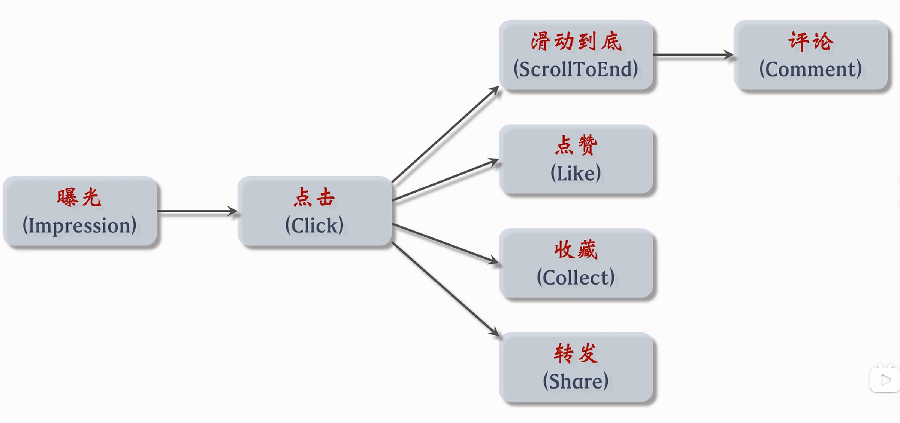
Clink，ScrollToEnd，Like，Collect，Share，Comment 都是推荐系统进行推荐的依据

#### 1.1 消费指标

对于每篇笔记，系统记录：

- 曝光次数(number of impressions)
- 点击次数(number of clicks)
- 点赞次数(number of likes)
- 收藏次数(number of collects)
- 转发次数(number of shares)

&emsp;&emsp;点击率=点击次数/曝光次数
&emsp;&emsp;点赞率=点赞次数/点击次数
&emsp;&emsp;收藏率=收藏次数/点击次数
&emsp;&emsp;转发率=转发次数/点击次数
&emsp;&emsp;阅读完成率=滑动到底次数/点击次数 \* f(笔记长度)

> 点击率越高，反应推荐系统越精准
> 消费指标用来衡量用户的短期兴趣

#### 1.2 北极星指标

- 用户规模
  - 日活用户数(DAU)、月活用户数(MAU)
- 消费
  - 人均使用推荐的时长，人均阅读笔记的数量
- 发布
  - 发布渗透率、人均发布量

> 北极星指标是最重要的标准，是衡量一个推荐系统好坏的根本标准

#### 1.3 实验流程

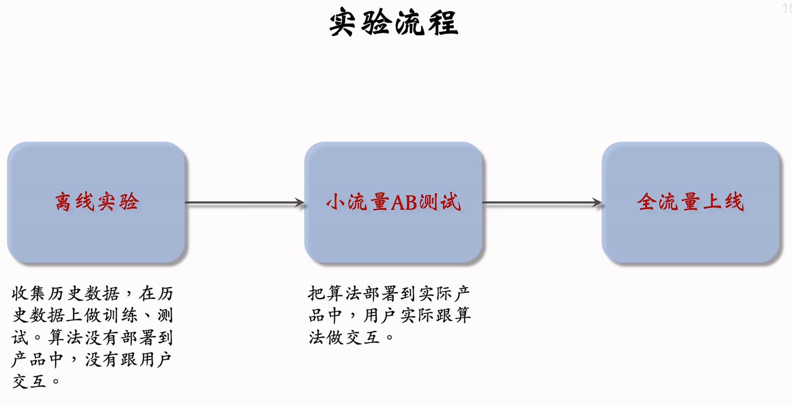
**离线实验**：收集历史数据，在历史数据上训练、测试。算法没有部署到产品中，没有跟用户交互
**小流量 AB 测试**：把算法部署到实际产品中，用户实际跟算法交互，把用户分为 A、B 组，进行对照实验
**全流量上线**：把算法推广到全部用户

## 2. 推荐系统的链路

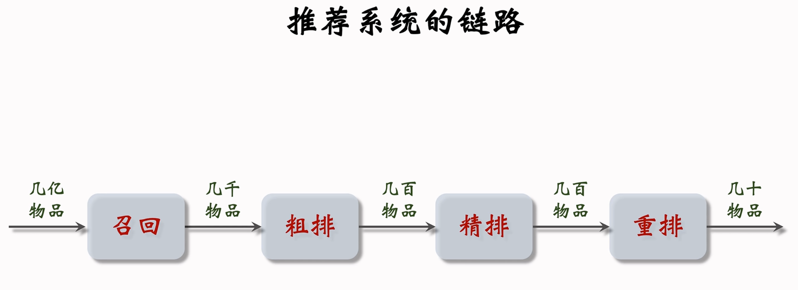
**召回**：从物品数据库中快速取回一些物品，使用多条召回通道同时进行召回操作            
**粗排**：用简单的机器学习模型对取出的物品进行打分，保留分数比较高的物品(截断)             
**精排**：用大规模的神经网络模型对这些物品进行打分，可以截断也可以不截断                     
**重排**：根据精排分数和多样性进行抽样，把相似的内容打散，并插入广告和运营内容

#### 2.1 召回通道
召回的目标：快速找到用户可能感兴趣的       
- 全体物品easy:绝大多数是用户根本不感兴趣的
- 被排序淘汰hard:用户可能感兴趣，但是不够感兴趣
- 有曝光没点击（没用）：用户感兴趣，可能碰巧没有点击

常见的召回通道有：协同过滤、双塔模型、关注的作者、等等                
系统对召回通道返回的所有结果进行融合和过滤

#### 2.2. 排序
排序的目标：区分比较感兴趣和非常感兴趣             

排序分为粗排和精排，召回通道返回的物品数量很多，如果使用高精度神经网络模型进行打分，花费代价很大                 
- 粗排：使用小规模神经网络模型对大量物品进行打分，得到小部分评分高的物品
- 精排：使用大规模神经网络模型对粗排结果重新打分，使用的特征比粗排多得多，精排打得分更加可靠

##### 2.2.1 模型执行流程

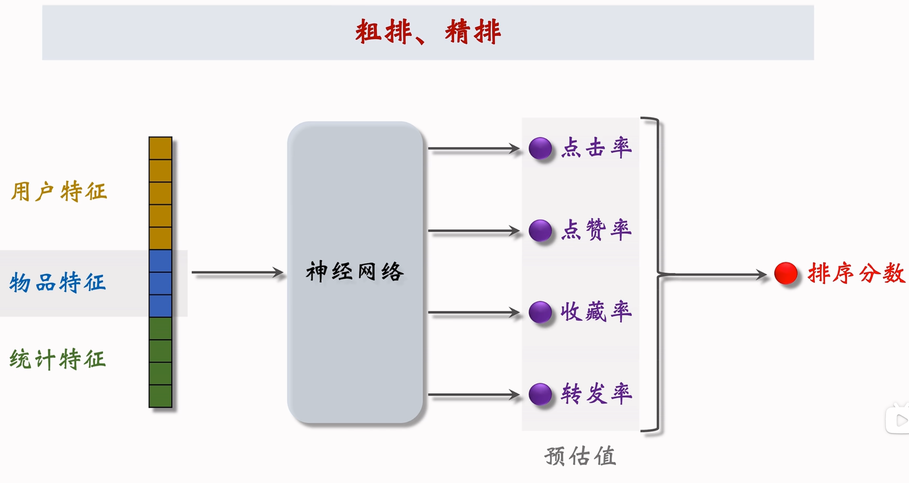

模型输入参数包括用户特征、物品特征、统计特征
模型输出预测的点击率、点赞率、收藏率、转发率
根据预测的结果给出排序分数

#### 2.3 重排

1. 做多样性抽样(比如 MMR，DPP)，从几十个物品中选出几十篇，多样性抽样的依据是精排分数大小和多样性
2. 用规则打散相似笔记，保证相似笔记在展示位上相隔一段距离
3. 插入广告、运营推广内容，根据生态要求调整排序

## 3. 推荐系统的 AB 测试

**作用 1：** 考察新的召回通道对线上指标的影响  
**作用 2：** 模型中有一些参数，比如 GNN 的深度取值$\in${1，2，3}，需要用 A/B 测试选取最优参数

#### 3.1 随机分桶

全部$n$位用户，分成$b$个桶，每个桶中有$\frac{n}{b}$位用户，如果用户数量足够大，<u>每个桶的 DAU 等指标应相同</u>。

1. 首先用哈希函数把用户 ID 映射成某个区间内的整数，然后把这些整数均匀随机分成$b$个桶。
2. <u>设置对照组，及实验条件不同的实验组</u>。
3. 计算某个桶的业务指标，比如 DAU，人均使用推荐的时长，点击率等等
4. 如果某个实验组指标显著优于对照组，则说明对应的策略有效，值得**推全**(指流量扩大到百分百)

#### 3.2 分层实验

信息流公司的业务和部门很多，可能出现<u>用户数量不够实验使用</u>

- **分层实验**：召回、粗排、精排、重排、用户界面、广告····(例如 GNN 召回通道属于召回层)
- **同层互斥**：GNN 实验占了召回层的 4 个桶，其他召回实验只能用剩余的 6 个桶
- **不同层正交**：每一层独立随机对用户做分桶。每一层都可以独立用 100%的用户做实验

> 同一个层，一个用户只可接受一个实验，对于不同的层，一个用户每个层可以接受一个实验

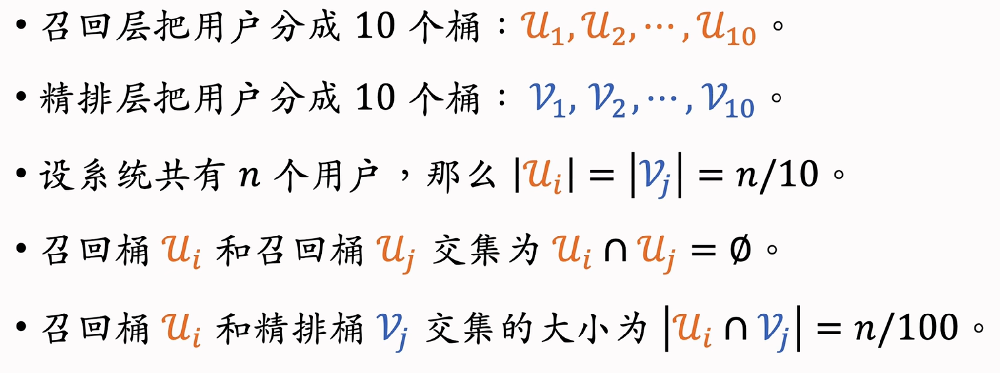
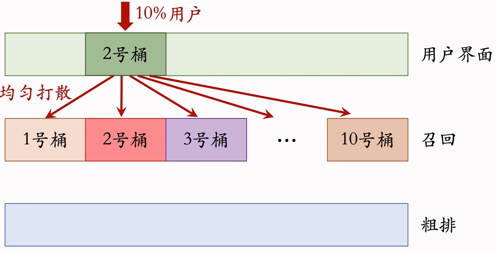

- 如果所有实验都正交，则可以同时做无数组实验。
- 那为什么不全使用正交：同类的策略(例如精排模型的两种结构)天然互斥，对一个用户，只能用其中一种。
- **同类的策略**(例如添加两条召回通道)效果会相互增强或抵消。互斥可以避免同类策略相互干扰
- **不同类型的策略**(例如添加召回通道、优化粗排模型)通常不会相互干扰，可以作为正交的两层

#### 3.3 Holdout 机制

- 每个实验(召回、粗排、精排、重排)独立汇报对业务指标的提升
- 公司考察一个部门(比如推荐系统)在一段时间内对业务指标总体的提升
- 取$10\%$的用户作为 holdout 桶，推荐系统使用剩余$90\%$的用户做实验，两者互斥
- $10\%$holdout 桶 VS $90\%$实验桶的 diff(需要归一化)为整个部门得到业务指标收益
- **每个考核周期结束之后**，清除 holdout 桶，让推全实验从$90\%$ 用户扩大 到$100\%$用户。
- 重新随机划分用户，得到 holdout 桶和实验桶，开始下一轮考核周期。
- 新的 holdout 桶与实验桶各种业务指标的 diff 接近 0。
- 在一个考核周期中，随着召回、粗排、精排、重排实验上线和推全，diff 会逐渐扩大。
  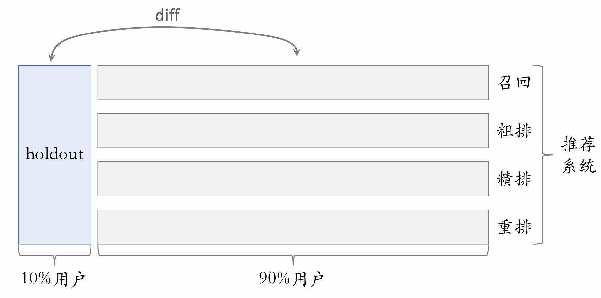

#### 3.4. 实验推全 & 反转实验

**实验推全：**                       
  所有的实验都是从小流量开始，如果业务指标的 diff 显著正向，则推全实验。          
  举个例子，我们做一个召回通道的实验，取 1 个桶作为实验组，1 个桶作为对照组。如果观测到显著正向的业务指标收益，则推全这条召回通道，让它从 10%的用户扩大到 90%。假设这条召回通道可以提升+1 分钟的人均使用推荐时长。考察与 holdout 桶的 diff，那么在 10%小流量实验期间，该召回通道贡献+1/9 分钟；在推全之后，它贡献了+1 分钟。

              
上线一个有效的实验之后，需要观察很多指标，<u>有的指标会立即被新策略影响，而有的指标有滞后性</u>。    
点击率、点赞率、完播率等指标会立刻被新策略影响，实验上线 1 天、或者实验上线 10 天，观测到的指标不会差距太大。     
用户使用推荐的时长、曝光的物品数量这些指标有一点滞后，需要多观察几天，指标才能稳定。                 
用户留存指标滞后非常严重，有可能短期内观测不到显著变化，但是在之后几个月中持续改善。指标滞后的原因不难理解，新策略改善用户体验，需要一些时间才能被用户感受到，感受到之后，用户对产品的粘性才越来越高。      

希望在小流量实验观测到显著收益之后，<u>尽快推全新策略，这样可以腾出桶供其他实验使用</u>，而且有时需要基于新策略做后续迭代优化。很多核心业务指标却具有滞后性，过快推全则观测不到完整的实验收益。实践中常用反转实验解决这对矛盾。                  

**反转实验：**  
如图 2.4 所示，每推全一个实验就新建一个推全层，它覆盖 90%用户，<u>新的推全层与召回等层正交</u>。在推全层中，85%的用户使用新策略，5%的用户(反转桶)使用旧策略，这样就可以长期观测新策略与旧策略业务指标的 diff。当考察周期结束，清除 holdout 桶时，将新策略应用到 holdout 桶的 10%用户。当反转实验完成时，关闭实验，则新策略会应用到反转桶的 5%的用户(此时**真正推全**)。
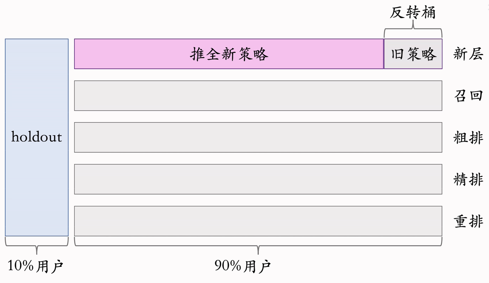

#### 3.5 总结
- 分层实验：同层互斥、不同层正交。       
- Holdout:保留10%的用户，完全不受实验影响，可以考察整个部门对业务指标的贡献。        
- 实验推全：新建一个推全层，与其他层正交。
- 反转实验：在新的推全层上，保留一个小的反转桶，使用旧策略，长期观察新旧策略的diff。       

## 4. 召回：基于物品的协同过滤(ItemCF)

#### 4.1. ItemCF 的实现

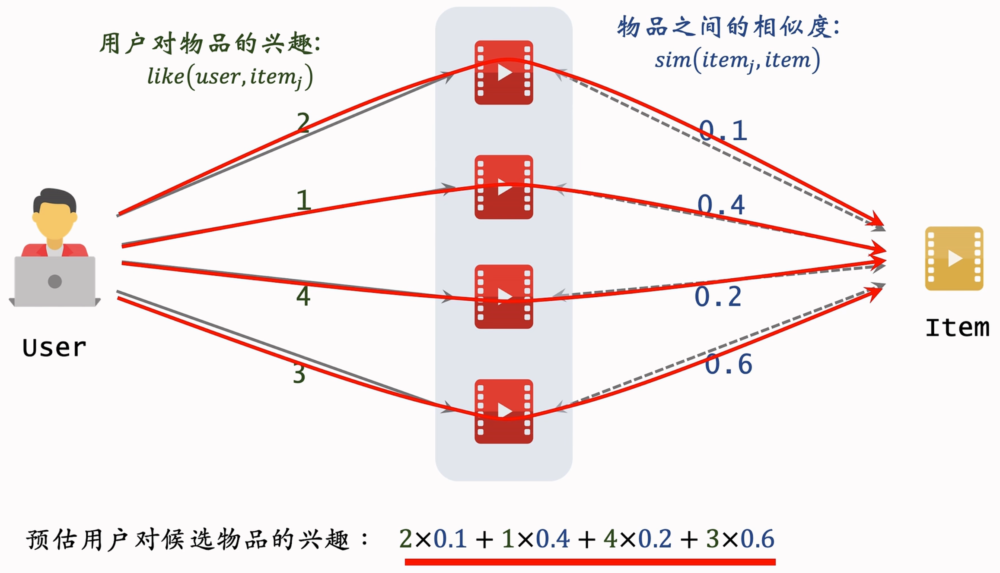

#### 4.2. 物品相似度

**两个物品的受众重合度越高，两个物品越相似**

- 喜欢物品$i_{1}$的用户记作集合$W_{1}$
- 喜欢物品$i_{2}$的用户记作集合$W_{2}$
- 定义交集$V=W_{1}\cap W_{2}$
- 两个物品的相似度：
  $$
  sim(i_{1},i_{2})=\frac{\left| v \right|}{\sqrt{\left| w_{1} \right|\cdot \left| w_{2} \right|}}$$

  > 公式没有考虑喜欢的程度$like(user,item)$

- 加入喜欢程度的相似度：
  $$sim(i_{1},i_{2})=\frac{\sum \limits_{v\in V}like(v,i_{1})\cdot like(v,i_{2})}{\sqrt{\sum\limits _{u_{1}\in W_{1}}like^{2}(u_{1},i_{1})}\cdot \sqrt{\sum \limits_{u_{2}\in W_{2}}like^{2}(u_{2},i_{2})}}
  $$
  > **余弦相似度(cosine similarity)**

#### 4.2. ItemCF 召回的完整流程

**1. 事先做离线计算**
   1. **建立“用户->物品”的索引**
   - 记录每个用户最近点击、交互过的物品 ID
   - 给定任意用户 ID，可以找到他近期感兴趣的物品列表
   2. **建立“物品->物品”的索引**
   - 计算物品之间两两相似度
   - 对于每个物品，索引它最相似的 k 个物品
   - 给定任意物品 ID，可以快速找到它最相似的 k 个物品         
  
**2. 线上做召回**
   1. 给定用户 ID，通过“用户->物品”索引，找到用户近期感兴趣的物品列表(**last-n**)。
   2. 对于 last-n 列表中每个物品，通过“物品->物品”的索引，找到 **top-k** 相似物品。
   3. 对于取回的相似物品(最多有$nk$个)，用公式预估用户对物品的兴趣分数         
   4. 返回**分数**最高的 100 个物品，作为推荐结果。

      > 索引的意义在于避免枚举所有的物品。          
      > 用索引，离线计算量大，线上计算量小。              
      > 如果有重复的，就去重，把分数加起来。    

## 5. 召回：Swing 模型

由于 **ItemCF 通过用户重合度判断两个物品的相似性**，可能会出现因为用户小圈子聚集导致毫不相关的物品被判为相似，Swing 模型的提出是为了降低用户小圈子聚集带来的误差。

#### 5.1. Swing 模型

- 用户$u_1$喜欢的物品记作集合$J_1$
- 用户$u_2$喜欢的物品记作集合$J_2$
- 定义**两个用户的重合度**：
  $$
  overlap(u_{1},u_{2})=\left|J_{1}\cap J_{2}\right|$$
- 用户$u_1$和$u_2$的重合度高，<u>则他们可能来自一个小圈子，要降低他们的权重</u>
- 喜欢物品$i_1$的用户记作集合$W_1$
- 喜欢物品$i_2$的用户记作集合$W_2$
- 定义交集$V=W_{1}\cap W_{2}$
- **两个物品的相似度**：
 $$ 
 sim(i_1,i_2)=\sum\limits_{u_1\in V}\sum\limits_{u_2\in V}\frac{1}{\alpha+overlap(u_1,u_2)}
 $$
  > $\alpha$是人工设置的参数，需要后期调节                  
  > overlap若大，则说明两个用户可能来自同一个小圈子，降低他们的权重

#### 5.2 总结
- Swing和ItemCF唯一区别在于物品相似度
- ItemCF:两个物品重合的用户比例高，则判定为相似
- Swing:额外考虑重合的用户是否来自同一个小圈子，<u>降低小圈子影响</u>      

## 6. 召回：基于用户的协同过滤(UserCF)

#### 6.1. UserCF 的原理

根据与我兴趣相似的网友进行推荐，如果一篇笔记，网友阅读过，而我未阅读过，就会给我推荐这篇笔记

找到兴趣相似的网友的方法：

1. <u>点击、点赞、收藏、转发的笔记</u>有很大的重合
2. <u>关注的作者</u>有很大的重合

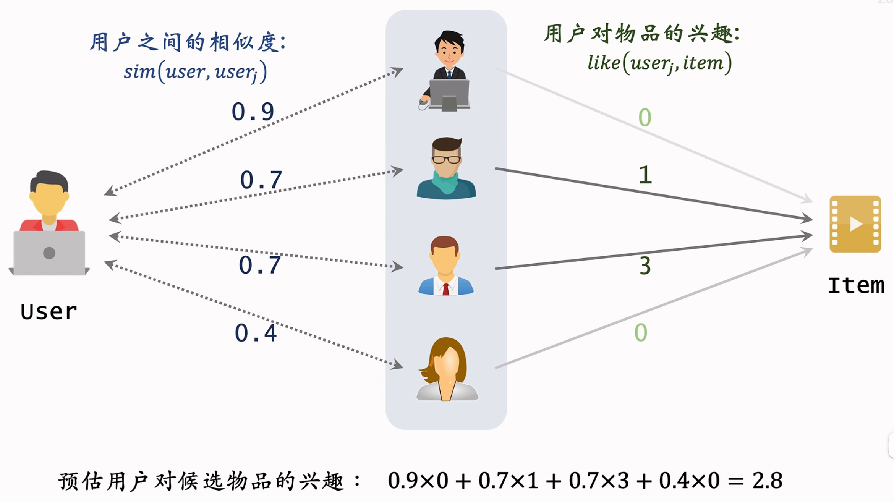
预估用户$user$对候选物品$item$的兴趣：
$$
\sum_{j}sim(user,user_j)\times like(user_j,item)
$$

#### 6.2. 用户之间的相似度

- 用户$u_1$喜欢的物品记作集合$J_1$
- 用户$u_2$喜欢的物品记作集合$J_2$
- 定义交集：$I=\left|J_{1}\cap J_{2}\right|$
- **两个用户的相似度**：
  $$
  sim(u_1,u_2)=\frac{\left| I \right|}{\sqrt{\left| J_1 \right|\cdot \left| J_2 \right|}}
  $$
  > 这个公式没有考虑热门物品的权重，通过热门物品计算两人的相似度没有意义
- **考虑热门物品的权重之后**，两个用户的相似度：
  $$
  sim(u_1,u_2)=\frac{\sum\limits_{l\in I}\frac{1}{\log{(1+n_l)}}}{\sqrt{\left| J_1 \right|\cdot \left| J_2 \right|}}
  $$
  > $n_l$：喜欢物品$l$的用户数量，反应物品的热门程度

#### 6.3. UserCF 召回的流程

**1. 事先做离线计算**
   1. 建立“**用户->物品**”的索引
   - 记录每个用户最近点击、交互过的物品 ID
   - 给定任意用户 ID，可以找到他近期感兴趣的物品列表
   2. 建立“**用户->用户**”的索引
   - 对于每个用户，索引它最相似的 k 个用户(ID和相似度)
   - 给定任意用户 ID，可以快速找到它最相似的 k 个用户
2. 线上做召回
   1. 给定用户 ID，通过“用户->用户”索引，找到 **top-k** 相似用户。
   2. 对于每个 top-k 相似用户，通过“用户->物品”的索引，找到每个用户近期感兴趣的物品列表(**last-n**)。
   3. 对于取回的相似物品(最多有$nk$个)，用公式预估用户对每个物品的兴趣分数 $\sum_{j}sim(user,user_j)\times like(user_j,item)$
   4. 返回分数最高的 100 个物品，作为推荐结果。

## 7. 离散特征处理

#### 7.1. 离散特征处理

**1. 建立字典：把类别映射成序号                   
2. 向量化：把序号映射成向量**
   - One-hot 编码：把序号映射成高维稀疏向量
   - **Embedding**：把序号映射成低维稠密向量

#### 7.2. One-Hot 编码

1. 例子                  
   国籍：中国、美国、印度等 200 种类别                         
   字典：中国->1，美国->2，印度->3，····                    
   One-hot 编码：用 200 维稀疏向量表⽰国籍                                     
   未知$\to 0\to \left[0,0,0,0,\cdots,0\right]$            
   中国$\to 1\to \left[1,0,0,0,\cdots,0\right]$               
   美国$\to 2\to \left[0,1,0,0,\cdots,0\right]$                  
   印度$\to 3\to \left[0,0,1,0,\cdots,0\right]$                       

2. One-Hot 编码的局限                     
   - 自然语⾔处理中，对单词做编码，英文有几万个常见单词，那么 one-hot 向量的维度是几万
   - 推荐系统中，对物品 ID 做编码，小红书有几亿篇笔记，那么 one-hot 向量的维度是几亿
   - <u>类别数量太大时，通常不用 one-hot 编码</u>

#### 7.3. Embedding 编码

**1. 参数数量：向量维度$×$类别数量**
   - 设 embedding 得到的向量都是 4 维的
   - 一共有 200 个国籍
   - 参数数量=4×200=800
2. 编程实现：TensorFlow、PyTorch 提供 embedding 层
   - **参数以矩阵**的形式保存，矩阵大小是向量维度$×$类别数量
   - 输入是序号，比如“美国”的序号是 2
   - 输出是向量，比如“美国”<u>对应参数矩阵的第 2 列</u>
> 类别数量很大时，用 embedding

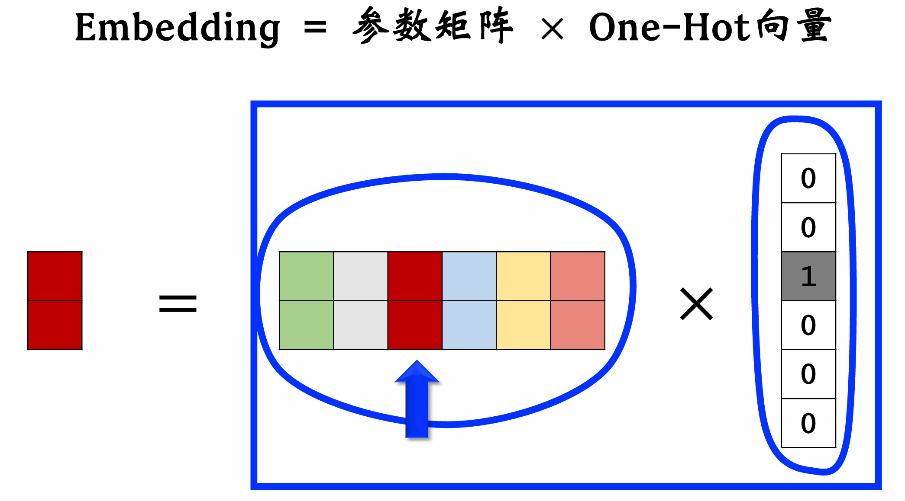

## 8. 向量召回：矩阵补充；最近邻查

#### 8.1. 矩阵补充的模型结构

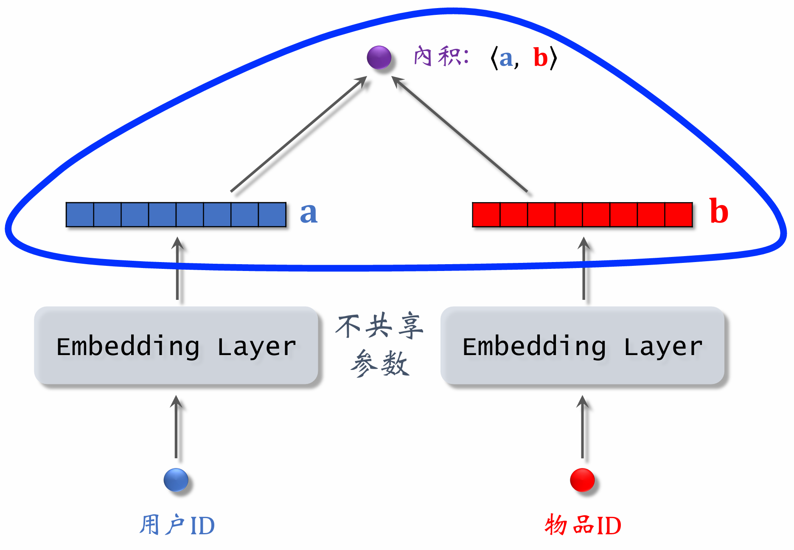
Embedding Layer 是一个矩阵，矩阵中的每一列是对应的向量，把用户 ID，物品 ID 分别通过 Embedding Layer 得到对应向量，最后对向量做内积

#### 8.2. 矩阵补充的模型训练

- 用户 embedding 参数矩阵记作$A$。<u>第$u$号用户对应矩阵第$u$列，记作向量$a_u$</u>
- 物品 embedding 参数矩阵记作$B$。<u>第$i$号物品对应矩阵第$i$列，记作向量$b_i$</u>
  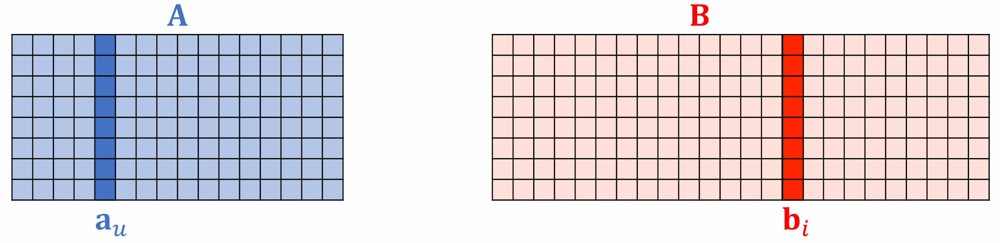
> 内积 $\left\langle a_u,b_i \right\rangle$ 是第$u$号用户对第$i$号物品兴趣的预估值            

**训练模型的目的是学习矩阵$A$和$B$，使得预估值拟合真实观测的兴趣分数**
- 数据集：(**用户 ID，物品 ID，兴趣分数**)的集合，          
  记作$\Omega =\left\{(u,i,y)\right\}$
- 数据集中的兴趣分数是系统记录的，比如：
  - 曝光但是没有点击->0 分
  - 点击、点赞、收藏、转发->各算 1 分
  - 分数最低是 0，最高是 4
- 把用户 ID、物品 ID 映射成向量
  - 第$u$号用户->向量$a_u$
  - 第$i$号物品->向量$b_i$
- **求解优化问题，得到参数 A 和 B**
  $$
  \min\limits_{A,B}\sum\limits_{(u,i,y)\in \Omega }(y-\left \langle a_u,b_i \right \rangle )^{2}
  $$

#### 8.3. 矩阵补充名称的由来

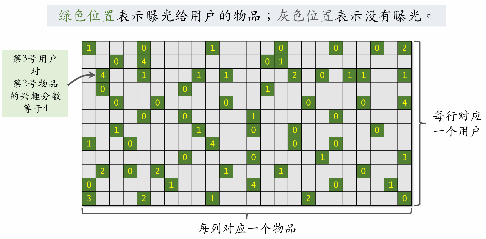

**用绿色位置的数据训练模型，用训练的模型推测灰色部分的值**                

#### 8.4. 矩阵补充的缺点！

1. 仅用 ID-embedding，没利用物品、用户属性
   - **物品属性**：类目、关键词、地理位置、作者信息
   - **用户属性**：性别、年龄、地理定位、感兴趣的类目
   - 双塔模型可以看做矩阵补充的升级版
2. 负样本的选取方式不对
   - 样本：用户—物品的二元组，记作$(u,i)$
   - 正样本：曝光之后，有点击、交互。(正确的做法)
   - 负样本：曝光之后，没有点击、交互。(错误的做法)
3. 做训练的方法不好
   - 內积$\left \langle a_i,b_i \right \rangle$不如**余弦相似度**
   - 用平方损失(回归)，不如用交叉熵损失(分类)

#### 8.5. 矩阵补充的线上服务步骤

##### 8.5.1. 模型存储

1. 训练得到 embedding 矩阵 A 和 B
   - A 的每一列对应一个用户
   - B 的每一列对应一个物品
2. 把矩阵 A 的列存储到 key-value 表
   - key 是用户 ID，value 是 A 的一列
   - 给定用户 ID，返回一个向量(用户的 embedding)
3. 矩阵 B 的存储和索引比较复杂

##### 8.5.2. 线上服务

1. 把用户 ID 作为 key，**查询 key-value 表**，得到该用户的向量，记作$a$
2. **最近邻查找**：查找用户最有可能感兴趣的 k 个物品，作为召回结果
   - 第$i$号物品的 embedding 向量记作$b_i$
   - 內积$\left \langle a_i,b_i \right \rangle$是用户对第$i$号物品兴趣的预估
   - 返回内积最大的 k 个物品
 > 如果枚举所有物品，时间复杂度正比于物品数量

#### 8.6. 近似最近邻查找ANN

- 数据库系统：Milvus、Faiss、HnswLib 等等
- 衡量**最近邻**的标准:
  - 欧式距离最小(L2 距离)，划分为多边形
  - 向量内积最大                       
    (如果对向量先L2归一化，则内积<->余弦相似度)
  - 向量夹角余弦最大(cosine 相似度)，划分为扇形

> **IVF倒排文件索引**：    
> - 离线建立索引：设定分块总数**nlist**，对所有商品embedding向量做k-means聚类，计算每个向量与所有聚类中心点的距离，构建倒排表
> - 线上检索：先粗筛即只和聚类中心计算距离选出最近的**nprobe**个分块，只遍历这些分区内的向量计算相似度             

## 9. 双塔模型：模型和训练

(前期融合concatenrate再进入神经网络的模型一定不是召回，一般是排序，召回模型属于后期融合)

#### 9.1 双塔模型的结构        

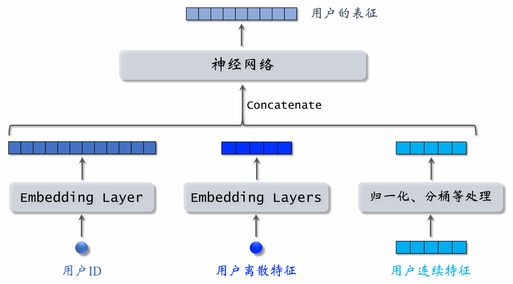
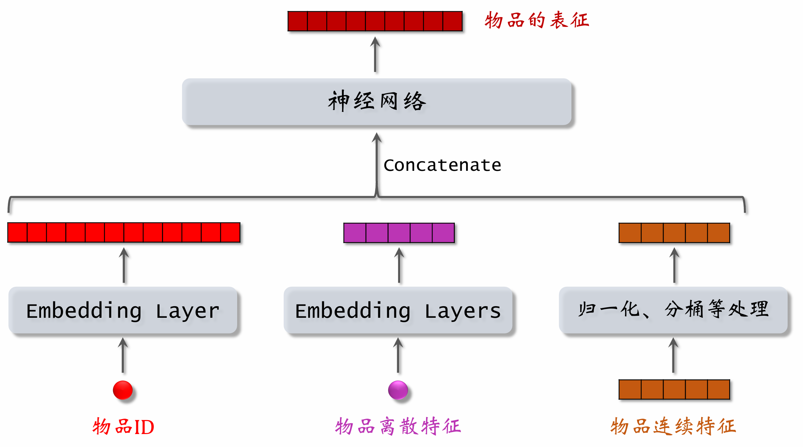
通过 Embedding 层和神经网络，将用户和物品特征转换为向量，作为表征
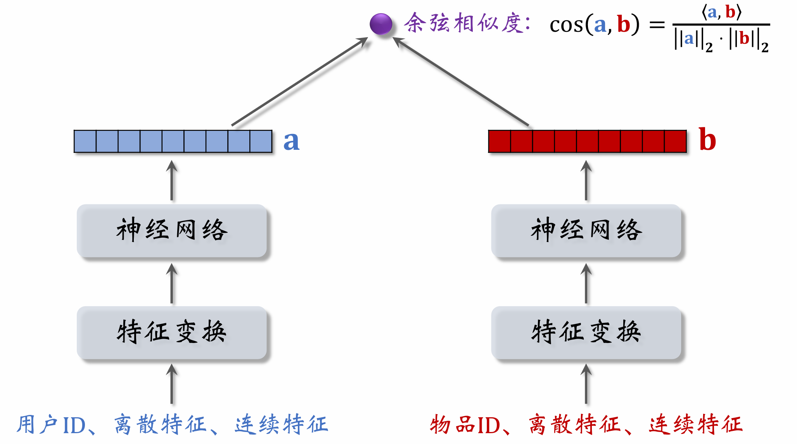
左边的塔用来提取用户的特征，右边的塔用来提取物品的特征                        
**余弦相似度**的分子是用户向量$a$与物品向量$b$的内积，分母是用户向量$a$的二范数与物品向量$b$的二范数的乘积

#### 9.2. 双塔模型的训练
- 训练阶段：训练时用户塔与物品塔前向传播同时计算向量，反向传播同步更新参数，联合端到端训练          
>  读取一个 Batch        
>  → 用户塔生成用户向量      
>  → 商品塔生成商品向量    
>  → 计算相似度矩阵        
>  → 构造正负样本关系         
>  → 计算损失      
>  → 反向传播  
>  → 更新两座塔  
>  → 读取下一个 Batch  

1. 训练方法：
   - Pointwise：独立看待每个正样本、负样本，每次一个用户、一个物品(可正可负)做简单的**二元分类**
   - Pairwise：每次取一个正样本、一个负样本，组成**二元组**
   - Listwise：每次取一个正样本、多个负样本，类似多元分类
2. 正负样本的选择
   - 正样本：用户点击的物品
   - 负样本：
     - 没有被召回的
     - 召回但是被粗排、精排淘汰的
     - 曝光但是未点击的

#### 9.3 Pointwise 训练

- 把召回看做二元分类任务
- 对于正样本，鼓励$cos(a,b)$ 接近 $+1$
- 对于负样本，鼓励$cos(a,b)$ 接近 $-1$
- **控制正负样本数量为 1:2 或者 1:3**

#### 9.4 Pairwise 训练

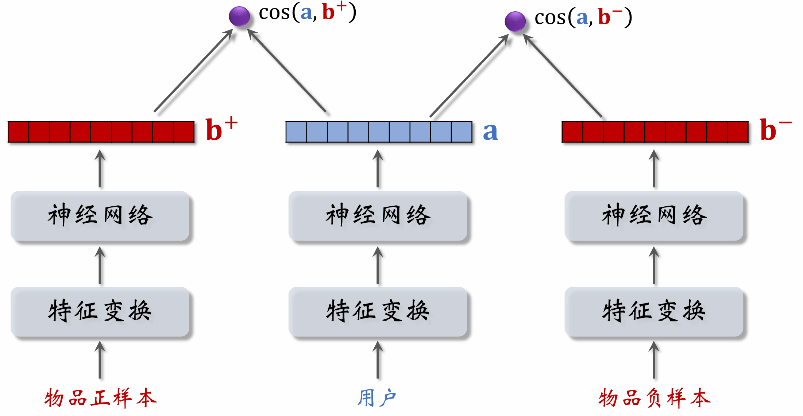
> 物品正样本和物品负样本所使用的神经网络、特征变换网络**参数一致**           

**基本想法**：鼓励$cos(a,b^{+})$大于$cos(a,b^{-})$, $cos(a,b^{+})$比$cos(a,b^{-})$<u>大的越多越好</u>

- 如果$cos(a,b^{+})$大于$cos(a,b^{-})+𝑚$，则没有损失。$m$是超参数
- 否则，**损失**等于$cos(a,b^{-})+𝑚-cos(a,b^{+})$

**损失函数**：
- **Triplet hinge loss**:     
  $$
  L(a,b^{+},b^{-})=max\left \{0,cos(a,b^{-})+m-cos(a,b^{+})\right \}
  $$
  > 让满足目标的三元组 loss=0，只惩罚那些没有满足“正样本相似度至少比负样本高 margin”的样本
- **Triplet logistic loss**:
  $$
  L(a,b^{+},b^{-})=\log{(1+\exp\left[\sigma \cdot(\cos(a,b^{-})-\cos(a,b^{+}))\right])}
  $$
  > $\sigma$是一个大于 0 的超参数，手动设置

#### 9.5 Listwise 训练             

**对比学习**是一种表示学习方法，通过构造正样本对和负样本对，使**相似样本在向量空间中更接近、不相似样本更远**，从而学习更有区分性的用户或物品表示

1. 样本选择
   - 一条数据包含
     - 一个用户，特征向量记作$a$
     - 一个正样本，特征向量记作$b^{+}$
     - **多个**负样本，特征向量记作$b_{1}^{-},\cdots,b_{n}^{-}$
   - 鼓励$cos(a,b^{+})$尽量大
   - 鼓励$cos(a,b_{1}^{-}),\cdots,cos(a,b_{n}^{-})$尽量小

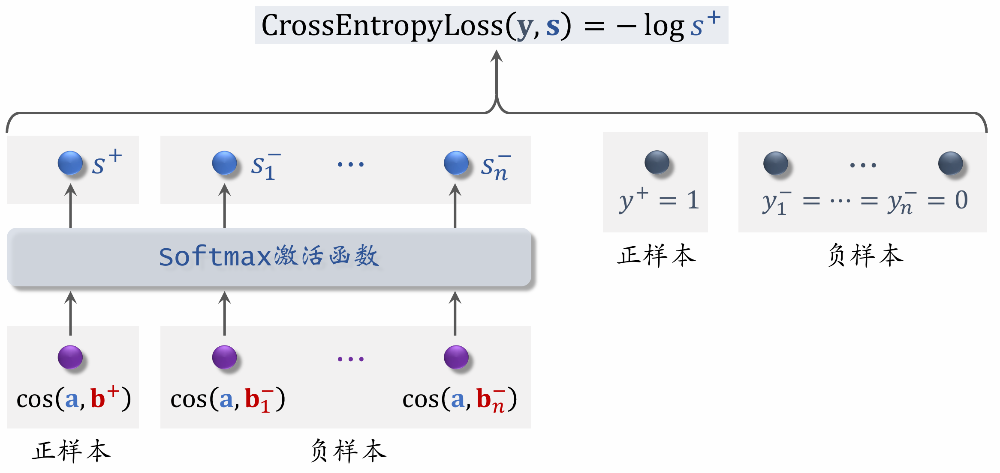

分别计算用户向量与正样本、负样本之间的余弦相似度，并将得到的结果输入 **softmax 激活函数**。正样本输出期望是 1，负样本输出的期望是 0。使用 **CrossEntropyLoss交叉熵**计算损失函数
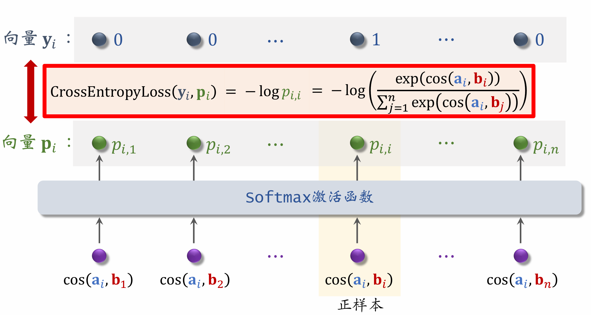

> 交叉熵损失函数：
> $$
> CrossEntropyLoss(y_i,p_i)=-\log{p_{i,i}}=-\log({\frac{\exp (\cos (a_i,b_i))}{\sum\limits_{j=1}^{n}\exp (\cos (a_i,b_i))}})
> $$

## 10. 双塔模型--正负样本
召回原始日志仅留存用户交互正样本，无天然负样本；所有负样本均为人工构造，常见全局随机采样、batch 内复用采样、难样本挖掘三种方式；只有精排环节可依托曝光未点击行为获得业务层面真实负样本。
1. 正样本
   - 正样本：曝光而且有点击的用户—物品二元组(用户对物品感兴趣)
   - 问题：少部分物品占据大部分点击，导致正样本大多是热门物品
   - 解决方案：**过采样冷门物品，或降采样热门物品**
     - 过采样(up-sampling)：一个样本出现多次
     - 降采样(down-sampling)：一些样本被抛弃
2. 简单负样本：全体物品
   - 未被召回的物品，大概率是用户不感兴趣的
   - **未被召回的物品$\approx$全体物品**
   - 从全体物品中做抽样，作为负样本
   - 均匀抽样：对冷门物品不公平
     - 正样本大多是热门物品
     - **如果均匀抽样产生负样本，负样本大多是冷门物品**
   - **非均匀抽采样：目的是打压热门物品**
     - 负样本抽样概率与热门程度(点击次数)正相关
     - 抽样概率$\propto$(点击次数)$^{0.75}$
      > 0.75是经验值                 

3. 简单负样本：Batch 内负样本
   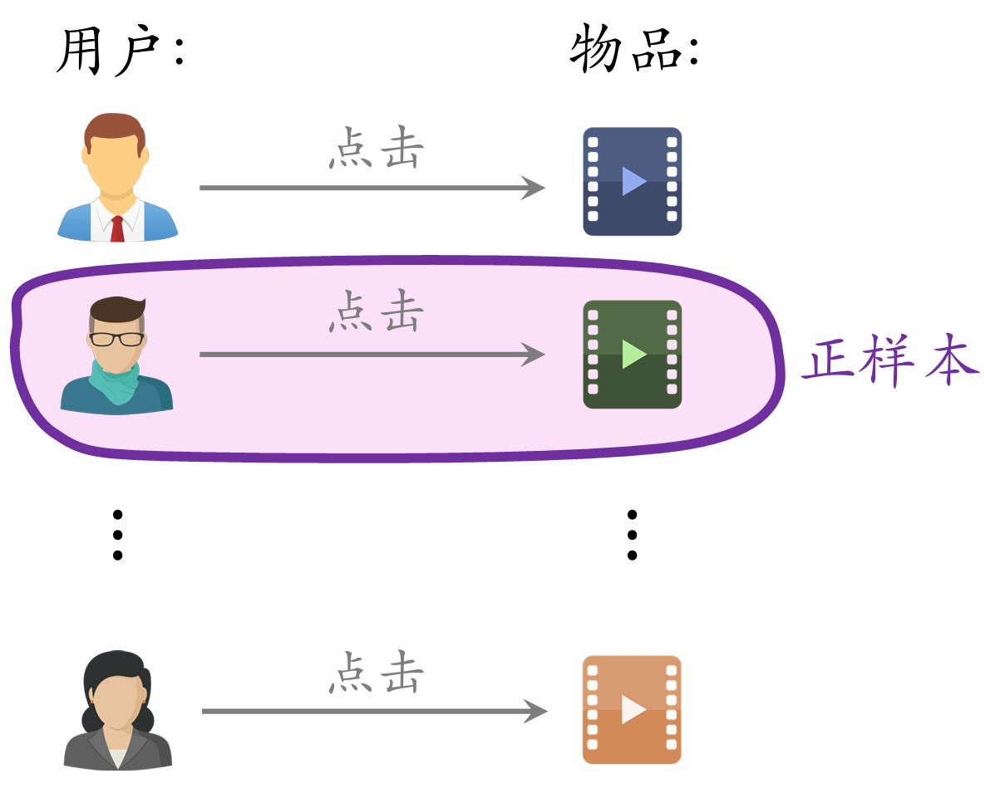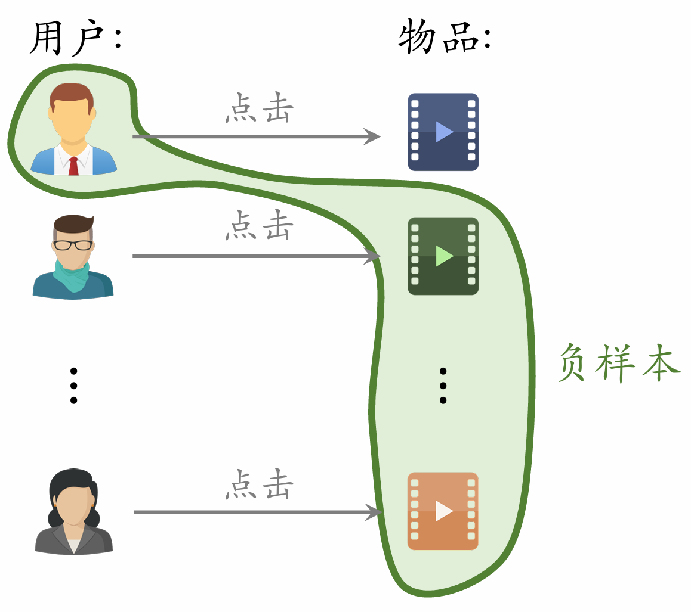
   - batch 内的用户至少点击过 batch 内的一个物品
   - 一个 batch 内有$n$个正样本，一个用户与其点击过的一件物品组成一个**正样本**
   - <u>一个用户和$n−1$个物品组成负样本</u>
   - 这个 batch 内一共有$n(n-1)$个负样本
   - <u>负样本都是简单负样本</u>
    > (第一个用户大概率不喜欢第二个物品，因为对于第一个用户来说，第二个物品相当于是从全体物品中简单随机抽样的)                             
  
  缺点：                      
   - 一个物品出现在 batch 内的概率$\propto$点击次数
   - 物品成为负样本的概率本该是$\propto$(点击次数)$^{0.75}$，但在这⾥是$\propto$点击次数
   - **热门物品成为负样本的概率过大**，对于热门物品的抽样打压太过了       
  
  如何修正：        
   - 物品$i$被抽样到的概率：$p_i\propto$点击次数
   - 预估用户对物品$i$的兴趣：$\cos(a,b_i)$
     > $cos(a,b_i)$余弦相似度，$a$用户特征向量，$b_i$物品特征向量
   - 做训练的时候，**调整为：$\cos(a,b_i)-\log{p_i}$**，线上做召回时，仍用$\cos(a,b_i)$              
   - 
4. 困难负样本：被排序淘汰的物品                         
   - 被<u>粗排</u>淘汰的物品(比较困难)
   - <u>精排</u>分数靠后的物品(非常困难)

  **训练双塔模型实际上是一个对正负样本的二元分类任务**

   - 如果样本池是全体物品，那么是简单分类，分类准确率高
   - 如果样本池是被粗排淘汰的物品，容易分错，比较困难
   - 如果样本池是精排分数靠后的物品，更容易分错，非常困难

5. 工业上的训练数据                  
   混合几种不同类型的负样本(比如从全体样本中随机非均匀抽样和粗排、精排中淘汰的样本)
        
     

6. 常见错误                        
   训练<u>召回</u>模型不能用<u>曝光但是没有点击的物品</u>作为负样本             
   训练<u>排序</u>模型会用<u>曝光但是没有点击的物品</u>作为负样本

## 11. 双塔模型--线上召回与更新

#### 11.1. 线上召回

1. **离线存储-物品**                                  
   利用物品塔提取每个物品的特征向量**b**，把 $\langle$ 特征向量**b**, 物品 ID $\rangle$ 保存到向量数据库。          
   数据库中查找方法采用**最近邻查找**               
   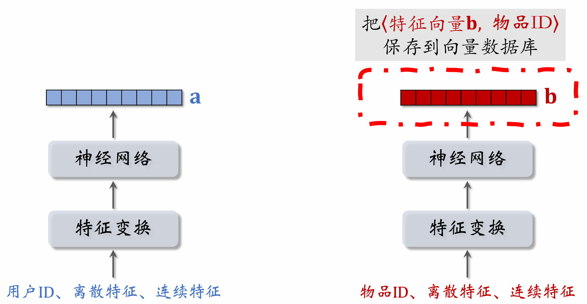
   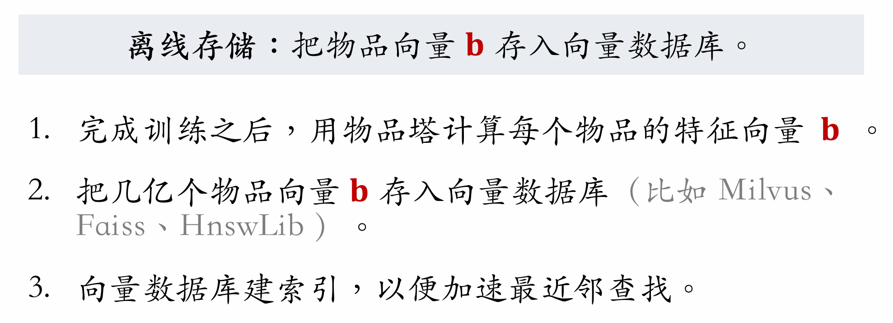    

2. **线上召回-用户**             
   当需要召回时，用**给定的用户 ID 和特征**，再线上计算用户特征向量**a**，把用户特征向量**a**作为 query，在物品向量数据库中进行最近邻查找
   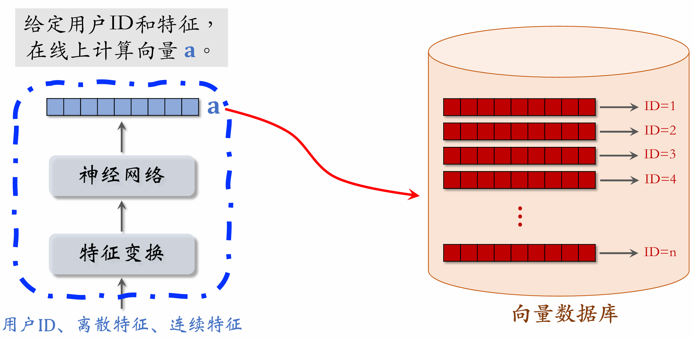
   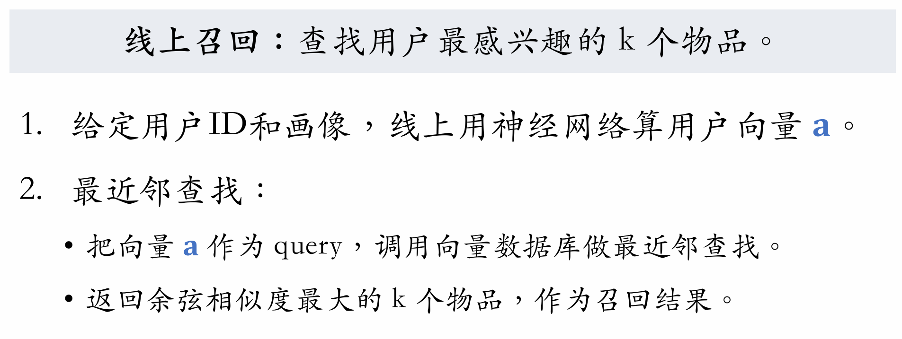

> **WHY为什么**?   
> 事先存储物品向量 b，线上现算用户向量 a    
> 1. 每做一次召回，用到一个用户向量 a，几亿物> 品向量 b。<u>(线上算物品向量的代价过大)</u>     
> 2. 用户兴趣动态变化，而物品特征相对稳定。<u>(可以离线存储用户向量，但不利于推荐)</u>

#### 11.2. 模型更新

1. **全量更新**：今天凌晨，用昨天全天的数据训练模型
   - **在昨天模型参数的基础上做训练**。(不是随机初始化)
   - 用昨天的数据，训练 1epoch，即每天数据只用一遍
   - <u>发布新的用户塔神经网络和物品向量，供线上召回使用</u>
   - 全量更新对数据流、系统的要求比较低 

2. **增量更新**：做 online learning 更新模型参数
   - 用户兴趣会随时发生变化
   - <u>实时收集线上数据，做流式处理，生成 TFRecord 文件</u>
      > TFRecord 只是 TensorFlow 常用的一种训练数据存储格式
   - 对模型做 online learning，增量更新 ID Embedding 参数。(**冻结**神经网络其他部分的参数，**只更新 Embedding 层参数**)
   - 发布用户 ID Embedding，供用户塔在线上计算用户向量。
     > 用户 Embedding 层的作用是将用户和用户离散、连续特征转换为向量，作为表征

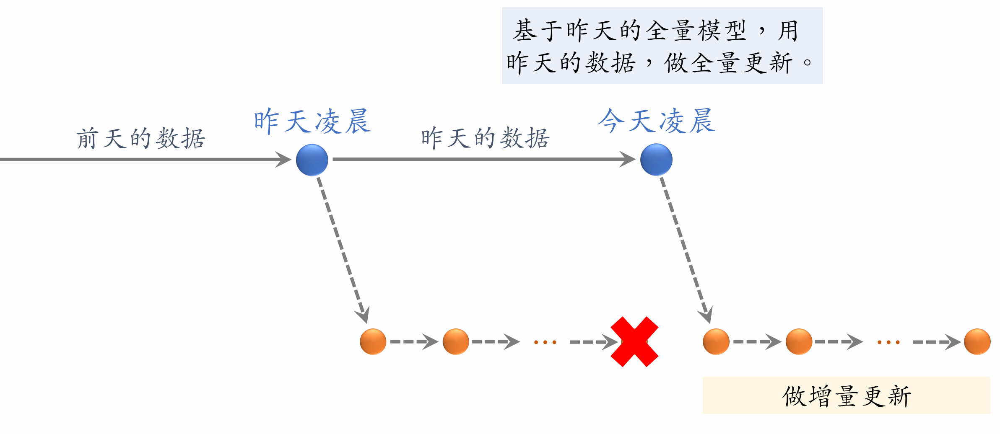

> **能否只做增量更新，不做全量更新**?
>
> - 小时级数据有偏；分钟级数据偏差更大
> - 随机打乱优于按顺序排列数据，全量训练优于增量训练        
     - 全量更新：random shuffle 一天的数据，做 1epoch 训练，能消除偏差
     - 增量更新：按照数据从早到晚的顺序，做 1epoch 训练   
> - 实际的系统是全量更新和增量更新相结合

## 12. 双塔模型+自监督学习

> 自监督学习的目的是把**物品塔**学习得更好

#### 12.1. 双塔模型的问题

1. 推荐系统的**头部效应**严重
   - 少部分物品占据大部分点击
   - 大部分物品的点击次数不高
2. 高点击物品的表征学得好，<u>长尾物品的表征学得不好</u>(长尾物品曝光点击太少，训练样本不够)
3. **自监督学习：做 data augmentation，更好地学习长尾物品的向量表征**。

#### 12.2. 训练双塔模型(无特征变换)

1. 从点击数据中随机抽取 n 个用户--物品二元组，组成一个 batch
2. 双塔模型的损失函数(对应用户 i)：<u>(batch内负样本纠偏)</u>
  $$
  L_{main}[i]=-\log({\frac{\exp (\cos (a_i,b_i)-\log{p_i})}{\sum\limits_{j=1}^{n}\exp (\cos (a_i,b_j)-\log{p_j})}})
  $$
4. 做梯度下降，减小损失函数：$\frac{1}{n}\sum\limits_{i=1}^{n}L_{main}[i]$

#### 12.3. 自监督学习

1. 物品$i$的特征分别通过<u>两个不同的变换 1 和变换 2</u> 得到物品特征$i'$和物品特征$i''$
2. 物品$j$进行同样操作，得到物品特征$j'$和物品特征$j''$
3. 将物品特征$i'$，$i''$，$j'$，$j''$分别通过物品塔，得到对应物品$i$的特征向量$b_i'$，$b_i''$，对应物品$j$的特征向量$b_j'$，$b_j''$
4. $b_i'$与$b_i''$之间应**具有高余弦相似度**，$b_i'$与$b_j'$和$b_j''$应具有低余弦相似度，鼓励$\cos(b_i',b_i'')$尽量大，$\cos(b_i',b_j'')$尽量小
   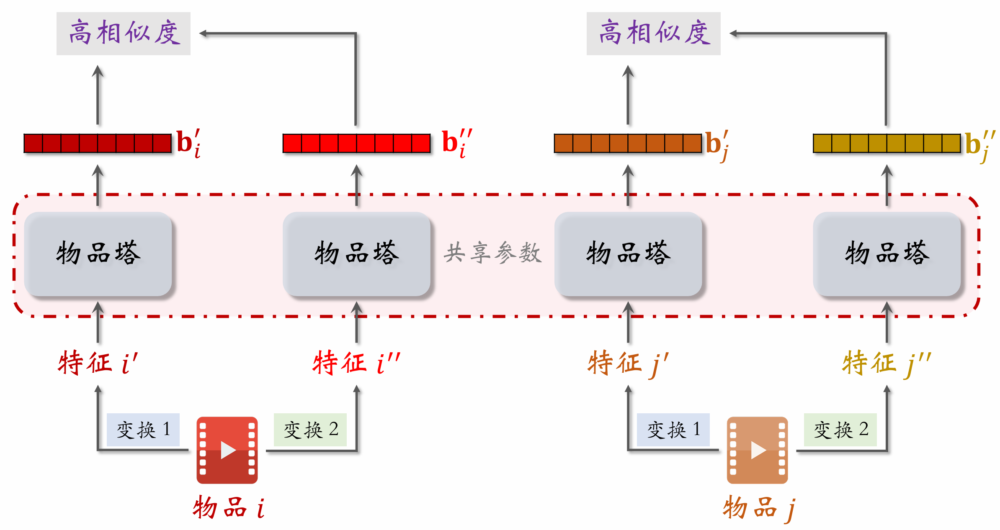
   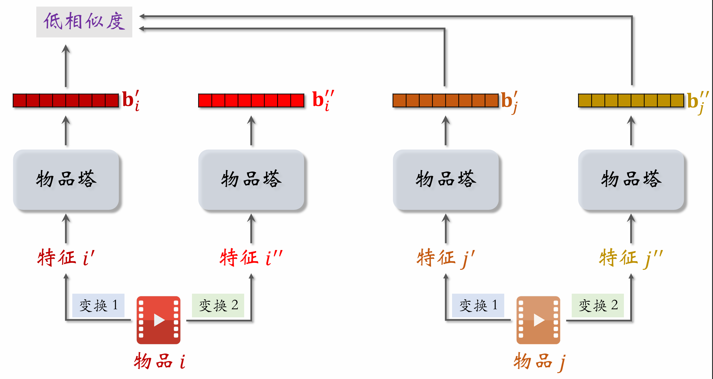

#### 12.4. 特征变换

1. **Random Mask**
   - 随机选一些离散特征(比如类目)，把它们遮住
   - 例：
     - 某物品的类目特征是$u$ = {数码,摄影}
     - Mask 后的类目特征是$u'$ = {default}    
     
2. **Dropout**(仅对多值离散特征生效)
   - 一个物品可以有多个类目，那么类目是一个**多值离散特征**
   - Dropout：随机丢弃特征中 50% 的值
   - 例:
     - 某物品的类目特征是$u$ = {美妆,摄影}
     - Dropout 后的类目特征是$u'$ = {美妆}
       > Random Mask 会舍弃物品某一项特征中的**所有值**，Dropout 会舍弃物品某一**多值离散特征**中的部分值   

3. **互补特征**(complementary)
   - 假设物品一共有 4 种特征：ID，类目，关键词，城市
   - 随机分成两组：{ID，关键词} 和 {类目，城市}
   - { ID，default，关键词，default } -> 物品表征向量 1
   - { default，类目，default，城市 } -> 物品表征向量 2
   - 物品表征向量 1 与物品表征向量 2 之间<u>应相似</u>  
  
4. **Mask 一组关联的特征**
   > 物品中某些特征具有强关联属性，只 mask 其中一个，神经网络可能会学习到被 mask 的特征，所以将这些具有强关联属性的特征同时 mask
   - 受众性别：$u$={男,女,中性}
   - 类目：$v$={美妆,数码,足球,摄影,科技,⋯}
   - $u$=⼥和$v$=美妆**同时出现的概率**$p(u,v)$大
   - $u$=⼥和$v$=数码同时出现的概率$p(u,v)$小
   - $p(u)$：某特征取值为$u$的概率
     - $p$(男性) = $20\%$
     - $p$(女性) = $30\%$
     - $p$(中性) = $50\%$
   - $p(u,v)$：某特征取值为$u$，另一个特征取值为$v$，同时发生的概率
     - $p$(⼥性，美妆) = $3\%$
     - $p$(⼥性，美妆) = $0.1\%$            
     
   离线计算特征两两之间的关联，用**互信息**(mutual information)衡量：
      $$
      MI(u,v)=\sum\limits_{u\in U} \sum\limits_{v\in V}p(u,v)\cdot \log{\frac{p(u,v)}{p(u)\cdot p(v)}}
      $$
     > 两个特征的关联越强，mutual information 就越大        

   step 1: 设一共有$k$种特征。离线计算特征两两之间$MI$,得到$k\times k$的矩阵          
   step 2: 随机选一个特征作为种子，找到种子最相关的$k/2$种特征            
   step 3: Mask 种子及其相关的$k/2$种特征，保留其余的$k/2$种特征          
    > - 好处：比randommask、dropout、互补特征等方法法效果更好           
    > - 坏处：方法复杂，实现的难度大，不容易维护

#### 12.5. 训练有特征变换的模型(自监督模型)

1. 从**全体物品**中均匀抽样，得到$m$个物品，作为一个 batch
   > 双塔模型是根据点击行为进行抽样，热门物品被抽样概率大             
   > 自监督模型训练时，直接从全体物品中抽样，冷门和热门物品抽样概率相同，自监督模型只训练物品塔
2. 做两类特征变换，物品塔输出两组向量：$b_1',b_2',\cdots,b_m'$和$b_1'',b_2'',\cdots,b_m''$
3. 第 i 个**物品的损失函数**：
  $$
  L_{self}[i]=-\log{(\frac{\exp(\cos(b_i',b_i''))}{\sum\limits_{j=1}^{m}\exp(\cos(b_i',b_j''))})}
  $$
4. 做梯度下降，减小自监督学习的损失：$\frac{1}{m}\sum\limits_{i=1}^{m}L_{self}[i]$
 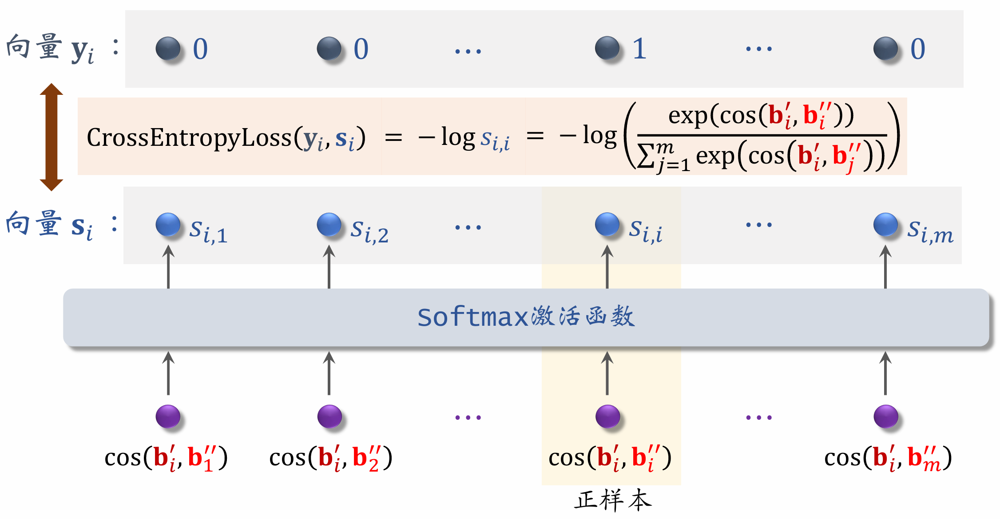

#### 12.6. 现实流程

1. 对**点击**做随机抽样，得到$n$对用户--物品二元组，作为一个 batch，训练双塔模型
2. 从**全体物品**中均匀抽样，得到$m$个物品，作为一个 batch，训练自监督学习模型
3. 做梯度下降，使得损失减小：
  $$
  \frac{1}{n}\sum\limits_{i=1}^{n}L_{main}[i]+\alpha \cdot \frac{1}{m}\sum\limits_{j=1}^{m}L_{self}[j]
  $$
   > $L_{main}$是双塔模型的损失，$L_{self}$是自监督学习的损失，$\alpha$是一个超参数，决定自监督学习模型能起到多大作用

## 13. Deep Retrieval

1. 经典的双塔模型把用户、物品表示为向量，线上做最近邻查找
2. <u>Deep Retrieval 把物品表征为路径(path)，线上查找用户最匹配的路径</u>
3. Deep Retrieval 类似于阿⾥的 TDM

- 索引：路径->list<物品>, 物品->list<路径>
- 预估模型：神经网络预估用户对路径的兴趣
- 线上召回：用户 -> 路径 -> 物品
- 训练：神经网络、物品表征路径

#### 13.1. 索引

1. 把一个物品表⽰为一条路径(path)，比如[2，4，1]
2. 一个物品可以表示为**多条路径**，比如{[2,4,1],[4,1,1]}
   > 举例：深度:depth = 3，宽度:width = K，可能的物品路径如下图所示
   > 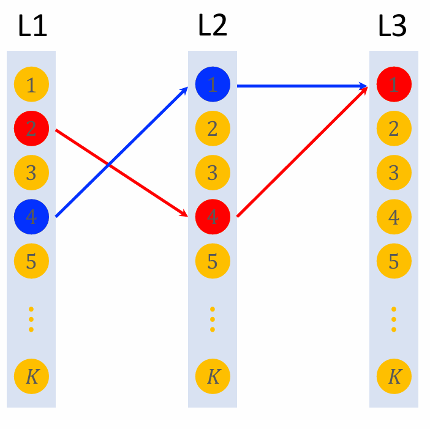
-  物品到路径的索引 item->List$\langle$path$\rangle$
   - 一个物品对应多条路径
   - 当用 3 个节点表⽰一条路径时：path= [a，b，c]
-  路径到物品的索引 path->List$\langle$item$\rangle$
   - 一条路径对应多个物品

#### 13.2. 预估模型

1. 用 3 个节点表⽰一条路径：path=[a,b,c]
2. 给定用户特征 x，预估用户对节点 a 的兴趣$p_1(a|x)$
3. 给定 x 和 a，预估用户对节点 b 的兴趣$p_2(b|a;x)$
4. 给定 x,a,b，预估用户对节点 c 的兴趣$p_3(c|a,b;x)$
5. 预估用户对 path=[a,b,c]兴趣：$p(a,b,c|x)=p_1(a|x)\times p_2(b|a;x)\times p_3(c|a,b;x)$
【朴素贝叶斯】

#### 13.2.1. 预估模型的具体执行过程

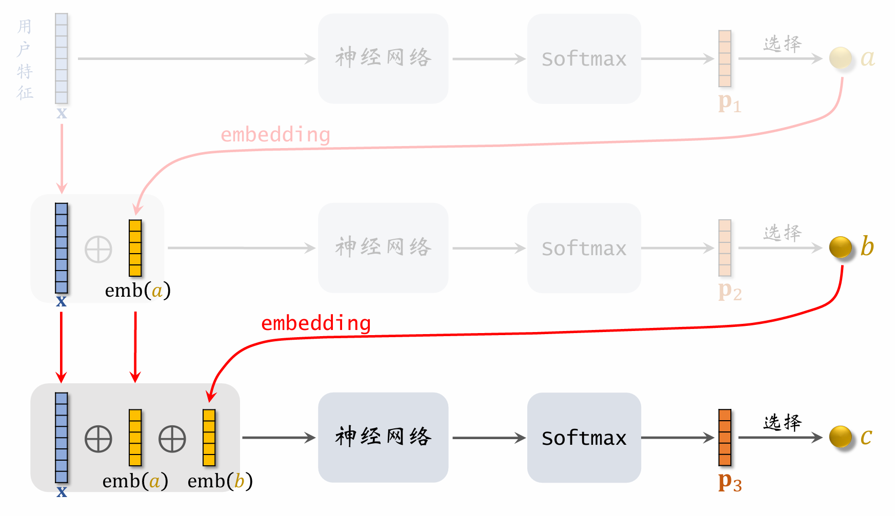

1. 假设 Deep Retrieval 结构有 3 层，每层有 k 个结点，则路径长度为 3，路径中每个结点有 k 种可能性
2. 提取用户特征向量 x,输入神经网络 1，由 Softmax 层输出一个向量$p_1$
3. <u>$p_1$对应 Deep Retrieval 结构的第一层，是一个 K 维向量，向量中每一个元素是对 Deep Retrieval 结构对应层别结点的打分</u>
4. 使用 beam search 方法，选出一个结点，记为 a，并进行 embedding，得到向量 emb(a)
5. 将用户特征向量 x 和向量 emb(a)进行向量拼接(Concatenation)操作，输入神经网络 2，得到对下一层的打分向量$p_2$
6. 以此类推，使用 beam search 方法，选出一个结点，记为 b，进行 embedding，得到向量 emb(b)
7. 将用户特征向量 x ，向量 emb(a)和向量 emb(b)进行向量拼接操作，输入神经网络 3，得到下一层别的打分向量$p_3$，并使用 beam search 方法，选出一个结点 c
8. 路径[a,b,c]即为预估路径

### 13.3. 线上召回

召回：**用户->路径->物品**

1. 第一步：给定用户特征，用 beam search 召回一批**路径**
2. 第二步：利用索引“path->List$\langle$item$\rangle$”，召回一批**物品**
3. 第三步：召回的物品可能会超过对召回通道的配额限制，所以对物品做打分和排序，选出一个子集，这一步可以使用双塔模型或者其他模型

### 13.3.1 使用 Beam Search 召回一批路径

1. 假设有 3 层，每层$K^3$个节点，那么一共有$K$条路径
2. 用神经网络给所有$K^3$条路径打分，计算量太大
3. 用 beam search，可以减小计算量，需要设置超参数 beam size
4. 用户对 path=[a,b,c]兴趣：$p(a,b,c|x)=p_1(a|x)\times p_2(b|a;x)\times p_3(c|a,b;x)$
5. 最优路径：$[a^{*},b^{*},c^{*}]=\genfrac{}{}{0pt}{}{\arg \max}{\scriptsize{a,b,c}} p(a,b,c|x)$
6. Beam Search 实质为**贪心算法**，当 beam size=1 时选中的路径[a,b,c]未必是最优的路径
7. beam size 比较小时，计算量比较小，但结果不准确，beam size 比较大时，计算量比较大，但结果准确

举例：当 beam size = 4，Deep Retrieval 结构有 3 层，每一层有 K 个结点时：

1. 根据预估模型得到的对第一层的打分向量$p_1$，向量$p_1$中的元素$p_1(1|x),p_1(2|x),\cdots,p_1(K|x)$分别是对第一层对应结点的打分，选出最高的 beam size 个，此时为 4

2. 由第一层得到 4 个结点，每个结点引出到下一层每个结点一条路径，根据预估模型得到的对第一层的打分向量$p_2$
3. 对于每个被选中的节点 a，计算用户对路径[a,b]的兴趣：$p_1(a|x)\times p_2(b|a;x)$
4. 算出$4\times K$个分数，每个分数对应一条路径，<u>选出分数 top 4 路径，排除掉没有选出的路径</u>。
5. 后续层别以此类推，每次只筛选出分数最高的 4 条路径

### 13.3.2 离线训练

> 同时学习神经网络参数和物品表征

- 训练目标 1：神经网络$p(a,b,c|x)$的参数，神经网络$p(a,b,c|x)$<u>预估用户对路径$[a,b,c]$的兴趣</u>
- 训练目标 2：物品的表征，把一个物品表征为多条路径${[a,b,c]}$建⽴索引:
  - item->List$\langle$path$\rangle$
  - path->List$\langle$item$\rangle$
- <u>训练时只需要正样本</u>。正样本(user, item)： **click(user, item) = 1**

**1. 学习神经网络参数**

- 假设物品表征为$J$条路径：$[a_1,b_1,c_1],\cdots,[a_J,b_J,c_J]$
- 用户对路径$[a,b,c]$的兴趣：$p(a,b,c|x)=p_1(a|x)\times p_2(b|a;x)\times p_3(c|a,b;x)$
- 如果用户点击过物品，说明用户对$J$条路径感兴趣
- 应该让$\sum\limits_{j=1}^{J}p(a_j,b_j,c_j|x)$变大
- **损失函数** loss = -log($\sum\limits_{j=1}^{J}p(a_j,b_j,c_j|x)$)

**2. 学习物品表征**

- 用户 user 对路径 path=[a,b,c]的兴趣记作：$p(path|user)=p(a,b,c|x)$
- **物品 item 与路径 path 的相关性**：$score(item,path)=\sum\limits_{user}p(path|user)\times click(user,item)$
  > p(path|user)表示用户对路径的兴趣 click(user,item)表示是否点击(0 或 1)
  > 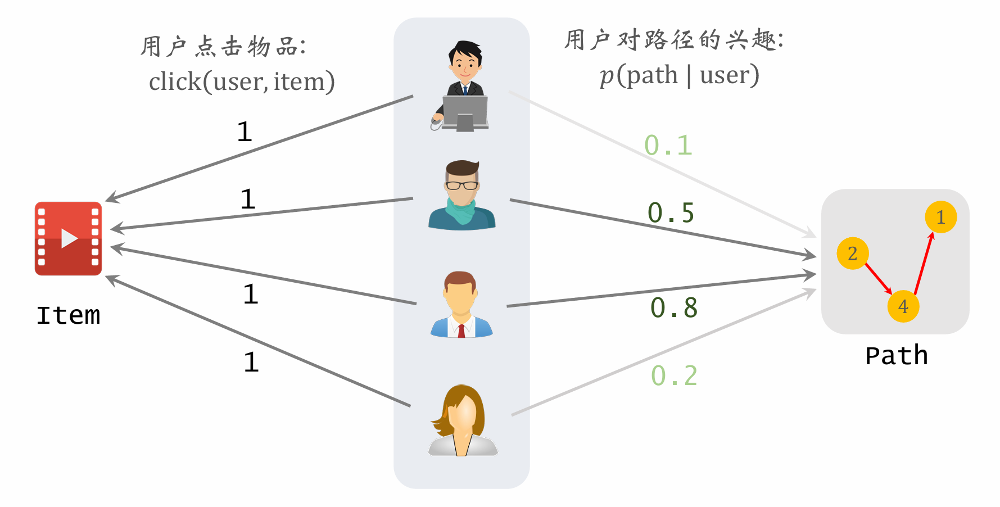
  > 图片左侧是物品，中间是用户，右边是神经网络计算出来的路径，每一个用户都点击过物品，可看作正样本
  > 计算$score(item,path)=\sum\limits_{user}p(path|user)\times click(user,item)$，如果得分高，则认为这条路径和这件物品相关性很高，便把这条路径作为物品的表征
- 根据 score(item,path)选出$J$条路径$\Pi = \{path_1,\cdots,path_J \}$**作为 item 的表征**
- 损失函数(选择与 item 高度相关的 path)：$loss(item,\Pi) = -\log(\sum\limits_{j=1}^Jscore(item,path_j))$
- **正则项**(避免过多的 item 集中在一条 path 上)：$reg(path_j)=(number\ of\ items\ on\ path_j)^4$

**3. 用贪心算法更新路径**

- 假设已经把物品表征为$J$条路径$\Pi = \{path_1,\cdots,path_J \}$
- 每次固定$\{path_i\}_{i\neq l}$，并从未被选中的路径中，选出一条作为新的$path_l$：$path_l\gets argmin_{path_l}loss(item,\Pi)+\alpha \cdot reg(path_l)$
- 选中的路径有较高的分数$score(item,path_l)$，而且路径上的物品数量不会太多。

**4. 训练**

1. 更新神经网络
   - 神经网络判断用户对路径的兴趣：p(path|X)
   - 训练所需的数据：(1)“物品->路径”的索引;(2)用户点击过的物品
   - 如果用户点击过物品，且物品对应路径 path，则更新神经网络参数使 p(path|X)变大
2. 更新物品的表征
   - 判断物品与路径的相关性：
     | 物品 ⟵| 用户 | ⟶ 路径 |
     | -: | -| :- |
     | 用户点击过物品 | | 神经网络的打分 |
   - 让每个物品关联$J$条路径
     - 物品和路径要有很高的相关性
     - 一条路径上不能有过多的物品

## 14. 其他召回：地理位置召回、作者召回、缓存召回

### 14.1 地理位置召回

1. **GeoHash 召回**
   - 用户可能对附近发生的事感兴趣
   - GeoHash：<u>对经纬度的编码，地图上一个长方形区域</u>
   - 索引：GeoHash->优质笔记列表(按时间倒排)
   - 这条召回通道<u>没有个性化</u>
     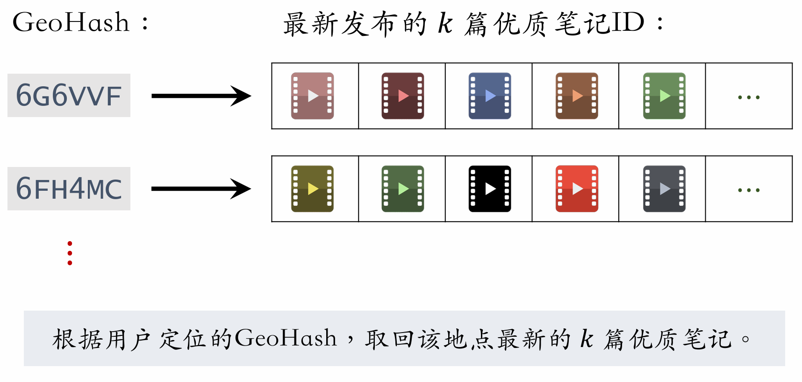
2. **同城召回**
   - 用户可能对同城发生的事感兴趣
   - 索引：城市->优质笔记列表(按时间倒排)
   - 这条召回通道<u>没有个性化</u>

### 14.2 作者召回

1. **关注作者召回**
   - 用户对关注的作者发布的笔记感兴趣
   - 2个索引:
     - 用户 -> 关注的作者
     - 作者 -> 发布的笔记
   - **召回**：用户 -> 关注的作者 -> 最新的笔记
2. **有交互的作者召回**
   - 如果用户对某笔记感兴趣(点赞、收藏、转发)，那么用户可能对该作者的其他笔记感兴趣
   - 索引：用户 -> 有**交互**的作者
   - 召回：用户 -> 有交互的作者 -> 最新的笔记
3. **相似作者召回**
   - 如果用户喜欢某作者，那么用户喜欢相似的作者
   - 索引：作者 -> 相似作者($k$个作者)
   - 召回：用户 -> 感兴趣的作者($n$个作者) -> 相似作者($nk$个作者) ->最新的笔记($nk$篇笔记)

### 14.3 缓存召回

想法：复用前 n 次推荐精排的结果

- 背景:
  - 精排输出几百篇笔记，送入重排
  - 重排做多样性抽样，选出几十篇
  - 精排结果一大半没有曝光，被浪费
- 精排前 50，但是没有曝光的，<u>缓存起来，作为一条召回通道</u>
  > 缓存大小固定，需要退场机制
  - 一旦笔记成功曝光，就从缓存**退场**
  - 如果超出缓存大小，就移除最先进入缓存的笔记
  - 笔记最多被召回 10 次，达到 10 次就退场
  - 每篇笔记最多保存 3 天，达到 3 天就退场

## 15. 曝光过滤 & Bloom Filter

### 15.1 曝光过滤问题

**如果用户看过某个物品，则不再把该物品曝光给该用户**    

- 对于每个用户，记录已经曝光给他的物品。(小红书只召回 1 个月以内的笔记，因此只需要记录每个用户最近 1 个月的曝光历史。)
- 对于每个召回的物品，判断它是否已经给该用户曝光过，<u>排除掉曾经曝光过的物品</u>
- 一位用户看过$n$个物品，本次召回$r$个物品，如果暴力对比，需要$O(nr)$的时间，太大了，所以用Bloom Filter.

### 15.2 Bloom Filter

- Bloom filter 判断一个物品 ID 是否在已曝光的物品集合中
  - 如果判断为 no，那么该物品一定不在集合中
  - 如果判断为 yes，那么该物品很可能在集合中。(可能误伤，错误判断未曝光物品为已曝光，将其过滤掉。)
- Bloom filter 是一种数据结构，把物品集合表征为一个 **m 维二进制向量**，该向量中，每一个元素占一个 bit，取值为 1 或 0
- 每个用户有一个曝光物品的集合，表征为一个向量，需要 m bit 的存储
- Bloom filter <u>有 k 个哈希函数，每个哈希函数把物品 ID 映射成介于 0 和 m−1 之间的整数</u>

> 哈希函数：一个计算公式，负责算映射值

**15.2.1. k=1 时**
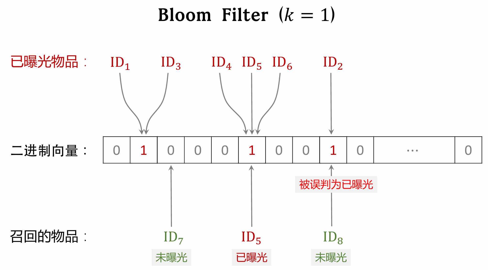

- 使用 1 个哈希函数，将物品映射到向量中，向量初始值全部赋值为 0
- 如果一个物品已曝光，则向量中对应位置赋值为 1，不同的物品可以映射到向量的同一个位置
- 召回的物品使用这个哈希函数，得到的值如果是 0，则表明一定未曝光，如果是 1，可能已曝光或未曝光

**15.2.2. k=3 时**
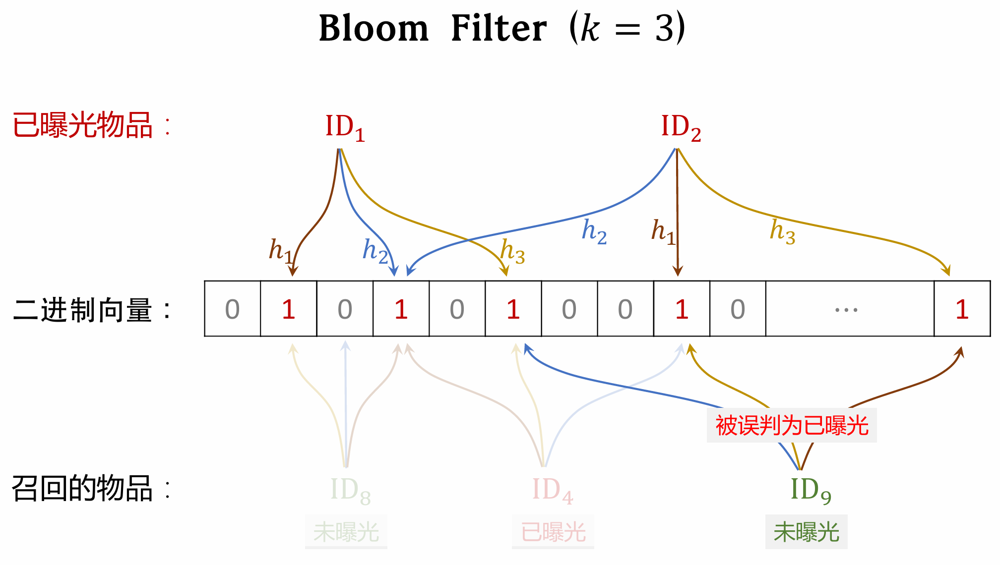

- 使用 3 个不同的哈希函数，将物品映射到向量中，向量初始值全部赋值为 0
- 如果一个物品已曝光，则使用这 3 个哈希函数得到的向量中的 3 个位置赋值为 1，<u>不同的物品可以映射到向量的同一个位置</u>
- 召回的物品使用这 3 个哈希函数，得到的值如果有一个是 0，则表明一定未曝光，如果都是 1，可能已曝光或未曝光

### 15.3 Bloom Filter 误伤的概率

曝光物品集合大小为$n$，二进制向量维度为$m$，使用$k$个哈希函数         
- Bloom Filter **误伤的概率**为$\delta \approx (1-\exp (-\frac{kn}{m}))^k$
  - $n$越大，向量中的 1 越多，误伤概率越大(未曝光物品的$k$个位置恰好都是 1 的概率大)
  - $m$越大，向量越长，越不容易发生哈希碰撞【不同输入算出完全一样的哈希值】
  - $k$太大、太小都不好，<u>$k$有最优取值</u>       

设定可容忍的误伤概率为$\delta$，那么最优参数为$k=1.44\cdot \ln{\frac{1}{\delta}}$，$m=2n\cdot \ln{\frac{1}{\delta}}$

### 15.4 曝光过滤的链路

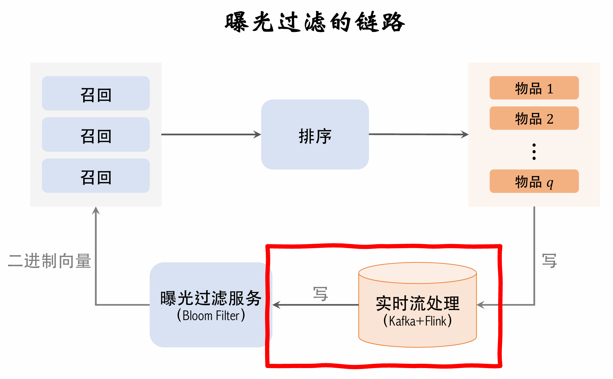

1.  **推荐**：推荐系统使用<u>不同的召回通道</u>，召回物品，并通过粗排、精排、重排，将一部分物品推荐给用户
2.  **曝光过滤**：推荐给用户的这部分物品，使用实时流处理(Kafka+Flink)，将物品写入 Kafka 对话序列，然后使用 Bloom Filter 处理，修改向量。
    > 这一步处理的速度必须非常快，否则在用户快速连续刷新的情况下，系统可能会给用户推荐重复物品
3.  **推荐**：在召回完成之后，系统调用曝光过滤服务，将已曝光的物品剔除，<u>剩下的物品再进入排序</u>

### 15.5 Bloom Filter 缺点

Bloom filter <u>只支持持添加物品，不⽀持删除物品</u>。从集合中移除物品，无法消除它对向量的影响，若直接将其对应位置的1改为0，会影响其他物品

- Bloom filter 把物品的集合表⽰成一个二进制向量
- 每往集合中添加一个物品，只需要把向量$k$个位置的元素置为 1(如果原本就是 1，则不变)       
- 每天都需要从物品集合中移除年龄大于 1 个月的物品(超龄物品不可能被召回，没必要把它们记录在 Bloom filter，降低$n$可以降低误伤率)

## 16. 排序：多目标排序模型

### 16.1 排序的依据

- 排序模型预估点击率、点赞率、收藏率、转发率等多种分数
- **融合**这些预估分数(比如加权和)
  【权重是做A/B测试调出来的】
- 根据融合的分数做排序、截断

### 16.2 多目标模型

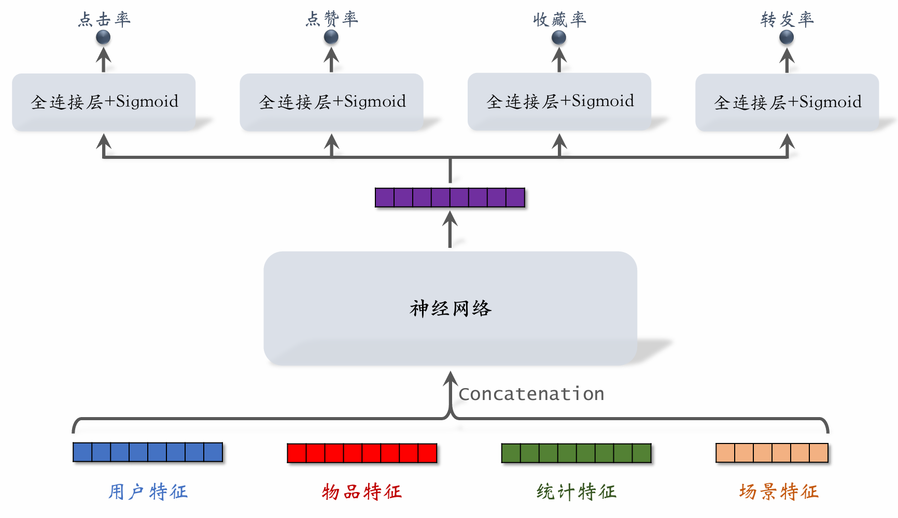

把用户特征、物品特征、统计特征、场景特征等特征向量进行向量拼接后(Concatenation)输入神经网络，神经网络输出一个向量，再把这个向量**输入四个不同的全连接层+Sigmod 层**，分别给出用户对物品的点击率$p_1$、点赞率$p_2$、收藏率$p_3$和转发率$p_4$的预测            

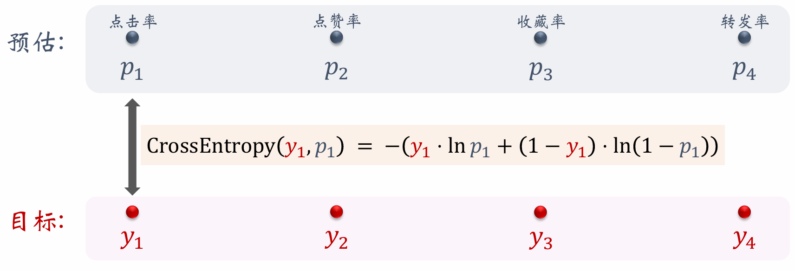

- 目标值$y_1,y_2,y_3,y_4$取值为 1 或者 0，**预测值**为 0 到 1 之间的实数
- **交叉熵损失** 
  $$
  CrossEntropy(y_1,p_1)=-(y_1\cdot \ln{p_1+(1-y_1)\cdot \ln{(1-p_1))}}
  $$
- 总的损失函数$\sum\limits_{i=1}^{4} \alpha_i\cdot CrossEntropy(y_i,p_i)$
- 对损失函数求梯度，<u>做梯度下降更新参数</u>

### 16.3 训练存在的问题

- 困难：类别不平衡，正样本少
  - 每 100 次曝光，约有 10 次点击、90 次无点击
  - 每 100 次点击，约有 10 次收藏、90 次无收藏
- 解决方案：**负样本降采样(down-sampling)**
  - 保留一小部分负样本
  - 让正负样本数量平衡，节约计算

### 16.4 预估值校准

- 正样本、负样本数量为$n_+$和$n_-$
- 对负样本做降采样，抛弃一部分负样本
- 使用$\alpha\cdot n_-$个负样本，$\alpha\in(0,1)$是采样率
- 由于负样本变少，<u>预估点击率大于真实点击率</u>
- **真实点击率**：$p_{true}=\frac{n_+}{n_++n_-}$(期望)
- **预估点击率**：$p_{pred}=\frac{n_+}{n_++\alpha\cdot n_-}$(期望)
- 由上两个等式可得**校准公式**：$p_{true}=\frac{\alpha\cdot p_{pred}}{1-p_{pred}+\alpha\cdot p_{pred}}$

## 17. 排序：Multi-gate Mixture-of-Experts(MMoE)

### 17.1 流程

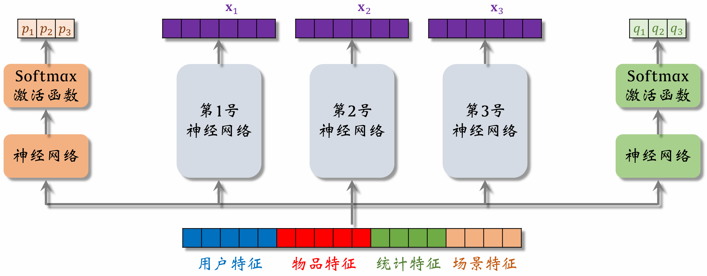

1. 将用户特征、物品特征、统计特征和场景特征进行向量拼接(Concatenation)，然后输入不同的神经网络(这里的神经网络称为**专家神经网络**，数量一般为 4 个或者 8 个，示例中采用 3 个)，这些神经网络的输出结果是向量。
2. 特征向量输入到另一个神经网络中，并经 softmax 层处理。输出结果是对专家神经网络的**权重打分**。权重向量的每一项都大于 0 小于 1，各项相加和等于 1

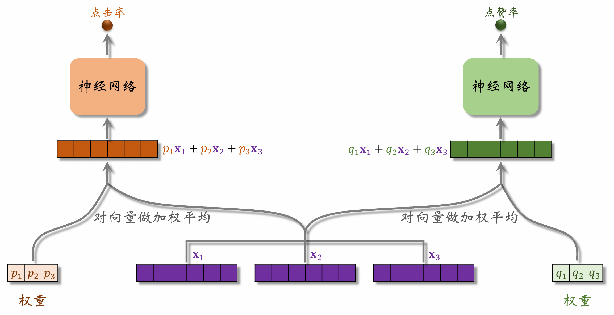

3. 使用权重向量和专家神经网络的结果进行加权计算，并把加权计算的结果输入到神经网络，神经网络的输出即是对某一消费指标的预估
4. <u>每一种消费指标，都需要计算一个单独的权重向量，和一个神经网络对其进行预测。</u>

### 17.2 softmax极化现象

**极化(polarize)**： Softmax 输出值一个接近 1，其余接近 0
出现极化现象会使 MMoE 模型退化为多目标模型，同时可能会出现某些专家神经网络的输出完全<u>没有被利用上</u>

解决极化问题：

- 如果有$n$个“专家”，那么每个 softmax 的输入和输出都是$n$维向量
- 在训练时，对 softmax 的输出使用 **dropout**
  - Softmax 输出的$n$个数值被 mask 的概率都是 10%
  - 每个“专家”被随机丢弃的概率都是 10%
    > 使用 dropout 后能避免极化现象的产生，因为一旦权重为 1 的专家被 mask，那么结果就会相差很大，<u>神经网络在训练时会避免这一情况</u>

## 18. 预估分数的融合

1. 简单的加权和
   $p_{click}+w_1\cdot p_{like}+w_2\cdot p_{collect}+\cdots$
   > $w_1，w_2$是各项权重，$p_{click}$点击的概率，$p_{like}$喜欢的概率，$p_{collect}$收藏的概率
2. **点击率乘以其他项的加权和**
   $p_{click}\cdot(1+w_1\cdot p_{like}+w_2\cdot p_{collect}+\cdots)$
   > $p_{click}\cdot p_{like}$曝光后再喜欢的概率
3. 海外某短视频 APP 的融分公式
   $(1+w_1\cdot p_{time})^{\alpha _1}\cdot(1+w_2\cdot p_{time})^{\alpha _2}\cdots$
   > $p_{time}$预估用户观看时长，$w_1,\alpha _1$是超参数，在做 AB 测试时进行调整
4. 国内某短视频 APP 的融分公式
   - 根据预估时长$p_{time}$，对$n$篇候选视频做排序
   - 如果某视频排名第$r_{time}$，则它**得分**$\frac{1}{r_{time}^\alpha+\beta}$
     > $\alpha,\beta$都是超参数
   - 对点击、点赞、转发、评论等预估分数做类似处理
   - 最终**融合分数**：$\frac{w_1}{r_{time}^{\alpha_1}+\beta_1}+\frac{w_2}{r_{click}^{\alpha_2}+\beta_2}+\frac{w_3}{r_{like}^{\alpha_3}+\beta_3}+\cdots$
5. 某电商的融分公式
   - <u>电商的转化流程：曝光->点击->加购物车->付款</u>
   - 模型预估：$p_{click},p_{cart},p_{pay}$
   - 最终融合分数：$p_{click}^{\alpha_1}\times p_{cart}^{\alpha_2}\times p_{pay}^{\alpha_3}\times price^{\alpha_4}$

## 19. 视频播放建模

- 图文笔记排序的主要依据：点击、点赞、收藏、转发、评论······
- 视频排序的依据还有**播放时长和完播**
- 直接用回归拟合播放时长效果不好。建议用 YouTube 的时长建模

### 19.1 指标：视频播放时长

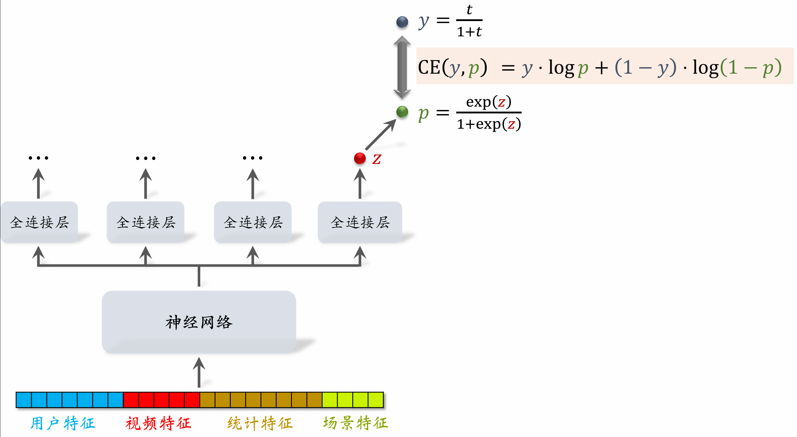

1. 将用户特征、视频特征、统计特征、场景特征输入神经网络(此神经网络被后续层别共享，**shared bottom**)，使用<u>不同的全连接层</u>输出对视频的点赞率、收藏率、播放时长等的预测，其中预测播放时长的全连接层输出$z$($z$还需经过计算处理，才能得出预测地播放时长)
2. 将$z$代入 Sigmod 函数，得到$p=\frac{\exp(z)}{1+\exp(z)}$，目标值是$y=\frac{t}{1+t}$，其中 t 是实际的观看时长
3. **损失函数(交叉熵)**：$CE(y,p)=y\cdot \log{p}+(1-y)\cdot \log{(1-p)}$
4. <u>$\exp(z)$是模型输出的对观看时长的预估</u>，并作为融分公式中的一项，影响排序

为什么是要exp而不是 $z/(1+z)$？DNN 原始输出 logit z 是无约束实数，可正、可负。

### 19.2 指标：视频完播

1. 回归方法
   - 例：视频长度 10 分钟，实际播放 4 分钟，则实际播放率为 y=0.4
   - 让预估播放率$p$拟合$y$：$loss=y\cdot\log p+(1-y)\cdot\log(1-p)$（交叉熵）
   - 线上预估完播率，模型输出 p=0.73，意思是预计播放 73%，作为融分的一项
2. 二元分类方法
   - <u>定义完播指标，比如完播 80%</u>
   - 例：视频长度 10 分钟，播放>8 分钟作为正样本，播放<8 分钟作为负样本
   - 做**二元分类**训练模型：播放>80% vs 播放<80%
   - **线上预估完播率**，模型输出$p$=0.73，意思是 <u>p(播放>80%) = 0.73</u>         
     为什么不能直接把预估的完播率用到融分公式？<u>因为完播率这个指标对短视频更有利</u>
   - 线上预估完播率，然后做**调整：$p_{finish}=\frac{预估完播率}{f(视频长度)}$**

     > $f(视频长度)$是有关视频时长的函数，视频时长越长，函数值越小
   - 把$p_{finish}$作为融分公式中的一项

## 20. 排序模型的特征

### 20.1. 用户画像(User Profile)

- 用户 ID(在召回、排序中做 embedding)
  > 用户 ID 通常使用 32 位或者 64 位向量进行 embedding
- 人口统计学属性：性别、年龄
- 账号信息：新老、活跃度·····
- 感兴趣的类目、关键词、品牌

### 20.2. 物品画像(Item Profile)

- **物品 ID**(在召回、排序中做 embedding)
- 发布时间(或者年龄)
- GeoHash(经纬度编码)、所在城市
- 标题、类目、关键词、品牌·····
- 字数、图⽚数、视频清晰度、标签数·····
- 内容信息量、图⽚美学······
  > 内容信息量、图片美学是<u>由算法打的分数</u>，用人工标注的数据训练cv和nlp模型，当物品发布后，此分数被写进物品画像中

### 20.3. 用户统计特征

- 用户最近 30 天(7 天、1 天、1 小时)的<u>曝光数、点击数、点赞数、收藏数·····</u>
- 按照笔记<u>图文/视频</u>**分桶**(比如最近 7 天，该用户对图文笔记的点击率、对视频笔记的点击率)
- 按照笔记<u>类目</u>分桶(比如最近 30 天，用户对美妆笔记的点击率、对美食笔记的点击率、对科技数码笔记的点击率)

### 20.4. 笔记统计特征

- 笔记最近 30 天(7 天、1 天、1 小时)的曝光数、点击数、点赞数、收藏数·····
- 按照用户性别**分桶**、按照用户年龄分桶·····
- 作者特征：
  - 发布笔记数
  - 粉丝数
  - 消费指标(曝光数、点击数、点赞数、收藏数)

### 20.5. 场景特征(Context)

- 用户定位 GeoHash(经纬度编码)、城市
- 当前时刻(**分段，做 embedding**)
- 是否是周末、是否是节假日
- ⼿机品牌、⼿机型号、操作系统

### 20.6. 特征处理

- **离散特征**：做 embedding
  - 用户 ID、笔记 ID、作者 ID
  - 类目、关键词、城市、⼿机品牌
- **连续特征**：做**分桶**，变成离散特征
  - 年龄、笔记字数、视频长度
- 连续特征：其他变换
  - 曝光数、点击数、点赞数等数值做$\log(1+x)$【长尾分布】
  - 转化为点击率、点赞率等值，并做**平滑**

### 20.7. 特征覆盖率

- 很多特征无法覆盖 100% 样本
  - 例：很多用户不填年龄，因此用户年龄特征的覆盖率远小于 100%
  - 例：很多用户设置隐私权限，APP 不能获得用户地理定位，因此场景特征有缺失
- <u>提高特征覆盖率，可以让精排模型更准</u>

### 20.8. 数据服务

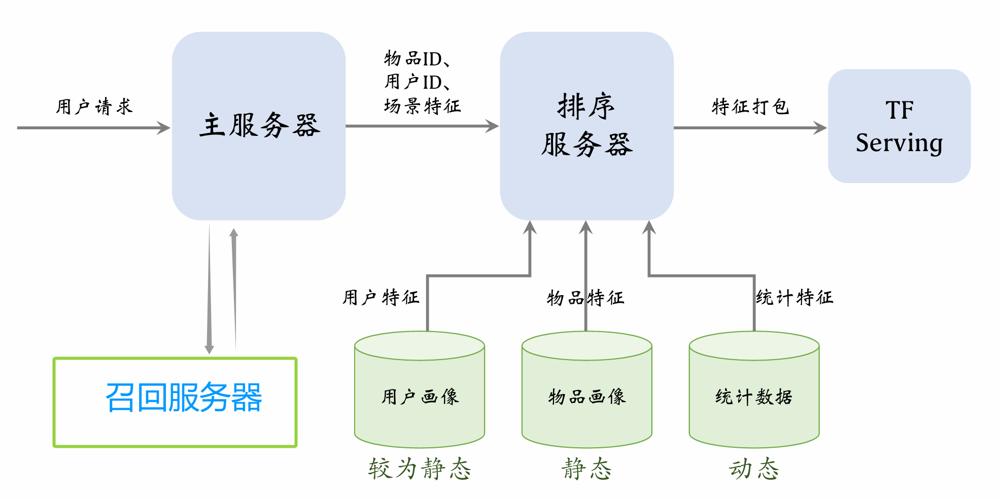

1. 当用户刷新软件时，会发送用户请求到推荐系统的主服务器上
2. 主服务器发起召回服务请求到**召回服务器**上，召回服务器将几十路的召回结果归并后发送回主服务器
3. 主服务器向排序服务器发送一个用户 ID，数千条物品 ID，还有当时的场景特征
4. 排序服务器分别向数据库请求**用户画像、物品画像、统计数据**
   > 用户画像数据库中的数据变化很小，需要很长时间才变化一次                
   > 物品画像数据库中的数据变化更小，几乎可以认为是静止不动的，要求数据库读取速度快，因为每一次请求都要拉取上千条物品画像                                   
   > 统计数据库中的数据**变化很快**，因为一旦用户与物品产生了互动，统计数据就会发生变化                          
5. 排序服务器获取到特征之后，会将特征打包后发送给 TF Serving，Tensor 会<u>给物品打分，并将分数返回给排序服务器，排序服务器根据融合分数，多样性分数，业务规则进行排序</u>

## 21. 粗排模型

多目标模型主要适用于精排

### 21.1. 粗排 vs 精排

- 粗排
  - 给几千篇笔记打分
  - 单次推理代价必须小
  - 预估的准确性不高
- 精排
  - 给几百篇笔记打分
  - 单次推理代价很大
  - 预估的准确性更高

### 21.2. 精排模型&双塔模型

1. 精排模型(多目标模型)
   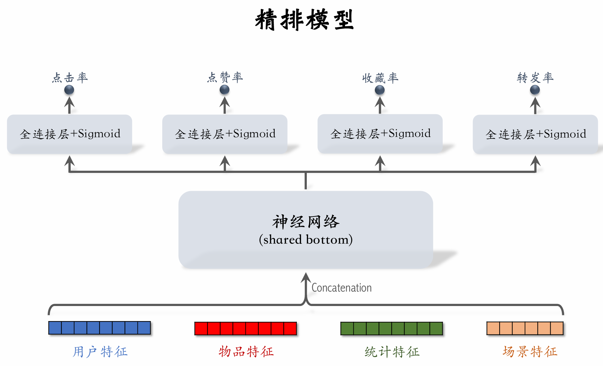
   - 前期融合：先对所有特征做向量连接(concatenation)，再输入神经网络
   - 线上推理代价大：如果有$n$篇候选笔记，整个大模型要做$n$次推理
2. 双塔模型(召回)
   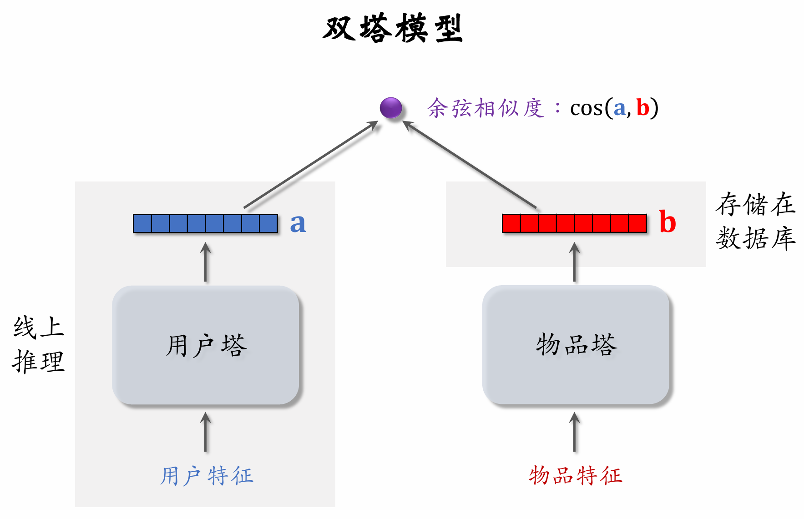
   - 后期融合：把用户、物品特征分别输入不同的神经网络，不对用户、物品特征做融合
   - 线上计算量小:
     - 用户塔只需要做一次线上推理，计算用户表征$a$
     - 物品表征$b$事先储存在向量数据库中，物品塔在线上不做推理
   - 预估准确性不如精排模型

### 21.3. 粗排的三塔模型

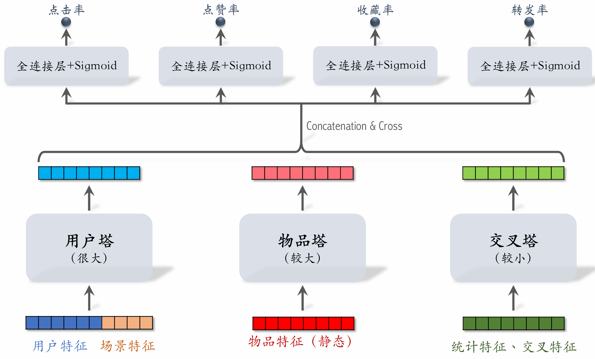

- 用户塔的输入是用户特征和场景特征
- 物品塔的输入是物品特征
- **交叉塔**的输入是统计特征、交叉特征(交叉特征是用户特征和物品特征做交叉)
- 三个塔的输出向量做向量连接和交叉后，进行各个业务指标的预测

1. 用户塔
   - 只有一个用户，用户塔只做一次推理
   - 即使用户塔很大，总计算量也不大
2. 物品塔
   - 有$n$个物品，理论上物品塔需要做$n$次推理
   - 物品特征变化很小，物品塔提前缓存物品特征的输出，只需定期利用物品塔刷新缓存即可
   - <u>PS(Parameter Server)缓存物品塔的输出向量</u>，避免绝大部分推理
3. 交叉塔
   - 统计特征**动态变化**，缓存不可行
   - 有$n$个物品，交叉塔必须做$n$次推理
4. 上层结构
   - 三个塔的输出向量做向量<u>连接和交叉后</u>，进入上层结构进行预测
   - 有$n$个物品，模型上层需要做$n$次推理
   - 粗排推理的大部分计算量在模型上层

### 21.4. 三塔模型的推理

1. 从多个数据源取特征
   - **1 个用户**的画像、统计特征
   - **$n$个物品**的画像、统计特征
2. 用户塔：只做 1 次推理
3. 物品塔：<u>未命中缓存时需要做推理</u>
4. 交叉塔：必须做$n$次推理
5. 上层网络做$n$次推理，给$n$个物品打分

## 22. 特征交叉：Factorized Machine(FM)
召回和排序都会用到。        
1. **线性模型**
   - 有$d$个特征，记作$x=[x_1,x_2,\cdots,x_d]$
   - 线性模型：$p=b+\sum\limits_{i=1}^{d}w_ix_i$
     > b 是偏移项，$w_i$是权重
   - 模型有$d+1$个参数，$w=[w_1,w_2,\cdots,w_d]$和 b
   - 预测是<u>特征的加权和</u>(只有加，没有乘)
2. **二阶交叉特征**
   - 有$d$个特征，记作$x=[x_1,x_2,\cdots,x_d]$
   - 线性模型+二阶交叉特征：$p=b+\sum\limits_{i=1}^{d}w_ix_i+\sum\limits_{i=1}^{d}\sum\limits_{j=i+1}^{d}u_{ij}x_ix_j$
     > $\sum\limits_{i=1}^{d}\sum\limits_{j=i+1}^{d}u_{ij}x_ix_j$是特征交叉项，$u_{ij}$是权重
   - 模型有$O(d^2)$个参数
   - 预测既使用了特征的加权和，也使用了特征的加权积
3. **Factorized Machine(FM)**
   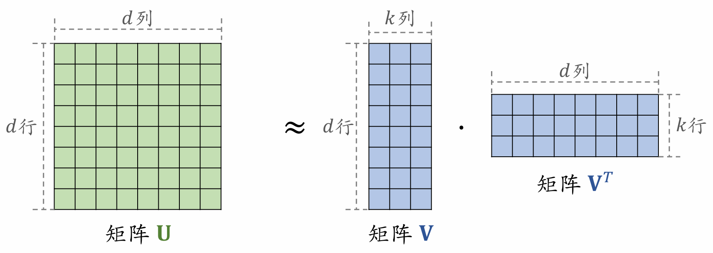

   - 将$u_{ij}$的值都提取出来，组成一个 d 行 d 列的对称矩阵
   - 此矩阵可近似等于矩阵$VV^T$，即$U\approx VV^T$，其中矩阵 V 是 d 行 k 列的矩阵，k 的值自己设置，k 越大，越精确
   - 用$VV^T$替换原矩阵中的$u_{ij}$，得到 Factorized Machine (FM)：$p=b+\sum\limits_{i=1}^{d}w_ix_i+\sum\limits_{i=1}^{d}\sum\limits_{j=i+1}^{d}(V_i^TV_j)x_ix_j$
   - <u>FM 模型有$O(kd)$个参数($k<<d$)</u>

> FM 是线性模型的替代品，能用线性回归、逻辑回归的场景，都可以用 FM        
> FM 使用二阶交叉特征，表达能力比线性模型更强           
> 通过做近似$U_{ij}\approx V_i^TV_j$，FM 把二阶交叉权重的数量从$O(d^2)$降低到$O(kd)$

## 23. 特征交叉：深度交叉网络(DCN)

召回、排序模型中的**神经网络**可以使用深度交叉网络代替

### 23.1. 交叉层(Cross Layer)

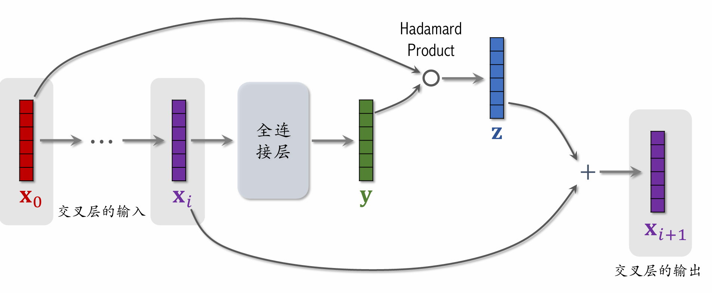

1. $x_0$是交叉层的初始输入，$x_i$是经过若干层后的输出，$x_i$经过一层全连接层后输出 y
2. 将 y 和$x_0$做 **Hadamard 乘积(对应元素依次相乘)**，$x_0、y、z$的维度应保持一致
3. 将$x_i、z$相加得到$x_{i+1}$，$x_{i+1}$即**是交叉层的输出**

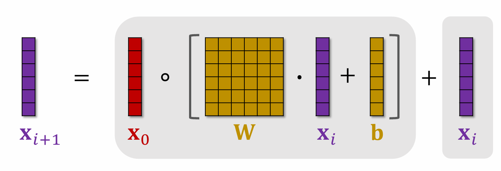

- 交叉层计算公式：$x_{i+1}=x_0\odot(w\cdot x_i+b)+x_i$
  > - $x_{i+1}$是交叉层的输出，$x_0$是初始输入，$x_i$是交叉层上一层的输出
  > - $w\cdot x_i+b$是**全连接层**，$w,b$是全连接层的参数
  > - $\odot$是 Hadamard 乘积的符号，表示两个矩阵对应位置相乘

### 23.2. 交叉网络(Cross Network)

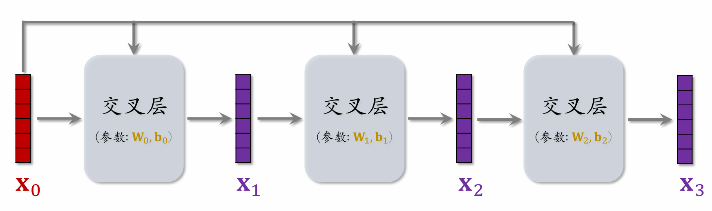

### 23.3. 深度交叉网络(Deep & Cross Network)

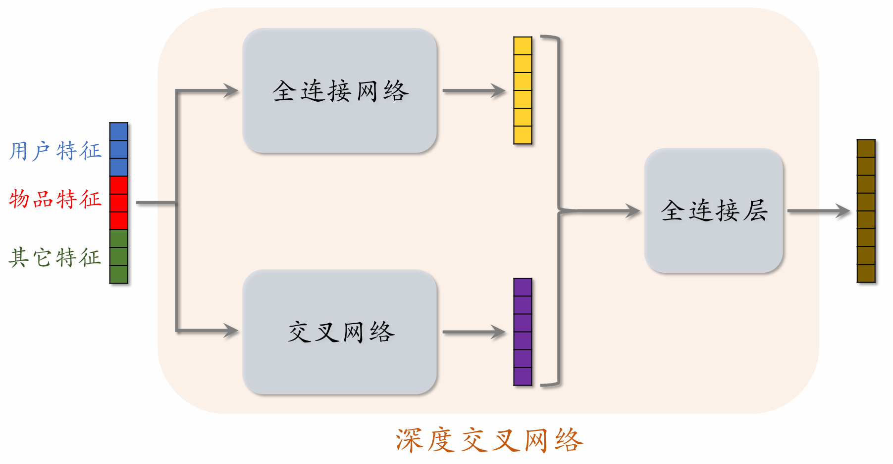
将全连接网络和交叉网络进行**并联**，两个网络的结果输出进行向量**拼接**后输入全连接层得出最终的结果

## 24. 特征交叉：LHUC 网络结构

Learning Hidden Unit Contributions (LHUC)，起源于语音 识别，**只能用于精排**

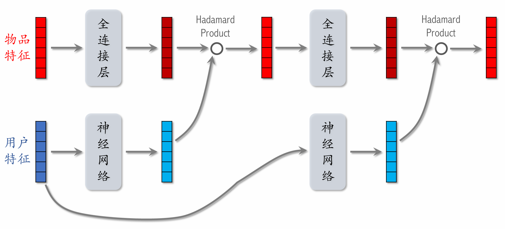

1. 将物品特征$a_0$通过一个全连接层进行处理，得到向量$a_1$
2. 将用户特征$b_0$通过一个神经网络$N_1$，该神经网络由多个全连接层和<u>一个 2 倍的 sigmoid 层</u>，输出结果向量$b_1$，$b_1$中的值在 0 到 2 中间
3. 将向量$a_1$和向量$b_1$进行 Hadamard 乘积处理，得到向量$a_2$
4. 将物品特征$a_2$通过一个全连接层进行处理，得到向量$a_3$
5. 将用户特征$b_0$通过一个神经网络$N_2$，该神经网络由多个全连接层和一个 2 倍的 sigmoid 层，输出结果向量$b_2$，$b_2$中的值在 0 到 2 中间
6. <u>将向量$a_3$和向量$b_2$进行 Hadamard 乘积处理</u>，得到向量$a_4$，$a_4$为最终输出结果

## 25. 特征交叉：SENet & Bilinear Cross

### 25.1. SENet

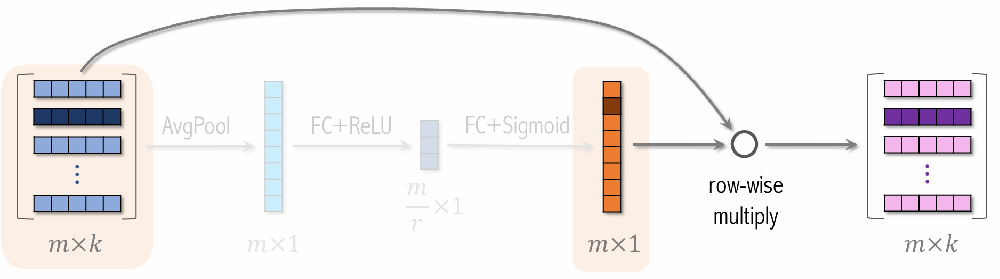

1. 把用户 ID、物品 ID、物品类目、······、物品关键词进行 Embedding 编码，提取特征向量，所有向量组成$m\times k$阶矩阵
2. 矩阵每一行做 AvgPool 池化操作，求每一行的平均值，组成一个新向量$x_1$($m$阶)
3. 向量$x_1$通过**一个全连接层和 ReLU 激活函数**，将向量$x_1$压缩成一个$\frac{m}{r}$维向量$x_2$
4. 向量$x_2$通过**一个全连接层和 Sigmoid 激活函数**，将向量$x_2$放缩成一个$m$维向量$x_3$，向量$x_3$中每一个元素都位于 0 到 1 之间
5. 权重向量$x_3$的每一位与初始矩阵对应行相乘，得到一个$m\times k$矩阵
   > 特征进行 Embedding 编码后，形成的<u>向量维度可以不同</u>，即初始矩阵的每一行长度可以不同

SENet 对离散特征做 field-wise 加权
- Field：
  - 特征用户 ID 进行 Embedding 后是 64 维向量
  - 64 个元素算一个 field，获得相同的权重
- 如果有$m$个 fields，那么权重向量是$m$维

### 25.2. Field 间特征交叉

- 不同特征向量之间交叉，基础方法有**内积($x_1\cdot x_2$)，哈达玛乘积($x_1\oplus x_2$)**
- 
1. 内积
2. 哈达玛乘积       
    -内积和哈达玛乘积均要求两个向量的<u>维度完全一致</u>
    - 向量内积的结果是一个数， m fields -> m 个实数
    - 哈达玛乘积的结果是一个向量，m fields ->$m^2$个向量
4. Bilinear Cross(内积)   
    如果有m个fields，则需要$m^2/2$个参数矩阵。由于计算量巨大，<u>需要人工选一些pair做交叉</u>。
    
5. Bilinear Cross(哈达玛乘积)
    

### 25.3. FiBiNet
把SENet和Bilinear cross结合起来
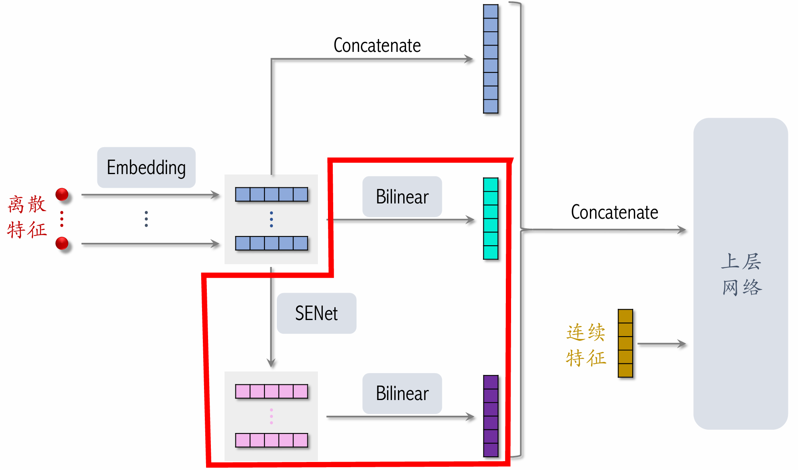

## 26. LastN：用户行为序列建模

### 26.1. LastN 特征

**LastN**：用户最近交互(点击、点赞等)过的 n 个物品 的物品ID     
- 对 LastN 物品 ID 做 embedding，得到 n 个向量
- 把 n 个向量取平均，<u>作为用户的一种特征</u>
- 适用于**召回双塔模型、粗排三塔模型、精排模型**
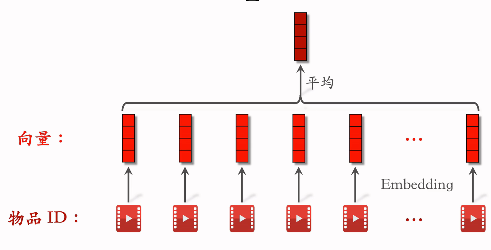
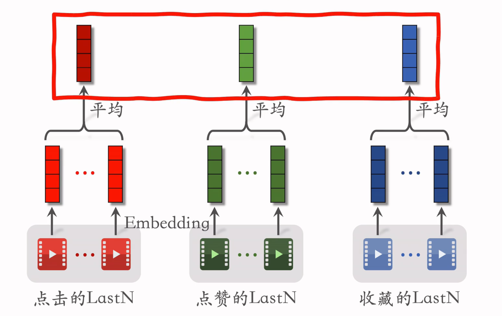

## 27. LastN02：DIN 模型

DIN 用**加权平均代替平均**，即注意力机制(attention)
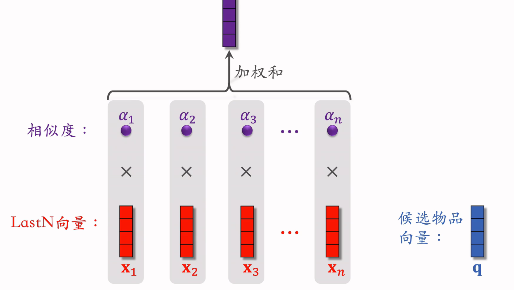
- 权重：候选物品与用户 LastN 物品的相似度，相似度越高，权重越高
- 对于某候选物品，计算它与用户 LastN 物品的相似度
- 以相似度为权重，求用户 LastN 物品向量的加权和，结果是一个向量
- 把得到的向量作为一种用户特征，输入排序模型，预估(用户，候选物品)的点击率、点赞率等指标

### 27.1. 简单平均 vs 注意力机制

- 简单平均和注意力机制都适用于精排模型
- 简单平均适用于双塔模型、三塔模型
  - 简单平均只需要用到 LastN，属于用户自⾝的特征，所以 可以把 LastN 向量的平均作为用户塔的输入
- 注意力机制不适用于双塔模型、三塔模型
  - 注意力机制需要用到 LastN+候选物品 而 用户塔看不到候选物品，不能把注意力机制用在用户塔

## 28. LastN03：SIM 模型

### 28.1. DIN 模型的缺点

- 注意力层的计算量 $\propto$ n(用户行为序列的长度)
- 只能记录最近几百个物品，否则计算量太大
- <u>缺点：关注短期兴趣，遗忘长期兴趣</u>

### 28.2. 如何改进 DIN

- **目标**：保留用户长期行为序列(𝑛 很大)，而且计算量不会过大
- **改进** DIN:
  - DIN 对 LastN 向量做加权平均，权重是相似度
  - 如果某 LastN 物品与候选物品差异很大，则**权重接近零**
  - <u>快速排除掉与候选物品无关的 LastN 物品</u>，降低注意力层的计算量

### 28.3. SIM 模型

- 保留用户长期行为记录，n 的大小可以是**几千**
- 对于每个候选物品，在用户 LastN 记录中做快速查找，找到 k 个相似物品
- <u>把 LastN 变成 TopK</u>，然后输入到注意力层
- SIM 模型减小计算量(从 n 降到 k)

### 28.3.1. step1 查找

- 方法一：**Hard Search**(类目)
  - 根据候选物品的**类目**，保留 LastN 物品中类目相同的
  - 简单，快速，无需训练
- 方法二：**Soft Search**(向量最近邻)
  - 把物品做 embedding，变成向量
  - 把候选物品向量作为 query，做 k 近邻查找，保留 LastN 物品中最接近的 k 个
  - 效果更好，编程实现更复杂

### 28.3.2. step2 注意力机制

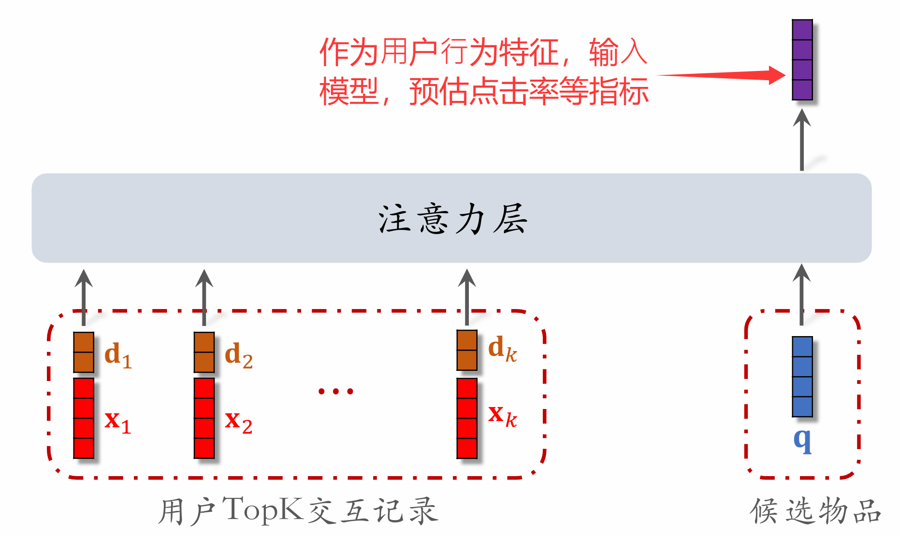

1. 从 LastN 用户行为序列中查找最接近候选物品的 k 个
2. 用户与某个 LastN 物品的交互时刻距今为$\delta$
3. <u>对$\delta$做离散化(划分时间段)，再做 embedding，变成向量 d</u>
4. 把两个向量做 concatenation，表征一个 LastN 物品
   1. 向量 x 是物品的 embedding
   2. 向量 d 是时间的 embedding

### 28.4. SIM 模型使用时间信息

- DIN 的序列短，记录用户近期行为
- SIM 的序列长，记录用户长期行为
- 时间越久远，重要性越低
- 长序列(长期兴趣)优于短序列(近期兴趣)
- 注意力机制优于简单平均

## 29. 推荐系统中的多样性

### 29.1. 物品相似性的度量

相似性的度量
  - 基于**物品属性标签**(类目、品牌、关键词······)
  - 基于**物品向量表征**
    - 用召回的双塔模型学到的物品向量(不好，因为头部现象严重，曝光和点击存在于少数物品，物品塔学习不好新物品和长尾物品)
    - 基于<u>内容</u>的向量表征(好)
    
1. 基于**物品属性标签**
   - 物品属性标签：类目、品牌、关键词
   - 根据一级类目、二级类目、品牌计算相似度
     - 物品 i：美妆、彩妆、⾹奈⼉
     - 物品 j：美妆、⾹⽔、⾹奈⼉
     - 相似度：$sim_i(i,j)=1,sim_2(i,j)=0,sim_3(i,j)=1$

2. 基于**图文内容**的物品表征

使用 CNN 提取图片特征，使用 BERT 提取文字特征
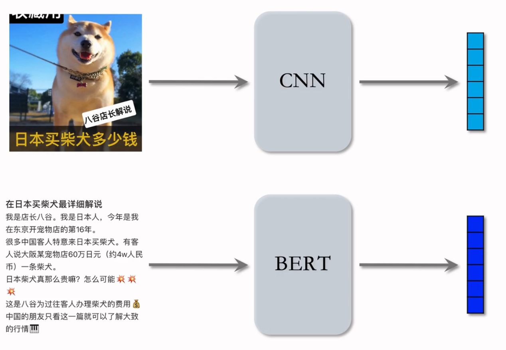
  - CLIP 是当前公认最有效的**预训练**方法
  - 思想：对于图⽚--文本二元组，预测图文是否匹配
  - 优势：<u>无需人工标注</u>。小红书的笔记天然包含图⽚+文字，大部分笔记图文相关

  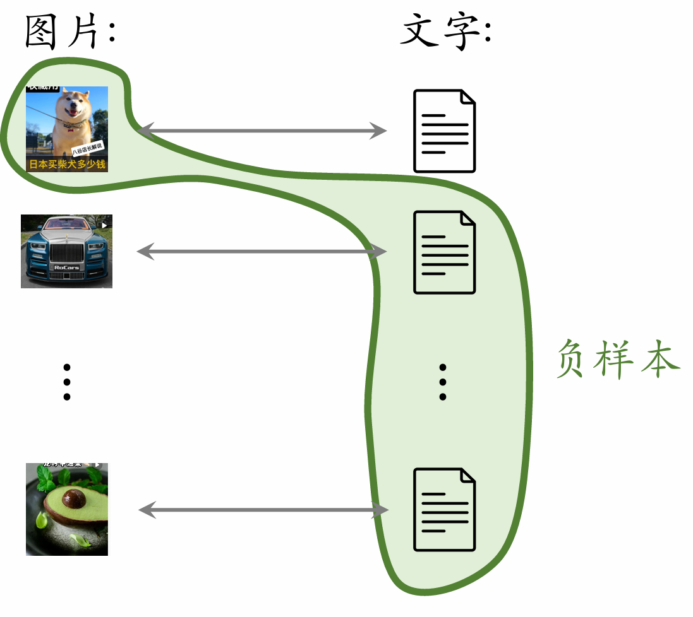

  - 一个 batch 内有 m 对匹配的图文作为正样本，任意一行即为一个正样本
  - batch内负样本：一张图⽚和 m−1 条文本组成**负样本**
  - 这个 batch 内一共有 m(m-1)对负样本

### 29.3. 提升多样性的方法

在粗排和精排之后加入后处理步骤，提升多样性，精排之后的后处理也叫做重排

## 30. MMR 多样性算法

### 30.1. 多样性
粗排的后处理也需要多样性算法，精排的后处理称为“重排”

粗排精排的后处理：
- 粗排和精排用多目标模型对物品做pointwise打分
- 对物品i，模型输出点击率、交互率的预估，融合成分数$reward_i$表示用户对物品i的兴趣

### 30.2. MMR 多样性算法
- 给 n 个候选物品打分为 reward$_1$，···，reward$_n$
- 把第 i 和 j 个物品的相似度记作 sim(i, j)
- 从 n 个物品中选出 k 个，既要有高精排分数，也要有多样性。
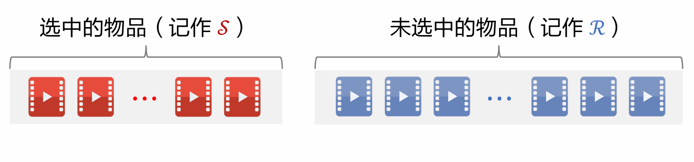

- 计算集合 R 中每个物品 i 的 Marginal Relevance 分数：**总分 = 相关性奖励 − 重复惩罚**
  $$
  MR_i=\theta \cdot \mathrm{reward} _i-(1-\theta)\cdot \max \limits_{j\in s}\mathrm{sim}(i,j)
  $$
- Maximal Marginal Relevance (MMR)：$\arg\max\limits_{i\in R} MR_i$

步骤：  
1. 已选中的物品 S **初始化为空集**，未选中的物品 R 初始化为全集{1,⋯,n}
2. 选择精排分数 reward$_i$最高的物品，<u>从集合 R 移到 S</u>
3. 做 k−1 轮循环：
   1. 计算集合 R 中所有物品的分数{MR$_i$}$_{i\in R}$
   2. 选出分数最高的物品，将其从 R 移到 S

### 30.3. 滑动窗口

已选中的物品越多(即集合 S 越大)，越难找出物品$i\in R$，使得 i 与 S 中的物品都不相似
- 设 sim 的取值范围是$[0,1]$。当 S 很大时，多样性分数$\max\limits_{j\in S}sim(i,j)$总是约等于 1，<u>导致 MMR 算法失效</u>
- 解决方案：设置一个滑动窗口 W，比如最近选中的 10 个物品，<u>用 W 代替 MMR 公式中的 S</u>
$$
\arg\max\limits_{i\in R}\{\theta \cdot \mathrm{reward} _i-(1-\theta)\cdot \max \limits_{j\in W}\mathrm{sim}(i,j)\}
$$
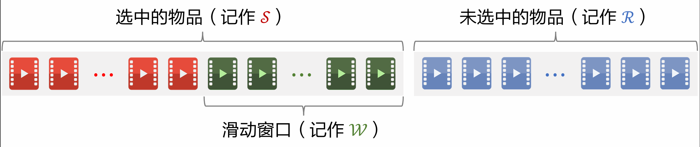
- 离得近的要多样，离得远的可以相似，用户可能已经忘了前面的。

## 31. 重排的规则

1. 最多连续出现 k 篇某种笔记(图文、视频)
2. 每 k 篇笔记最多出现 1 篇某种笔记（运营推广）
3. 前 t 篇笔记最多出现 k 篇某种笔记（比如电商卡片）

### 31.3. MMR + 重排规则

- 重排结合 MMR 与规则，<u>在满足规则的前提下最大化 MR</u>
- 每一轮先用规则排除掉 R 中的部分物品，得到子集 R'   
    e.g:前3篇笔记已选出，其中有一篇带电商卡片，那第4篇不能带，去掉得到新子集      
- MMR 公式中的 R 替换成子集 R'，选中的物品符合规则
$$
\arg\max\limits_{i\in R'}\{\theta \cdot \mathrm{reward} _i-(1-\theta)\cdot \max \limits_{j\in W}\mathrm{sim}(i,j)\}
$$

## 32. DPP 多样性算法(数学基础)
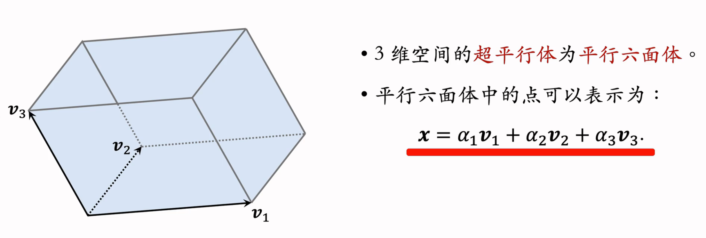

- 一组向量$v_1$,⋯,$v_k\in R^d$可以确定一个**k 维超平行体**：$p(v_1,\cdots,v_k)=\{\alpha_1v_1+\cdots+\alpha_kv_k|0\le\alpha_1,\cdots,\alpha_k\le1\}$
- 要求$k\le d$，比如 d=3 维空间中有 k=2 维平行四边形
- <u>如果$v_1$,⋯,$v_k$线性相关，则体积 vol(p)=0</u>(例：有 k = 3 个向量，落在一个平面上，则平行六面体的体积为 0)
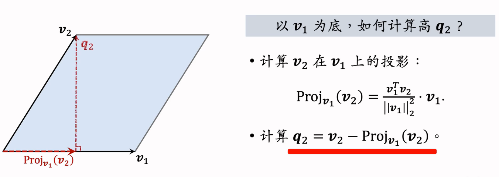
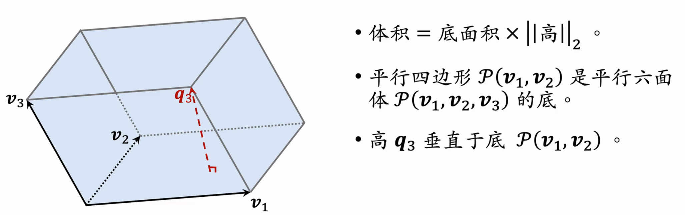
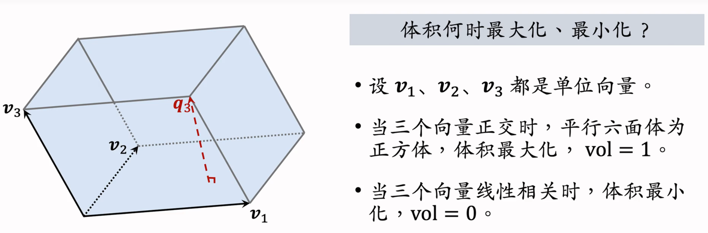
- 给定 k 个物品，把它们表征为单位向量$v_1$,⋯,$v_k\in R^d$，二范数都为1，$k\le d$，，把它们作为矩阵$V\in R^{d\times k}$的列
- 用<u>超平行体的体积衡量物品的多样性</u>，体积介于 0 和 1 之间
- 如果$v_1$,⋯,$v_k$**两两正交(多样性好)**，则体积最大化，vol=1
- 如果$v_1$,⋯,$v_k$**线性相关(多样性差)**，则体积最小化，vol=0
- 设$d\ge k$，行列式与体积满足：det($V^TV$)=vol$(P(v_1,\cdots,v_k))^2$
- 因此，<u>可以用行列式 det($V^TV$)衡量向量$v_1,\cdots,v_k$的多样性</u>

## 33. DPP 多样性算法

### 33.1. DPP

- DPP 是一种传统的统计机器学习方法
  $$\arg\max\limits_{S:|S|=k}\log\det(V_s^TV_s)$$
  > 从 n 个候选物品中选择 K 个，使得行列式取对数后结果最大
- 将 DPP 应用在推荐系统：
  $$
  \arg\max\limits_{S:|S|=k}\theta\cdot(\sum\limits_{j\in S}\mathrm{reward}_j)+(1-\theta)\cdot \log\det(V_s^TV_s)
  $$

### 33.2. 行列式点过程(DPP)

- 设 A 为$n\times n$的矩阵，它的(i,j)元素为$a_{ij}=v_i^Tv_j$, n个候选物品
- 给定向量$v_1,\cdots,v_n\in R^d$，需要 O($n^2d$)时间计算 A
- $A_s=V_S^TV_S$为 A 的一个$k\times k$子矩阵。如果$i,j\in S$，则$a_{ij}$是$A_S$的一个元素
- DPP 是个**组合优化**问题，从集合{1,···,n} 中选出一个大小为 k 的子集 S，是NPhard问题
- 用 S 表⽰已选中的物品，用 R 表⽰未选中的物品，贪心算法求解：
  $$\arg\max\limits_{i\in R}\theta\cdot\mathrm{reward_i}+(1-\theta)\cdot\log\det (A_{S\cup\{i\}})$$

### 33.3. 求解 DPP

1. **暴力算法**

- 对于单个 i，计算$A_{S\cup \{i\}}$的行列式需要 O($|S|^3$)时间(高斯消元法化为上三角矩阵)
- 对于所有$i\in R$，计算行列式需要时间$O(|S|^3\cdot|R|)$
- 需要求解上式 K 次<u>才能选出 K 个物品</u>，如果暴力计算行列式，那么总时间复杂度为$O(|S|^3\cdot|R|\cdot k)=O(nk^4)$
- 暴力算法的总时间复杂度为$O(n^2d+nk^4)$，其中需要$O(n^2d)$时间计算矩阵 A

2. **Hulu 的快速算法**        

时间复杂度：
- 给定向量$v_1,\cdots,v_n\in R^d$，需要$O(n^2d)$时间计算 A
- 用$O(nk^2)$时间计算所有的行列式(利用 **Cholesky 分解**)
  - Cholesky 分解$A_s=LL^T$，其中 L 是下三角矩阵(对角线以上的元素全零)
  - Cholesky 分解可供计算$A_s=LL^T$的行列式，下三角矩阵 L 的行列式 det(L)等于 L 对角线元素乘积
  - $A_S$的行列式为$\det(A_S)=\det(L)^2=\prod_iL_{ii}^2$
- 已知$A_s=LL^T$，则可以<u>快速求出所有$A _{S\cup \{i\}}$的 Cholesky 分解</u>，因此可以快速算出所有$A _{S\cup \{i\}}$的行列式

步骤：
- 初始时 S 中只有一个物品，$A_S$是 1X1 的矩阵
- 每一轮循环，基于上一轮算出的$A_S=LL^T$，快速求出$A _{S\cup \{i\}}$的 Cholesky 分解($\forall i\in R$)，从而求出$\log\det(A _{S\cup \{i\}})$

**DPP的拓展——1. 滑动窗口**
- 随着集合 S 增大，其中相似物品越来越多，物品向量会趋近线性相关
- 行列式$\det(A_S)$会坍缩到零，对数趋于负无穷
- 贪心算法每轮从 R 中选出一个物品：(滑动窗口记作 W)
$$
\arg\max\limits_{i\in R}\theta\cdot\mathrm{reward_i}+(1-\theta)\cdot\log\det(A_{W\cup\{i\}})$$

**DPP的拓展——2. 规则约束**      
先用规则排除掉$R$中的部分物品，得到子集 $R'$ ，然后求解
$$
\arg\max\limits_{i\in R}\theta\cdot\mathrm{reward_i}+(1-\theta)\cdot\log\det(A_{W\cup\{i\}})
$$

## 34. 物品冷启动：评价指标

### 34.1. 物品冷启动

**UGC**（User Generated Content，用户生成内容）；       
PGC（Professional Generated Content，专业生产内容）       
UGC的冷启动：     
- 小红书上用户新发布的笔记
- B 站上用户新上传的视频
- 今日头条上作者新发布的文章

1. <u>为什么要特殊对待新笔记?</u>

   - 新笔记缺少与用户的交互，导致推荐的难度大、效果差
   - 扶持新发布、低曝光的笔记，可以增强作者发布意愿

2. 优化冷启的**目标**

- <u>精准推荐</u>：克服冷启的困难，把新笔记推荐给合适的用户，不引起用户反感
- <u>激励发布</u>：流量向低曝光新笔记倾斜，激励作者发布
- <u>挖掘高潜</u>：通过初期小流量的试探，找到高质量的笔记，给与流量倾斜

3. **评价指标**

- 作者侧指标(作者发布意愿)
  - 发布渗透率、人均发布量
- 用户侧指标(推荐是否精准)
  - 新笔记指标：新笔记的点击率、交互率
  - 大盘指标：消费时长、日活、月活
- 内容侧指标(冷启是否能挖掘出优质笔记)
  - 高热笔记占比

而普通笔记一般只考虑用户侧指标。

### 34.2. 作者侧指标

- **发布渗透率**= 当日发布<u>人数</u>/ 日活人数    
  (发布一篇或以上，就算一个发布人数)
- **人均发布量**= 当日发布<u>笔记数</u>/ 日活人数

均反映出作者的发布积极性，冷启的重要优化目标是——促进法不、增大内容池。

### 34.3. 用户侧指标

- **新笔记的消费指标**
  - 新笔记的点击率、交互率
  - 分别考察高曝光、低曝光新笔记    
      (少部分头部新笔记占据了大部分的曝光)
- **大盘消费指标**
  - 大盘的消费时长、日活、月活
  - <u>大力扶持低曝光新笔记会怎么样？</u>——**跷跷板效应**：
    - 作者侧发布指标变好
    - 推荐效果不好，用户体验下降，用户侧大盘消费指标变差

### 34.4. 内容侧指标

- 高热笔记占比
  - 高热笔记：前 30 天获得 1000+次点击
  - 高热笔记占比越高，说明<u>冷启阶段挖掘优质笔记</u>的能力越强

### 34.5. 冷启动的优化点

- 优化**全链路**(包括召回和排序)
- **流量调控**(流量怎么在新物品、老物品中分配)

## 35. 物品冷启动：简单召回通道

### 35.1. 召回的难点

1. 缺少用户交互，还<u>没学好笔记 IDembedding</u>，导致双塔模型效果不好
2. 缺少用户交互，导致 <u>ItemCF(物品协同过滤)不适用</u>

- ItemCF召回（不适用）      
- 双塔模型（改造后使用）
- 类目、关键词召回（适用）
- 聚类、Look-Alike召回（适用）

### 35.2. 双塔模型
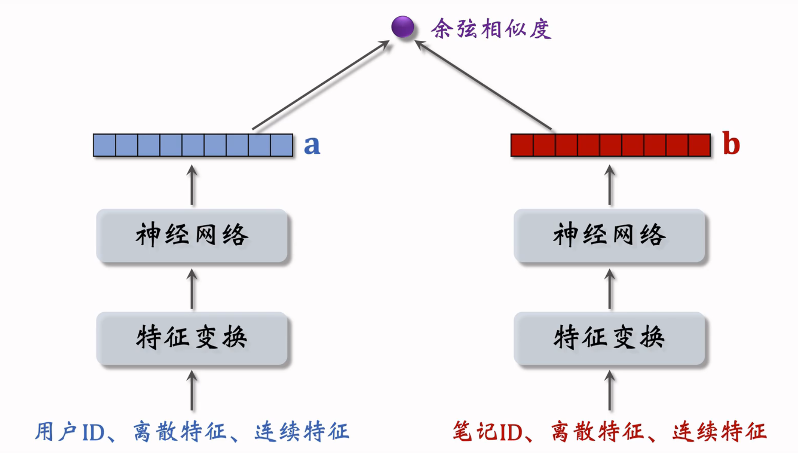

**改进方案**如下：
1. <u>**新笔记使用 defaultembedding**</u>
  - 物品塔做 IDembedding 时，让所有新笔记共享一个 ID，而不是用自己真正的 ID
  - Default embedding：共享的 ID 对应的 embedding 向量
  - 到下次模型训练的时候，新笔记已有用户交互才有自己的 ID embedding 向量
  > **学出来的**而非随机初始化——训练阶段把一部分历史物品模拟成“新物品”，让它们共享一个特殊ID，然后利用正常推荐损失反向传播学习出来的。它代表的是<u>所有未见过物品的公共先验表示</u>。上线的新笔记先使用它，等积累行为数据后，再分配真实ID并学习独立embedding。

2. <u>**利用相似笔记 embedding 向量**</u>
  - 把图文内容表征为向量，查找 top k **内容最相似**的高曝笔记
  - 把 k 个高曝笔记的 embedding 向量取平均，作为新笔记的 embedding
- <u>多个向量召回池</u>
  - 多个召回池，让新笔记有更多曝光机会(1 小时新笔记,6 小时新笔记,24 小时新笔记,30 天笔记)
  - 共享同一个双塔模型，那么多个召回池不增加训练的代价
  >【召回时并行搜索多个池并合并候选，从而给新内容更多曝光机会。但所有池中的item embedding仍由同一个双塔模型生成，只是存储位置不同】

### 35.3. 类目召回
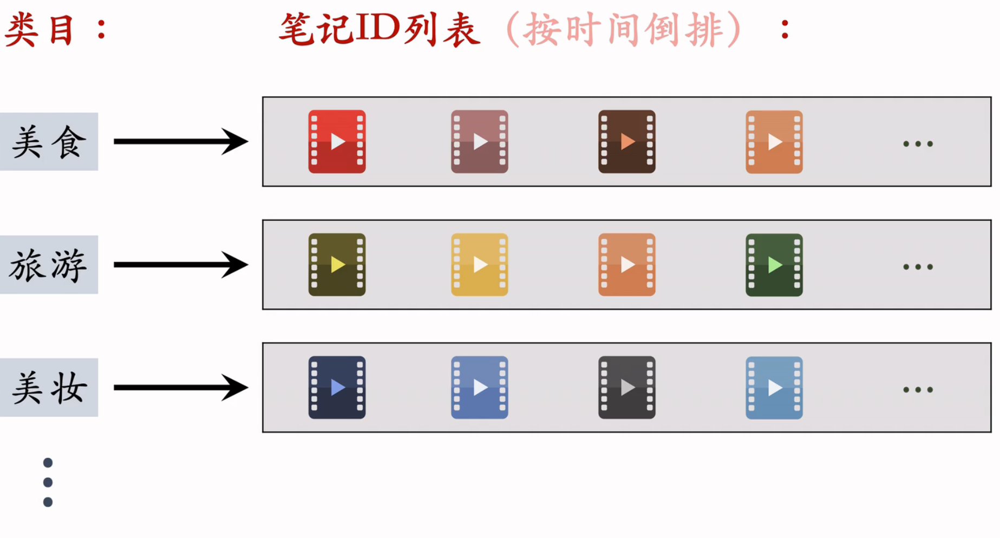
- 系统维护**类目索引**：类目 -> 笔记列表(按时间倒排)
- 用类目索引做召回：**用户画像** -> 类目 -> 笔记列表
- 取回笔记列表上前 k 篇笔记(即**最新的 k 篇**)

### 35.4. 基于关键词的召回

- 系统维护关键词索引：关键词 -> 笔记列表(<u>按时间倒排</u>)
- 根据用户画像上的关键词做召回

### 35.5 类目和关键词召回-缺点：

1. 只对刚刚发布的新笔记有效
  - 取回某类目/关键词下最新的 k 篇笔记
  - 发布几小时之后，就再没有机会被召回
2. 弱个性化，不够精准

## 36. 物品冷启动：聚类召回
- 基本思想：根据用户的点赞、收藏、转发，推荐内容相似的笔记
- 线下训练：多模态神经网络把图文内容映射到向量
- 线上服务：用户喜欢的笔记->特征向量->最近的cluster->新笔记

### 36.1. 聚类召回
**聚类索引：**      
  如果用户喜欢一篇笔记，那么他会喜欢<u>内容相似</u>的笔记
  - 事先训练一个神经网络，基于笔记的类目和图文内容，把**笔记映射到向量**
  - 对笔记向量做聚类，划分为 1000cluster，记录每个 cluster 的中心方向。(**k-means 聚类，用余弦相似度**)
  - 一篇新笔记发布之后，用神经网络把它映射到一个特征向量
  - 从 1000 个中心向量(对应 1000 个 cluster)中找到最相似的向量，<u>作为新笔记的 cluster</u>
  - 添加索引：cluster -> 笔记 ID 列表(按时间倒排)

**线上召回**
- 给定用户 ID，找到他的 <u>last-n 交互的笔记列表</u>，把这些笔记作为种子笔记
- 把每篇种子笔记映射到向量，寻找最相似的 cluster。(知道了用户对哪些 cluster 感兴趣。)
- 从每个 cluster 的笔记列表中，<u>取回最新</u>的 m 篇笔记
- 最多取回 mn 篇新笔记，其中n是用户行为记录

### 36.2. 内容相似度模型-神经网络

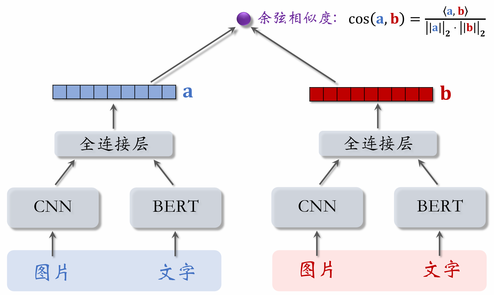
使用 CNN 提取图片特征向量，BERT 提取文字特征向量，再将图片和文字特征向量作**向量连接**(concatenation)后输入神经网络，输出笔记的特征向量
- BERT是预训练好的，也可以<u>微调fine-tune</u>
- 全连接层是随机初始化的，需要从数据中学习

### 36.3. 训练内容相似度模型

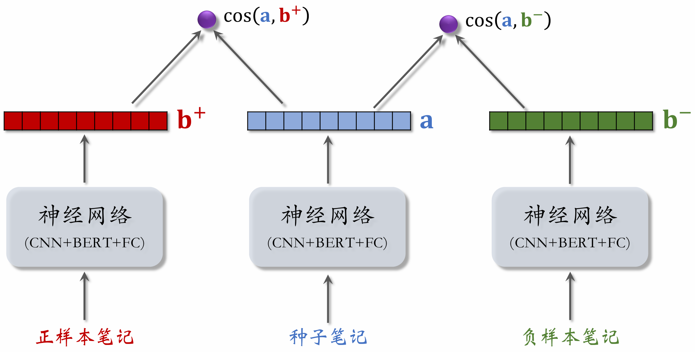
神经网络由 CNN+BERT+全连接层组成，<u>3个神经网络参数相同</u>，输入一个三元组(<u>正样本，种子笔记，负样本笔记</u>)         
**目标**：鼓励$\cos(a,b^+)$大于$\cos(a,b^-)$       
Triplet hinge loss：
$$L(a,b^+,b^-)=\max\{0,\cos(a,b^-)+m-\cos(a,b^+)\}$$
Triplet logistic loss：
$$L(a,b^+,b^-)=\log(1+\exp(\cos(a,b^-)-\cos(a,b^+)))$$

### 36.4. 正样本

1. <u>人工标注</u>二元组的相似度
2. <u>算法自动选</u>正样本
  - 只用**高曝光笔记**作为二元组(因为有充足的用户交互信息)
  - 两篇笔记有相同的**二级类目**，比如都是“菜谱教程”
  - 用 ItemCF 的**物品相似度**选正样本

### 36.5. 负样本

- 从全体笔记中随机选出满足条件的：
  - 字数较多(神经网络提取的文本信息有效)
  - 笔记质量高，避免图文无关

## 37. 物品冷启动：Look-Alike 人群扩散

### 37.1. Look-Alike 起源于互联网广告

从<u>符合条件的种子用户</u>中通过人群扩散，找到潜在的用户，成为 Look-Alike 用户
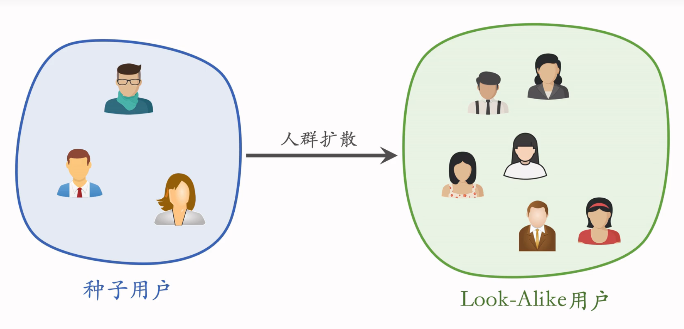

如何计算两个用户的相似度？
- UserCF:两个用户有共同的兴趣点
- Embedding:两个用户向量的cosine较大

### 37.2. Look-Alike 用于新笔记召回

- 点击、点赞、收藏、转发——用户对笔记可能感兴趣
- 把<u>有交互</u>的用户作为新笔记的种子用户
- 用 look-alike 在<u>相似用户</u>中扩散
  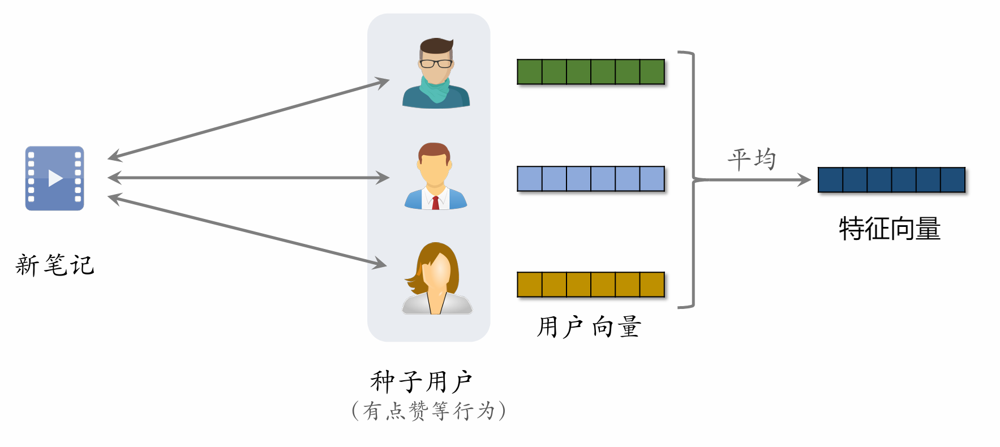
  用户一旦对新笔记产生交互，便把这个用户作为这篇笔记的种子用户，提取所有种子用户的 embedding 向量(可复用双塔)并求平均，结果作为这篇笔记的特征向量

- **近线更新**特征向量(几分钟更新一次)
- 特征向量是有交互的用户的向量的**平均**
- <u>每当有用户交互该物品</u>，更新笔记的特征向量
- 使用向量数据库储存新笔记特征向量。当用户发起刷新请求时，使用双塔模型中用户的 embedding 向量在数据库作**最近邻查**

## 38. 物品冷启动：流量调控

### 38.1. 冷启动的优化点

- 优化全链路(包括召回和排序)
- 流量调控(流量怎么在新物品、老物品中分配)

### 38.2. 扶持新笔记的目的

目的 1：**促进发布，增大内容池**
  - 新笔记获得的曝光越多，作者创作积极性越高
  - 反映在发布渗透率、人均发布量          

目的 2：**挖掘优质笔记**
  - 做探索，让每篇新笔记都能获得足够曝光
  - 挖掘的能力反映在高热笔记占比

### 38.3. 工业界的做法

在**粗排和重排**阶段，使新笔记的流量远远大于自然分发的流量。
- 假设推荐系统只分发年龄<30 天的笔记
- 假设采用自然分发，新笔记(年龄<24 小时)的曝光占比为 1/30
- 扶持新笔记，让新笔记的曝光占比远大于 1/30

### 38.4. 流量调控技术的发展

1. 在推荐结果中**强插**新笔记
2. 对新笔记的排序分数做**提权**(boost)
3. 通过提权，对新笔记做**保量**（提权的策略更复杂精细）
- 差异化保量

### 38.5. 新笔记提权(boost)

**目标**：让新笔记有更多机会曝光
  - 如果做自然分发，24 小时新笔记占比为 1/30
  - 做人为干涉，让新笔记占比大幅提升
- 干涉粗排、重排环节(都是漏斗)，给新笔记提权  
      
优点：容易实现，投入产出比好          
缺点：
  - 曝光量对提权系数很敏感，需要人为设置
  - 很难精确控制曝光量，<u>容易过度曝光和不充分曝光</u>

### 38.6. 新笔记保量

**保量**：不论笔记质量高低，都保证 24 小时获得 100 次曝光
- 在原有提权系数的基础上，乘以额外的提权的系数
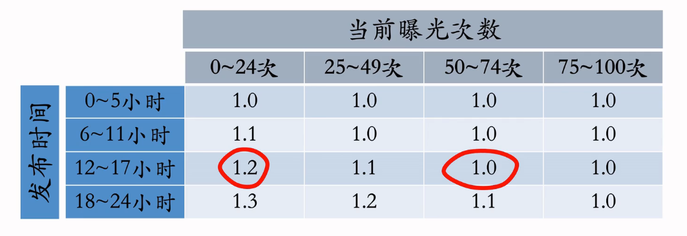

**动态提权保量**：
   用下面四个值计算提权系数

- 目标时间：比如 24 小时
- 目标曝光：比如 100 次
- 发布时间：比如笔记已经发布 12 小时
- 已有曝光：比如笔记已经获得 20 次曝光
$$\mathrm{提权系数}=f(\frac{\mathrm{发布时间}}{\mathrm{目标时间}}，\frac{\mathrm{已有曝光}}{\mathrm{目标曝光}})=f(0.5,0.2)$$

**保量的难点**:  保量成功率远低于 100%

- 很多笔记在 24 小时达不到 100 次曝光
- 召回、排序存在不足
- 提权系数调得不好
  线上环境变化会导致保量失败
- 线上环境变化：新增召回通道、升级排序模型、改变重排打散规则······
- 线上环境变化后，需要调整提权系数

<u>给新笔记的boost越大，对笔记越有利？</u>冷启阶段，分数提升越多，曝光次数越多，但是笔记容易被推荐给不太适合的用户——点击率点赞率等指标变低、长期会受推荐系统的打压难以成为热门笔记。

### 38.7. 差异化保量

- 简单保量：不论新笔记质量高低，都做扶持，在前 24 小时给 100 次曝光
- **差异化保量**：不同笔记有不同保量目标，普通笔记保 100 次曝光，内容优质的笔记保 100~500 次曝光————基础保量+内容质量+作者质量

## 39. 物品冷启动：AB 测试

### 39.1. 新笔记冷启的 AB 测试

- 作者侧指标：
  - 发布渗透率、人均发布量
- 用户侧指标
  - 对新笔记的点击率、交互率
  - 大盘指标：消费时长、日活、月活(标准的 AB 测试)

### 39.2. 用户侧实验
假设新笔记曝光越多，用户使用APP时长越低。       
新策略是把新笔记排序时的权重增大两倍。                              
用户消费指标的结果：        
- AB 测试的 diff 是负数(策略组不如对照组)
- 如果推全，<u>diff 会缩小</u>(比如 −2% -> −1%)——因为实验组变差、而总曝光保量固定，所以对照组会变好。
  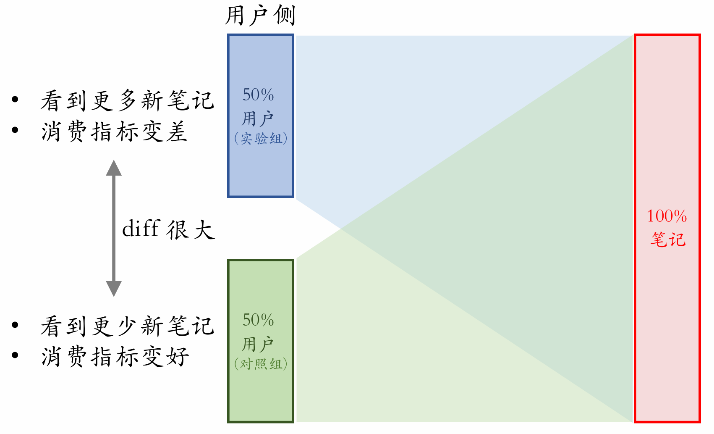

~~### 39.3. 作者侧实验~~

## 40. 涨指标的方法

### 40.1. 推荐系统的评价指标

- **日活用户数(DAU)和留存**是最核心的指标
- 目前工业界最常用 LT7 和 LT30 衡量留存
  - 某用户今天($t_0$)登录 APP，包括今天在内的未来 7 天($t_0\sim  t_6$)中有 4 天登录 APP，那么该<u>用户今天</u>($t_0$)的 LT7 等于 4， 显然有 $1\le LT7\le7$ 和$1\le LT30 \le 30$
  - <u>LT 增长通常意味着用户体验提升</u>。(除非 LT 增长且 DAU 下降，用糖水不等式理解。)
  - 假设 APP 禁⽌低活用户登录，则 DAU 下降，LT 增长
- 其他核心指标：用户使用时长、总阅读数(即总点击数)、总曝光数。这些指标的重要性低于 DAU 和留存
  - 时长增长，LT 通常会增长
  - 时长增长，比如推荐的是长视频，阅读数、曝光数可能会下降
- 非核心指标：点击率、交互率、等等
- 对于 UGC 平台，发布量和发布渗透率也是核心指标

### 40.2. 涨指标的方法有哪些?

1. 改进召回模型，添加新的召回模型
2. 改进粗排和精排模型
3. 提升召回、粗排、精排中的多样性
4. 特殊对待新用户、低活用户等特殊人群
5. 利用关注、转发、评论这三种交互行为         

后3种为工业界经验。

## 41. 涨指标的方法：召回

### 41.1. 召回模型 & 召回通道

- 推荐系统有几十条召回通道，它们的召回总量是固定的。总量越大，指标越好，粗排计算量越大
- **双塔模型**(two-tower)和**item-to-item**(I2I)是最重要的两类召回模型，占据召回的大部分配额
- 有很多小众的模型，占据的配额很少。在召回总量不变的前提下，添加某些召回模型可以提升核心指标
- **有很多内容池**，比如 30 天物品、1 天物品、6 小时物品、新用户优质内容池、分人群内容池
- <u>同一个模型可以用于多个内容池</u>，得到多条召回通道

### 41.2. 双塔模型

改进双塔模型

1. **优化正样本、负样本**
  - 简单正样本：有点击的(用户，物品)二元组
  - 简单负样本：随机组合的(用户，物品)二元组
  - 困难负样本：被召回但排序靠后的(用户，物品)二元组

2. **改进神经网络结构**
  - Baseline：用户塔、物品塔分别是<u>全连接网络</u>，各输出一个向量，分别作为用户、物品的表征
  - 改进：用户塔、物品塔分别用 **DCN**代替全连接网络
  - 改进：在用户塔中使用用户行为序列(last-n)
  - 改进：使用**多向量模型**代替单向量模型。(标准的双塔模型也叫单向量模型。)
      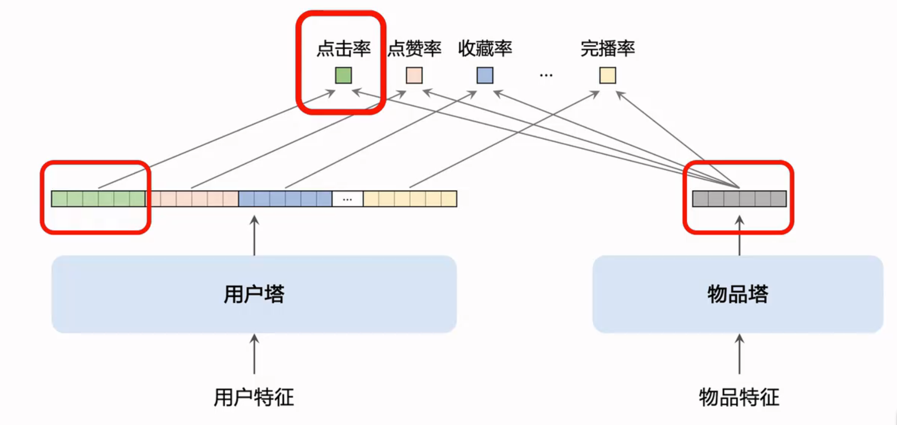

3. **改进模型的训练方法**
  - Baseline：做二分类，让模型学会区分正样本和负样本
  - 改进：结合二分类、batch 内负采样。(对于 batch 内负采样，需要做<u>纠偏</u>。)
  - 改进：使用<u>自监督学习方法</u>，让冷门物品的 embedding 学得更好。

### 41.3. Item-to-Item (I2I)

I2I 是一大类模型，基于**相似物品**做召回
- 最常见的用法是 U2I2I(user→ item→ item)
  - 用户 u 喜欢物品$i_1$(用户历史上交互过的物品)
  - 寻找$i_1$的相似物品$i_2$(即 I2I)
  - 将$i_2$推荐给 u

如何计算物品相似度?

- 方法 1：ItemCF 及其变体
  - 一些用户同时喜欢物品$i_1$和$i_2$，则认为$i_1$和$i_2$相似——即依赖用户行为
  - ItemCF 、Online ItemCF、Swing、Online Swing 都是基于相同的思想
  - <u>线上同时使用</u>上述 4 种 I2I 模型，各分配一定配额
- 方法 2：基于物品向量表征，计算向量相似度。(双塔模型、图神经网络均可计算物品向量表征。)

### 41.4. 小众的召回模型

- 类似 I2I 的模型
  - **U2U2I** (user -> user -> item)：已知用户$u_1$与$u_2$相似，且$u_2$喜欢物品 i，那么给用户$u_1$推荐物品 i
  - **U2A2I** (user -> author -> item)：已知用户 u 喜欢作者 a，且 a 发布物品 i，那么给用户 u 推荐物品 i
  - **U2A2A2I** (user -> author -> author -> item)：已知用户 u 喜欢作者$a_1$，且$a_1$与$a_2$相似，作者$a_2$发布物品 i，那么给用户 u 推荐物品 i

## 42. 涨指标的方法：排序模型

### 42.1. 精排模型的改进

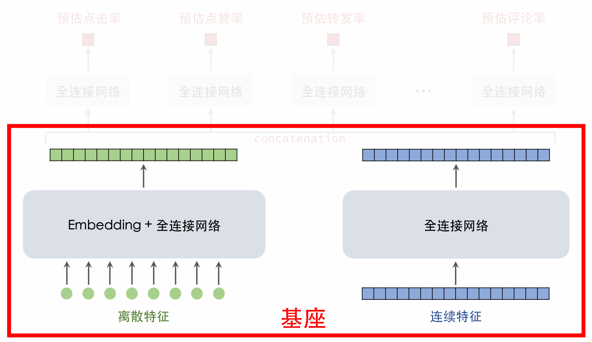

- **基座**的输入包括离散特征和连续特征，输出一个向量，作为多目标预估的输入
  - 改进 1：基座<u>加宽加深</u>，计算量更大，预测更准确
  - 改进 2：做自动的<u>特征交叉</u>，比如 bilinear 和 LHUC
  - 改进 3：**特征工程**，比如添加统计特征、多模态内容特征
- 基于基座输出的向量，同时预估点击率等**多个目标**
  - 改进 1：增加新的预估目标，并把预估结果加入融合公式
    - 最标准的目标包括点击率、点赞率、收藏率、转发率、评论率、关注率、完播率……
    - 寻找更多目标，比如进入评论区、给他人写的评论点赞……
    - 把新的预估目标加入融合公式
  - 改进 2：MMoE、PLE 等结构可能有效，但往往无效
  - 改进 3：纠正 position bias 可能有效，也可能无效

### 42.2. 粗排模型的改进

1. 粗排的打分量比精排大 10 倍，因此粗排模型<u>必须够快</u>
   - 简单模型：多向量双塔模型，同时预估点击率等多个目标
   - 复杂模型：三塔模型效果好，但工程实现难度较大

2. **粗精排一致性建模**：蒸馏精排训练粗排，让粗排与精排更一致
   - 方法 1：pointwise 蒸馏
     - 设 y 是用户真实行为，设 p 是精排的预估
     - 用(y+p)/2 作为粗排拟合的目标
   - 方法 2：pairwise 或 listwise 蒸馏
     - 给定 k 个候选物品，按照精排预估做排序
     - 做 learning to rank (LTR)，让粗排<u>拟合精排预估的物品的序</u>(而非值)
- 优点：粗精排一致性建模可以提升核心指标
- 缺点：如果精排出 bug，精排预估值 p 有偏，会污染粗排训练数据

### 42.3. 用户行为序列建模
目前做法：

- 最简单的方法是对物品向量**取平均**，作为一种用户特征
- **DIN** 使用注意力机制，对物品向量做加权平均
- 工业界目前沿着 **SIM** 的方向发展。先用类目等属性筛选物品，然后用 DIN 对物品向量做加权平均

改进措施：        
- 改进 1：<u>增加序列长度</u>，让预测更准确，但是会增加计算成本和推理时间
- 改进 2：筛选的方法，比如用类目、物品向量表征聚类
  - <u>离线</u>用多模态神经网络提取物品内容特征，将物品表征为向量
  - 离线将物品向量聚为 1000 类，每个物品有一个聚类序号
  - <u>线上排序</u>时，用户行为序列中有 n=1,000,000 个物品。某候选物品的聚类序号是 70，对 n 个物品做筛选，只保留聚类序号为 70 的物品。n 个物品中只有数千个被保留下来
  - 同时有好几种筛选方法，取筛选结果的并集
- 改进 3：对用户行为序列中的物品，使用 ID 以外的一些特征

沿着 SIM 的方向发展，让原始的序列尽量长，然后做筛选降低序列长度，最后将筛选结果输入 DIN

### 42.4. 在线学习（增量更新）
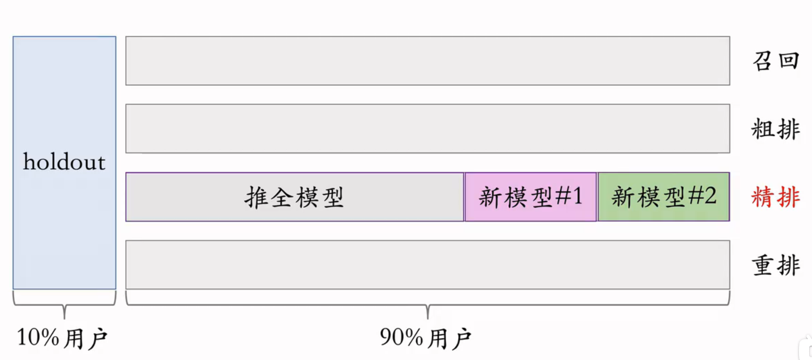
- 在线学习对指标的提升巨大，但是会制约模型开发迭代的效率
- 线上有 m 个模型，其中 1 个是 holdout，1 个是推全的模型，m−2 个测试的新模型
- 每套在线学习的机器成本都很大，因此 m 数量很小，制约模型开发迭代的效率

### 42.5. 老汤模型

用每天新产生的数据对模型做 1epoch 的训练（全量更新），久而久之，老模型训练得非常好，很难被超过
- 问题 1：如何快速<u>判断新模型结构是否优于老模型?</u>(不需要追上线上的老模型，只需要判断新老模型谁的结构更优)
  - 对于新、老模型结构，都**随机初始化模型全连接层**
  - Embedding 层可以是随机初始化，也可以是复用老模型训练好的参数
  - 用 n 天的数据训练新老模型。(从旧到新，训练 1epoch)
  - 如果新模型显著优于老模型，新模型很**可能**更优
  - 只是比较新老模型结构谁更好，而非真正追平老模型
- 问题 2：如何<u>更快追平、超过线上的老模型</u>?(只有几十天的数据，新模型就能追上训练上百天的老模型。)
  - 已经得出初步结论，认为新模型很可能优于老模型。用几十天的数据训练新模型，早日追平老模型
  - 方法 1：尽可能多地**复用**老模型训练好的 embedding 层，避免随机初始化 embedding 层。(Embedding 层是对用户、物品特点的“记忆”，比全连接层学得慢。)
  - 方法 2：用**老模型做 teacher**，蒸馏新模型。(用户真实行为是 y，老模型的预测是 p，用(y+p)/2 作为训练新模型的目标。)
    【蒸馏：不学习硬标签，而是大模型输出的软标签，包含更多的信息】

## 43. 涨指标的方法：多样性

### 43.1. 精排多样性

- 精排阶段，结合<u>兴趣分数和多样性分数</u>对物品 i 排序
  - $s_i$：兴趣分数，即融合点击率等多个预估目标
  - $d_i$：多样性分数，即物品 i 与已经选中的物品的差异
  - 用$s_i+d_i$对物品做排序
- 常用 MMR、DPP 等方法计算多样性分数，精排使用滑动窗口，粗排不使用滑动窗口
  - 精排决定最终的曝光，<u>曝光页面上邻近的物品相似度应该小</u>。
  - 粗排要考虑**整体**的多样性，而非一个滑动窗口中的多样性
- 除了多样性分数，精排还使用**打散策略**增加多样性
  - <u>类目</u>：当前选中物品 i，之后 5 个位置不允许跟 i 的二级类目相同
  - <u>多模态</u>：事先计算物品多模态内容向量表征，将全库物品聚为 1000 类；在精排阶段，如果当前选中物品 i，之后 10 个位置不允许跟 i 同属一个聚类

### 43.2. 粗排多样性

粗排给 5000 个物品打分，选出 500 个物品送入精排，提升粗排和精排多样性都可以提升推荐系统核心指标
- 根据$s_i$对 5000 个物品排序，分数最高的 200 个物品送入精排，先只考虑兴趣分数
- 对于剩余的 4800 个物品，对每个物品 i 计算兴趣分数$s_i$和多样性分数$d_i$
- 根据$s_i+d_i$对剩余 4800 个物品排序，分数最高的 300 个物品送入精排

### 43.3. 召回多样性——双塔模型：添加噪声

用户塔将用户特征作为输入，输出用户的向量表征；然后做 ANN 检索，召回向量相似度高的物品
- 线上做召回时(在计算出用户向量之后，在做 ANN 检索之前)，往<u>用户向量中添加随机噪声</u>
- 用户的兴趣越窄(比如用户最近交互的 n 个物品只覆盖少数几个类目)，则添加的噪声越强
- 添加噪声使得召回的物品更多样，可以提升推荐系统核心指标

### 43.4. 召回多样性——双塔模型：抽样用户行为序列

用户最近交互的 n 个物品(用户行为序列)是用户塔的输入
- 保留最近的 r 个物品(r$\ll$n)，从剩余的 n-r 个物品中**随机抽样** 𝑡 个物品(t$\ll$n)。(可以是均匀抽样，也可以用非均匀抽样让类目平衡。)
- 将得到的 <u>r+t 个物品作为用户行为序列</u>，而不是用全部 n 个物品

抽样用户行为序列为什么能涨指标?
  - 一方面，注入随机性，召回结果更多样化
  - 另一方面，n 可以非常大，可以利用到用户很久之前的兴趣

### 43.5. U2I2I：抽样用户行为序列

U2I2I(user -> item -> item)中的第一个 item 是指用户最近交互的 n 个物品之一，在 U2I2I 中叫作**种子物品**
- n 个物品覆盖的类目数较少，且<u>类目不平衡</u>
- 做<u>非均匀随机抽样</u>，从 n 个物品中选出 t 个，让类目平衡(想法和效果与双塔中的用户行为序列抽样相似。)
- 用抽样得到的 t 个物品(代替原本的 n 个物品)作为 U2I2I 的种子物品       
一方面，类目更平衡，多样性更好。另一方面，n 可以更大，覆盖的类目更多

### 43.6. 探索流量

每个用户曝光的物品中<u>有 2%是非个性化的</u>，用作兴趣探索
- 维护一个精选内容池，其中物品均为交互率指标高的优质物品。(内容池可以分人群，比如 30~40 岁男性内容池。)
- 从精选内容池中随机抽样几个物品，<u>跳过排序，直接插入</u>最终排序结果
- 兴趣探索在短期内负向影响核心指标，但长期会产生正向影响

## 44. 涨指标的方法：特殊对待特殊人群

### 44.1. 为什么要特殊对待特殊人群?

1. 新用户、低活用户的行为很少，<u>个性化推荐不准确</u>
2. 新用户、低活用户容易流失，要想办法促使他们<u>留存</u>
3. 特殊用户的行为(比如点击率、交互率)不同于主流用户，基于全体用户行为训练出的模型在特殊用户人群上有偏

### 44.2. 构造特殊的内容池

新用户、低活用户的行为很少，个性化召回不准确。(既然个性化不好，那么就保证内容质量好。)        

针对特定人群的特点构造特殊内容池，提升用户满意度。(例如，对于喜欢留评论的中年⼥性，构造促评论内容池，满足这些用户的互动需求。)

1. **如何构造特殊内容池?**

- 方法 1：根据物品获得的<u>交互次数、交互率</u>选择优质物品
  - 圈定人群：只考虑特定人群，例如 18~25 岁一二线城市男性
  - 构造内容池：用该人群对物品的交互次数、交互率给物品打分，选出分数最高的物品进入内容池
  - 内容池有弱个性化的效果
  - 内容池<u>定期更新</u>，加入新物品，排除交互率低和失去时效性的老物品
  - 该内容池只对该人群生效
- 方法 2：做<u>因果推断</u>，判断物品对人群留存率的贡献，根据贡献值选物品

2. **特殊内容池的召回**

- 通常使用双塔模型从<u>特殊内容池</u>中做召回
  - 双塔模型是个性化的
  - 对于新用户，双塔模型的个性化做不准
  - 靠高质量内容、弱个性化做弥补
- 额外的训练代价
  - 对于正常用户，不论有多少内容池，只训练一个双塔模型
  - 对于新用户，由于历史交互记录很少，需要<u>单独训练</u>模型
- 额外的推理代价
  - 内容池定期更新，然后要<u>更新 ANN 索引</u>
  - 线上做召回时，需要做 ANN 检索
  - 特殊内容池都很小(比全量内容池小 10~100 倍)，所以需要的额外算力不大

### 44.3. 特殊的排序策略（针对低活用户）

1. **排除低质量物品**

- 对于新用户、低活用户这样的特殊人群，业务上只关注<u>留存</u>，不在乎消费(总曝光量、广告收入、电商收入)，对于新用户、低活用户，少出广告、甚⾄不出广告
- 新发布的物品不在新用户、低活用户上做<u>探索</u>
  - 物品新发布时，推荐做得不准，会损害用户体验
  - <u>只在活跃的老用户上做探索</u>，对新物品提权(boost)
  - 不在新用户、低活用户上做探索，避免伤害用户体验

2. **差异化的融分公式**

- 新用户、低活用户的点击、交互行为不同于正常用户，低活用户的人均点击量很小；没有点击就不会有进一步的交互。低活用户的融分公式中，<u>提高预估点击率的权重</u>(相较于普通用户)
- <u>保留几个曝光坑位</u>给预估点击率最高的几个物品
  - 例：精排从 500 个物品中选 50 个作为推荐结果，其中 3 个坑位给点击率最高的物品，剩余 47 个坑位由融分公式决定。
  - 甚⾄可以把点击率最高的物品排在第一，确保用户一定能看到

### 44.4. 特殊的排序模型

特殊用户人群的行为不同于普通用户。新用户、低活用户的点击率、交互率偏高或偏低。排序模型被主流用户主导，对特殊用户做不准预估

1. 方法 1：**大模型+小模型**

- 用<u>全体用户行为训练大模型</u>，大模型的预估 p 拟合用户行为 y
- 用特殊用户的行为训练小模型，<u>小模型的预估 q 拟合大模型的残差 y-p</u>
- 对主流用户只用大模型做预估 p
- 对特殊用户，结合大模型和小模型的预估 p+q（小模型用于纠偏）

2. 方法 2：**融合多个 experts，类似 MMoE**

- 只用一个模型，模型有多个 experts，各输出一个向量
- 对 experts 的输出做加权平均
- <u>根据用户特征计算权重</u>(与MMOE的区别)
- 以新用户为例，模型将用户的新老、活跃度等特征作为输入，输出**权重**，用于对 experts 做加权平均

3. 方法 3：**大模型预估之后，用小模型做校准**

- 用大模型预估点击率、交互率
- 将<u>用户特征、大模型预估点击率和交互率</u>作为小模型(例如 GBDT)的输入
- 在特殊用户人群的数据上训练小模型，小模型的输出<u>拟合用户真实行为</u>（与方法1的区别）

## 45. 涨指标的方法：利用交互行为
推荐系统如何利用交互行为？            
最简单的方法：将模型预估的交互率用于排序，比如将交互行为当做预估的目标或将预估的点击率、交互率做融合，作为排序的依据。      
有没有其他用途？

### 45.1. 关注

#### 45.1.1 关注量对留存的价值
- 对于一位用户，他关注的作者越多，则平台对他的吸引力越强
- 用户<u>留存率(r)与他关注的作者数量(f)正相关</u>
- 如果某用户的 f 较小，则推荐系统要促使该用户关注更多作者

**1. 方法 1：用排序策略提升关注量**

- 对于用户 u，模型预估候选物品 i 的关注率为$p_i$
- 设用户 u 已经关注了 f 个作者
- 我们定义单调递减函数 $w(f)$，用户已经关注的作者越多，则 $w(f)$越小
- 在排序融分公式中添加 $w(f)·p_i$，用于促关注。(如果 f 小且$p_i$大，则 $w(f)·p_i$给物品 i 带来很大加分)

2. **方法 2：构造促关注内容池和召回通道**

- 这个<u>内容池中物品的关注率高</u>，可以促关注
- 如果用户关注的作者数 f 较小，则对该用户使用该内容池
- <u>召回配额</u>可以固定，也可以与 f 负相关

#### 45.1.2 粉丝数对促发布的价值

UGC 平台将作者发布量、发布率作为核心指标，希望作者多发布，作者发布的物品被平台推送给用户，会产生点赞、评论、关注等交互。交互(尤其是关注、评论)可以提升作者发布积极性
- 作者的粉丝数越少，则每增加一个粉丝对发布积极性的提升越大
- <u>用排序策略帮助低粉新作者涨粉</u>
- 某作者 a 的粉丝数(被关注数)为$f_a$
- 作者 a 发布的物品 i 可能被推荐给用户 u，模型预估关注率为$p_{ui}$
- 我们定义单调递减函数 $w(f_a)$作为权重；作者 a 的粉丝越多，则 w($f_a$)越小
- 在排序融分公式中添加 $w(f_a)·p_{ui}$，帮助低粉作者涨粉

#### 45.1.3 隐式关注关系

召回通道 U2A2I：user -> author -> item
- 显式关注关系：用户 u 关注了作者 a，将 a 发布的物品推荐给 u。(点击率、交互率指标通常高于其他召回通道)
- **隐式关注关系**：用户 u 喜欢看作者 a 发布的物品，但是 u 没有关注 a
- 隐式关注的作者数量远大于显式关注。<u>挖掘隐式关注关系，构造 U2A2I 召回通道</u>，可以提升推荐系统核心指标

### 45.2. 转发(分享)
A平台用户将物品转发到B平台，可以为A吸引站外流量。         
推荐系统做**促转发**（也叫**分享回流**）可以提升DAU和消费指标。           
简单提升转发次数是否有效？
- 模型预估转发率为$p$，融分公式中有一项$w·p$，让转发率大的物品更容易获得曝光机会
- 增大权重$w$可以促转发，吸引站外流量，但是会负面影响点击率和其他交互率。   

**KOL建模**         
目标：在不损害点击和其他交互的前提下，尽量多吸引站外流量。

什么样的用户的转发可以吸引大量站外流量？————<u>其他平台</u>的Key Opinion Leader(KOL)

<u>如何判断？</u>该用户历史上 的转发能带来多少站外流量。

- 方法1：排序融分公式中添加额外的一项 $k_u·p_ui$     
    - $k_u$：如果用户$u$是站外KOL，则$k_u$大
    - $p_ui$：为用户$u$推荐物品$i$，模型预估的转发率

- 方法2：构造促转发内容池和召回通道，对站外KOL生效

### 45.3. 评论
**评论促发布**：        
  关注、评论等交互可以提升作者的发布积极性。        
  - 如果新发布物品尚未获得很多评论，则给**预估评论率**提权，让物品尽快获得评论。
  - 排序融分公式中添加额外的一项 $w_i·p_i$     
      - $w_i$：权重，与物品$i$已有的评论数量负相关
      - $p_i$：为用户推荐物品$i$，模型预估的评论率

**其他价值**：
- 有的用户<u>喜欢留评论</u>，为其添加促评论的内容池，利于提升这些用户的留存
- 有的用户常<u>留高质量评论</u>，对作者、其他用户的留存有贡献

