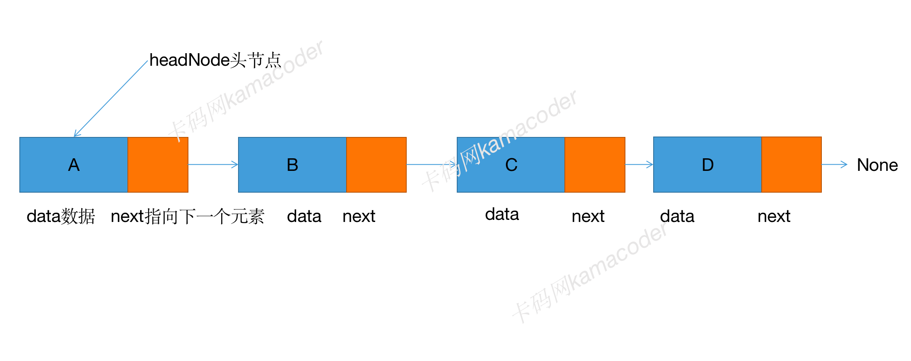
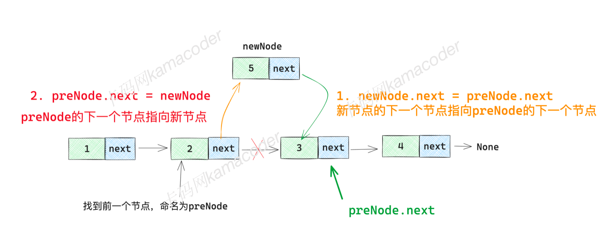
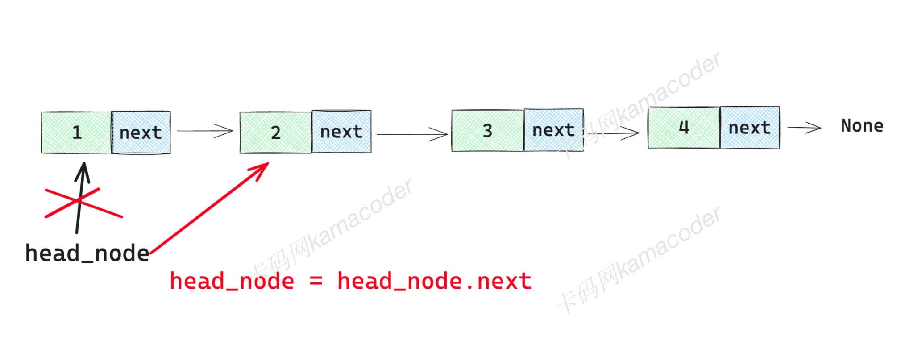
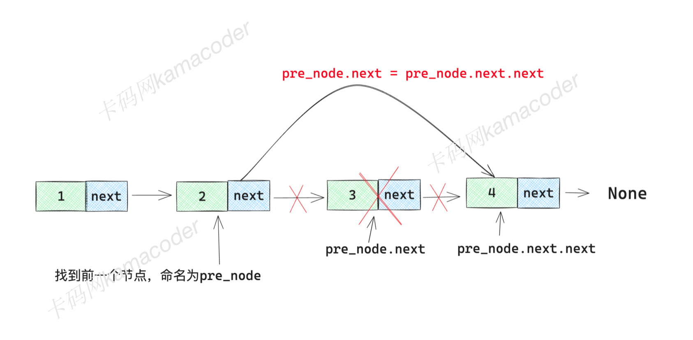
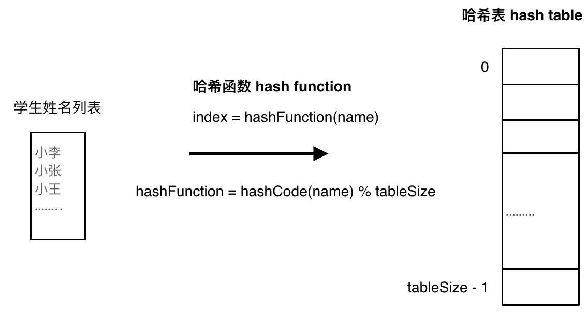

- [模版](#模版)
  - [题目](#题目)
  - [答案](#答案)
- [1 A+B问题](#1-ab问题)
  - [题目](#题目-1)
  - [答案](#答案-1)
  - [输入](#输入)
  - [数据类型](#数据类型)
  - [变量赋值](#变量赋值)
  - [多重赋值](#多重赋值)
  - [计算A+B](#计算ab)
  - [循环输入输出](#循环输入输出)
  - [模块](#模块)
- [2 A+B问题](#2-ab问题)
  - [题目](#题目-2)
  - [答案：](#答案-2)
  - [\_占位符](#_占位符)
  - [列表List](#列表list)
  - [range()函数](#range函数)
  - [for循环](#for循环)
  - [while循环](#while循环)
  - [数据类型转换](#数据类型转换)
  - [sys模块](#sys模块)
- [3 A+B问题](#3-ab问题)
  - [题目](#题目-3)
  - [答案：](#答案-3)
  - [if语句](#if语句)
  - [关系运算符](#关系运算符)
  - [逻辑运算符](#逻辑运算符)
  - [break循环](#break循环)
  - [continue](#continue)
  - [条件运算符/三元](#条件运算符三元)
- [4 A+B问题](#4-ab问题)
  - [题目](#题目-4)
  - [答案](#答案-4)
  - [算术运算符](#算术运算符)
  - [复合赋值运算符](#复合赋值运算符)
  - [内置数学函数](#内置数学函数)
  - [内置sum(列表, 初始值)函数](#内置sum列表-初始值函数)
  - [map(function, list)函数](#mapfunction-list函数)
- [5 A+B问题](#5-ab问题)
  - [题目](#题目-5)
- [6 数组的倒序与隔位输出](#6-数组的倒序与隔位输出)
  - [题目](#题目-6)
  - [答案](#答案-5)
  - [数组](#数组)
  - [序列](#序列)
  - [可变值和不可变值](#可变值和不可变值)
  - [列表](#列表)
  - [切片](#切片)
- [7 摆平积木](#7-摆平积木)
  - [题目](#题目-7)
  - [答案](#答案-6)
- [8 数字中偶数的和](#8-数字中偶数的和)
  - [题目](#题目-8)
  - [答案：](#答案-7)
  - [使用取模运算和整数除法来获取每一位，直到 n 变为0](#使用取模运算和整数除法来获取每一位直到-n-变为0)
- [9 打印正方形](#9-打印正方形)
  - [题目](#题目-9)
  - [答案](#答案-8)
  - [循环嵌套](#循环嵌套)
- [10 平均绩点](#10-平均绩点)
  - [题目](#题目-10)
  - [答案](#答案-9)
  - [字符串string的使用](#字符串string的使用)
  - [``format``方法](#format方法)
- [11 句子缩写](#11-句子缩写)
  - [题目](#题目-11)
  - [答案：](#答案-10)
  - [字符串大小的比较](#字符串大小的比较)
  - [函数](#函数)
  - [实参和形参](#实参和形参)
- [12 位置互换](#12-位置互换)
  - [题目](#题目-12)
  - [答案](#答案-11)
  - [元组](#元组)
- [13 链表的基础操作1](#13-链表的基础操作1)
  - [题目](#题目-13)
  - [答案](#答案-12)
  - [链表](#链表)
  - [class类](#class类)
  - [定义链表节点](#定义链表节点)
  - [链表的插入](#链表的插入)
  - [打印链表的节点](#打印链表的节点)
- [14 链表的基础操作2](#14-链表的基础操作2)
  - [题目](#题目-14)
  - [答案](#答案-13)
  - [寻找第n个节点get方法](#寻找第n个节点get方法)
- [15 链表的基础操作3](#15-链表的基础操作3)
  - [题目](#题目-15)
  - [答案](#答案-14)
  - [插入链表的过程](#插入链表的过程)
  - [删除链表的过程](#删除链表的过程)
- [16 出现频率最高的字母list](#16-出现频率最高的字母list)
  - [题目](#题目-16)
  - [答案](#答案-15)
  - [哈希表理论基础](#哈希表理论基础)
- [17 判断集合成员set](#17-判断集合成员set)
  - [题目](#题目-17)
  - [答案](#答案-16)
  - [set集合](#set集合)
- [18 开房门map](#18-开房门map)
  - [题目](#题目-18)
  - [答案](#答案-17)
  - [map映射](#map映射)
- [19 洗盘子(栈)](#19-洗盘子栈)
  - [题目](#题目-19)
  - [答案](#答案-18)
  - [栈](#栈)
  - [栈的操作](#栈的操作)
- [20 排队取奶茶(队列)](#20-排队取奶茶队列)
  - [题目](#题目-20)
  - [答案](#答案-19)
  - [队列](#队列)
  - [队列的操作](#队列的操作)


# 模版
## 题目
- 题目描述：  
  
- 输入描述：  
  。
- 输出描述：  
  。  
  。
- 输入示例： 
    ```text

    ```
- 输出示例： 
    ```text

    ```
## 答案  
    ```python

    ```

**粗体**``灰底`` *斜体*


# 1 A+B问题
## 题目
- 题目描述：  
你的任务是计算 a+b。
- 输入描述：  
输入包含一系列的 a 和 b 对，通过空格隔开。一对 a 和 b 占一行。
- 输出描述：  
对于输入的每对 a 和 b，你需要依次输出 a、b 的和。  
如对于输入中的第二对 a 和 b，在输出中它们的和应该也在第二行。
- 输入示例： 
    ```text
    3 4
    11 40
    ```
- 输出示例： 
    ```text
    7
    51
    ```
## 答案  
    ```python
    while True:
        try:
            data=input().split()
            res= int(data[0]) + int(data[1])
            print(res)
        except:
            break    
    ```
## 输入
**input()**：<font color=red>接收的总是一个字符串</font>，``int(input())``例如输入整数3, input()接收的内容是 "3", int("3")转为整数3  
``input("请输入一些文本: ")``  
print()函数和input()函数结合起来，实现与用户的交互 
  
input()遇到空格不会停止接收输入，且输入的是字符串，那么使用split()方法分隔并返回一个列表（见下节）  
**split()**：()以空格分隔；(",")以,分隔

## 数据类型
int整数  
float浮点数  
bool布尔值逻辑值真假  
string字符串'或"括起来

## 变量赋值
=往往意味着把右边的值赋值给左边  
python 是一种动态类型语言，变量的数据类型可以随着分配给他们的值而改变

## 多重赋值
```python
a=b=c=42
x,y,z=1,2,3
a,b=[1,2]
```

## 计算A+B
```python
data = input().split() # 将输入字符按空格分割得到数据列表
res = int(data[0])+int(data[1]) # 取元素并转换为整数，相加后赋值给res
print(res)
```

## 循环输入输出
为了满足多组数据的计算要求，需要循环输入输出。   
**while循环**：在满足特定条件时重复执行代码块的控制结构，若设置条件部分为True，循环将一直执行直到使用break语句终止循环   
**try代码块**：try中的代码被尝试执行，如果未发生错误则正常执行，若停止输入后输入的内容无法被正确分割成两个整数，这时由except捕获异常并执行异常处理代码   

```python
while True:
    try:
    # 尝试执行这部分程序
    except:
    # 捕获异常，执行异常处理代码
        break
```


    

## 模块
每一个模块都有一个内置属性`__name__` ，使得同一个Python文件既可以作为可执行程序运行，也可以作为模块被其他程序导入使用。 <font color=red>注意缩进！</font> 
```python
 #直接运行程序
 if __name__ == "__main__":
    # 这里写测试代码
```
```python
# math作为模块被导入
import  math
print(math.aqrt(25))

from math import sqrt
print(sqrt(25))
```


# 2 A+B问题
## 题目
- 题目描述：  
  计算a+b，但输入方式有所改变。
- 输入描述：  
第一行是一个整数N，表示后面会有N行a和b，通过空格隔开。  
- 输出描述：  
对于输入的每对a和b，你需要在相应的行输出a、b的和。
如第二对a和b，对应的和也输出在第二行。
- 输入示例： 
    ```text
    2
    2 4
    9 21
    ```
- 输出示例： 
    ```text
    6
    30
    ```
- 提示信息：   
  测试数据不仅仅一组。也就是说，会持续输入N以及后面的a和b
## 答案：  
```python
    # for循环
    while True:
        try:
            N = int(input())
            for _ in range(N):
                a,b = input().split()
                print(int(a)+int(b))
        except:
            break
```
  
- 解题过程
    ```python
    N = int(input())
    i=0
    while i < N:
        a,b=input().split()
        print(int(a)+int(b))
        i = i+1 
    ```
    上述代码只能运行一次N的输入，但是如果先算一组N1行，接着算一组N2行就会报错，如下正确
    ```python
    while True:
        try:
            N = int(input())
            i = 0
            while i < N:
                a,b=input().split()
                print(int(a)+int(b))
                i = i+1 
        except:
            break
    ```
## _占位符
_ 不是特殊语法，只是一个通常表示“这个变量我不打算用”的变量名。只关心“循环几次”，不关心当前是第几次
## 列表List
数据之间逗号,分隔，由方括号[]括起来  
可以包含各种数据类型   
**索引**访问列表元素，从0开始

## range()函数
是python中的一个内置类型，表示一个不可变的数字序列,<font color=red>不可以直接与数字相加减</font>   
range(stop)：0-stop(不含)  
range(start, stop)：start-stop(不含)   
range(start, stop, step)：步长控制间隔，默认为1
```python
r = range(5)
print(list(r))  # 输出: [0, 1, 2, 3, 4]
```
- 惰性计算：不立即生成所有数字，节省内存
- 不可变：创建后不能修改
- 可迭代：可以在for循环中使用
- 支持索引：可通过下表访问
```python
r = range(5)
print(r[0])   # 输出: 0
print(r[3])   # 输出: 3
print(len(r)) # 输出: 5
```

## for循环
遍历一个列表中的元素并执行循环中的代码块，list是列表，item是一个循环变量
```python
for intem in list:
    # 循环体 

persons = ["tom", "jerry", "mike"]
# 遍历列表，n表示每次循环时的值
for n in persons:
    print(n)

word = 'hello'
# 遍历字符串，letter表示字符串中的每一个字符
for letter in word:
    print(letter)
```

## while循环  
while和while True的<font color=red>区别</font>：前者是满足条件就继续运行，后者一直运行但if某种情况才break即条件在循环内部。
```python
# 初始化语句
while 条件判断:
      # 迭代语句
```

例如：从1数到100
- 初始化语句：我们计数通常从1开始，也就是说，我们最开始初始化了一个值1
- 条件：判断值是否小于100，如果小于100，说明我们还没有计数完，需要继续计数，如果等于100，说明已经计数完毕，则结束计数
- 迭代语句：如果本次计数值小于100，将值加1
- 重复步骤二，再次判断值是否小于100
- 重复步骤三，计数值再加1

```python
count = 1 # 初始化
while count <= 100: # 判断
    print(count)
    # 迭代
    count = count +1
```


## 数据类型转换
- 隐式：python自动完成，如整数和浮点数运算时，整数隐式转换为浮点数；while条件判断0为false,其他非0的为true
- 显式： int()、float()、str()、bool() 

## sys模块
包含了许多与系统相关的变量和函数，常用来处理输入和输出  
- sys.exit([status]): 退出程序。status 是一个整数，通常为 0 表示成功，非零表示错误。  
- sys.stdin: 标准输入流，用于从键盘或其他输入设备读取数据。
- sys.stdout: 标准输出流，用于将数据打印到屏幕
```python
# 导入 sys 模块
import sys  

# sys.stdin表示输入流，遍历获取的line表示每一行输入
for line in sys.stdin:
      # 对每行数据进行处理
```
**ipynb文件转为md**

在终端输入：
 jupyter nbconvert --to markdown 'python基础1.ipynb' 


# 3 A+B问题
## 题目
- 题目描述：  
  计算a+b。
- 输入描述：  
  输入中每行是一对a和b。其中会有一对是0和0标志着输入结束，且这一对不要计算。  
- 输出描述：  
对于输入的每对a和b，你需要在相应的行输出a、b的和。
如第二对a和b，对应的和也输出在第二行。
- 输入示例： 
    ```text
    2 4
    11 19
    0 0
    ```
- 输出示例： 
    ```text
    6
    30
    ```
## 答案：
    ```python
    while True: 
        try:
            s = input().split()
            a, b = int(s[0]), int(s[1])
            # 如果输入的a和b同时为0， 则终止循环，如果不是同时为0，则跳过该代码块，不执行
            if a == 0 and b == 0:
                # 遇到特定输入时退出循环
                break
            print(a + b)
        except:
            break
    ```

- 自己尝试
```python
while True:
    try:
        a,b=map(int,input().split())
        if (a!=0) or (b!=0):
        #if not a and not b:等价于if a==0 and b==0:
        ## 如果不加int操作，比较的是字符串 "0" 和整数 0，它们永远不相等
            print(a+b)
        else:
            print("\n")
    except:
        break
```


## if语句
条件语句，表示假设在某种条件下，代码才可以执行。  
<font color=red>注意</font>：尽量不适用else，否则时间花费会更多。  
**condition**是条件判断，返回布尔值（真和假），真-执行缩进里的代码；假-跳过这一段。
```  python
if condition:
    # 执行代码块
```
**else**语句，假设条件不满足时执行缩进里的代码。  
**elif**条件分支可以有多个，但都是在if不成立时执行。  
```python
if 有西瓜:
    # 如果有西瓜，则执行这里的代码块
elif 有苹果:
    # 在没有西瓜的情况下，有苹果，则执行这里的代码块
else:
    # 既没有西瓜，也没有苹果，上面的条件都为假，则执行这里的代码块
```
## 关系运算符
- =  右边的值赋给左边  
- ==  比较两个值之间是否相等  
- \> 左侧是否大于右侧
- < 左侧是否小于右侧
- \>=，>=
- != 不等于，两个值是否不相等
  
## 逻辑运算符
- and 都为真才真
- or 至少一个为真
- not 将条件判断的值取反后返回
```python
# 如果val是任何的非0值，条件为真，执行代码
if val:
# 如果val是0，转换为false,经过非运算后进行取反,条件为真
if not val:
```

## break循环
完全退出循环，终止离它最近的while、for语句的，break之后的代码都不会再执行，

## continue
用于控制跳出循环，同样的，它也只能出现在for、while循环的内部，跳过当前循环迭代的剩余部分，然后继续下一次循环迭代， 通常用于在某个特定条件下，跳过某些特定的迭代操作，但仍然继续循环   
```python
numbers = [1, 2, 3, 4, 5, 6, 7]
for number in numbers:
    # 当满足条件时，跳过本次迭代，继续下一次循环
    if number == 2:
        continue  # 当number等于2时，跳过本次循环迭代，但会进行number == 3的循环
    print(number)
# continue 输出1 3 4 5 6 7
# break 输出1
```
## 条件运算符/三元
经过简化后的if-else语句，先对条件表达式进行求值判断, 如果判断结果为True, 则执行语句1，并返回执行结果，如果判断结果为False, 则执行语句2，并返回执行结果  

```python
语句1 if 条件表达式 else 语句2
```


# 4 A+B问题
## 题目
- 题目描述：  
  计算若干整数的和。
- 输入描述：  
  每行的第一个数N，表示本行后面有N个数。
  如果N=0时，表示输入结束，且这一行不要计算。  
- 输出描述：  
  对于每一行数据需要在相应的行输出和。
- 输入示例： 
    ```text
    4 1 2 3 4
    5 1 2 3 4 5
    0
    ```
- 输出示例： 
    ```text
    10
    15
    ```

## 答案
- 自己尝试  
    ```python
    while True:
        try:
            data =list(map(int, input().split()))
            N = data[0]
            if N==0:
                break
            res = 0
            for i in range(N):
                res = res + data[i+1]
            print(res)
        except:
            break
    ```
- 答案1
    ```python
    while True:
        input_line = input().split()
        n = int(input_line[0])
        if n == 0:
            break
        else:
            res = 0
            for i in range(n):
                res = res + int(input_line[i+1])
            print(res)
    ```
- 答案2 使用map, sum, 切片
    ```python
    while True:
        input_line = input().split()
        n = int(input_line[0])
        if n == 0:
            break
        else:
            numbers = list(map(int, input_line[1:]))
            res = sum(numbers)
            print(res)
    ```

## 算术运算符
加法+  
减法-  
乘法*  
除法/（总是除去浮点数）  
整除//（5//2得2）  
幂运算**（2**3=8）
取余%（10%4=2）

## 复合赋值运算符
`sum = sum + i`
```python
a += 5 # a = a + 5
a -= 5 # a = a - 5
a *= 5 # a = a * 5
**=  /=  //=  %=
```

## 内置数学函数
- abs(x): 绝对值
- max(x, y, z, ...): 最大值
- min(x, y, z, ...): 最小值
- pow(x, y): y的x次方，参数为整数
- round(x): 浮点数x的四舍五入值     
- 更多的需要`import math`
- math.ceil(x): 大于或等于x的最小整数
- math.floor(X): 向下取整，返回一个比x小的最大整数
- math.pow(x, y): y的x次方，math模块会把参数转换成浮点数
- math.sqrt(x): 返回x的平方根
- 生成随机数`import random`
```python
import random
print( random.randint(1,10) )        # 产生 1 到 10 的一个整数型随机数  
print( random.random() )             # 产生 0 到 1 之间的随机浮点数
print( random.uniform(1.1,5.4) )     # 产生  1.1 到 5.4 之间的随机浮点数，区间可以不是整数
print( random.choice('tomorrow') )   # 从序列中随机选取一个元素
print( random.randrange(1,100,2) )   # 生成从1到100的间隔为2的随机整数

a=[1,3,5,6,7]                # 将序列a中的元素顺序打乱
random.shuffle(a)
print(a)
```


## 内置sum(列表, 初始值)函数
- 如果在代码中重新定义了`sum变量`，将覆盖内置的`sum函数`
初始值是总和的初始值，然后将列表中的元素依次相加，如下示例
```python
sum(列表, 初始值)

numbers = [1, 2, 3, 4, 5]
total = sum(numbers)
print(total) # 输出15
```

## map(function, list)函数
将一个函数应用到序列中的每个元素，并返回一个包含结果的新序列
- function是要应用到列表中每个元素的函数
- list是要处理的列表
```python
str_numbers = ["1","2","3","4"]
int_numbers = list(map(int, str_numbers))
print(int_numbers)
# 输出[1, 2, 3, 4]
```


# 5 A+B问题
## 题目
- 题目描述:   
  你的任务是计算若干整数的和。   
- 输入描述:    
  输入的第一行为一个整数N，接下来N行每行先输入一个整数M，然后在同一行内输入M个整数。   
- 输出描述:    
  对于每组输入，输出M个数的和，每组输出之间输出一个空行。   
- 输入示例:
  ```text    
    3   
    4 1 2 3 4    
    5 1 2 3 4 5    
    3 1 2 3    
    ```
- 输出示例:   
  ```text   
    10    

    15   

    6  
    ``` 

提示：注意以上样例为一组测试数据，后端判题会有很多组测试数据，也就是会有多个N的输入，只保证每组数据内部之间有空白行，两组数据之间没有空行！  

 <font color=red>vscode输入时，按shift+enter为换行，但是上一行不显示只显示当前行，边输入边运行，eg:输入3没反应，再输4 1 2 3 4 计算出结果输出</font>   

## 答案   
- 自己尝试：
```python
while True:
    try:
        N = int(input())
        for i in range(N):
            data = list(map(int, input().split()))
            M = data[0]
            res = 0
            for j in range(M):
                res += data[j+1]
            print(res)
            if i < (N-1):
                print()
            else:
                break
    except:
        break
```
- 答案：  
    ```python
    while True:
        try:
            N = int(input())
            for i in range(N):
                input_line = input().split()
                m = int(input_line[0])
                total = 0
                # 累加 m 个数值
                for j in range(m):
                    total += int(input_line[j + 1])
                print(total)
                # 控制输出一个空行，每组数据的最后一行不输出
                if i < N-1:
                    print()
        except:
            break
    ```


# 6 数组的倒序与隔位输出
## 题目
- 题目描述:    
给定一个整数数组，编写一个程序实现以下功能：  
将输入的整数数组倒序输出，每个数之间用空格分隔。  
从正序数组中，每隔一个单位（即索引为奇数的元素），输出其值，同样用空格分隔。       
- 输入描述:    
第一行包含一个整数 n，表示数组的长度。  
接下来一行包含 n 个整数，表示数组的元素。    
- 输出描述:  
  首先输出倒序排列的数组元素，然后输出正序数组中每隔一个单位的元素。    

- 输入示例:
  ```text    
    5   
    2 3 4 5 6   
  ```
    
- 输出示例:      
  ```text
    6 5 4 3 2    
    2 4 6   
  ```
- 提示：   
  数据范围1 <= n <= 1000.   
## 答案
- 自己尝试：    
    ```python
    n = int(input())
    if (n>=1) and (n<=1000):
        nums = list(map(int, input().split()))
        for i in range(n):
            print(nums[-i-1], end=" ")
        print()
        for j in range(0, n, 2):
            print(nums[j], end=" ")
    else:
        print('输入错误')
    ```
- 答案：  
    ```python
    n = int(input())
    nums = list(map(int, input().split()))
    for i in range(-1, -n-1, -1):
        print(nums[i], end=" ")
    print()
    for j in range(0, n, 2):
        print(nums[j], end=" ")
    ```
__倒序输出__：使用`for循环`和`range函数`倒序遍历  
__隔位输出__：`print(object, end=" ")`


## 数组
一种用于存储相同数据类型的元素的**数据结构**
- 大小固定：元素个数一旦声明，不能在运行时动态更改
-  相同数据类型：所有元素类型相同
-  连续存储：在内存中连续存储
-  下标访问：通过索引进行访问，从0开始

## 序列
python中保存一组有序数据的数据类型，所有数据都有唯一的位置（索引），主要序列类型如下：   
- 列表：[]，元素之间逗号,分隔。可变，可增删改
- 元组：()，元素之间逗号,分隔。不可变，创建后元素不可改
- 字符串："  "或' '包裹起来的字符集合，元素是字符，不可变    
序列有一些共同特性，比如通过索引访问、切片、长度计算、迭代等，即切片和for循环操作在元组和字符串中也可以进行。

## 可变值和不可变值
python中数据类型按照创建后是否可以被改变分为2类。   
- 可变：创建后可以**原地**进行修改，包括列表、字典、集合等
- 不可变：创建后不能被修改，包括整数、浮点数、字符串、元组等，当改变值的时候，会创建一个**新的对象**  


## 列表
python中用列表替换了数组，与数组相比更灵活，存储一组有序的元素，但可以包含各种*8不同类型**的元素甚至是其他列表，而且列表长度可变。  
1. 创建列表：方括号[]或list(可迭代对象)，`list函数`可将其他可迭代对象转换成列表
   ```python
   a = [1, 2, 3, 4]
   # 错 a = list(1, 2, 3)
   b = list() # 生成一个空列表
   c = "hello"
   c_list = list(c) # ['h', 'e', 'l', 'l', 'o']
   ```
2. 访问列表元素：从0表示一个元素开始的索引，`a_list[0]`
   或负数索引，-1最后一个，-2倒数第二个
3. 修改列表元素：通过索引修改，`a_list[1] = 10`
4. 列表长度：使用`len()函数`获取长度即元素个数
5. 其他常见操作：
   - my_list.append(value):将新元素添加到列表末尾
   - my_list.insert(index, value):在索引index处插入元素value
   - my_list.remove(value):移除第一个值为value的元素
   - my_list.pop(index):删除并返回索引index处的元素
   - my_list.index(value):返回第一个指定值value的元素索引位置
   - my_list.sort():升序排列元素
   - my_list.reverse():反转元素顺序   
   - <font color=red>以上大部分操作为原地操作</font>

```python
my_list = [3, 1, 4, 2]

# 1. append() - 原地添加，返回None
result = my_list.append(5)
print(result)       # None
print(my_list)      # [3, 1, 4, 2, 5]

# 2. insert() - 原地插入，返回None  
result = my_list.insert(1, 99)
print(result)       # None
print(my_list)      # [3, 99, 1, 4, 2, 5]

# 3. remove() - 原地移除，返回None
result = my_list.remove(1)
print(result)       # None  
print(my_list)      # [3, 99, 4, 2, 5]

# 4. sort() - 原地排序，返回None
result = my_list.sort()
print(result)       # None
print(my_list)      # [2, 3, 4, 5, 99]

# 5. reverse() - 原地反转，返回None
result = my_list.reverse()
print(result)       # None
print(my_list)      # [99, 5, 4, 3, 2]

##############################

# pop() - 删除并返回元素，原地修改但返回被删除的值
result = my_list.pop(1)    # 删除索引1的元素
print(result)              # 1 (返回被删除的值)
print(my_list)             # [3, 4, 2] (原列表被修改)

# index() - 返回值，不修改原列表
result = my_list.index(4)  # 查找元素4的索引
print(result)              # 1 (返回索引值)
print(my_list)             # [3, 4, 2] (原列表不变)
```

## 切片
获取列表中的一小部分元素，即子列表`my_list(startIndex: endIndex: step)`   
且在索引元素前的空隔，包含start不含end，step默认为1挨着取


# 7 摆平积木
## 题目
- 题目描述：  
  小明很喜欢玩积木。一天，他把许多积木块组成了好多高度不同的堆，每一堆都是一个摞一个的形式。然而此时，他又想把这些积木堆变成高度相同的。但是他很懒，他想移动最少的积木块来实现这一目标，你能帮助他吗？
  
- 输入描述：  
  输入包含多组测试样例。每组测试样例包含一个正整数n，表示小明已经堆好的积木堆的个数。    
  接着下一行是n个正整数，表示每一个积木堆的高度h，每块积木高度为1。其中1<=n<=50,1<=h<=100。   
  测试数据保证积木总数能被积木堆数整除。  
  当n=0时，输入结束。  
- 输出描述：  
  对于每一组数据，输出将积木堆变成相同高度需要移动的最少积木块的数量。   
  在每组输出结果的下面都输出一个空行。
- 输入示例： 
    ```text
    6
    5 2 4 1 7 5
    0
    ```
- 输出示例： 
    ```text
    5
    ```
**关键**：只计算少于平均值的堆！
## 答案
- 自己尝试：  
    ```python
    while True:
        try:
            n = int(input())
            if n!=0:
                nums = list(map(int, input().split()))
                h0 = int(sum(nums) / n)
                res = 0
                for i in range(n):
                    if nums[i] < h0:
                        res += (h0-nums[i])
                    else:
                        continue
                print(res)
                print()
            else:
                break
        except:
    ```
- 答案:
    ```python
    while True:
        try:
            n = int(input())
            if n == 0:
                break
            # 获取每堆积木数量，将之转换成列表
            nums = list(map(int, input().split()))
            # 计算积木总数量
            total_sum = sum(nums)
            # 计算平均值
            average = total_sum // n
            # 定义输出结果
            result = 0
            # 遍历每一摞积木
            for num in nums:
            # 如果当前摞的积木超过平均值, 把超出平均值数量的积木移到不足平均值的地方，超出的数量就是需要挪动的次数
                if num > average:
                    result += num - average
            # 输出结果
            print(result)
            print()
        except:
            break
    ```
# 8 数字中偶数的和
## 题目
- 题目描述：  
  有一天, 小明收到一张奇怪的信, 信上要小明计算出给定数各个位上数字为偶数的和。
  例如：5548，结果为12，等于 4 + 8 。
  小明很苦恼，想请你帮忙解决这个问题。
- 输入描述：  
  输入数据有多组。每组占一行，只有一个整整数，保证数字在32位整型范围内。
- 输出描述：  
  对于每组输入数据，输出一行，每组数据下方有一个空行。
- 输入示例： 
    ```text
    415326
    3262
    ```
- 输出示例： 
    ```text
    12

    10
    ```
 
## 答案：
- 思路：   
  使用取模运算和整数除法来获取每一位，直到 n 变为0  
- 
    ```python
    while True:
        try:
            n = int(input())
            res = 0
            while n != 0:
                a = n %10
                if a % 2 == 0:
                    res += a
                n = n //10
            print(res)  
            print()  
        except:
            break   
    ```

# 9 打印正方形
## 题目
- 题目描述：  
  编写一个程序，模拟打印一个正方形的框。程序应该接受用户输入的正整数作为正方形的边长，并打印相应大小的正方形框。   
  请注意，内部为空白，外部是由 "*" 字符组成的框。
- 输入描述：  
  输入只有一行，为正方形的边长 n。
- 输出描述：  
  输出正方形组成的框。
- 输入示例： 
    ```text
    5
    ```
- 输出示例： 
    ```text
    *****
    *   *
    *   *
    *   *
    *****
    ```
## 答案
- 答案1：
    ```python
    n = int(input())
    for i in range(n):
        for j in range(n):
            if (i == 0) or (j == 0) or (i == n-1) or (j == n-1):
                print("*", end = " ")
            else:
                print(" ", end = " ")
        i += 1
        print()
    ```
- 答案2：
  ```python
    n = int(input())
    print("* " * n)
    if n>1:
        for i in range(n-2):
            print("* " + "  " * (n-2) + "*")
        print("* " * n)
  ```

<font color=red>``print()``每调用一次会自动换行输出，参数``end=""`` 不换行</font>
## 循环嵌套
之前的学习中，已经知道了如何用for循环遍历列表结构，但数据的组织形式除了是一维的，还可能是多维的，比如数学中的矩阵、表格、游戏棋盘。
对于二维的数据，需要循环嵌套。
```python
# 创建一个包含二维数据的二维列表，即列表的每一个元素都是一个列表
matrix = [
    [1, 2, 3, 4, 5],
    [6, 7, 8, 9, 10],
    [11,12,13,14,15],
      [16,17,18,19,20],
      [21,22,23,24,25]
]

# 遍历二维列表
for row in matrix: # 外部循环迭代行，也就是第一行，第二行... 第n行
    for item in row: #  内部循环迭代列，也就是第一列，第二列...第n列
        print(item, end=" ") # 输出元素值
    # 在每行结束后换行
    print()
```

# 10 平均绩点  
## 题目  
- 题目描述：  
  每门课的成绩分为A、B、C、D、F五个等级，为了计算平均绩点，规定A、B、C、D、F分别代表4分、3分、2分、1分、0分。
- 输入描述：  
  有多组测试样例。每组输入数据占一行，由一个或多个大写字母组成，字母之间由空格分隔。
- 输出描述：  
  每组输出结果占一行。如果输入的大写字母都在集合｛A,B,C,D,F｝中，则输出对应的平均绩点，结果保留两位小数。否则，输出“Unknown”。
- 输入示例： 
    ```text
    A B C D F
    B F F C C A
    D C E F
    ```
- 输出示例： 
    ```text
    2.00
    1.83
    Unknown
    ```   
## 答案
- 注意：当循环遇到{A, B, C, D, F}以及空格之外的字符时，会输出"Unknown", 然后退出for循环的执行，但是仍然会执行循环之后的语句，即print平均成绩语句，实际上，这行代码不应该被执行，应该怎样做才能避免这行代码的执行呢？
    ```python
    # 初始化一个 "真令牌"
    flag = True
    # 在某种情况下真令牌被替换成假令牌
    flag = False
    # 无法执行下面的逻辑
    if flag:
        # 在flag为True时执行的代码
    ```
- 答案：
    ```python
    while True:
        try:
            s = input()
            sum_grade = 0
            count = 0
            flag = 1
            # 遍历字符串
            for char in s:
                if char == 'A':
                    sum_grade += 4
                    count += 1
                elif char == 'B':
                    sum_grade += 3
                    count += 1
                elif char == 'C':
                    sum_grade += 2
                    count += 1
                elif char == 'D':
                    sum_grade += 1
                    count += 1
                elif char == 'F':
                    count +=1
                elif char == ' ':
                    continue
                else:
                    flag = 0
                    print("Unknown")
                    break
            if flag:  # 非0值为真
                print("{:.2f}".format(sum_grade / count))
        except:
            break
    ```

## 字符串string的使用   
可以变长的字符序列，用来存储文本信息和操作文本数据。   
- 创建     
  使用单引号``''``或双引号``""``来创建，python中没有字符类型，一个字符也是字符串。  
    ```python
    str1 = "hello,world"
    str2 = 'a'
    ```
- 拼接  
  使用``+``运算符拼接字符串
  ```python
  first_name = "Tom"
  last_name = "Jerry"
  full_name = first_name + " " + "and" + " " + last_name
  # full_name 现在是 Tom and Jerry
  ```

- 索引访问   
  索引从0开始，能进行遍历和切片操作。  
  ```python
    str1 = "Hello"
    # 使用正数索引访问字符串中的字符
    first_char = str1[0]  # 获取第一个字符 H
    last_char = str1[-1] 	# 获取最后一个字符 o

    str1 = "Hello"
    # 使用 for 循环遍历字符串中的字符
    for char in str1:
        print(char, end = " ")
    # 输出结果：H e l l o

    str1 = "Hello,World!"

    # 使用切片操作获取子字符串
    sub_string = str1[0:5]  # 获取从索引0到索引4的子字符串，不包括索引5的字符
    print(sub_string)  # 输出结果：Hello

    # 省略起始和结束索引来获取整个字符串
    full_string = str1[:]
    print(full_string)  # 输出结果：Hello,World!

    # 使用步长来获取间隔字符
    step_string = str1[0::2]  # 从索引0开始，每隔2个字符获取一个字符
    print(step_string)  # 输出结果：HloWrd
  ```
- 字符串操作方法   
  ``len(str)``获取字符串长度    
  ``str.split()`` 将字符串分割成子字符串并返回一个列表，默认情况下，使用空格作为分隔符   
  ``" ".join(str的列表)`` 将列表中的字符串连接成一个新的字符串，你可以指定连接符号，比如下面的示例  
  ```python
    data = ['mike', 'john', 'jerry']
    "*".join(data) # 结果为'mike*john*jerry'
  ```  
  ``str.replace("A", "B")``用B替换字符串中的指定子字符串A   

## ``format``方法  
{0}是``str.format()``方法使用的索引占位符之一。    
这种格式化方式允许通过位置参数或关键字参数来插入和格式化<font color=red>字符串内容</font>。   
当使用数字作为占位符时，这些数字代表传递给``.format()``函数的相应参数的位置。     
```python
person_info = "姓名:{0}, 年龄:{1}"
result = person_info.format('张三', 28)
print(result)    # 输出：姓名:张三, 年龄:28

formatted_number = "{:.2f}".format(3.1415926)
print(formatted_number) 
``` 

# 11 句子缩写
## 题目
- 题目描述：  
  输出一个词组中每个单词的首字母的大写组合。
- 输入描述：  
  输入的第一行是一个整数n，表示一共有n组测试数据。（输入只有一个n，没有多组n的输入）   
  接下来有n行，每组测试数据占一行，每行有一个词组，每个词组由一个或多个单词组成；每组的单词个数不超过10个，每个单词有一个或多个大写或小写字母组成；    
  单词长度不超过10，由一个或多个空格分隔这些单词。  
- 输出描述：  
  请为每组测试数据输出规定的缩写，每组输出占一行。   
- 输入示例： 
    ```text
    1
    ad dfa     fgs
    ```
- 输出示例： 
    ```text
    ADF
    ```
- 提示信息：
  单词之间可能有多个空格
## 答案：
- 无函数版
   ```python
    n = int(input())
    for _ in range(n):
        s = input()
        result = ''
        if s[0].islower():
            result += s[0].upper()
        else:
            result += s[0]
        #这里答案给的是len(s)-1，如果确认最后一个字符不是空格则s[len(s)-1]不可能为空格，可以不减一，若不确定是否空格必须减一，否则会索引越界
        for i in range(0, len(s)):
            # # 如果当前字符是空格，下一个字符不是空格，说明下一个字符是新单词的首字母
            if s[i] == ' ' and s[i+1] != ' ':
                if s[i+1].islower():
                    result += s[i + 1].upper()
                else:
                    result += s[i+1]
        print(result)
   ```
- 函数版
  ```python
    # 将小写字母转换成大写字母的函数
    def change_char(a):
        if 'a' <= a <= 'z':
            a = chr(ord(a) - 32)
        return a

    n = int(input())
    for _ in range(n):
        result = ""
        s = input()
        result += change_char(s[0])  # 将s[0]传递到参数进行处理，转换成大写字母
        for i in range(1, len(s) - 1):
            if s[i] == ' ' and s[i + 1] != ' ':
                result += change_char(s[i + 1])  # 将s[i+1]传递到参数进行处理，转换成大写字母
        print(result)
  ```

- 字符串方法
  ```python
    n = int(input())
    for _ in range(n):
        words = input().split()
        result = ''
        for word in words:
            result += word[0].upper()
        print(result)
  ```
## 字符串大小的比较
字符按照它们的Unicode码点值进行排序。这是一个整数值，用于唯一标识字符，a-z为97-122，A-Z为65-90，大小写字母之间的差值为32，可通过数学运算进行<font color=red>大小写字母的转化</font>。     
``ord('A')``函数来查找字符的Unicode码点值     
``islower()isupper()``用于检查字符串中的字符是否都是小写/大写字母    
``lower()upper()``方法将字符串中的所有字母转换为小写/大写

## 函数
```python
def 函数名(形参列表)：
    函数体
```
- ``def``定义一个函数时，函数名前要放置这样一个关键字，不可更改不能缺少。   
- 函数名：使用小写字母，并使用下划线``_``分隔单词。   
- ``()``内填充参数列表，传给函数。   
- 函数体：编写程序，通常包含一个``return``语句，表示函数的返回结果。     

比如，比大小的函数。   
```python
def max(a, b):
    if (a > b):
        return a
    if (b > a):
        return b
a = 10
b = 20
print(max(a, b))
```
比如，小写字符转换为大写字符的函数。   
```python
def change_char(a):
    if 'a' <= a <= 'z':
        # ord(a)获取unicode码值
        # chr()函数将unicode码值转为对应的字符
        a = chr(ord(a)-32)
    return a
```

## 实参和形参
**形参**位于函数的参数列表中，作用是定义函数接受的参数名称，只在函数执行期间有效，在函数执行完毕后会被销毁，它们与函数外部的变量名称可以相同，而不会发生冲突。   
**实参**是函数调用中传递给函数的具体值或变量，它的值将被传递给函数内部的形参。    
```python
def modify_value(x):
    x = x + 1
    print(x)

value = 10
modify_value(value) # 打印11
print(value) # 仍然是10
```
一般情况下，当函数执行时，实参的值会复制一份给形参，因此在函数中的修改只会影响形参的值，不会影响传递的实参。  
```python
def modify_list(lst):
    lst.append(4)
    print(lst)

my_list = [1, 2, 3]
modify_list(my_list) # 列表将地址传给函数，函数中对列表进行append()操作，列表的内容改变
print(my_list) # [1, 2, 3, 4]
```
<font color=red>注意：</font>
如果实参是*可变对象*（例如，列表或字典），函数内的操作可能会影响到实参，这是因为在这种情况下，形参和实参引用的是同一个地址。    


# 12 位置互换
## 题目
- 题目描述：  
  给定一个长度为偶数位的字符串，请编程实现字符串的奇偶位互换。
- 输入描述：  
  输入包含多组测试数据。   
  输入的第一行是一个整数n，表示有测试数据。（整个输入中，只有一个n）  
  接下来是n组测试数据，保证串长为偶数位(串长<=50)。   
- 输出描述：  
  请为每组测试数据输出奇偶位互换后的结果，每组输出占一行。   
- 输入示例： 
    ```text
    2
    0aa0
    bb00
    ```
- 输出示例： 
    ```text
    a00a
    bb00
    ```
## 答案
- 自己做的（字符串+拼接）
   ```python
    n = int(input())
    for _ in range(n):
        s = input()
        result = ''
        if (len(s)%2 == 0):
            for i in range(0, len(s), 2):
                result += s[i+1]
                result += s[i]
            print(result)
        else:
            break
   ```
- 评论区的（列表）
  ```python
    n = int(input())
    for i in range(n):
        s = list(input())
        for j in range(1, len(s)+1):
            if j% 2== 0:
                s[j-1], s[j-2] = s[j-2], s[j-1]
        print(''.join(s), end='\n')

  ```
- 答案
  ```python
    def swap(a, b):
        return b, a
    n = int(input())
    for _ in range(n):
        chs = list(input())
        # 遍历列表，注意迭代的步数为2
        for i in range(0, len(chs)-1, 2):
            # 交换变量
            chs[i], chs[i+1] = swap(chs[i], chs[i+1])
            # 最后将字符列表转换成字符串输出
        print("".join(chs))
  ```
## 元组
使用``()``来定义，其中的元素用逗号分隔，元组*不可变*。 
<font color=red>元组中只有一个元素时，需要在元素后面添加逗号，即(1,)</font>    
- 元组的解构/拆包  
  将元组中的元素赋值给多个变量，可使用下划线_忽略不需要的值。   
  ```python
    ## 赋值
    a, b, c = (1, 2, 3)
    _, x, _ = (1, 2, 3)
    print(x) #输出2
    # 交换变量的值
    a = 1
    b = 2
    a, b = b, a
    print(a, b) #输出：2,1

    ## 使用*捕获剩余的元素
    a, *b, c = (1, 2, 3, 4, 5)
    print(a, b, c) #输出:1 [2, 3, 4] 5 

    ## 函数调用时传递参数
    def add(a, b):
        return a + b
    # 元组解包传递参数
    numbers = (1, 2)
    result = add(*numbers)
    print(result)  # 输出: 3
  ```
- 元组的打包
  将多个值组合成一个元组。   
  ```python
  def get():
    return 10, 20
  x, y = get()
  print(x, y) # 输出10 20
  ```  

# 13 链表的基础操作1
## 题目
- 概述：   
  **学习到了链表节点的定义方式，以及在尾部插入链表节点以及链表遍历的过程，涉及到的新知识有点多。**
- 题目描述：  
  构建一个单向链表，链表中包含一组整数数据。   
  输出链表中的所有元素。   
    要求：
    1. 使用自定义的链表数据结构
    2. 提供一个 linkedList 类来管理链表，包含构建链表和输出链表元素的方法
    3. 在 main 函数中，创建一个包含一组整数数据的链表，然后调用链表的输出方法将所有元素打印出来。
- 输入描述：  
  包含多组测试数据，输入直到文件尾结束。    
  每组的第一行包含一个整数 n，表示需要构建的链表的长度。     
  接下来一行包含 n 个整数，表示链表中的元素。。
- 输出描述：  
  每组测试数据输出占一行。  
  按照顺序打印出链表中的元素，每个元素后面跟一个空格。
- 输入示例： 
    ```text
    5
    1 2 3 4 5
    6
    3 4 5 6 7 8
    ```
- 输出示例： 
    ```text
    1 2 3 4 5
    3 4 5 6 7 8
    ```
- 注意：数据范围1 <= n <= 1000;
## 答案  
```python
# 链表节点类
class Node:
    def __init__(self, data):
        self.data = data
        self.next = None
# 链表类
class LinkList:
    def __init__(self):
        self.head_node = None
        self.length = 0
    # 尾部插入链表节点
    def insert(self, data):
        self.length += 1
        new_node = Node(data)
        if self.head_node is None:
            self.head_node = new_node
            return self.head_node
        current_node = self.head_node
        while current_node.next is not None:
            current_node = current_node.next
        current_node.next = new_node
        return new_node
   # 打印链表节点
    def print_link_list(self):
        current_node = self.head_node
        while current_node is not None:
            # 如果当前节点的下一个节点不是None, 说明没有到最后一个节点，输出空格
            if current_node.next is not None:
                print(current_node.data, end=' ')
            else: # 否则，只输出对应的链表节点值
                print(current_node.data)
            current_node = current_node.next

while True:
    try:
        n = int(input())  # 接收 n 的输入，表示链表的长度
        elements = list(map(int, input().split()))  # 接收链表中的元素
    except:
        break

    link_list = LinkList()  # 新建链表

    for data in elements:
        link_list.insert(data)  # 将数据插入到链表节点中

    link_list.print_link_list()  # 打印链表数据
```

## 链表   
- 前言： 
  字符串和数组（列表）这两种结构，元素都可按照一定的顺序排列，都可通过索引访问列表中的元素和字符串中的字符，但是有以下缺点：大小固定、内存连续、元素数据类型固定。

**链表**的元素存储可以是连续的，也可以不理阿旭，每个数据元素除了存储本身的信息(``data数据域``)之外，还存储指示下一个元素的地址的信息(``next指针域``)，元素像是“链”串起来的。   
   
第一个节点的存储位置被称为**头节点**，然后通过next指针找到下一个节点，直到找到最后一个节点，最后一个节点的next指针*并不存在*，也就是“空”的，在 Python 中，用None来表示。    

## class类    
类中的方法每次被调用时，python会自动传递一个参数，表示调用方法的对象本身也就是创建的*实例*，这个参数一般命名为``self``。
```python
class Person:
    # 类中定义一个变量name，会成为所有实例的公共属性
    name = "Tom"
    # 定义函数，称之为方法，可通过该类的实例来访问
    def say_hello(self):
        print("Hello")
# 创建Person的实例
person1 = Person()
person2 = Person()
# 实例可以调用属性
person1.name = "Jerry"
person2.name = "Mike"
# 实例可以调用方法
person1.say_hello()
person2.say_hello()
```
上述操作中，在类中定义了``name``属性，但是会把属性的“值”固定下来，实例``person1、person2``的``name``值都一样，然而应该不同，所以要使用``__init__``方法来初始化属性。   
```python
class Person:
    # 定义__init__方法，name是创造实例时传递的参数
    def __init__(self, name):
        # self表示实例本身，即实例.name属性 = 传递的name值
        self.name = name
# "Mike"值传递给__init__(self, name）中的name, 进行通过self.name = name给实例添加name属性
person1 = Person("Mike") 
```
``__init__``方法向新创建的对象初始化属性，调用类创建对象时，类后面的所有参数都会一次传递到init中。   

## 定义链表节点  
一个链表节点包含一个数据元素和一个指向下一个节点的指针，即包括一个**数据字段**和一个**节点字段**。    
初始化一个新节点，其``next``通常不存在，即一个空值，``None``可以用于初始化或重置对象的属性，以表明属性当前为空或者没有设置。   
```python
# 定义链表节点类
class Node:
    # init方法，初始化属性
    def __init__(self, data):
        self.data = data # 存储节点的数据
        self.next = None # next指针初始化为None
```
上面的代码只是声明了一个链表节点，一个链表是有0到多个链表节点构成的，还需要定义一个**链表类**用于容纳链表节点，一般包括链表**头节点**和链表的**节点长度**这两个属性。   
```python
# 定义链表类
class LinkList:
    def __init__(self):
    # 链表头节点，初始化为None
        self.head_node = None
        # 链表长度，初始化为0
        self.length = 0
```

## 链表的插入
上述没有提供将节点插入到链表中的操作，那就定义一个方法：接收传入的数据，并构建一个新的节点，插入到链表的尾部，   
- 新加入一个节点，所以链表长度``length + 1``   
- 创建一个新的链表节点，初始化它的值为``data``  
- 如果当前链表还是空链表（头节点为空），则新创建的链表节点为*头节点*   
- 如果当前链表不为空链表，则当前链表的尾部的``next``指向新节点，新接入的链表节点变为链表的*尾部*     
```python
class LinkList:
    def __init__(self):
        self.head_node = None
        self.length = 0
    # 该方法名称为insert，接收data作为参数
    def insert(self, data):
        # 链表长度加1
        self.length += 1 
        # 创建一个新的链表节点，初始化值为 data
        new_node = Node(data) 
        # 如果当前链表为空链表
        if self.head_node is None: 
            #  新创建的链表节点为头节点
            self.head_node = new_node 
            return self.head_node
        # 如果当前链表不是空链表, currentNode 指针初始指向 头节点
        current_node = self.head_node
        # 不断移动 currentNode，直到 next 指针为空时停止，说明已经走到最后一个节点
        while current_node.next is not None:
            current_node = current_node.next
        # 将新创建的节点插入到链表的尾部
        current_node.next = new_node 
        return new_node # 返回插入的节点
```
## 打印链表的节点
```python
# 打印链表节点
def print_link_list(self):
    current_node = self.head_node
    while current_node is not None:
        if current_node.next is not None:
            print(current_node.data, end=' ')
        else:
            print(current_node.data)
        current_node = current_node.next
```


# 14 链表的基础操作2
## 题目
- 概述：  
  **通过输出链表第 m 个元素练习了链表节点的定义和链表的插入和遍历操作。**
- 题目描述：  
  请编写一个程序，实现以下操作：    
  构建一个单向链表，链表中包含一组整数数据，输出链表中的第 m 个元素（m 从 1 开始计数）。 
    要求：
    1. 使用自定义的链表数据结构
    2. 提供一个 linkedList 类来管理链表，包含构建链表、输出链表元素以及输出第 m 个元素的方法
    3. 在 main 函数中，创建一个包含一组整数数据的链表，然后输入 m，调用链表的方法输出第 m 个元素
- 输入描述：  
  第一行包含两个整数 n 和 k，n 表示需要构建的链表的长度，k 代表输入的 m 的个数。    
  接下来一行包含 n 个整数，表示链表中的元素。       
  接下来一行包含 k 个整数，表示输出链表中的第 m 个元素。   
- 输出描述：  
  测试数据输出占 k 行。    
  每行输出链表中的第 m 个元素。如果 m 位置不合法，则输出“Output position out of bounds.”。
- 输入示例： 
    ```text
    5 5
    1 2 3 4 5
    4 3 2 9 0
    ```
- 输出示例： 
    ```text
    4
    3
    2
    Output position out of bounds.
    Output position out of bounds.
    ```
## 答案  
```python
    # 链表节点定义
    class Node:
        def __init__(self, data):
            self.data = data
            self.next = None

    # 链表类定义
    class LinkList:
        def __init__(self):
            self.head_node = None
            self.length = 0
        # insert方法
        def insert(self, data):
            self.length += 1
            new_node = Node(data)
            if self.head_node is None:
                self.head_node = new_node
                return self.head_node
            else:
                current_node = self.head_node
                while current_node.next is not None:
                    current_node = current_node.next
                current_node.next = new_node
                return new_node

        ### get节点方法
        def get(self, n):
            if n < 1 or n >self.length:
                return None
            i = 1
            # 从头节点开始遍历
            current_node = self.head_node
            while current_node is not None:
                if i == n:
                    return current_node
                i += 1
                current_node = current_node.next    
            # 没有找到第n个节点的情况下返回None
            return None
        ###

    # n表示需要构建的链表的长度，k代表输入的 m 的个数
    n, k = map(int, input().split())

    # 构建一个新的链表
    link_list = LinkList()
    # 根据读入数据写入链表
    elements = list(map(int, input().split()))
    for data in elements:
        link_list.insert(data)

    m_values = list(map(int, input().split()))
    ### get方法写法
    for m in m_values:
        node = link_list.get(m) # 调用 get 方法，获取第 m 个节点
        if node is not None: # 如果节点 不为 None, 输出对应的 data
            print(node.data)
        else: # 否则，则为 m 位置不合法
            print("Output position out of bounds.")
    ###


    ''' 普通写法
    for m in m_values:
        if m < 1 or m > link_list.length:
            print("Output position out of bounds.")
        else:
            current_node = link_list.head_node
            for _ in range(m - 1):
                current_node = current_node.next
            # 输出第m个节点的值
            print(current_node.data)
    '''
```
## 寻找第n个节点get方法
将寻找第m个节点定义为链表类的一个方法，方法需要接收一个参数。   
```python
def get(self, n):
    if n < 1 or n >self.length:
        return None
### 上面返回None是为了万一后面增加、删除的位置超过了长度
    i = 1
    # 从头节点开始遍历
    current_node = self.head_node
    while current_node is not None:
        if i == n:
            return current_node
        i += 1
        current_node = current_node.next    
    # 没有找到第n个节点的情况下返回None
    return None
```


# 15 链表的基础操作3
## 题目
- 题目描述：  
  请编写一个程序，实现以下链表操作：构建一个单向链表，链表中包含一组整数数据。     
    1. 实现在链表的第 n 个位置插入一个元素，输出整个链表的所有元素。   
    2. 实现删除链表的第 m 个位置的元素，输出整个链表的所有元素。      
 要求：
        1. 使用自定义的链表数据结构。
        2. 提供一个 linkedList 类来管理链表，包含构建链表、插入元素、删除元素和输出链表元素的方法。
        3. 在 main 函数中，创建一个包含一组整数数据的链表，然后根据输入的 n 和 m，调用链表的方法插入和删除元素，并输出整个链表的所有元素。
- 输入描述：  
  每次输出只有一组测试数据。    
  每组的第一行包含一个整数 k，表示需要构建的链表的长度。    
  第二行包含 k 个整数，表示链表中的元素。   
  第三行包含一个整数 S，表示后续会有 S 行输入，每行两个整数，第一个整数为 n，第二个整数为 x ，代表在链表的第 n 个位置插入 x。     
  S 行输入...    
  在 S 行输入后，后续会输入一个整数 L，表示后续会有 L 行输入，每行一个整数 m，代表删除链表中的第 m 个元素。    
  L 行输入...
- 输出描述：  
  包含多组输出。   
  每组输出构建的链表，链表元素中用空格隔开，最后一个元素后没有空格。          
  然后是 S 行输出，每次插入一个元素之后都将链表输出一次，元素之间用空格隔开，最后一个元素后没有空格；      
  如果插入位置不合法，则输出“Insertion position is invalid.”。     
  然后是 L 行输出，每次删除一个元素之后都将链表输出一次，元素之间用空格隔开，最后一个元素后没有空格；如果删除元素后链表的长度为0，则不打印链表。    
  如果删除位置不合法，则输出“Deletion position is invalid.”。    
  如果链表已经为空，执行删除操作时不需要打印任何数据。
- 输入示例： 
    ```text
        5
        1 2 3 4 5
        3
        4 3
        3 4
        9 8
        2
        1
        0
    ```
- 输出示例： 
    ```text
        1 2 3 3 4 5
        1 2 4 3 3 4 5
        Insertion position is invalid.
        2 4 3 3 4 5
        Deletion position is invalid.
    ```
## 答案  
```python
class Node:
        def __init__(self, data):
            self.data = data
            self.next = None

# 链表类定义
class LinkedList:
    def __init__(self):
        self.head_node = None
        self.length = 0
    # 尾部insert方法
    def insert(self, data):
        self.length += 1
        new_node = Node(data)
        if self.head_node is None:
            self.head_node = new_node
            return self.head_node
        else:
            current_node = self.head_node
            while current_node.next is not None:
                current_node = current_node.next
            current_node.next = new_node
            return new_node

    # get第n个节点方法
    def get(self, n):
        if n < 1 or n > self.length:
            return None
        i = 1
        # 从头节点开始遍历
        current_node = self.head_node
        while current_node is not None:
            if i == n:
                return current_node
            i += 1
            current_node = current_node.next    
        # 没有找到第n个节点的情况下返回None
        return None

    # 在第 n 个位置插入元素
    def insert_at(self, n, data):
        # 先创建节点
        new_node = Node(data)
        if n == 1:  # 头节点的情况
            new_node.next = self.head_node # 新节点的 next 指向原来的头节点
            self.head_node = new_node #  新节点成为新的头节点
            self.length += 1 # 链表长度 + 1
            return new_node
        else:  # 不是头节点的情况
            pre_node = self.get(n - 1) # 使用 get 方法获取要插入位置的前一个节点，命名 pre_node
            if pre_node is not None:
                new_node.next = pre_node.next # 将新节点的 next 指针指向 pre_node 的 next 指针
                pre_node.next = new_node # 将 pre_node 的 next 指针指向新节点
                self.length += 1 # 链表长度 + 1
                return new_node
        return None 

    def delete(self, n):
        # 判断头节点是否存在=链表是否为空
        if self.head_node is None:
            return None
        if n == 1:
            deleted_node = self.head_node
            self.head_node = self.head_node.next
            self.length -= 1
            return deleted_node
        else: 
            pre_node = self.get(n-1)
            if pre_node is not None and pre_node.next is not None:
                deleted_node = pre_node.next
                # 跳过要删除的节点
                pre_node.next = pre_node.next.next
                # 链表长度-1
                self.length -= 1
                return deleted_node
        return None
        # 表示删除失败

    # 打印链表节点
    def print_link_list(self):
        current_node = self.head_node
        while current_node is not None:
            if current_node.next is not None:
                print(current_node.data, end=' ')
            else:
                print(current_node.data)
            current_node = current_node.next


k = int(input())
elements = list(map(int, input().split()))
link_list = LinkedList()
for data in elements:
    link_list.insert(data)

#link_list.print_link_list()

s = int(input())
for _ in range(s):
    n, x = map(int, input().split())
    node = link_list.insert_at(n, x)
    if node is not None:
        link_list.print_link_list()
    else:
        print("Insertion position is invalid.")

l = int(input())
for _ in range(l):
    m = int(input())
    # 在索引m处删除节点
    deleted_node = link_list.delete(m)
    if deleted_node is not None:
        link_list.print_link_list()
    else:
        print("Deletion position is invalid.")   
```

<font color="red">注意：因为get方法里设置了不符合位置要求的n，会返回None，后面插入、删除使用了get方法，就不需要再判断n是否符合要求。</font>
## 插入链表的过程

需要具体区分头节点。   
<font color=red>为什么？</font>：如果不单独处理头节点，就找不到“第一个节点的前一个节点”，代码会出问题。  
```python
# 在第 n 个位置插入元素
def insert_at(self, n, data):
    # 先创建节点
    new_node = Node(data)
    if n == 1:  # 头节点的情况
        new_node.next = self.head_node # 新节点的 next 指向原来的头节点
        self.head_node = new_node #  新节点成为新的头节点
        self.length += 1 # 链表长度 + 1
        return new_node
    else:  # 不是头节点的情况
        pre_node = self.get(n - 1) # 使用 get 方法获取要插入位置的前一个节点，命名 pre_node
        if pre_node is not None:
            new_node.next = pre_node.next # 将新节点的 next 指针指向 pre_node 的 next 指针
            pre_node.next = new_node # 将 pre_node 的 next 指针指向新节点
            self.length += 1 # 链表长度 + 1
            return new_node
    return None 
    # 表示插入失败

```
## 删除链表的过程
需要区分是否有头节点    
<font color=red>为什么？</font>：如果不单独处理头节点，就找不到“第一个节点的前一个节点”，代码会出问题。 
- 如果不存在头节点：链表为空，返回None
- 如果存在头节点，要删除头节点：
    
- 如果存在头节点，要删除非头节点：
    


```python
def delete(self, n):
    # 判断头节点是否存在=链表是否为空
    if self.headNode is None:
        return None
    if n == 1:
        deleted_node = self.head_n_ode
        self.head_node = self.head_node.next
        self.length -= 1
        return deleted_node
    else: 
        pre_node = self.get(n-1)
        if pre_node is not None and pre_node.next is not None:
            deleted_node = pre_node.next
            # 跳过要删除的节点
            pre_node.next = pre_node.next.next
            # 链表长度-1
            self.length -= 1
            return deleted_node
    return None
    # 表示删除失败

```
# 16 出现频率最高的字母list
## 题目
- 题目描述：  
  给定一个只包含小写字母的字符串，统计字符串中每个字母出现的频率，并找出出现频率最高的字母，如果最高频率的字母有多个，输出字典序**靠前**的那个字母。   
- 输入描述：  
  包含多组测试数据，每组测试数据占一行。    
- 输出描述：  
  有多组输出，每组输出占一行。   
- 输入示例： 
    ```text
    2
    abcdeef
    aabbccddeeff
    ```
- 输出示例： 
    ```text
    e
    a
    ```
## 答案  
- 列表做法
  ```python
    n = int(input())
    for _ in range(n):
        s = input()
        #创建包含26个0的列表
        temp = [0] * 26
        for char in s:
            # 当前字符和字符'a'之间的码值--列表索引
            k = ord(char) - ord('a')
            temp[k] += 1

        # 初始化最大频率
        maxFreq = 0
        # 初始化最大字符的索引，-1表示还未找到
        maxFreqChar = -1
        # 循环迭代处理列表中的字符
        for i in range(26):
            if temp[i] > maxFreq:
                maxFreq = temp[i]
                maxFreqChar = i
        
        res = chr(ord('a') + maxFreqChar)
        print(res)
  ```
- 字典做法
  ```python
    n = int(input())
    for _ in range(n):
        # 保存的是一个字符串
        s = input()
        # 创建一个空字典
        count = {}
        # 遍历字符串中每一个字符
        for char in s:
            # 若char已经在字典里，就取出它原来的次数再加 1
            # 若char不在字典里，就先按 0 处理，再加 1
            count[char] = count.get(char, 0) + 1
        maxFreq = 0
        # 先设为空字符串
        maxFreqChar = ''
        # 将count字典的所有键按字母顺序排列，再遍历
        for char in sorted(count):
            if count[char] > maxFreq:
                maxFreq = count[char]
                maxFreqChar = char
        print(maxFreqChar)  
  ```

## 哈希表理论基础    
- **哈希表**    
Hsah table哈希表，也叫散列表，它是根据**关键码的值**而直接进行访问的数据结构。    
用来快速判断一个元素是否出现在集合里。        
其实数组就是一张哈希表，其关键码是数组的索引下标，可通过下标直接访问数组中的元素。
哈希表常使用的数据结构有**list数组、set集合、映射**。      
- **哈希函数**   
通过hashCode把名字转化为数值，一般hashcode是通过特定编码方式，可以将其他数据格式转化为不同的数值，这样就把学生名字映射为哈希表上的索引数字了。   

- 若hashCode得到的数值大于tableSize：再次对数值取模，这样就保证一定能映射到哈希表上。    
- 学生数量大于哈希表大小：会有几个学生名字同时映射到哈希表同一个索引下标的位置。——哈希碰撞（拉链法和线性探测法）。     


# 17 判断集合成员set
## 题目
- 题目描述：  
  判断给定的整数 n 是否存在于给定的集合中。    
- 输入描述：  
  有多组测试数据，第一行有一个整数 k，代表有 k 组测试数据。     
  每组数据第一行首先是一个正整数 m，表示集合中元素的数量（1 <= m <= 1000）。      
  接下来一行包含 m 个整数，表示集合中的元素。     
  最后一行包含一个整数 n，表示需要进行判断的目标整数。。
- 输出描述：  
  包含多组输出，每组输出占一行。    
  如果集合中存在 n，输出“YES”，否则输出“NO”。
  。
- 输入示例： 
    ```text
    2
    5
    1 2 3 4 5
    3
    6
    1 2 3 4 5 6
    7
    ```
- 输出示例： 
    ```text
    YES
    NO
    ```
## 答案  
- 自己写的=答案（注意输出大小写）  
```python
k = int(input())
for _ in range(k):
    m = int(input())
    s = set(map(int, input().split()))
    t = int(input())
    if t in s:
        print("YES")
    else:
        print("NO")
```

## set集合
是一种数据结构，用于存储一组**不重复**的元素（会自动去重）并且不保证元素的顺序，最重要的操作是**查找**。     
- **创建**       
  - 使用大括号``{}``创建集合，元素之间用逗号``,``分隔。
  - ``set()函数``创建或列表转集合。
  ```pyhton
    my_set = {1, 2, 3}
    my_set1 = set()
    # 有重复的元素会自动保留一个
    my_set2 = set([1, 1, 2, 3])   # {1, 2, 3}
    my_set3 = sset("hello")   # {'e', 'h', 'l', 'o'}
  ```
- **``in``关键字**     
  判断某个元素是否在集合中
  ```python
  if "Tom" in my_test:
  ```
- **交并差集**
  ```python
    set1 = {1, 2, 3}
    set2 = {3, 4, 5}
    u_set = set1 | set2  
    # 并集，现在集合是{1, 2, 3, 4, 5}
    i_set = set1 & set2  
    # 交集, 现在集合是 {3}
    d_set = set1 - set2  
    # 差集, 表示存在于集合1中，但不存在于集合2中的元素，{1, 2}
  ```
- **常用方法()**    
  - ``add()``添加元素；
  - ``remove()``或``discard()``从集合中移除指定元素，区别在于当移除一个集合中不存在的元素时，remove()会引起异常，而discard()不会；   
  - ``len()函数``获取集合的元素个数
  - ``clear()``方法清空集合中的所有元素
  - 使用``for``循环遍历集合中的元素   
  ```python
    # 创建集合
    set1 = {1, 2, 3}
    # 向集合添加元素
    set1.add(4)
    # 移除集合元素
    set1.remove(3)
    # 获取集合长度
    print(len(set1))
    # 遍历集合
    for element in set1:
        print(element)
    # 清空集合中的元素
    set1.clear()
  ```

# 18 开房门map
## 题目
- 题目描述：  
  假设你手里有一串钥匙，这串钥匙上每把钥匙都有一个编号，对应着一个房门的编号。现给你一个房门编号，你需要判断是否能够打开该房门。   
- 输入描述：  
  测试数据共有多组。     
  第一行为一个整数 s，表示共有多少组测试数据。     
  每组第一行有一个整数 n，表示钥匙串上有多少把钥匙。   
  后面共有 n 行输入，每行两个整数，第一个整数 k 表示钥匙编号，第二个整数 d 表示房门编号。     
  最后一行有一个整数 x，表示需要打开的房门编号。     
- 输出描述：  
  输出多组，每组占一行。     
  如果能打开，则输出**钥匙编号**，不能打开则输出“Can't open the door.”。       
- 输入示例： 
    ```text
    2
    5
    878788 9373833
    837837 3837378
    378338 3398939
    388733 2329389
    878373 3938399
    3938399
    3
    998389 3892393
    444323 3892783
    883782 5334332
    8739833
    ```
- 输出示例： 
    ```text
    878373
    Can't open the door.
    ```
## 答案  
- 自己尝试
```python
    s = int(input())
    for _ in range(s):
        n = int(input())
        dict0 = {}
        for i in range(n):       
            k, d = map(int, input().split())
            dict0[d] = k
        x = int(input())
        if x in dict0:
            print(dict0[x])
        else:
            print("Can't open the door.")
```
- 答案(flag的用法)
  若不加flag，不管找没找到，都会输出最后一句话。
```python
s = int(input())  # 读取测试用例的数量
for _ in range(s):
    umap = {}  # 创建一个空的字典
    n = int(input())  # 读取键值对的数量
    for _ in range(n):
          # 第一个整数表示钥匙编号，第二个整数表示房门编号
        key, door = map(int, input().split())
        umap[key] = door
    x = int(input())  # 读取需要查找的房门编号
    flag = True
    for key, door in umap.items():  # 遍历字典中的键值对
        if door == x:  # 如果找到匹配的门
            print(key)  # 输出对应的键
            flag = False
            break
    # 如果没有找到匹配的门，输出对应的语句
    if flag:
        print("Can't open the door.")
```

## map映射
map将一个元素(``key``键)与一个相对应的值(``value``)关联起来，一一对应，键和值都是唯一的。    
在python中，常用``字典dict``实现了映射这种数据结构。   
``key``的数据类型必须是**不可变**的，比如字符串、数字、元组    

- **创建**
  - 使用大括号``{}``包裹，每个键值对用冒号``:``分隔，键值对之间用``,``分隔，<font color=red>注意：</font>如果直接创建一个``{}``，表示**空字典**而非空集合
  - 使用内置函数``dict()``创建字典，对字典
  - 添加、删除键值对``dict[key] = value`` 和``del()或clear()方法``    
  ```python
    # 创建空字典
    my_dict = dict()
    # 添加键值对
    my_dict["mike"] = 99
    my_dict["tom"] = 98
    my_dict["jerry"] = 100
    # 更新值
    my_dict["mike"] = 100
    # 访问值
    print(my_dict["mike"]) #100
    # 删除对应的键值对
    del my_dict["mike"]
    # 清空字典
    my_dict.clear() 
    # 删除字典
    del my_dict 
  ```
- ``in``关键字
  检查字典中的**键**或**值**是否存在使用``in``来判断， 
  ```python
  if "mike" in my_dict: #找不了值
  if "mike" in my_dict.keys():
  if 99 in my_dict.values(): 
  ```
- 遍历
  ``items()``方法返回来字典中的所有键值对，list还能将其转化为列表
  ```python
    for key, value in my_dict.items():
        print(f"Key: {key}, Value: {value}")
    list(my_dict.items())  # 输出 [('mike', 99), ('tom', 98), ('jerry', 100)]
  ```
  


# 19 洗盘子(栈)
**栈**是只能在尾部进行插入和删除操作的数据结构，**队列**是在尾部进行插入操作、头部进行删除操作的数据结构。都可以用list模拟！
## 题目
- 题目描述：  
  在餐厅里，洗盘子的工作需要使用到栈这种数据结构。   
  假设你手里有一个盘子堆放区。现在需要模拟洗盘子的过程，每个盘子都有一个编号。   
  盘子堆放区操作说明： 
    1. 当操作为 1 时，表示从盘子堆放区拿走顶部的盘子清洗。
    2. 当操作为 2 时，表示有未洗的盘子放入盘子堆放区。     
   在一系列操作之后，你需要回答：下一个清洗的盘子编号？    
- 输入描述：  
  第一行有一个整数 n，代表初始盘子堆放区中盘子的数量为 n。     
  第二行有 n 个整数，代表了盘子的**编号**，同时整数之间的顺序也代表了未洗盘子加入盘子堆放区的顺序。     
  第三行为一个整数 m，代表接下来将会有 m 次操作。      
  接下来一共有 m 行，代表共有 m 次操作。       
  如果是操作 1，那么该行只会有一个数字 1，代表有一个盘子被拿走清洗。      
  如果是操作 2，那么该行有两个数字，第一个数字 2 表示有未洗的盘子加入，第二个数字代表未洗的盘子编号。
- 输出描述：  
  输出共一行，为下一个该清洗的盘子编号。 如果没有下一个该清洗的盘子，那么请输出 “All the dishes have been washed.”。     
- 输入示例： 
    ```text
    5
    1001 1002 1003 1004 1005
    3
    1
    1
    2 1006
    ```
- 输出示例： 
    ```text
    1006
    ```
## 答案  
- 自己尝试
    ```python
    n = int(input())
    stack = list(map(int, input().split()))
    m = int(input())
    for _ in range(m):
        ope = list(map(int, input().split()))
        if len(ope) == 1 :
            stack = stack[:-1]
        else:
            stack.append(ope[1])
    if  stack:
        print(stack.pop())
    else:
        print("All the dishes have been washed.")
    ```
- 改进
  ```python
    n = int(input())
    stack = list(map(int, input().split()))
    m = int(input())
    for _ in range(m):
        ope = list(map(int, input().split()))   
        # 更直观    
        if ope[0] == 1:
            # 需要判断栈非空
            if stack:
                stack.pop()
        else:
            stack.append(ope[1])
    if stack:
        # 题目只让输出下一个要洗的，没让删掉
        print(stack[-1])
    else:
        print("All the dishes have been washed.")
  ```
- 答案（差不多，不写了）
## 栈
栈的操作实际上和洗盘子的过程是类似的，拿出待清洗那一摞盘子的最顶端的那个盘子，清洗之后将其放在已清洗区域，这对于待清洗盘子来说是出栈，对于已清洗区域来说，是入栈（进栈）。       
栈这种结构只能在**栈顶**那一侧进行**插入和删除**操作，而且是后进先出LIFO(后进入栈的元素离栈顶比较近，先出来)，允许进行插入和删除的那一端是栈顶，与之对应的另一端是栈底，如果一个栈不包含任何元素，这个栈被称为**空栈**。

## 栈的操作
python通常通过**列表**模拟实现：      
- 获取栈的长度，``len()``获取列表长度，即栈中元素的数量
- **进栈**，将新的元素放入栈中，会成为栈顶元素即最后一个元素，``append()``操作
- **出栈**，栈顶元素从栈中离开，``pop()``移除栈顶元素，原地更改栈，括号内可传入数字作为索引   
- 获取栈顶元素，即列表最后一位，索引``list[-1]``获取
- 判断是否为空，``if not stack``，列表空视作``False``，所以若列表为空，``not stack``将返回``True``
```python
stack = []  # 创建一个空栈
# 入栈
stack.append(1)
stack.append(2)
stack.append(3)
# 出栈
top_element = stack.pop()  # 弹出并返回栈顶元素
print(top_element)  # 输出 3
# 判断栈是否为空
if not stack:
```

# 20 排队取奶茶(队列)
## 题目
- 题目描述：  
  假设有一家奶茶店，现在有一些人在排队等待取奶茶，同时也有人在取奶茶。请你设计一个程序模拟这种情况下的奶茶队列管理。     
  假设每个人取奶茶的时间非常短，可以忽略不计，只需要考虑队列中的操作。     
  队列操作说明：   
    1. 当操作为 1 时，表示有人已经取走奶茶，从队列中**删除**该人的信息。
    2. 当操作为 2 时，表示有新人加入排队，将该人的信息**加入**队列。      
  在一系列操作之后，你需要回答：下一个取奶茶的人是谁？
- 输入描述：  
  第一行有一个整数 n，代表初始队列有 n 个人。      
  第二行有 n 个字符串，代表当前奶茶队列中的人。     
  第三行为一个整数 m，代表接下来将会有 m 次操作。    
  接下来一共有 m 行，代表共有 m 次操作。     
  如果是操作 1，那么该行只会有一个数字，代表有人取走了奶茶。      
  如果是操作 2，那么该行有一个数字和一个字符串，第一个数字 2 表示有人加入了奶茶队列，第二个字符串代表**新加入**的奶茶队列的人。。
- 输出描述：  
  输出只有一行，为下一个取奶茶的人。 如果已经没有取奶茶的人了，输出“There are no more people in the queue.”。      
- 输入示例： 
    ```text
    5
    Giselle Winter Aubree Wrenley Royalty
    3
    1
    1
    2 Andrew
    ```
- 输出示例： 
    ```text
    Aubree
    ```
## 答案  
- 自己尝试
```python
    n = int(input())
    queue = input().split()
    m = int(input())
    for _ in range(m):
        ope = list(input().split())
        if int(ope[0]) == 1:
            if queue :
                queue.pop(0)
        else:
            queue.append(ope[1])
    if queue :
        print(queue[0])
    else:
        print("There are no more people in the queue.")
```
- 答案（差不多）

## 队列
和排队一样，从**队尾**入队，从**队头**出队，先进先出FIFO(最先进入队列的元素将首先被移除)。   

## 队列的操作
python中，``queue``模块提供了多种队列的实现，因此可以使用类来创建队列，不过依旧可以使用列表模拟队列的实现。    
- 获取队列长度，即队列中元素的数量，使用列表的``len()函数``    
- 入队，将新元素添加到队列尾部，使用列表的``append()函数``
- 出队，获取并移除头部元素，``pop(0)``函数传递索引
-  访问头部元素但不将其移除，使用索引访问``queue[0]``      
1. 用``list``模拟
    ```python
    queue = []
    # 入队操作
    queue.append("Tom")
    queue.append("Jerry")
    queue.append("Mike")
    # 出队操作
    removed_person = queue.pop(0)  # 弹出并返回队列中的第一个元素
    # 判断队列是否为空：
    if not queue:
        print("队列为空")
    else:
        print(f"队头元素: {queue[0]}")
    ```
2. 导入``queue``模块
    ```python
    import queue
    # 创建一个队列
    q = queue.Queue()
    # 通过put()实现入队操作
    q.put(1)
    q.put(2)
    q.put(3)
    # 通过get()实现出队操作
    item = q.get()  # 出队并返回队列中的元素，默认取队头
    print(item)  # 输出 1
    ```