# 一、简介
为什么引入并发编程？         
例如，网络爬虫采用并发下载，app应用采用异步并发。
程序提速方法？     
单线程串行，多线程并发，多CPU并行，多机器并行。   
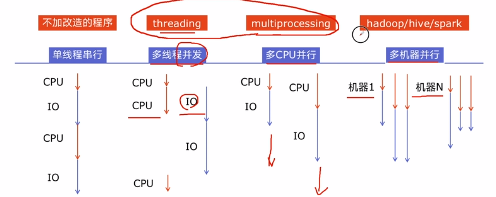
python对并发编程的支持？     
- 多线程：threading，利用CPU和IO可以同时执行的原理，CPU不会干巴巴等待IO完成        
- 多进程：multiprocessing，利用多核CPU的能力，真正的并行执行任务      
- 异步IO：asyncio，在单线程利用CPU和IO同时执行的原理，实现函数异步执行     
**python的相关函数：**    
- 使用Lock对资源加锁，防止冲突访问      
- 使用Queue实现不同线程/进程之间的数据通信，实现生产者-消费者模式         
- 使用线程池Pool/进程池Pool，简化线程/进程的任务提交、等待结束、获取结果     
- 使用subprocess启动外部程序的进程，并进行输入输出交互  
  
# 二、 怎样选择多线程多进程多协程
## 1. 什么是CPU密集型计算、IO密集型计算？
- CPU-bound计算密集型    
  I/O短时间能完成，CPU需要大量计算处理，CPU占用率高。            
  例如：压缩解压缩、加密解密，大规模数学计算、视频编码解码、机器学习训练、大数据统计计算        
   
- I/O bound
  系统运作的大部分状况是CPU在等I/O（硬盘/内存）的读/写操作，CPU占用率较低。    
  例如：文件处理、网络爬虫、读写数据库、调用第三方 API、聊天消息收发、日志读写  
    


## 2. 多线程、多进程、多协程的对比？
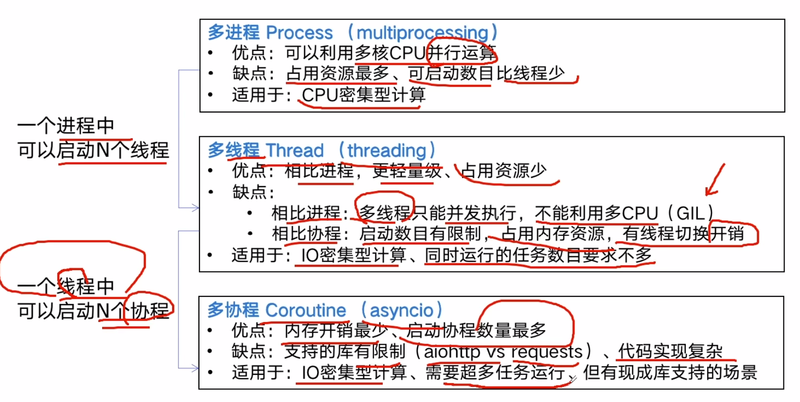

## 3. 如何根据任务选对应技术？
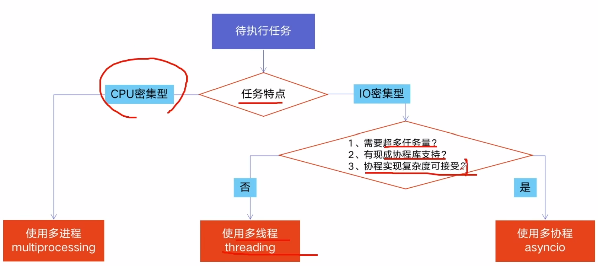

# 三、 全局解释器锁GIL
## 1. python速度慢的两大原因
与C/C++/JAV相比，python很慢，很多公司的基础架构代码依然用C/C++。    
- 动态类型语言，边解释边执行
- GIL使得python无法利用多核CPU并发执行
## 2. GIL是什么
全局解释器锁，Global Interpreter Lock，是计算机程序设计语言解释器用于同步线程的一种机制，使得任何一个时刻**仅**有一个线程在执行。即便在多核处理器上，使用GIL的解释器也只允许同一时间执行一个线程。    
## 3. 为什么有GIL
当时为了解决多线程之间数据完整性和状态同步问题而设计的。pyhon中的对象管理，是使用**引用计数器**进行的，引用数为0则释放对象。
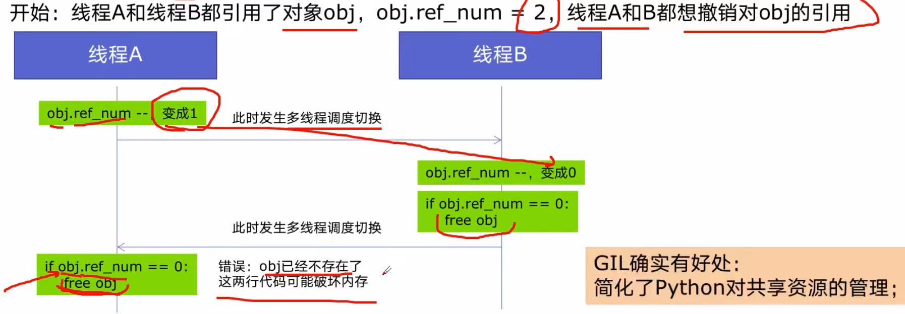
## 4. 如何规避GIL的限制
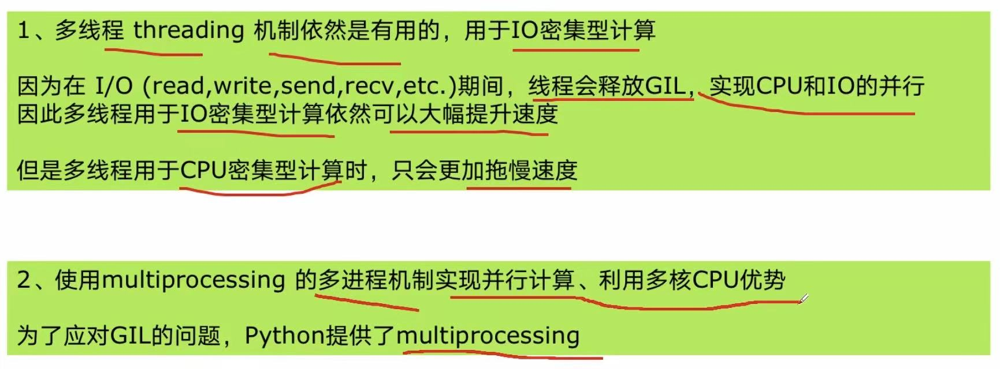

# 四、 多线程爬虫
## 1. python创建多线程
- ``blog_spider.py``
  （有问题，url是重复的，先不管）
```python
import requests
urls = [
    f"https://www.cnblogs.com/#p{page}"
    for page in range(1, 50+1)
]
def craw(url):
    r = requests.get(url)
    print(url, len(r.text))
craw(urls[0])
```

- ``01.multi_thread_craw.py``
```python
import blog_spider
import threading
import time
## 单线程
def single_thread():
    print("single_thread begin")
    for url in blog_spider.urls:
        blog_spider.craw(url)
        print("single_thread end")
## 多线程
def multi_thread():
    print("multi_thread begin")
    threads = []
    for url in blog_spider.urls:
        threads.append(
            threading.Thread(target = blog_spider.craw, args = (url, ))
        )
    for thread in threads:
        thread.start()
    for thread in threads:
        thread.join()

    print("multi_thread begin")
if __name__ == "__main__":
    start = time.time()
    single_thread()
    end = time.time()
    print("single thread cost:", end - start, "seconds")

    start = time.time()
    multi_thread()
    end = time.time()
    print("multi thread cost:", end - start, "seconds")
```
```python
# 准备一个函数
def my_func(a, b):
  do_craw(a, b)
# 创建一个线程
import threading
t = threading.Thread(target = my_func, args = (100, 200))
# 启动
t.start()
# 等待结束
t.join()
```
# 五、生产者消费者爬虫
## 1. 多组件的Pipeline的技术架构
复杂的事情不会一下子做完，而是会分很多中间步骤一步步完成。
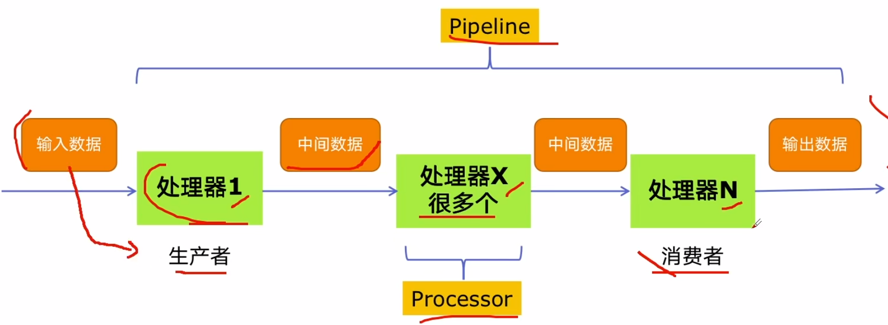


## 2. 生产者消费者爬虫的架构
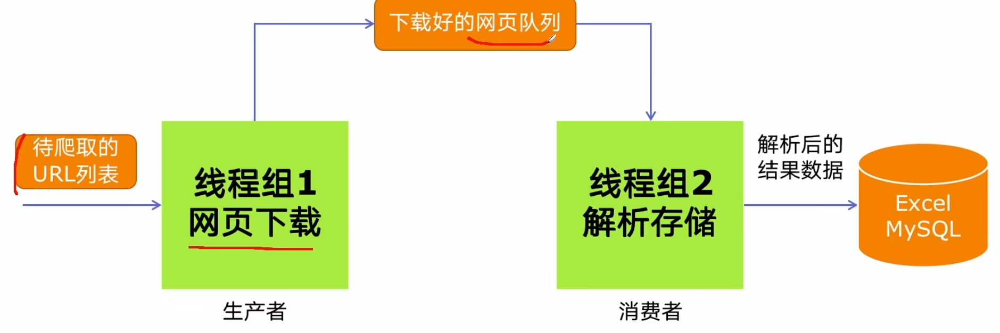


## 3. 多线程数据通信的queue.Queue
用于多线程之间、线程安全的数据通信，比如多线程并发同时访问数据不会冲突。
```python
# 导入类库
import queue
# 创建Queue对象
q = queue.Queue()
# 添加元素
q.put(item)
# 获取元素
item = q.get()
## 查询状态
# 查看元素多少
q.qsize()
# 判断是否为空
q.empty()
# 判断是否已满
q.full()
```
## 4. 代码编写实现
- ``03.lock_concurrent.py``

```python
import queue
import blog_spider
import time
import random
import threading

def do_craw(url_queue: queue.Queue, html_queue: queue.Queue):
    """
    爬虫线程执行的函数：
    1. 从 url_queue 中取出一个 url
    2. 调用 blog_spider.craw(url) 抓取网页源码
    3. 把抓到的 html 放入 html_queue
    4. 打印当前线程信息和队列状态
    """
    while True:
        # 从 url 队列中取出一个待爬取的网址
        # get() 默认是阻塞的，如果队列为空，线程会在这里等待
        url = url_queue.get()

        # 调用封装好的 craw 方法，获取该 url 对应的网页 HTML
        html = blog_spider.craw(url)

        # 将抓取到的网页源码放入 html_queue
        # 供后面的解析线程继续处理
        html_queue.put(html)

        # 打印当前线程名、正在爬取的 url，以及 url_queue 当前剩余数量
        print(
            threading.current_thread().name,
            f"craw {url}",
            "url_queue.size = ",
            url_queue.qsize()
        )

        # 让线程随机休眠 1~2 秒
        # 模拟人为访问节奏，避免请求过快
        time.sleep(random.randint(1, 2))


def do_parse(html_queue: queue.Queue, fout):
    """
    解析线程执行的函数：
    1. 从 html_queue 中取出网页源码
    2. 调用 blog_spider.parse(html) 解析网页内容
    3. 把解析结果写入文件
    4. 打印当前线程信息和解析结果数量
    """
    while True:
        # 从 html 队列中取出一个网页源码
        # 如果队列为空，同样会阻塞等待
        html = html_queue.get()

        # 调用封装好的 parse 方法，提取网页中的目标数据
        # results 一般是一个列表，例如 [(链接1, 标题1), (链接2, 标题2), ...]
        results = blog_spider.parse(html)

        # 遍历解析结果，并逐行写入输出文件
        for result in results:
            fout.write(str(result) + '\n')

        # 打印当前线程名、解析得到的结果数量，以及 html_queue 当前剩余数量
        print(
            threading.current_thread().name,
            f"result.size = {len(results)}",
            "html_queue.size = ",
            html_queue.qsize()
        )

        # 随机休眠 1~2 秒
        time.sleep(random.randint(1, 2))

if __name__ == "__main__":
    # 创建两个队列：
    # url_queue：存放待爬取的网页 url
    # html_queue：存放已经爬取到的网页源码 html
    url_queue = queue.Queue()
    html_queue = queue.Queue()

    # 把所有待爬取的 url 放入 url_queue
    # blog_spider.urls 一般是提前准备好的 url 列表
    for url in blog_spider.urls:
        url_queue.put(url)

    # 创建 3 个爬取线程
    # target=do_craw 表示线程执行 do_craw 函数
    # args=(url_queue, html_queue) 表示给 do_craw 传入这两个参数
    # name=f"craw{idx}" 是给线程起名字，方便调试时区分
    for idx in range(3):
        t = threading.Thread(
            target=do_craw,
            args=(url_queue, html_queue),
            name=f"craw{idx}"
        )
        t.start()   # 启动线程

    # 以写入模式打开文件，用来保存解析后的结果
    fout = open("02.data.txt", "w", encoding="utf-8")

    # 创建 3 个解析线程
    # target=do_parse 表示线程执行 do_parse 函数
    # args=(html_queue, fout) 表示给 do_parse 传入 html 队列和输出文件对象
    for idx in range(3):
        t = threading.Thread(
            target=do_parse,
            args=(html_queue, fout),
            name=f"parse{idx}"
        )
        t.start()   # 启动线程
```

# 六、 线程安全问题
## 1. 线程安全概念         
指某个函数、函数库在多线程环境中被调用时，能够正确地处理多个线程之间的共享变量，使程序能正确完成。             
由于线程的执行会随时发生切换，就造成了不可预料的结果，出现线程不安全。    
## 2. Lock用于解决线程安全
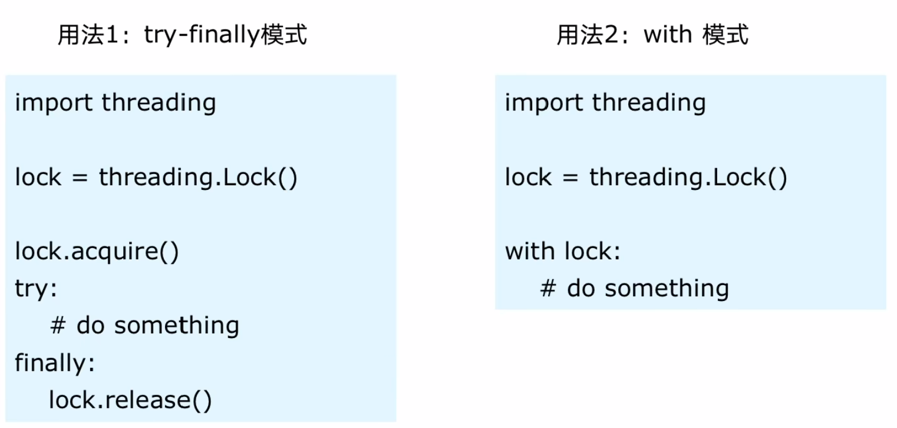

## 3. 代码演示问题及解决方案
- 演示问题          
```python
import threading
import time

class Account:
    def __init__(self, balance):
        self.balance = balance
    
def draw(account, amount):
    # 如果余额大于取钱数目
    if account.balance >= amount:
        time.sleep(0.1)  #加这一句会把问题显现出来，因为sleep会造成当前线程的阻塞，进而切换线程
        print(threading.current_thread().name, 
              "取钱成功")
        account.balance -= amount
        print(threading.current_thread().name,
              "余额", account.balance )
    else:
        print(threading.current_thread().name, 
              "取钱失败，余额不足")
        
if __name__ == "__main__":
    account = Account(1000)
    ta = threading.Thread(name="ta", target=draw, args=(account, 800))
    tb = threading.Thread(name="tb", target=draw, args=(account, 800))

    ta.start()
    tb.start()

###输出：
# tb 取钱成功
# ta 取钱成功
# tb 余额 200
# ta 余额 -600
```
- 用lock解决问题        
  先创建一把公共锁，再让多个线程在访问共享数据时都使用它
```python
### 实例化一个锁
lock = threading.Lock()

class Account:
    def __init__(self, balance):
        self.balance = balance
    
def draw(account, amount):
    ### 给这段代码加互斥锁，保证同一时刻只有一个线程能进入这段取钱逻辑
    with lock:
        # 如果余额大于取钱数目
        if account.balance >= amount:
            '''''''
```
# 七、线程池
## 1. 线程池的原理
新建线程系统需要分配资源、终止线程系统需要回收资源。    
如果可以重用线程，则可以减去新建/终止的开销。       
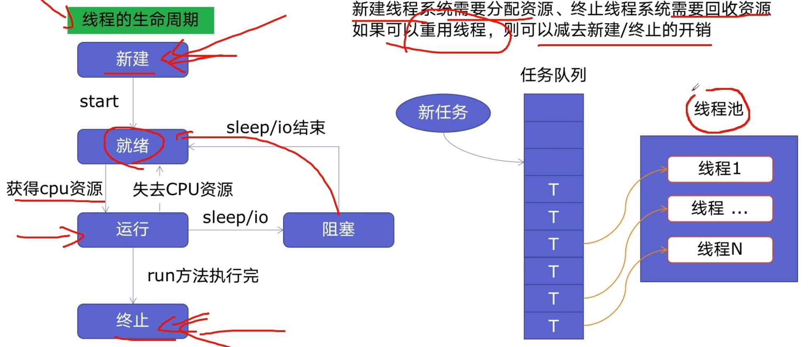


## 2. 使用线程池的好处
- 提升性能：因为不需要大量新建、终止线程
- 适用场景：突发性大量请求或需要大量线程完成任务，但实际任务处理时间较短
- 防御功能：避免系统因创建线程过多而导致系统负荷过大响应变慢的问题
- 代码优势：线程池的语法比自己新建再执行更加简洁

## 3. ThreadPoolExecutor的使用语法
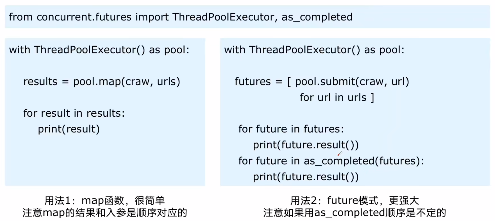

## 4. 使用线程池改造爬虫程序
如何用线程池把多个网页的“抓取”和“解析”两个阶段并发执行，从而提高处理效率。  
```python
import concurrent.futures
import blog_spider

# craw
# 创建一个线程池并命名pool，with表示这段代码执行完后，线程池会自动关闭和回收资源
with concurrent.futures.ThreadPoolExecutor() as pool:
    # 把urls交给函数craw
    htmls = pool.map(blog_spider.craw, blog_spider.urls)
    # zip把一一对应的url和html捆绑打包为元组，再用list变成列表[(url1, html1), (url2, html2)..]
    htmls = list(zip(blog_spider.urls, htmls))
    for url, html in htmls:
        print(url, len(html))

print("craw over")

# parse
with concurrent.futures.ThreadPoolExecutor() as pool:
    futures = {}
    for url, html in htmls:
        # 任务提交给线程池后，任务不一定立刻完成，线程池先返回一个 future 对象
        # submit一次提交一个对象
        future = pool.submit(blog_spider.parse, html)
        futures[future] = url
    
    # 按任务提交顺序取结果
    #for future, url in futures.items():
        # 取出这个任务最终执行完成后的返回值，如果任务还没执行完，程序会在这里等待，直到任务完成
    #    print(url, future.result())

    # 按完成顺序处理
    for future in concurrent.futures.as_completed(futures):
        url = futures[future]
        print(url, future.result())
```
# 八、 web服务中使用线程池加速
## 1. web服务的架构以及特点
什么是web服务？   
**通过网络接收请求、处理请求、再返回结果的程序。** 

比如你在浏览器里访问一个网址，打开淘宝首页、搜索天气、登录学校系统，背后都有一个程序在接收你的请求，然后把结果返回给你，这个程序提供的能力，就可以叫 web 服务。

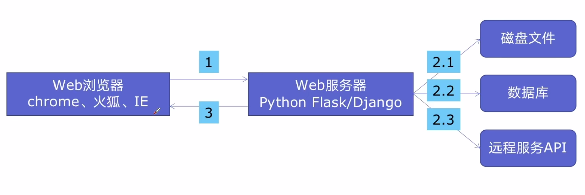

web服务的特点：   
- 对响应时间要求高，比如要求200ms返回
- 有大量的依赖IO操作的调用，比如读取磁盘文件、数据库、远程API
- 经常需要处理几万人、几百万人的同时请求


## 2. 使用线程池加速
好处：    
- 方便将磁盘文件、数据库、远程API的IO调用并发执行
- 线程池的线程数目不会无限创建（导致系统挂掉），具有防御功能

## 3. 代码用Flask实现Web服务并加速
一个 Web 请求里，多个耗时操作会顺序阻塞。        
**Flask服务**就是一个用 Flask 框架搭建的、通过网址或接口对外提供功能的 Python Web 服务，即实现web服务的工具。    
```python
import flask
import json
import time

app = flask.Flask(__name__)

def read_file():
    time.sleep(0.1)
    return "file result"

def read_db():
    time.sleep(0.2)
    return "db result"
    
def read_api():
    time.sleep(0.3)
    return "api result"
    
@app.route("/")
def index():
    result_file = read_file()
    result_db = read_db()
    result_api = read_api()
    # 这里把一个 Python 字典转成 JSON 字符串并返回
    return json.dumps({
        "result_file": result_file,
        "result_db": result_db,
        "result_api": result_api
    })

if __name__ == "__main__":
    app.run()
    # 浏览器打开网页，进入开发者工具F5刷新即可查看所用时间
```
加速之后，之间减半了，0.1、0.2和0.3并发运行至少需要0.3秒    
```python
import flask
import json
import time
from concurrent.futures import ThreadPoolExecutor

app = flask.Flask(__name__)
# 初始化一个全局的线程池
pool = ThreadPoolExecutor()

def read_file():
    time.sleep(0.1)
    return "file result"

def read_db():
    time.sleep(0.2)
    return "db result"
    
def read_api():
    time.sleep(0.3)
    return "api result"
    
@app.route("/")
def index():
    result_file = pool.submit(read_file)
    result_db = pool.submit(read_db)
    result_api = pool.submit(read_api)
    # 这里把一个 Python 字典转成 JSON 字符串并返回
    return json.dumps({
        "result_file": result_file.result(),  
        "result_db": result_db.result(),  
        "result_api": result_api.result()   
    })

if __name__ == "__main__":
    app.run()
    # 浏览器打开网页，进入开发者工具F5刷新即可查看所用时间
```
# 九、 多进程multiprocessing加速程序
## 1. 有了多线程threading，为什么还要用多进程multiprocessing？
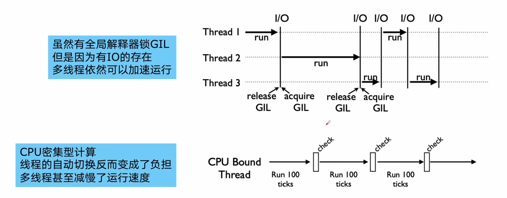


## 2. 多进程multiprocessing知识梳理
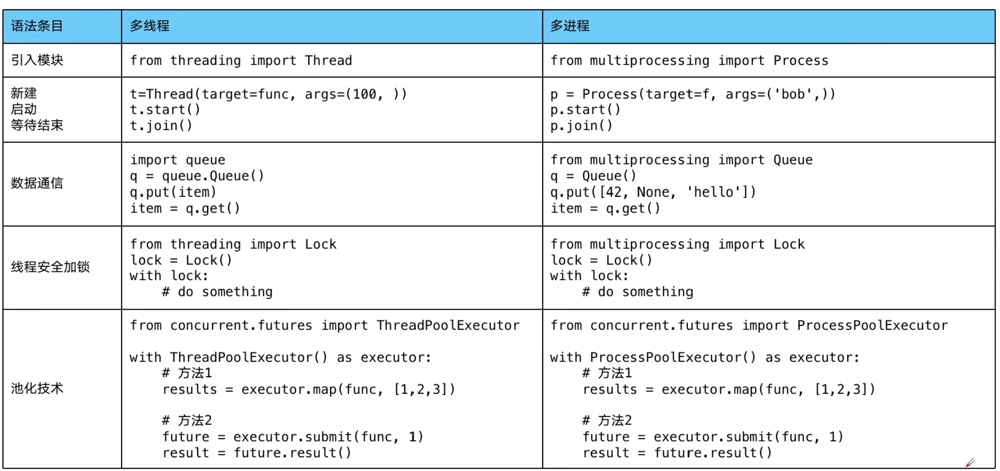

## 3. 代码：cpu密集型的单线程、多线程、多进程对比
代码对比：   
```python
import math
from concurrent.futures import ThreadPoolExecutor, ProcessPoolExecutor
import time

def timer(func):
    def wrapper(*args, **kwargs):
        start = time.time()
        result = func(*args, **kwargs)
        end = time.time()
        print(f"{func.__name__}, cost {end - start} seconds")
        return result
    return wrapper

PRIMES = [112272535095293] * 50

# 判断一个数是否是素数
def is_prime(n):
    if n < 2:
        return False
    if n ==2:
        return True
    if n % 2 == 0:
        return False
    # 求n的平方根并向下取整
    sqrt_n = int(math.floor(math.sqrt(n)))
    # 非质数一定能写成两数乘积，且一个比平方根大一个比平方根小
    # step为2，因为前面已经检查过偶数了
    for i in range(3, sqrt_n + 1, 2):
        if n % i == 0:
            return False
    return True

## 单线程
@timer
def single_thread():
    for number in PRIMES:
        is_prime(number)

## 多线程
@timer
def multi_thread():
    with ThreadPoolExecutor() as pool:
        pool.map(is_prime, PRIMES)

## 多进程
@timer
def multi_process():
    with ProcessPoolExecutor() as pool:
        pool.map(is_prime, PRIMES)


if __name__ == "__main__":
    single_thread()
    multi_thread()
    multi_process()

'''
if __name__ == "__main__":
    start = time.time()
    single_thread()
    end = time.time()
    print("single_thread, cost", end - start, "seconds")

    start = time.time()
    multi_thread()
    end = time.time()
    print("multi_thread, cost", end - start, "seconds")

    start = time.time()
    multi_process()
    end = time.time()
    print("multi_process, cost", end - start, "seconds")
'''
```
结果：
```python
single_thread, cost 86.24097347259521 seconds
multi_thread, cost 88.88515448570251 seconds
multi_process, cost 35.398542642593384 seconds
```

# 十、 在Flask服务中使用进程池加速
多进程环境之间完全隔离，定义pool时，它所依赖的函数必须都已经声明完了，所以``process_pool = ProcessPoolExecutor()``必须放在函数后.....还不行......需要将其定义到main函数里.....最后还是网页报错！【【暂时pass】】
```python
import flask
from concurrent.futures import ProcessPoolExecutor
import math
import json


app = flask.Flask(__name__)

PRIMES = [112272535095293] * 50

# 模拟cpu密集型计算
def is_prime(n):
    if n < 2:
        return False
    if n ==2:
        return True
    if n % 2 == 0:
        return False
    # 求n的平方根并向下取整
    sqrt_n = int(math.floor(math.sqrt(n)))
    # 非质数一定能写成两数乘积，且一个比平方根大一个比平方根小
    # step为2，因为前面已经检查过偶数了
    for i in range(3, sqrt_n + 1, 2):
        if n % i == 0:
            return False
    return True

@app.route("/is_prime/<numbers>")
def api_is_prime(numbers):
    number_list = [int(x) for x in numbers.split(",")]
    results = process_pool.map(is_prime, number_list)
    return json.dumps(dict(zip(number_list, results)))

if __name__ == "__main__":
    process_pool = ProcessPoolExecutor()
    app.run()
```