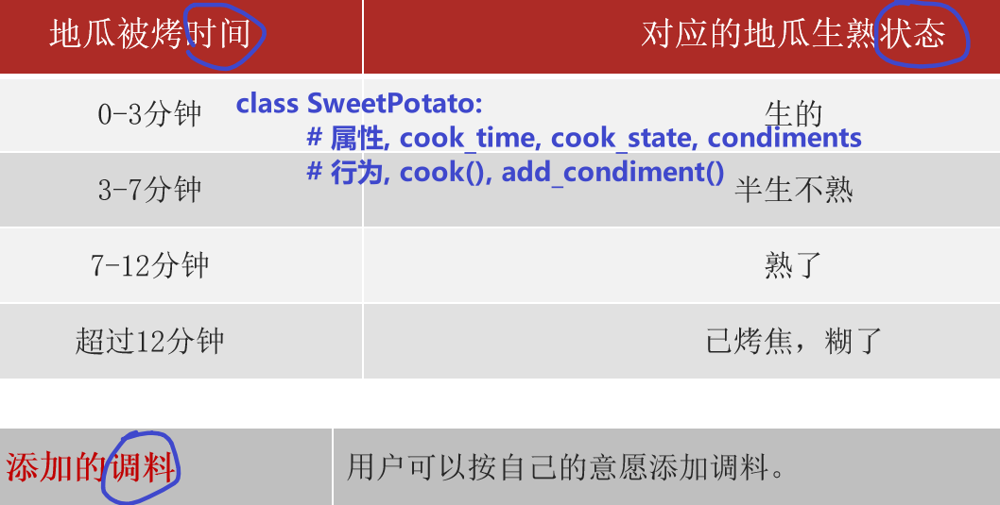
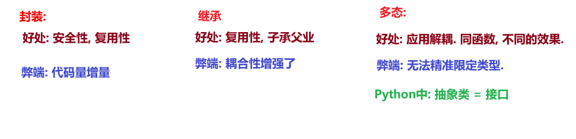
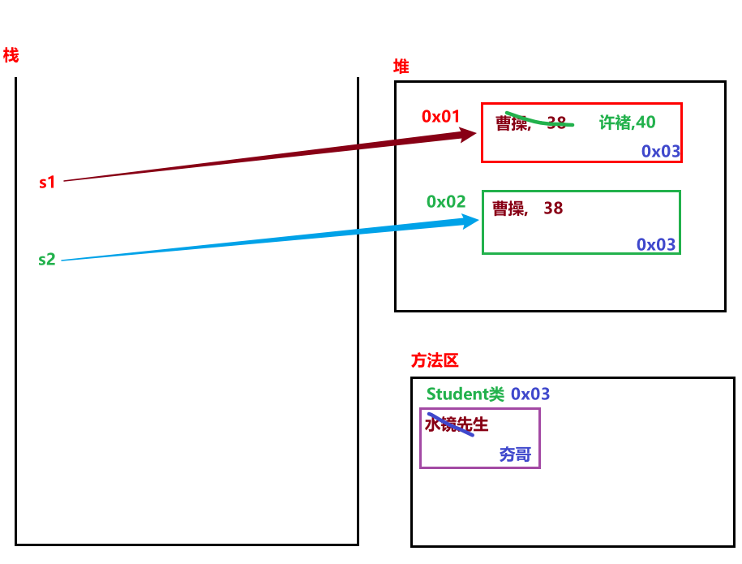

# tips
 **参考思路:** 概述, 思想特点, 举例, 总结             
> e.g:面向对象是一种编程思想，强调的是以对象为基础完成各种操作，它是基于面向过程的。说到面向对象，不得不提的就是它的三大思想特点：             
> - 更符合人们的思考习惯    
> - 把复杂的事情简单化        
> - 把程序员从执行者变成指挥者        
>             
> 举例：越符合生活的场景越好          
> 总结：万物皆对象   
>
1. 面向过程和面向对象的区别？             
   

 


# 一、 面向对象基础
## 1.1 面向对象
### 1.1.1 面向对象和面向过程
**编程思想**： 人们利用计算机来解决问题的思维。
- 面向过程：            
    以 **步骤(过程)** 为基础完成各种操作。

- 面向对象:     
    以 **对象** 为基础完成各种操作, 它是基于**面向过程**的。     
    - 优点：    
        1. 与实际的世界更加接近，所有的对象被赋予属性和方法，编程更富有人性化     
        2. 宗旨在于模拟现实世界     
        3. 现实生活中，所有事物全被视为对象     
    - 特点:
      	1. 更符合人们的思考习惯.
      	2.  把复杂的事情简单化.
      	3. 把人们(程序员)从执行者变成指挥者.
    
- 面向过程侧重过程，而面向对象是对面向过程的再次封装处理，通过对象来模拟现实世界。  
总结: **万物皆对象**.

### 1.1.2 面向对象特征介绍

- 三大特征： 封装，继承， 多态

* 封装    
    > 隐藏对象的*属性*和*实现细节*，仅对外提供公共的访问方式。      
    控制在程序中属性的读和修改的访问级别， 将抽象得到的数据和行为(功能)相结合，形成一个**有机的整体**，即将数据和操作数据的源代码结合形成“类”，其中数据和函数都是类的成员。
  * 好处：
    > 提高代码的安全性，以特定的访问权限控制使用类的成员。     (私有化)    
    > 提高代码的复用性。      (函数)
  * 举例：
    > 手机电脑等都可以封装为一个类

* 继承
    > 子类继承父类的属性和方法，使得子类对象（实例）具有父类的特征和行为。     
    满足 **“is-a关系”**    
  * 好处
    > 提高代码的复用性。
  - 弊端
    > 耦合性增强

* 多态
    > 不同类的对象对同一消息做出反，即同一消息可根据发送对象的不同而采用多种不同的行为方式。 
    * 好处
        > 解耦合，可拓展. 

## 1.2 面向对象的基本概念和行为
### 1.2.1 类和对象
- **类**：对现实事物的抽象描述，**抽象的模版**，员工——姓名、性别——能走、说话、领工资  
```text
# 定义类
class 类名: # 命名遵循大驼峰
    # 定义类方法
    方法列表...
```     
- **对象**：现实事物的具体体现，**具体的实例**，张三——张三、男——爱走路来上班、跟女同事聊得来、每月10日上交工资  

- 属性：名词，描述事物的外在特征，例如姓名、性别、年龄
- 行为：动词，描述事物能够做什么，例如吃、喝、学习


```text
如何访问类中的成员？
    step1: 创建该类的对象
        对象名 = 类名()
    step2: 通过 对象名. 的方式调用
        对象名.属性名
        对象名.行为名()
```

### 1.2.2 入门案例_汽车类

```python
"""
案例: 演示定义汽车类 及 使用类中的成员.
需求: 定义汽车类, 有跑的行为.
"""
# 1.定义汽车类
class Car:   # 类名遵循大驼峰命名法
    # 属性

    # 行为
    def run(self):
        print("汽车会跑")

# 2.创建汽车类的对象
c1 = Car()

# 3.调用Car类的run()函数  调用Car#run()
c1.run()
```

### 1.2.3 self关键字
**self** 是python内置的关键字，用于指向**对象实例本身**。     
**谁调用函数, self就代表哪个对象。**    
- 作用:    
    1个类可以有多个对象，都可以通过 ``对象名.`` 的方式访问类中的行为(函数)。          
    函数默认有``self属性``，函数通过self来区分到底是**哪个对象**调用了类的方法。       
- 区分：        
    1.在 **类外** 访问类中的行为, 需要通过 ``对象名.`` 的方式访问.   
    2.在 **类内** 访问类中的行为，需要通过 ``self.`` 的方式访问。    

### 1.2.4 类外访问函数-案例
```python
'''
案例：self关键字介绍
需求：定义汽车类，创建多个该类的函数，看打印结果
'''
# 1. 定义汽车类.
class Car:
      # 属性
  
      # 行为, 跑
      def run(self):
          print('汽车会跑!...')
          print(f'我是run函数, self的值是: {self}')

# 2.创建汽车类的对象.
c1 = Car()
print(f'c1对象:{c1}')   # 和{self}一致    
# 输出：<__main__.Car object at 0x000002025FFDF1F0> 
# __main__.Car → 类名   0x000002025FFDF1F0 → 对象在内存中的地址（十六进制）
print(f'c1对象: {id(c1)}')
# 输出：2209223668208
# 对象在内存中的地址对应的整数（十进制），每次运行可能都不同
# 调用Car#run()
c1.run()
print('-' * 34)

# 3.继续创建汽车类的对象.
c2 = Car()
print(f'c2对象: {c2}')
# 输出：<__main__.Car object at 0x000002025FFDF250>
# 调用Car#run()
c2.run()
``` 

### 1.2.5 类内访问函数-案例
```python
"""
案例: 演示通过 self关键字实现 在类内访问其它函数.
需求: 定义汽车类, 类内有run()函数, 并在work()中调用run()函数, 创建该类对象, 调用上述的函数.
"""

# 1. 定义汽车类.
class Car:
    # 属性(名词)

    # 行为(动词)
    # 1.1 run()函数
    def run(self):
        print(f'{self} 汽车在跑...')

    # 1.2 work()函数, 在其内部调用run()
    def work(self):
        print(f'我是work函数, 我的self值: {self}')
        self.run()      # self = 本类当前对象的引用.

# 2.在类外访问Car类的行为(函数)
c1 = Car()
print(f'c1对象: {c1}')
c1.run()        # c1在跑
print('-' * 34)
c1.work()       # c1在work, c1在跑
print('=' * 34) # 分割线

# 3.再次创建对象.
c2 = Car()
print(f'c2对象: {c2}')
c2.run()
print('-' * 34)
c2.work()

# c1对象: <__main__.Car object at 0x00000163CC0DF190>
# <__main__.Car object at 0x00000163CC0DF190> 汽车在跑...
# ----------------------------------
# 我是work函数, 我的self值: <__main__.Car object at 0x00000163CC0DF190>
# <__main__.Car object at 0x00000163CC0DF190> 汽车在跑...
# ==================================
# c2对象: <__main__.Car object at 0x00000163CC0DF1F0>
# <__main__.Car object at 0x00000163CC0DF1F0> 汽车在跑...
# ----------------------------------
# 我是work函数, 我的self值: <__main__.Car object at 0x00000163CC0DF1F0>
# <__main__.Car object at 0x00000163CC0DF1F0> 汽车在跑...
```

### 1.2.6 入门案例_手机类
练习： 01_4_example_手机类.py

## 1.3 添加和获取对象属性
### 1.3.1 属性的概念
属性表示的是**固有特征**，在python中使用变量表示，例如人的姓名、年龄、身高、体重等 **（名词）** ，都是对象的属性。          
- 类外            
  - 添加： ``对象名.属性 = 属性值`` （该属性独属于这个对象, 即:该类的其它对象没有这个属性）
  - 获取： ``对象名.属性``
- 类内
  - 添加：魔法方法__init__
  - 获取：``self.属性``，定义``函数show()``


### 1.3.2 类外-添加和获取属性 - 案例
```python
"""
案例: 演示在类外 如何获取 和 设置 对象的属性.
需求: 创建汽车类, 设置为红色, 4个轮胎, 有跑的功能.
"""
# 1.创建汽车类.
class Car:
    # 属性(名词), 事物具有哪些特征 -> 变量.

    # 行为(动词), 事物能够做什么 -> 函数.
    def run(self):
        print('汽车会跑...')

# 2.创建该类的对象 -> 这个是 类外 的位置.
c1 = Car()
c1.run()        # 汽车会跑...

# 细节1: 给c1对象设置属性.
c1.color = '红色'
c1.number = 4
# 细节2: 打印c1对象的属性值.
print(f'颜色: {c1.color}, 轮胎数: {c1.number}')
print('-' * 34)

# 3.继续创建该类的对象.
c2 = Car()
c2.run()
# 细节3: 尝试调用c2对象的 color和number属性
# print(f'颜色: {c2.color}, 轮胎数: {c2.number}')
```

### 1.3.3 类内-获取属性 - 案例

```python
"""
案例: 演示类内如何获取对象的属性.
"""
# 1. 定义汽车类, 创建该类对象, 赋予颜色 和 轮胎数两个属性, 并在类内访问该属性.
class Car:
    # 属性

    # 行为
    # 1.1 跑
    def run(self):
        print('汽车会跑')

    # 1.2 定义函数show(), 实现 在类内访问 汽车对象的属性.
    def show(self):
        print(f'我是show函数, 对象的颜色: {self.color}, 轮胎数: {self.number}')

# 2.创建汽车类的对象
c1 = Car()

# 3. 给其(c1)赋予 属性 -> 类外设置属性.
c1.color = '红色'
c1.number = 4

# 4. 类外访问属性.
print(f"颜色: {c1.color}, 轮胎数: {c1.number}")

# 5. 类外访问行为(类中的函数)
c1.run()
c1.show()
print('-' * 34)

# 6. 继续创建汽车类对象, 尝试分别调用run(), show()函数.
c2 = Car()
c2.run()
# c2.show()       # 报错.
```

## 1.4 魔法方法
属于python内置的函数，总被双下划线所包围，特定场景下自动调用，不需要手动调用。   
- ``__init__``属性的初始化     
- ``__str__``打印对象        
- ``__del__``删除对象时给出提示

### 1.4.1 ``__init__()``方法
在python中，每当新创建一个对象时，就会自动触发``__init()__``方法，分为“无参”和“有参”两种情况。      
在``__init__()``魔法方法中，**初始化属性**, 则: 该类所有的对象，一创建，就有这些属性了。       


* 案例1：无参数
  ```python
  """
  案例: 演示 init魔法方法的 用法.
  魔法方法:
      概述/特点:
          Python内置的函数, 在满足特定的场景下, 会被 自动调用.
      常用的魔法方法:
          __init__()
          __str__()
          __del__()
  """  
  # 需求: 定义汽车类, 默认属性为: color='黑色', number=3
  # 1. 定义汽车类.
  class Car:
      # 1.1 在魔法方法 init()中, 初始化: 属性.
      def __init__(self):
          print('我是 无参 init 魔法方法')
  
          # 1.2 在init魔法方法中, 初始化属性, 则: 该类所有的对象, 一创建, 就有这些属性了.
          self.color = '黑色'
          self.number = 3
  
      # 1.3 定义show()函数, 打印该类对象的 各个属性值.
      def show(self):
          print(f'颜色: {self.color}, 轮胎数: {self.number}')
    
  # 2.创建汽车类对象.
  c1 = Car()      # 会自动调用 __init__()函数.
  #### 修改c1的属性值
  c1.color = '红色'
  c1.number = 6
  # 打印c1对象的属性值.
  print(c1.color, c1.number)
  c1.show()
  print('-' * 34)
  c2 = Car()
  c2.show()
  ```

* 案例2：有参数
  ```python
  """
  案例: 演示魔法方法之 init 有参版, 实际开发常用.
  
  大白话举例:
      无参版 init ->  默认上的有底色, 你需要重新涂色(覆盖底色)
      有参版 init ->  默认没有涂色的石膏娃娃, 我们根据喜好自由涂色即可.
  """
  # 需求: 创建汽车类, 不给默认值, 由汽车对象 外部各自赋值即可.
  # 1. 定义汽车类.
  class Car:
      # 2.有参的 __init__()函数, 参数值由: 外部对象自行赋值.
      def __init__(self, color, number):
          """
          该魔法方法用于给 汽车类 对象的属性 赋值.
          :param color:  车的颜色
          :param number: 车的轮胎数
          """
          self.color = color
          self.number = number
  
      # 定义show()函数, 打印该类对象的 各个属性值.
      def show(self):
          print(f'颜色: {self.color}, 轮胎数: {self.number}')
  
  # 3. 创建汽车类对象.
  # c1 = Car()  # 报错, 因为默认调用了init()函数, 但是该函数有参数, 则必须传参.
  c1 = Car('红色', 6)
  c1.show()
  print('-' * 23)
  
  c2 = Car('绿色', 4)
  c2.show()
  ```

### 1.4.2 ``__str__()``方法    
  
当用``print()``函数打印对象时，会自动调用该对象(所在类)的 ``str魔法方法``；        
该魔法方法默认打印的是对象的**内存地址值**，无意义，一般都会重写，改为打印对象的各个属性值。   

```python   
def __str__(self):
    # ...
    return 字符串结果
```

```python
"""
案例: 演示 str魔法方法的 用法.
魔法方法:
    概述/特点:
        Python内置的函数, 在满足特定的场景下, 会被 自动调用.
    常用的魔法方法:
        __init__()      在(每次)创建对象的时候, 会自动触发该类的 __init__()函数.
        __str__()       当用print()函数 打印对象的时候, 会自动调用该对象(所在类)的 str魔法方法.
                        该魔法方法默认打印的是对象的地址值, 无意义, 一般都会重写, 改为打印 对象的各个属性值.
        __del__()
"""
# 1. 定义汽车类.
class Car:
    # 2.有参的 __init__()函数, 参数值由: 外部对象自行赋值.
    def __init__(self, color, number):
        """
        该魔法方法用于给 汽车类 对象的属性 赋值.
        :param color:  车的颜色
        :param number: 车的轮胎数
        """
        self.color = color
        self.number = number


    # 魔法方法str(), 默认打印地址值, 无意义, 一般会重写, 改为打印对象的各个属性值.
    def __str__(self):
        return f'颜色: {self.color}, 轮胎数: {self.number}'
        # return f'{self.color}, {self.number}'

# 3.创建该类的对象.
c1 = Car('绿色', 4)
print(c1)       # 输出语句打印对象, 默认调用了该对象 所在类的 str魔法方法.
print('-' * 23)

c2 = Car('红色', 6)
print(c2)
```

### 1.4.3 ``__del__()``方法
当.**py文件执行结束**, 或者 **手动 del 释放对象资源**, 会自动调用该函数``del 对象``  ，python解释器会默认调用``__del__()``方法。      


```python
"""
案例: 演示 del魔法方法的 用法.
魔法方法:
    概述/特点:
        Python内置的函数, 在满足特定的场景下, 会被 自动调用.
    常用的魔法方法:
        __init__()      在(每次)创建对象的时候, 会自动触发该类的 __init__()函数.
        __str__()       当用print()函数 打印对象的时候, 会自动调用该对象(所在类)的 str魔法方法.
                        该魔法方法默认打印的是对象的地址值, 无意义, 一般都会重写, 改为打印 对象的各个属性值.
        __del__()       当.py文件执行结束, 或者 手动 del 释放对象资源, 会自动调用该函数.
"""

# 1. 定义汽车类, 属性: 品牌.   行为:run()   通过del魔法方法删除该类的对象, 看看效果.
class Car:
    # 2. 在魔法方法init中, 完成: 属性的初始化.（有参）
    def __init__(self, brand):
        self.brand = brand

    # 3.重写 str魔法方法, 打印对象的属性值.
    def __str__(self):
        return f'品牌: {self.brand}'

    # 4. 重写 del魔法方法, 删除对象时给出提示.
    def __del__(self):
        print(f'{self} 对象被删除了!')


# 5. 创建汽车类对象.
c1 = Car('小米 Su7 Ultra')
print(c1)       # 输出： 品牌：小米 Su7 Ultra

# 6. 手动访问 brand 属性.
print(c1.brand)     #输出：小米 Su7 Ultra
print('-' * 23)

# 7.手动删除c1对象, 然后尝试 打印该对象 或者 访问对象的属性.
# del c1 
'''  
若重写str和del，会打印：品牌：小米 Su7 Ultra 对象被删除了
'''
# print(c1)       # 报错.

print('程序结束!')

''' 
手动删，会先打印“对象删除；否则，先打印：程序结束。
'''
```

### 1.4.4 减肥案例

```python
"""
案例: 减肥案例.

需求:
    例如，小明同学当前体重是100kg。每当他跑步一次时，则会减少0.5kg；每当他大吃大喝一次时，则会增加2kg。请试着采用面向对象方式完成案例。

分析:
    类名:         Student
    对象名:        xm
    属性(名词):   当前体重, current_weight
    行为(动词)    跑步, 吃饭
"""
# 1.定义学生类.
class Student:
    # 2.在魔法方法init中, 完成: 对象的属性的初始化.
    def __init__(self):
        # 默认为100，无参版__init__
        self.current_weight = 100

    # 3.每当他跑步一次时，则会减少0.5kg
    def run(self):
        print('疯狂跑步...')
        self.current_weight -= 0.5      # 体重减小.

    # 4.大吃大喝.
    def eat(self):
        print('大吃大喝一顿...')
        self.current_weight += 2

    # 5.重写魔法方法str, 打印属性值, 即: 当前体重.
    def __str__(self):
        # return '当前体重: %s' % self.current_weight
### %s字符串 %d整数 %f浮点数 %.2f保留2位小数
        return f'当前体重: {self.current_weight} kg!'

# 6. 测试.
if __name__ == '__main__':
    # 6.1 创建学生对象.
    xm = Student()
    # 6.2 跑步
    xm.run()
    xm.run()
    # 重新运行，回到原始默认的100
    # 6.3 吃喝
    xm.eat()
    # 6.4 当前体重.
    print(xm)
```

### 1.4.5 烤地瓜案例



```python
"""
案例: 烤地瓜案例.

需求:
    1. 定义地瓜类 -> SweetPotato
    2. 属性: 被烤时间cook_time, 烘焙状态 cook_state, 调料condiments
    3. 行为: 烘烤cook(), 添加调料add_condiment()
    4. 魔法方法: init() -> 初始化属性,  str() -> 打印地瓜信息.
    5. 规则:
        烘烤时间        地瓜状态
        [0, 3)          生的          包左不包右, 前闭后开.
        [3, 7)          半生不熟
        [7, 12)         熟了
        [12, ∞]         糊了
"""
# 1. 定义地瓜类 -> SweetPotato
class SweetPotato:
    # 2. 在魔法方法__init__()中, 初始化地瓜的属性.
    def __init__(self):
        self.cook_time = 0
        self.cook_state = '生的'
        self.condiments = []

    # 3.具体的烘烤动作.
    def cook(self, time):
### 先判断输入值是否有效，再对其判断操作
        # 3.1 根据烘烤时间, 修改地瓜的烘烤状态.
        if time <= 0:
            print('无效值!')
        else:
            # 3.2 修改地瓜的 烘烤时间.
            self.cook_time += time
            # 3.3 根据烘烤时间, 修改地瓜的烘烤状态.
            if 0 <= self.cook_time < 3:
                self.cook_state = '生的'
            elif 3 <= self.cook_time < 7:
                self.cook_state = '半生不熟'
            elif 7 <= self.cook_time < 12:
                self.cook_state = '熟了'
            else:
                self.cook_state = '糊了'

    # 4. 添加调料 add_condiment()
    def add_condiment(self, condiment):
        ## 列表添加元素
        self.condiments.append(condiment)

    # 5. 重写str()方法, 打印地瓜信息.
    def __str__(self):
        return f'烘烤时间: {self.cook_time}, 地瓜状态: {self.cook_state}, 调料: {self.condiments}'

# 6.测试.
if __name__ == '__main__':
    # 7. 创建地瓜对象
    dg = SweetPotato()

    # 8. 具体的烘烤动作.
    # dg.cook(-3)
    dg.cook(3)
    dg.cook(5)
    dg.cook(7)

    # 9. 添加调料
    dg.add_condiment('芥末/辣根')
    dg.add_condiment('折耳根')
    dg.add_condiment('豆汁')
    dg.add_condiment('鲱鱼罐头')

    # 10. 打印地瓜状态.
    print(dg)
```

# 二、 面向对象高级
## 2.1 创建类的格式
```text
格式1:
    class 类名:
        pass

格式2:（用得少）
    class 类名():
        pass

格式3:
    # class 类名(父类名):
    class 类名(object):
        pass
```

```python
# 需求: 定义老师类
# class Teacher:
# class Teacher():
class Teacher(object):  
    pass
## object是所有类的父类，Python中所有的类都直接或者间接继承自object类.
t1 = Teacher()
print(t1)
```

## 2.2 继承
1. 了解什么是继承
2. 什么是单继承和多继承
3. 子类如何重写父类同名方法和属性
4. 子类如何调用父类方法
5. 什么是多层继承
### 2.2.1 继承入门
**继承**：子类可以继承父类的 *属性* 和 *行为* .  
```text
class 父类名(object):
    ...
class 子类名A(父类名B):
    # A:子类，派生类
    # B:父类，基类，超类
    ...
```
python中，所有类默认继承``object类``——**顶级类或基类**；其他类叫做**派生类**。    
- 好处:     
    提高代码的复用性
- 弊端:       
    耦合性增强了, 父类不好的内容, 子类想没有都不行.
- 扩展:       
        开发原则：**高内聚, 低耦合**           
        - **内聚**： 指的是类自己独立处理问题的能力.     
        - **耦合**： 指的是类与类之间的关系.    
        大白话解释: 自己能搞定的事儿, 就不要麻烦别人.


```python
"""
案例: 继承入门.
      Father类有一个默认性别为男，爱好散步行走，son类也想拥有这些属性和行为
"""
# 需求: 定义父类(男, 散步), 定义子类, 继承父类.
# 1. 定义父类.
class Father(object):
    def __init__(self):
        self.gender = '男'

    def walk(self):
        print('饭后走一走, 活到九十九!')

## 耦合，子类被迫从父类继承
    # def smoking(self):
    #     print('抽烟有害, 健康!')

# 2. 定义子类.
class Son(Father):
    pass

# 3.测试子类的功能.
s = Son()
print(f'性别: {s.gender}')    # 子类从父类继承过来 属性.
s.walk()                     # 子类从父类继承过来 行为.
# s.smoking()
```
### 2.2.2 单继承和多继承
**单继承**：一个子类只能继承自**一个父类**，不能继承多个子类。 这个子类会具有父类的属性和方法。     
**多继承**：一个类同时继承了**多个父类**，且同时具有所有父类的属性和方法。      
``class Son(Father, Mother)``会优先考虑更近的父类的属性和方法。
- 多继承扩展:     
    **MRO机制**：可以查看某个对象在调用函数时的 *顺序* , 即: 先找哪个类, 后找哪个类.      
    ```text 
        类名.mro()  方法  
        类名.__mro__    属性 
    ```


- 单继承 案例
    ```python
    """
    案例: 演示单继承, 即: 1个子类继承自 1个父类.

    故事1: 一个摊煎饼的老师傅，在煎饼果子界摸爬滚打多年，研发了一套精湛的摊煎饼技术， 师父要把这套技术传授给他的唯一的最得意的徒弟。

    分析:
        1. 定义师傅类, Master
            属性: kongfu
            行为: make_cake()
        2. 定义子类, Prentice, 继承师傅类.
    """
    # 1. 定义师傅类.
    class Master:
        # 1.1 定义属性.
        def __init__(self):
            self.kongfu = '[古法配方]'

        # 1.2 定义行为.
        def make_cake(self):
            print(f'采用 {self.kongfu} 摊煎饼果子.')
    # 2.定义徒弟类, 继承自师傅类.
    class Prentice(Master):
        pass
    # 3.测试.
    p = Prentice()
    p.make_cake()
    ```


- 多继承 案例
    ```python
    """
    案例: 演示多继承.
    需求: 小明是个爱学习的好孩子，想学习更多的摊煎饼果子技术，于是，在百度搜索到黑马程序员学校，报班来培训学习摊煎饼果子技术。
    """
    # 1. 定义师傅类.
    class Master:
        # 1.1 定义师傅类属性.
        def __init__(self):
            self.kongfu = '[古法煎饼果子配方]'
        # 1.2 定义师傅类方法.
        def make_cake(self):
            print(f'运用 {self.kongfu} 制作煎饼果子')

    # 2. 定义黑马学校类.
    class School:
        # 2.1 定义学校类属性.
        def __init__(self):
            self.kongfu = '[黑马AI煎饼果子配方]'
        # 2.2 定义学校类方法.
        def make_cake(self):
            print(f'运用 {self.kongfu} 制作煎饼果子')

    # 3.定义徒弟类 -> 有个对象叫 小明.
    class Prentice(School, Master): 
    ## 从左往右, 就近原则.
        pass

    # 4.测试.
    xm = Prentice()
    print(xm.kongfu)        
    xm.make_cake()
    print('-' * 23)

    # 5. 查看mro机制的结果.
    print(Prentice.mro())       
    # Prentice -> School -> Master -> object
    print(Prentice.__mro__)     
    # Prentice -> School -> Master -> object
    ```

### 2.2.3 子类重写父类-同名属性和方法
**重写**也叫覆盖，即: 子类出现和父类**重名**的*属性* 或者 *行为*。                     
调用层次遵循**就近原则**，子类有就用，没有就去就近的父类找，依次查找其所有的父类，有就用，没有就报错。     

```python
"""
案例: 演示子类重写父类功能.
"""
# 故事3: 小明掌握了老师傅和黑马的技术后，自己潜心钻研出一套自己的独门配方的全新摊煎饼果子技术。
# 1. 老师父类.
class Master:
    # 1.1 属性
    def __init__(self):
        self.kongfu = '[古法煎饼果子配方]'
    # 1.2 行为
    def make_cake(self):
        print(f'运用{self.kongfu}制作煎饼果子')

# 2. 黑马学校类
class School:
    # 2.1 属性
    def __init__(self):
        self.kongfu = '[黑马AI煎饼果子配方]'
    # 2.2 行为
    def make_cake(self):
        print(f'运用{self.kongfu}制作煎饼果子')

# 3. 徒弟类
class Prentice(School, Master):
## 重写
    # 3.1 属性
    def __init__(self):
        self.kongfu = '[独创煎饼果子配方]'

    # 3.2 行为
    def make_cake(self):
        print(f'运用{self.kongfu}制作煎饼果子')

# 4. 测试.
if __name__ == '__main__':
    # 4.1 创建徒弟类对象.
    p = Prentice()
    # 4.2 访问属性.
    print(p.kongfu)
    # 4.3 调用函数.
    p.make_cake()

```

### 2.2.3 子类调用父类方法(重写后)
思路:     
  1. ``父类名.父类函数名(self)`` 精准访问, 想找哪个父类, 就调哪个父类。         
  2. ``super().父类函数名()`` 只能访问**最近**的那个父类, 有就用, 没有就往后**继续查找**，做不到跳过近的找后面的。      

* 方式1: **父类名.父类方法名(self)**
  

  ```python
  """
  案例: 子类重写父类功能后, 继续访问父类功能.
  """
  # 故事4: 很多顾客都希望能吃到徒弟做出的有自己独立品牌的煎饼果子，也有黑马配方技术的煎饼果子味道。
  # 1. 老师父类.
  class Master:
      # 1.1 属性
      def __init__(self):
          self.kongfu = '[古法煎饼果子配方]'
      # 1.2 行为
      def make_cake(self):
          print(f'运用{self.kongfu}制作煎饼果子')
  
  # 2. 黑马学校类
  class School:
      # 2.1 属性
      def __init__(self):
          self.kongfu = '[黑马AI煎饼果子配方]'
      # 2.2 行为
      def make_cake(self):
          print(f'运用{self.kongfu}制作煎饼果子')
  
  # 3. 徒弟类
  class Prentice(School, Master):
      # 3.1 属性
      def __init__(self):
          self.kongfu = '[独创煎饼果子配方]'
      # 3.2 行为
      def make_cake(self):
          print(f'运用{self.kongfu}制作煎饼果子')

  ## python中函数不能重名
    
      # 3.3 调用父类的功能.
      def make_master_cake(self):
        ##
          Master.__init__(self) 
          ## ！！！如果没有上面这句，还是独创，
          # 因为self的属性没有初始化
          Master.make_cake(self)
  
      def make_school_cake(self):
          School.__init__(self)
          School.make_cake(self)
  
  # 4. 测试.
  if __name__ == '__main__':
      # 4.1 创建徒弟类对象.
      p = Prentice()
      # 4.2 访问属性.
      print(p.kongfu)         # 独创
      # 4.3 调用函数.
      p.make_cake()           # 独创
      p.make_master_cake()    # 古法
      p.make_school_cake()    # AI
      print('-' * 34)
    ## 注意：仍然是AI！！！
      p.make_cake()           # AI
  ```

* 方式2: **super().父类功能名()**     
  使用``super()``可以自动查找**父类**，适合**单继承**使用，多继承不建议。          
  ```python
  """
  案例: 子类重写父类功能后, 继续访问父类功能.
  """
  # 故事4: 很多顾客都希望能吃到徒弟做出的有自己独立品牌的煎饼果子，也有黑马配方技术的煎饼果子味道。
  # 1. 老师父类.
  class Master:
      # 1.1 属性
      def __init__(self):
          self.kongfu = '[古法煎饼果子配方]'
  
      # 1.2 行为
      def make_cake(self):
          print(f'运用{self.kongfu}制作煎饼果子')
  
  # 2. 黑马学校类
  class School:
      # 2.1 属性
      def __init__(self):
          self.kongfu = '[黑马AI煎饼果子配方]'
  
      # 2.2 行为
      def make_cake(self):
          print(f'运用{self.kongfu}制作煎饼果子')
  
  # 3. 徒弟类
  class Prentice(School, Master):
      # 3.1 属性
      def __init__(self):
          self.kongfu = '[独创煎饼果子配方]'
  
      # 3.2 行为
      def make_cake(self):
          print(f'运用{self.kongfu}制作煎饼果子')
  
      # 3.3 调用父类的功能.
      # def make_master_cake(self):
      #     Master.__init__(self)
      #     Master.make_cake(self)
      #
      # def make_school_cake(self):
      #     School.__init__(self)
      #     School.make_cake(self)
  
      def make_old_cake(self):
          super().__init__()
          super().make_cake()
  
  # 4. 测试.
  if __name__ == '__main__':
      # 4.1 创建徒弟类对象.
      p = Prentice()
      # 4.2 访问属性.
      print(p.kongfu)         # 独创
      # 4.3 调用函数.
      p.make_cake()           # 独创
      # p.make_master_cake()    # 古法
      # p.make_school_cake()    # AI
      print('-' * 34)
      # p.make_cake()           # AI
      p.make_old_cake()         # AI
  ## 若school例没有子类要的属性和方法，会接着往后的父类里找
  
  ```

### 2.2.4 多层继承-案例
类A继承类B, 类B继承类C, 这就是多层继承。          
```python
"""
案例: 演示多层继承.
目前题设中的继承体系
    object <- Master, School <- Prentice <- TuSun
"""
# 故事4: 很多顾客都希望能吃到徒弟做出的有自己独立品牌的煎饼果子，也有黑马配方技术的煎饼果子味道。
# 1. 老师父类.
class Master:
    # 1.1 属性
    def __init__(self):
        self.kongfu = '[古法煎饼果子配方]'
    # 1.2 行为
    def make_cake(self):
        print(f'运用{self.kongfu}制作煎饼果子')

# 2. 黑马学校类
class School:
    # 2.1 属性
    def __init__(self):
        self.kongfu = '[黑马AI煎饼果子配方]'
    # 2.2 行为
    def make_cake(self):
        print(f'运用{self.kongfu}制作煎饼果子')

# 3. 徒弟类
class Prentice(School, Master):
    # 3.1 属性
    def __init__(self):
        self.kongfu = '[独创煎饼果子配方]'
    # 3.2 行为
    def make_cake(self):
        print(f'运用{self.kongfu}制作煎饼果子')
    # 3.3 调用父类的功能.
    def make_master_cake(self):
        Master.__init__(self)
        Master.make_cake(self)
    def make_school_cake(self):
        School.__init__(self)
        School.make_cake(self)
    # def make_old_cake(self):
    #     super().__init__()
    #     super().make_cake()
##
# 4.创建徒孙类.
class TuSun(Prentice):
    pass

# 5. 测试.
if __name__ == '__main__':
    # 5.1 创建徒孙类对象.
    ts = TuSun()
    # 5.2 调用功能.
    ts.make_cake()          # Prentice类的
    ts.make_master_cake()   # Master类的
    ts.make_school_cake()   # School类的
```

## 封装入门

```python
"""
案例: 演示封装之私有属性.

封装简介:
    概述:
        属于面向对象的三大特征之一, 就是隐藏对象的属性和实现细节, 仅对外提供公共的访问方式.
    怎么封装?
        我们学的 函数, 类 都是封装的体现.
    好处:
        1. 提高代码的安全性.        由 私有化 来保证
        2. 提高代码的复用性.        由 函数 来保证
    弊端:
        代码量增加了. 因为私有内容外界想访问, 必须提供公共的访问方式, 代码量就增加了.

私有格式:
    __属性名
    __函数名()
"""
# 故事5: 小明把技术给徒孙的时候, 不希望把自己的私房钱给徒孙, 代码模拟.
# 1. 定义师傅类Master

# 2. 定义学校类School

# 3. 定义徒弟类
class Prentice:
    # 3.1 属性
    def __init__(self):
        self.kongfu = '[黑马煎饼果子配方]'
        # 私房钱.
        self.__money = 20000

    # 3.2 方法
    def make_cake(self):
        print(f'运用{self.kongfu}制作煎饼果子')

    # 3.3 针对私有的属性, 提供公共的访问方式.
    def get_money(self):         # 获取
        return self.__money

    def set_money(self, money): # 设置
        self.__money = money

# 4. 定义徒孙类
class TuSun(Prentice):
    pass

# 5. 测试.
if __name__ == '__main__':
    ts = TuSun()
    print(ts.kongfu)
    ts.make_cake()
    print('-' * 34)

    # print(ts.__money)     # 报错, 父类私有成员, 子类无法访问.

    ts.set_money(100)
    print(ts.get_money())   # 通过父类提供的公共的访问方式, 访问父类的私有成员.
```

## 多态入门

```python
"""
案例: 演示多态入门.

多态概述:
    专业版: 同一个函数, 接收不同的参数, 有不同的效果
    大白话: 同一个事物在不同时刻表现出来的不同状态, 形态.

    前提条件:
        1. 要有继承.
        2. 要有方法重写, 不然多态无意义.
        3. 要有父类引用指向子类对象.
    案例:
        动物类案例.
"""
# 1.定义动物类
class Animal:           # 抽象类(也叫: 接口)
    def speak(self):    # 抽象方法
        pass


# 2. 定义子类, 狗类.
class Dog(Animal):
    def speak(self):
        print('狗叫: 汪汪汪')

# 3. 定义子类, 猫类.
class Cat(Animal):
    def speak(self):
        print('猫叫: 喵喵喵')

# 汽车类
class Car:
    def speak(self):
        print('车叫: 滴滴滴')

# 4. 定义函数, 接收不同的动物对象, 调用speak方法
def make_noise(an:Animal):    #  an:Animal = Dog()
    an.speak()

# 5. 测试.
if __name__ == '__main__':
    # an:Animal = Dog()       # 父类引用指向子类对象.
    # d:Dog = Dog()           # 创建狗类对象.

    # 5.1 创建狗类, 猫类对象.
    d = Dog()
    c = Cat()

    # 5.2 演示多态.
    make_noise(d)
    make_noise(c)
    print('-' * 34)

    # 5.3 测试汽车类
    c = Car()
    make_noise(c)
```

## 多态案例_构建对战平台



```python
"""
案例: 演示Python的多态案例之 战斗平台.

需求:
    1. 构建对战平台(公共的函数) object_play(), 接收: 英雄机 和 敌机.
    2. 在不修改对战平台代码的情况下, 完成多次战斗.
    3. 规则:
        英雄机, 1代战斗力60, 2代战斗力80
        敌机, 1代战斗力70

代码提示:
    英雄机1代 HeroFighter
    英雄机2代 AdvHeroFighter
    敌机     EnemyFighter
"""

# 1. 定义英雄机1代, 战斗力 60
class HeroFighter:
    def power(self):
        return 60

# 2. 定义英雄机2代, 战斗力 80
class AdvHeroFighter(HeroFighter):
    def power(self):
        return 80

# 3. 敌机1代
class EnemyFighter:
    def power(self):
        return 70

# 4. 构建对战平台, 公共的函数, 接收不同的参数, 有不同的效果 -> 多态.
# def object_play(hero: HeroFighter, enemy:EnemyFighter):
def object_play(hero, enemy):
    # 参1: 英雄机, 参2: 敌机
    if hero.power() >= enemy.power():
        print('英雄机 战胜 敌机!')
    else:
        print('英雄机 惜败 敌机!')


# 5. 测试.
if __name__ == '__main__':
    # 思路1: 不使用多态, 完成对战.
    # 场景1: 英雄机1代 vs 敌机1代
    h1 = HeroFighter()
    e1 = EnemyFighter()
    if h1.power() >= e1.power():
        print('英雄机1代 战胜 敌机1代')
    else:
        print('英雄机1代 惜败 敌机1代')
    print('-' * 34)

    # 场景2: 英雄机2代 vs 敌机1代
    h2 = AdvHeroFighter()
    e1 = EnemyFighter()
    if h2.power() >= e1.power():
        print('英雄机2代 战胜 敌机1代')
    else:
        print('英雄机2代 惜败 敌机1代')
    print('*' * 34)

    # 思路2: 使用多态, 完成对战.
    h1 = HeroFighter()
    h2 = AdvHeroFighter()
    e1 = EnemyFighter()
    # 场景1: 英雄机1代 vs 敌机1代
    object_play(h1, e1)
    print('-' * 34)
    # 场景2: 英雄机2代 vs 敌机1代
    object_play(h2, e1)

    # object_play(h2, h1)
```

## 抽象类案例_空调案例

```python
"""
案例: 演示抽象类的用法.

抽象类解释:
    概述:
        在Python中, 抽象类 = 接口, 即: 有抽象方法的类就是 抽象类,也叫 接口.
        抽象方法 = 没有方法体的方法, 即: 方法体是 pass 修饰的.
    作用/目的:
        抽象类一般充当父类, 用于指定行业规范, 准则, 具体的实现交由 子类 来完成.
"""

# 1. 定义抽象类, 空调类, 设定: 空调的规则.
class AC:
    # 1.1 制冷
    def cool_wind(self):
        pass

    # 1.2 制热
    def hot_wind(self):
        pass

    # 1.3 左右摆风
    def swing_l_r(self):
        pass

# 2. 定义子类(小米空调), 实现父类(空调类)中的所有抽象方法.
class XiaoMi(AC):
    # 2.1 制冷
    def cool_wind(self):
        print('小米 核心 制冷技术!')

    # 2.2 制热
    def hot_wind(self):
        print('小米 核心 制热技术!')

    # 2.3 左右摆风
    def swing_l_r(self):
        print('小米空调 静音左右摆风 技术!')

# 3. 定义子类(格力空调), 实现父类(空调类)中的所有抽象方法.
class Gree(AC):
    # 3.1 制冷
    def cool_wind(self):
        print('格力 核心 制冷技术!')

    # 3.2 制热
    def hot_wind(self):
        print('格力 核心 制热技术!')

    # 3.3 左右摆风
    def swing_l_r(self):
        print('格力空调 低频左右摆风 技术!')


# 4. 测试
if __name__ == '__main__':
    # 4.1 小米空调
    xm = XiaoMi()
    xm.cool_wind()
    xm.hot_wind()
    xm.swing_l_r()
    print('-' * 23)

    # 4.2 格力空调
    gree = Gree()
    gree.cool_wind()
    gree.hot_wind()
    gree.swing_l_r()
```

## 对象属性和类型属性解释

* 图解

  

* 代码演示

  ```python
  """
  案例: 演示对象属性 和 类属性.
  
  属性介绍:
      概述:
          它是1个名词, 用来描述事物的外在特征的.
      分类:
          对象属性: 属于每个对象的, 即: 每个对象的属性值可能都不同.  修改A对象的属性, 不影响对象B
          类属性:   属于类的, 即: 能被该类下所有的对象所共享.  A对象修改类属性, B对象访问的是修改后的.
  
  对象属性:
      定义到 init 魔法方法中的属性, 每个对象都有自己的内容.
      只能通过 对象名. 的方式调用.
  
  类属性:
      定义到类中, 函数外的属性(变量), 能被该类下所有的对象所共享.
      既能通过 类名. 还能通过 对象名. 的方式来调用, 推荐使用 类名. 的方式.
  """
  
  # 需求: 演示 对象属性 和 类属性相关.
  # 1. 定义1个 Student类, 每个学生都有自己的 姓名, 年龄
  class Student:
      # 2. 定义类属性
      teacher_name = '水镜先生'
  
      # 3. 定义对象属性, 即: 写到 init 魔法方法中的属性.
      def __init__(self, name, age):
          self.name = name
          self.age = age
  
      # 4. 定义str魔法方法, 输出对象的信息.
      def __str__(self):
          return '姓名: %s, 年龄: %d' % (self.name, self.age)
  
  # 5. 测试
  if __name__ == '__main__':
      # 场景1: 对象属性
      s1 = Student('曹操', 38)
      s2 = Student('曹操', 38)
  
      # 修改s1的属性值.
      s1.name = '许褚'
      s1.age = 40
  
      print(f's1: {s1}')
      print(f's2: {s2}')
      print('-' * 23)
  
      # 场景2: 类属性
      # 1. 类属性可以通过 类名.  还可以通过 对象名. 的方式调用.
      print(s1.teacher_name)          # 水镜先生
      print(s2.teacher_name)          # 水镜先生
      print(Student.teacher_name)     # 水镜先生
      print('-' * 23)
  
      # 2.尝试用 对象名. 的方式来修改 类属性.
      # s1.teacher_name = '夯哥'       # 只能给s1对象赋值, 不能给类属性赋值.
  
      # 3. 如果要修改类变量的值, 只能通过  类名. 的方式实现.
      Student.teacher_name = '夯哥'
      print(s1.teacher_name)          # 夯哥
      print(s2.teacher_name)          # 夯哥
      print(Student.teacher_name)     # 夯哥
  ```

## 类方法和静态方法

  ```python
"""
案例: 演示类方法和静态方法.

类方法:
    属于类的方法, 可以通过 类名. 还可以通过 对象名. 的方式来调用.
    定义类方法的时候, 必须使用装饰器 @classmethod, 且第1个参数必须表示 类对象.

静态方法:
    属于该类下所有对象所共享的方法, 可以通过 类名. 还可以通过 对象名. 的方式来调用.
    定义静态方法的时候, 必须使用装饰器 @staticmethod, 且参数传不传都可以.

区别:
    1. 类方法的第1个参数必须是 类对象, 静态方法无参数的特殊要求
    2. 你可以理解为: 如果函数中要用 类对象, 就定义成类方法, 否则定义成 静态方法, 除此外, 并无任何区别.
"""

# 1. 定义学生类.
class Student:
    # 2. 定义类属性.
    school = '黑马程序员'

    # 3. 定义类方法
    @classmethod
    def show1(cls):
        print(f'cls: {cls}')        # <class '__main__.Student'>
        print(cls.school)
        print('我是类方法')

    # 4. 定义静态方法
    @staticmethod
    def show2():
        print(Student.school)
        print('我是静态方法')


# 5. 测试.
if __name__ == '__main__':
    s1 = Student()
    s1.show1()
    print('-' * 23)
    s1.show2()
  ```

## 学生管理系统_学生类代码编写

> 如下是写到  **student.py** 文件中的代码

```python
"""
该文件用于记录 学生类, 学生的属性信息为: 姓名, 性别, 年龄, 手机号, 描述信息.
"""

# 1. 定义学生类.
class Student:
    # 2. 定义魔法方法, 初始化属性信息.
    def __init__(self, name, gender, age, phone, desc):
        """
        该魔法方法, 用于初始化 属性信息.
        :param name:    学生姓名
        :param gender:  性别
        :param age:     年龄
        :param phone:   手机号
        :param desc:
        """
        self.name = name
        self.gender = gender
        self.age = age
        self.phone = phone
        self.desc = desc


    # 3. 定义魔法方法, 用于打印学生信息.
    def __str__(self):
        """
        该魔法方法, 用于打印学生信息.
        :return:
        """
        return f'姓名: {self.name}, 性别: {self.gender}, 年龄: {self.age}, 手机号: {self.phone}, 描述信息: {self.desc}'


# 4. 测试
if __name__ == '__main__':
    s = Student('乔峰', '男', 38, '13112345678', '丐帮帮主')
    print(s)
```

## 学生管理系统_框架搭建

> 如下是写到 **studentcms.py** 文件中的内容.

```python
"""
该文件用于 完成学生管理系统的 具体业务的操作, 即: 增删改查, 保存学生信息等...
"""

# 导包
from student import Student


# 1. 创建学生管理系统类.
class StudentCMS(object):
    # 2. 通过魔法方法init, 初始化属性信息.
    def __init__(self):
        # 创建一个空列表, 用于存储学生信息.
        self.stu_list = []      # [学生对象, 学生对象, 学生对象] -> [Student(...), Student(...)...]

    # 3. 定义函数, 实现打印 管理系统的界面.
    def show_view(self):
        print('*' * 23)
        print('学生管理系统V2.0版')
        print('\t1.添加学生信息')
        print('\t2.删除学生信息')
        print('\t3.修改学生信息')
        print('\t4.查询单个学生信息')
        print('\t5.查询所有学生信息')
        print('\t6.保存学生信息')
        print('\t0.退出系统')
        print('*' * 23)


    # 4. 定义函数, 实现添加学生信息功能.
    def add_student(self):
        pass

    # 5. 定义函数, 实现删除学生信息功能.
    def del_student(self):
        pass

    # 6. 定义函数, 实现修改学生信息功能.
    def update_student(self):
        pass

    # 7. 定义函数, 实现查询单个学生信息功能.
    def search_one_student(self):
        pass

    # 8. 定义函数, 实现查询所有学生信息功能.
    def search_all_student(self):
        pass

    # 9. 定义函数, 实现保存学生信息功能.
    def save_student(self):
        pass

    # 10. 定义函数, 实现加载学生信息.
    def load_student(self):
        pass

    # 11. 定义函数, 把上述的所有业务逻辑跑通.
    def start(self):
        # 11.1
        # 11.2 死循环, 不断的玩儿.
        while True:
            # 11.3
            # 11.4 打印 学生管理系统的界面.
            self.show_view()
            # 11.5 提示用户录入要操作的编号, 并接收.
            input_num = input('请输入您要操作的编号:')
            # 11.6 根据用户输入的编号, 做不同的操作.
            if input_num == '1':
                # 添加学生信息
                print('添加学生信息\n')
                self.add_student()
            elif input_num == '2':
                # 删除学生信息
                print('删除学生信息\n')
                self.del_student()
            elif input_num == '3':
                # 修改学生信息
                print('修改学生信息\n')
                self.update_student()
            elif input_num == '4':
                # 查询单个学生信息
                print('查询单个学生信息\n')
                self.search_one_student()
            elif input_num == '5':
                # 查询所有学生信息
                print('查询所有学生信息\n')
                self.search_all_student()
            elif input_num == '6':
                # 保存学生信息
                print('保存学生信息\n')
                self.save_student()
            elif input_num == '0':
                # 退出系统, 做二次校验.
                result = input('您确定要退出吗? (Y/N) -> ')
                if result.lower() == 'y':       # 字符串的lower() -> 把字母转成小写形式.
                    print('谢谢您的使用, 期待下次再会!')
                    break
            else:
                # 输入错误
                print('录入有误, 请重新录入!\n')


# 12. 在main中测试.
if __name__ == '__main__':
    # 12.1 创建学生管理系统对象.
    cms = StudentCMS()
    # 12.2 调用学生管理系统对象的start()函数, 启动学生管理系统.
    cms.start()
```

## 学生管理系统_入口文件

> 如下的代码是写到 **main.py** 文件中的.

```python
"""
该文件 用作程序的入口文件.
"""

from studentcms import StudentCMS


# 程序的主入口
if __name__ == '__main__':
    # 1. 创建学生管理系统对象.
    stu_cms = StudentCMS()
    # 2. 启动程序即可.
    stu_cms.start()
```

## 学生管理系统_功能实现

* 添加学生

  ```python
  # 4. 定义函数, 实现添加学生信息功能.
  def add_student(self):
      # 4.1 提示用户输入学生信息, 并接收.
      name = input('请输入学生姓名:')
      gender = input('请输入学生性别:')
      age = int(input('请输入学生年龄:'))
      phone = input('请输入学生电话:')
      desc = input('请输入学生描述信息:')
      # 4.2 把上述的信息封装成学生对象.
      stu = Student(name, gender, age, phone, desc)
      # 4.3 把学生对象添加到列表中.
      self.stu_list.append(stu)
      # 4.4 提示.
      print(f'添加 {name} 学生信息成功!\n')
  ```

* 查看所有学生信息

  ```python
  # 8. 定义函数, 实现查询所有学生信息功能.
  def search_all_student(self):
      # 8.1 判断列表长度是否为0, 如果为0, 提示: 暂无学生信息, 请添加后查询.
      if len(self.stu_list) == 0:
          print('暂无学生信息, 请添加后查询! \n')
      else:
          # 8.2 如果长度不为0, 遍历列表, 打印出所有的学生信息.
          for stu in self.stu_list:
              print(stu)
          print()     # 为了格式好看, 加个换行.
  ```

* 删除学生信息

  ```python
  # 5. 定义函数, 实现删除学生信息功能.
  def del_student(self):
      # 5.1 提示用户输入要删除的学生的姓名, 并接收.
      del_name = input('请输入要删除的学生姓名:')
      # 5.2 遍历列表, 找到要删除的学生, 并删除.
      for stu in self.stu_list:
          # 5.3 如果当前学生的姓名 和 要删除的学生相同, 就删除该学生信息
          if stu.name == del_name:
              self.stu_list.remove(stu)
              print(f'学员 {del_name} 信息删除成功!\n')
              break
              else:
                  # 走到这里, 说明没有走break, 即: 没有找到这个学生.
                  print('查无此人, 请检查后重新删除!\n')
  ```

* 修改学生信息

  ```python
  # 6. 定义函数, 实现修改学生信息功能.
  def update_student(self):
      # 6.1 提示用户输入要修改的学生的姓名, 并接收.
      upd_name = input('请输入要修改的学生姓名:')
      # 6.2 遍历列表, 找到要修改的学生, 并修改.
      for stu in self.stu_list:
          # 6.3 如果当前学生的姓名 和 要修改的学生相同, 就修改该学生信息
          if stu.name == upd_name:
              # 6.4 提示用户录入该学员新的信息.
              stu.gender = input('请录入修改后的性别: ')
              stu.age = int(input('请录入修改后的年龄: '))
              stu.phone = input('请录入修改后的电话: ')
              stu.desc = input('请录入修改后的描述信息: ')
  
              print(f'学员 {upd_name} 信息修改成功!\n')
              break
              else:
                  # 走到这里, 说明没有走break, 即: 没有找到这个学生.
                  print('查无此人, 请检查后重新操作!\n')
  ```

* 查询单个学生信息

  ```python
  # 7. 定义函数, 实现查询单个学生信息功能.
  def search_one_student(self):
      # 7.1 提示用户输入要查找的学生的姓名, 并接收.
      search_name = input('请输入要查找的学生姓名:')
      # 7.2 遍历列表, 找到要查找的学生, 并打印信息.
      for stu in self.stu_list:
          # 7.3 如果当前学生的姓名 和 要查找的学生相同, 就打印该学生信息
          if stu.name == search_name:
              print(stu, end='\n\n')
              break
              else:
                  # 走到这里, 说明没有走break, 即: 没有找到这个学生.
                  print('查无此人, 请检查后重新操作!\n')
  ```

## 扩展_dict属性

```python
"""
案例: 演示Python内置的dict属性.

__dict__ 属性介绍:
    它是Python内置的属性, 可以把对象转成字典形式.
"""
from 学生管理系统_面向对象版.student import Student

# 需求1: 把 学生对象 -> 字典形式, 属性名做键, 属性值做值.
s1 = Student('德桦', '男', 81, '111', '刻骨铭心')
print(s1)

# {'name': '德桦', 'gender': '男', 'age': 81, 'phone': '111', 'desc': '刻骨铭心'}
my_dict = s1.__dict__
print(my_dict)
print(type(my_dict))
print('-' * 23)

# 需求2: 把 [学生对象, 学生对象, 学生对象] -> [字典, 字典, 字典]
s1 = Student('德桦', '男', 81, '111', '刻骨铭心')
s2 = Student('志奇', '男', 22, '222', '我不是紫琦')
s3 = Student('紫琦', '男', 66, '333', '有请志奇')
stu_list = [s1, s2, s3]

# 列表推导式.
list_dict = [stu.__dict__ for stu in stu_list]
print(list_dict)
print('-' * 23)

# 需求3: 把 {'name': '德桦', 'gender': '男', 'age': 81, 'phone': '111', 'desc': '刻骨铭心'} -> 学生对象
my_dict = {'name': '德桦', 'gender': '男', 'age': 81, 'phone': '111', 'desc': '刻骨铭心'}
s5 = Student(my_dict['name'], my_dict['gender'], my_dict['age'], my_dict['phone'], my_dict['desc'])
print(s5)
print(type(s5))
print('-' * 23)

s6 = Student(**my_dict)     # 效果同上
print(s6)
print(type(s6))
```

## 学生管理学系统_保存学生信息

```python
# 9. 定义函数, 实现保存学生信息功能.
def save_student(self):
    # 9.1 关联 学生信息文件.
    with open('./stu_data.txt', 'w', encoding='utf-8') as dest_f:
        # 9.2 把 [学生对象, 学生对象...] -> [字典, 字典...]
        stu_dict = [stu.__dict__ for stu in self.stu_list]
        # 9.3 把字典列表, 持久化到文件中.
        dest_f.write(str(stu_dict)) # 记得转成字符串再写入.
```

## 学生管理系统_加载学生信息

```python
# 10. 定义函数, 实现加载学生信息.
def load_student(self):
    # 10.1 加入异常处理, 有可能文件不存在.
    try:
        # 10.2 关联学生信息文件.
        with open('./stu_data.txt', 'r', encoding='utf-8') as src_f:
            # 10.3 一次性读取所有数据.
            stu_data = src_f.read()     # '[字典, 字典...]'
            # 10.4 把上述的字符串, 转为列表.
            stu_list = eval(stu_data)   # ''
            # 10.5 判断如果列表为空, 就赋予空列表.
            if len(stu_list) == 0:
                stu_list = []
                # 10.6 把stu_list(列表套字典) 转成 [学生对象, 学生对象...], 并赋值给 self.stu_list
                self.stu_list = [Student(**stu_dict) for stu_dict in stu_list]
                except:
                    # 10.7 走这里, 说明目的地文件不存在, 创建即可.
                    with open('./stu_data.txt', 'w', encoding='utf-8') as src_f:
                        pass
```

## 学生管理系统_最终代码

* **student.py** 文件中的代码

  ```python
  """
  该文件用于记录 学生类, 学生的属性信息为: 姓名, 性别, 年龄, 手机号, 描述信息.
  """
  
  # 1. 定义学生类.
  class Student:
      # 2. 定义魔法方法, 初始化属性信息.
      def __init__(self, name, gender, age, phone, desc):
          """
          该魔法方法, 用于初始化 属性信息.
          :param name:    学生姓名
          :param gender:  性别
          :param age:     年龄
          :param phone:   手机号
          :param desc:
          """
          self.name = name
          self.gender = gender
          self.age = age
          self.phone = phone
          self.desc = desc
  
  
      # 3. 定义魔法方法, 用于打印学生信息.
      def __str__(self):
          """
          该魔法方法, 用于打印学生信息.
          :return:
          """
          return f'姓名: {self.name}, 性别: {self.gender}, 年龄: {self.age}, 手机号: {self.phone}, 描述信息: {self.desc}'
  
  
  # 4. 测试
  if __name__ == '__main__':
      s = Student('乔峰', '男', 38, '13112345678', '丐帮帮主')
      print(s)
  ```

* **studentcms.py** 文件中的代码

  ```python
  """
  该文件用于 完成学生管理系统的 具体业务的操作, 即: 增删改查, 保存学生信息等...
  """
  
  # 导包
  from student import Student
  import time
  
  # 1. 创建学生管理系统类.
  class StudentCMS(object):
      # 2. 通过魔法方法init, 初始化属性信息.
      def __init__(self):
          # 创建一个空列表, 用于存储学生信息.
          self.stu_list = []      # [学生对象, 学生对象, 学生对象] -> [Student(...), Student(...)...]
          # self.stu_list = [
          #     Student('德桦', '男', 81, '111', '刻骨铭心'),
          #     Student('志奇', '男', 22, '222', '我不是紫琦'),
          #     Student('紫琦', '男', 66, '333', '有请志奇'),
          #     Student('冷哥', '男', 88, '444', '谁动了我的水冷'),
          #     Student('卷帘', '男', 52, '555', '谁动了我的大酱'),
          # ]
  
      # 3. 定义函数, 实现打印 管理系统的界面.
      # 因为该函数中没有使用self, 所以可以把该函数定义为静态方法.
      @staticmethod
      def show_view():
          print('*' * 23)
          print('学生管理系统V2.0版')
          print('\t1.添加学生信息')
          print('\t2.删除学生信息')
          print('\t3.修改学生信息')
          print('\t4.查询单个学生信息')
          print('\t5.查询所有学生信息')
          print('\t6.保存学生信息')
          print('\t0.退出系统')
          print('*' * 23)
  
      # 4. 定义函数, 实现添加学生信息功能.
      def add_student(self):
          # 4.1 提示用户输入学生信息, 并接收.
          name = input('请输入学生姓名:')
          gender = input('请输入学生性别:')
          age = int(input('请输入学生年龄:'))
          phone = input('请输入学生电话:')
          desc = input('请输入学生描述信息:')
          # 4.2 把上述的信息封装成学生对象.
          stu = Student(name, gender, age, phone, desc)
          # 4.3 把学生对象添加到列表中.
          self.stu_list.append(stu)
          # 4.4 提示.
          print(f'添加 {name} 学生信息成功!\n')
  
      # 5. 定义函数, 实现删除学生信息功能.
      def del_student(self):
          # 5.1 提示用户输入要删除的学生的姓名, 并接收.
          del_name = input('请输入要删除的学生姓名:')
          # 5.2 遍历列表, 找到要删除的学生, 并删除.
          for stu in self.stu_list:
              # 5.3 如果当前学生的姓名 和 要删除的学生相同, 就删除该学生信息
              if stu.name == del_name:
                  self.stu_list.remove(stu)
                  print(f'学员 {del_name} 信息删除成功!\n')
                  break
          else:
              # 走到这里, 说明没有走break, 即: 没有找到这个学生.
              print('查无此人, 请检查后重新删除!\n')
  
      # 6. 定义函数, 实现修改学生信息功能.
      def update_student(self):
          # 6.1 提示用户输入要修改的学生的姓名, 并接收.
          upd_name = input('请输入要修改的学生姓名:')
          # 6.2 遍历列表, 找到要修改的学生, 并修改.
          for stu in self.stu_list:
              # 6.3 如果当前学生的姓名 和 要修改的学生相同, 就修改该学生信息
              if stu.name == upd_name:
                  # 6.4 提示用户录入该学员新的信息.
                  stu.gender = input('请录入修改后的性别: ')
                  stu.age = int(input('请录入修改后的年龄: '))
                  stu.phone = input('请录入修改后的电话: ')
                  stu.desc = input('请录入修改后的描述信息: ')
  
                  print(f'学员 {upd_name} 信息修改成功!\n')
                  break
          else:
              # 走到这里, 说明没有走break, 即: 没有找到这个学生.
              print('查无此人, 请检查后重新操作!\n')
  
      # 7. 定义函数, 实现查询单个学生信息功能.
      def search_one_student(self):
          # 7.1 提示用户输入要查找的学生的姓名, 并接收.
          search_name = input('请输入要查找的学生姓名:')
          # 7.2 遍历列表, 找到要查找的学生, 并打印信息.
          for stu in self.stu_list:
              # 7.3 如果当前学生的姓名 和 要查找的学生相同, 就打印该学生信息
              if stu.name == search_name:
                  print(stu, end='\n\n')
                  break
          else:
              # 走到这里, 说明没有走break, 即: 没有找到这个学生.
              print('查无此人, 请检查后重新操作!\n')
  
      # 8. 定义函数, 实现查询所有学生信息功能.
      def search_all_student(self):
          # 8.1 判断列表长度是否为0, 如果为0, 提示: 暂无学生信息, 请添加后查询.
          if len(self.stu_list) == 0:
             print('暂无学生信息, 请添加后查询! \n')
          else:
              # 8.2 如果长度不为0, 遍历列表, 打印出所有的学生信息.
              for stu in self.stu_list:
                  print(stu)
              print()     # 为了格式好看, 加个换行.
  
      # 9. 定义函数, 实现保存学生信息功能.
      def save_student(self):
          # 9.1 关联 学生信息文件.
          with open('./stu_data.txt', 'w', encoding='utf-8') as dest_f:
              # 9.2 把 [学生对象, 学生对象...] -> [字典, 字典...]
              stu_dict = [stu.__dict__ for stu in self.stu_list]
              # 9.3 把字典列表, 持久化到文件中.
              dest_f.write(str(stu_dict)) # 记得转成字符串再写入.
  
  
      # 10. 定义函数, 实现加载学生信息.
      def load_student(self):
          # 10.1 加入异常处理, 有可能文件不存在.
          try:
              # 10.2 关联学生信息文件.
              with open('./stu_data.txt', 'r', encoding='utf-8') as src_f:
                  # 10.3 一次性读取所有数据.
                  stu_data = src_f.read()     # '[字典, 字典...]'
                  # 10.4 把上述的字符串, 转为列表.
                  stu_list = eval(stu_data)   # ''
                  # 10.5 判断如果列表为空, 就赋予空列表.
                  if len(stu_list) == 0:
                      stu_list = []
                  # 10.6 把stu_list(列表套字典) 转成 [学生对象, 学生对象...], 并赋值给 self.stu_list
                  self.stu_list = [Student(**stu_dict) for stu_dict in stu_list]
          except:
              # 10.7 走这里, 说明目的地文件不存在, 创建即可.
              with open('./stu_data.txt', 'w', encoding='utf-8') as src_f:
                  pass
  
      # 11. 定义函数, 把上述的所有业务逻辑跑通.
      def start(self):
          # 11.1 加载学生信息.
          self.load_student()
          # 11.2 死循环, 不断的玩儿.
          while True:
              # 11.3 为了效果更明显, 加入: 延迟(休眠线程)
              time.sleep(1)
              # 11.4 打印 学生管理系统的界面.
              StudentCMS.show_view()
              # 11.5 提示用户录入要操作的编号, 并接收.
              input_num = input('请输入您要操作的编号:')
              # 11.6 根据用户输入的编号, 做不同的操作.
              if input_num == '1':
                  # 添加学生信息
                  # print('添加学生信息\n')
                  self.add_student()
              elif input_num == '2':
                  # 删除学生信息
                  # print('删除学生信息\n')
                  self.del_student()
              elif input_num == '3':
                  # 修改学生信息
                  # print('修改学生信息\n')
                  self.update_student()
              elif input_num == '4':
                  # 查询单个学生信息
                  # print('查询单个学生信息\n')
                  self.search_one_student()
              elif input_num == '5':
                  # 查询所有学生信息
                  # print('查询所有学生信息\n')
                  self.search_all_student()
              elif input_num == '6':
                  # 保存学生信息
                  self.save_student()
                  print('保存学生信息成功!\n')
              elif input_num == '0':
                  # 退出系统, 做二次校验.
                  result = input('您确定要退出吗? (Y/N) -> ')
                  if result.lower() == 'y':       # 字符串的lower() -> 把字母转成小写形式.
                      # 在退出前, 自动保存学生数据到文件.
                      self.save_student()
                      print('谢谢您的使用, 期待下次再会!')
                      break
              else:
                  # 输入错误
                  print('录入有误, 请重新录入!\n')
  
  
  
  # 12. 在main中测试.
  if __name__ == '__main__':
      # 12.1 创建学生管理系统对象.
      cms = StudentCMS()
      # 12.2 调用学生管理系统对象的start()函数, 启动学生管理系统.
      cms.start()
  
      # import os
      # print(os.getcwd())
  
  ```

* **main.py** 文件中的代码

  ```python
  """
  该文件 用作程序的入口文件.
  """
  
  from studentcms import StudentCMS
  
  
  # 程序的主入口
  if __name__ == '__main__':
      # 1. 创建学生管理系统对象.
      stu_cms = StudentCMS()
      # 2. 启动程序即可.
      stu_cms.start()
  ```


