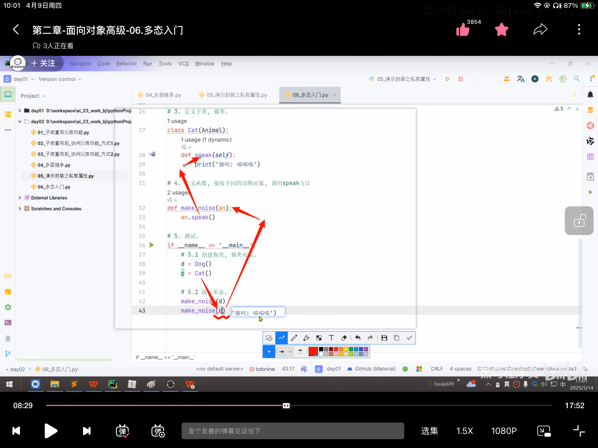
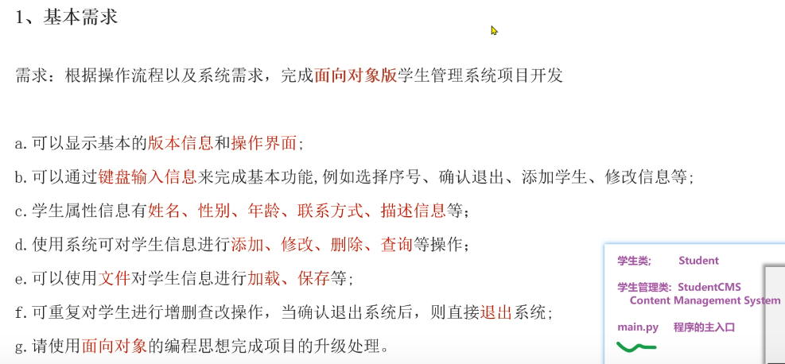
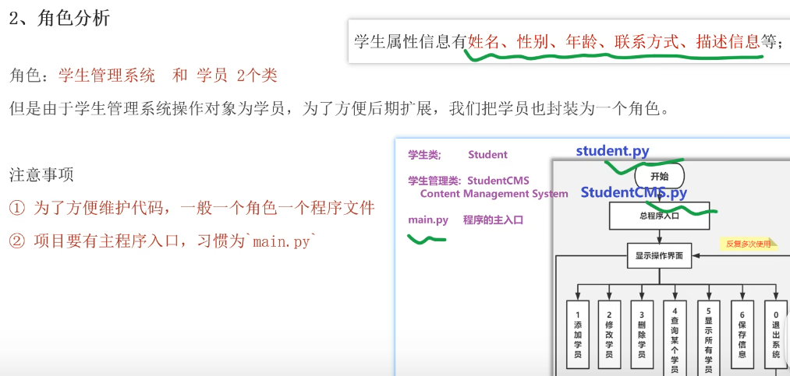
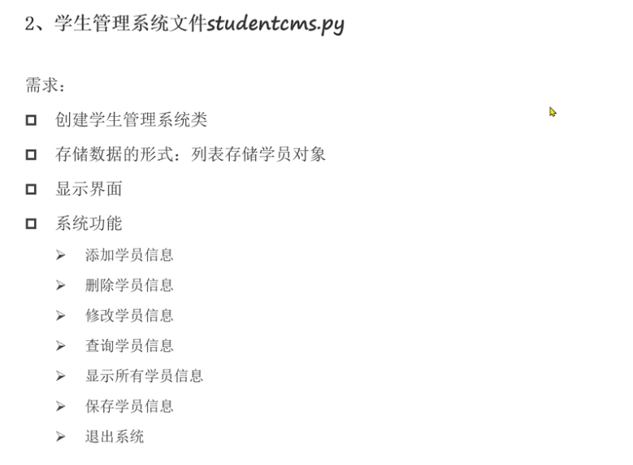
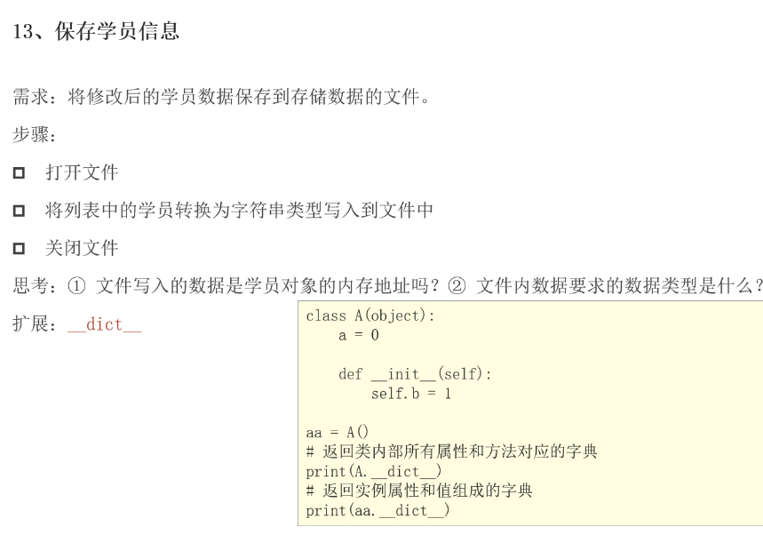
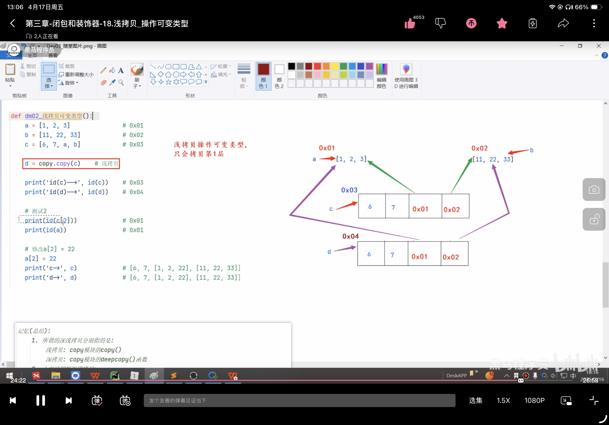
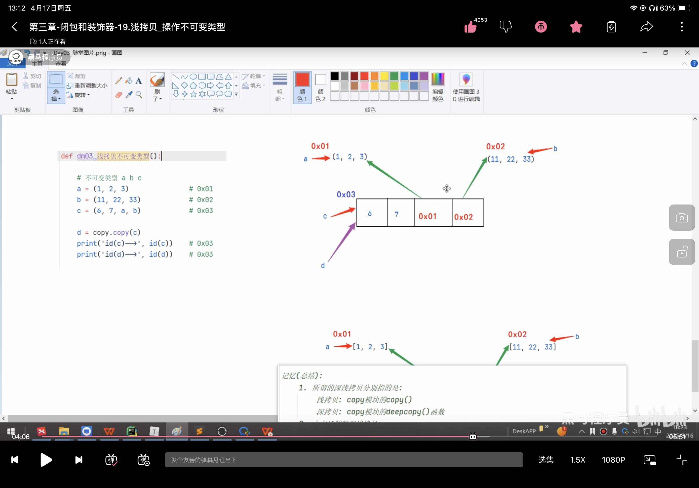
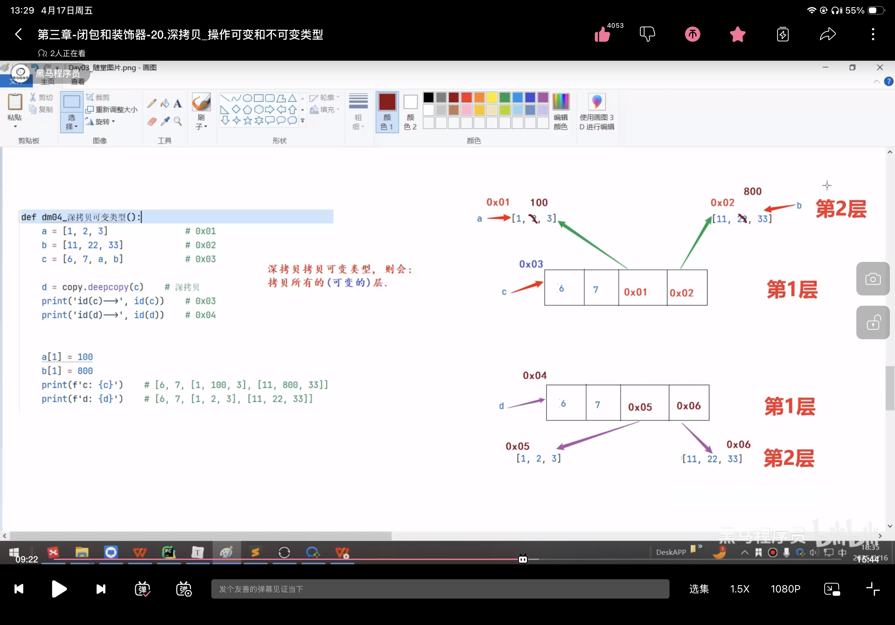

- [tips](#tips)
- [一、 面向对象基础](#一-面向对象基础)
  - [1.1 面向对象](#11-面向对象)
    - [1.1.1 面向对象和面向过程](#111-面向对象和面向过程)
    - [1.1.2 面向对象特征介绍](#112-面向对象特征介绍)
  - [1.2 面向对象的基本概念和行为](#12-面向对象的基本概念和行为)
    - [1.2.1 类和对象](#121-类和对象)
    - [1.2.2 入门案例\_汽车类](#122-入门案例_汽车类)
    - [1.2.3 self关键字](#123-self关键字)
    - [1.2.4 类外访问函数-案例](#124-类外访问函数-案例)
    - [1.2.5 类内访问函数-案例](#125-类内访问函数-案例)
    - [1.2.6 入门案例\_手机类](#126-入门案例_手机类)
  - [1.3 添加和获取对象属性](#13-添加和获取对象属性)
    - [1.3.1 属性的概念](#131-属性的概念)
    - [1.3.2 类外-添加和获取属性 - 案例](#132-类外-添加和获取属性---案例)
    - [1.3.3 类内-获取属性 - 案例](#133-类内-获取属性---案例)
  - [1.4 魔法方法](#14-魔法方法)
    - [1.4.1 ``__init__()``方法](#141-__init__方法)
    - [1.4.2 ``__str__()``方法](#142-__str__方法)
    - [1.4.3 ``__del__()``方法](#143-__del__方法)
    - [1.4.4 减肥案例](#144-减肥案例)
    - [1.4.5 烤地瓜案例](#145-烤地瓜案例)
- [二、 面向对象高级](#二-面向对象高级)
  - [2.1 创建类的格式](#21-创建类的格式)
  - [2.2 继承](#22-继承)
    - [2.2.1 继承入门](#221-继承入门)
    - [2.2.2 单继承和多继承](#222-单继承和多继承)
    - [2.2.3 子类重写父类-同名属性和方法](#223-子类重写父类-同名属性和方法)
    - [2.2.3 子类调用父类方法(重写后)](#223-子类调用父类方法重写后)
    - [2.2.4 多层继承-案例](#224-多层继承-案例)
  - [2.3 封装](#23-封装)
    - [2.3.1 封装入门](#231-封装入门)
    - [2.3.2 定义和获取私有属性](#232-定义和获取私有属性)
  - [2.4 多态](#24-多态)
    - [2.4.1 多态入门](#241-多态入门)
    - [2.4.2 多态案例\_构建对战平台](#242-多态案例_构建对战平台)
  - [2.5 扩展知识点](#25-扩展知识点)
    - [2.5.1 抽象类及案例\_空调](#251-抽象类及案例_空调)
    - [2.5.2 对象属性和类属性](#252-对象属性和类属性)
    - [2.5.3 类方法和静态方法](#253-类方法和静态方法)
  - [2.6 学生管理系统](#26-学生管理系统)
    - [2.6.1 学生类](#261-学生类)
    - [2.6.2 学生管理系统\_框架搭建](#262-学生管理系统_框架搭建)
    - [2.6.3 学生管理系统\_入口文件](#263-学生管理系统_入口文件)
    - [2.6.4 学生管理系统\_功能实现](#264-学生管理系统_功能实现)
    - [2.6.5 扩展``__dict__``属性——对象和字典的转化](#265-扩展__dict__属性对象和字典的转化)
    - [2.6.6 学生管理学系统\_保存和加载学生信息](#266-学生管理学系统_保存和加载学生信息)
    - [2.6.7 学生管理系统\_最终代码](#267-学生管理系统_最终代码)
- [三、 闭包和装饰器和深浅拷贝](#三-闭包和装饰器和深浅拷贝)
  - [3.1 闭包入门](#31-闭包入门)
    - [3.1.1 闭包背景介绍](#311-闭包背景介绍)
    - [3.1.2 闭包入门](#312-闭包入门)
  - [3.1.3 nonlocal关键字介绍](#313-nonlocal关键字介绍)
  - [3.2 装饰器](#32-装饰器)
    - [3.2.1  装饰器入门](#321--装饰器入门)
    - [3.2.2 装饰器案例](#322-装饰器案例)
    - [3.2.3 多个装饰器的使用](#323-多个装饰器的使用)
  - [3.3 深浅拷贝（面试！）](#33-深浅拷贝面试)
    - [3.3.1 可变与不可变类型](#331-可变与不可变类型)
    - [3.3.2 变量赋值执行原理](#332-变量赋值执行原理)
    - [3.3.3 深浅拷贝](#333-深浅拷贝)
- [四、 迭代器和生成器](#四-迭代器和生成器)
  - [4.1 迭代器](#41-迭代器)
    - [4.1.1 迭代器入门](#411-迭代器入门)
  - [4.2 生成器](#42-生成器)
    - [4.2.1 生成器介绍](#421-生成器介绍)
    - [4.2.2 生成器-推导式写法](#422-生成器-推导式写法)
    - [4.2.3 生成器-``yield``关键字写法](#423-生成器-yield关键字写法)
    - [4.2.4 生成器案例-歌词](#424-生成器案例-歌词)
  - [4.3 Property属性](#43-property属性)
    - [4.3.1 property属性——装饰器用法](#431-property属性装饰器用法)
    - [4.3.2 property属性——类属性用法](#432-property属性类属性用法)
  - [4.4 正则表达式（能看懂，不看了）](#44-正则表达式能看懂不看了)
    - [4.4.1 正则表达式入门](#441-正则表达式入门)
    - [4.4.2 正则替换](#442-正则替换)
  - [正则表达式\_校验单个字符](#正则表达式_校验单个字符)
  - [正则表达式\_校验多个字符](#正则表达式_校验多个字符)
  - [正则表达式\_校验开头和结尾](#正则表达式_校验开头和结尾)
  - [正则表达式\_校验分组](#正则表达式_校验分组)
  - [正则表达式\_校验邮箱](#正则表达式_校验邮箱)
  - [正则表达式\_提取QQ号](#正则表达式_提取qq号)
  - [正则表达式\_校验html](#正则表达式_校验html)


# tips
 **参考思路:** 概述, 思想特点, 举例, 总结             
> e.g:面向对象是一种编程思想，强调的是以对象为基础完成各种操作，它是基于面向过程的。说到面向对象，不得不提的就是它的三大思想特点：             
> - 更符合人们的思考习惯    
> - 把复杂的事情简单化        
> - 把程序员从执行者变成指挥者        
>             
> 举例：越符合生活的场景越好          
> 总结：万物皆对象   
>
1. 面向过程和面向对象的区别？             
   

2. return和print区别？
   ```python
    def test():
        return 'Hi'
    test()
    ```
    Jupyter交互编辑器里会打印出'Hi'，但是运行.py文件只return不能打印出来，如果print会打印出Hi，区别在于是否有单引号。

3. ``for...else...``语法       
   找到了就break，没找到就else
   ```python
    for ...:
      if ...:
        ...
        break
    else:
        ...
   ```
 
4. 字典解包              
   ``func(**dict)``将字典键值对作为参数传给函数，字典的键必须和函数参数相同，否则报错，                
    :param args: 数字元组, ``*args`` -> 接收所有的位置参数, 封装到 元组                      
    :param kwargs: 字典, 键是字符串, 值是数字, ``**kwargs`` -> 接收所有的关键字参数, 封装到 字典


 


# 一、 面向对象基础
## 1.1 面向对象
### 1.1.1 面向对象和面向过程
**编程思想**： 人们利用计算机来解决问题的思维。
- 面向过程：            
    以 **步骤(过程)** 为基础完成各种操作。

- 面向对象:     
    以 **对象** 为基础完成各种操作, 它是基于**面向过程**的。     
    - 优点：    
        1. 与实际的世界更加接近，所有的对象被赋予属性和方法，编程更富有人性化     
        2. 宗旨在于模拟现实世界     
        3. 现实生活中，所有事物全被视为对象     
    - 特点:
      	1. 更符合人们的思考习惯.
      	2.  把复杂的事情简单化.
      	3. 把人们(程序员)从执行者变成指挥者.
    
- 面向过程侧重过程，而面向对象是对面向过程的再次封装处理，通过对象来模拟现实世界。  
总结: **万物皆对象**.

### 1.1.2 面向对象特征介绍

- 三大特征： 封装，继承， 多态             
  封装是为了提高安全性，但是增加代码量；继承为了解决该问题，但增强了耦合性即父类有的子类必须有；多态来解决耦合性问题。    

* 封装    
    > 隐藏对象的*属性*和*实现细节*，仅对外提供公共的访问方式。      
    控制在程序中属性的读和修改的访问级别， 将抽象得到的数据和行为(功能)相结合，形成一个**有机的整体**，即将数据和操作数据的源代码结合形成“类”，其中数据和函数都是类的成员。
  * 好处：
    > 提高代码的安全性，以特定的访问权限控制使用类的成员。     (私有化)    
    > 提高代码的复用性。      (函数)
  * 举例：
    > 手机电脑等都可以封装为一个类

* 继承
    > 子类继承父类的属性和方法，使得子类对象（实例）具有父类的特征和行为。     
    满足 **“is-a关系”**    
  * 好处
    > 提高代码的复用性。
  - 弊端
    > 耦合性增强

* 多态
    > 不同类的对象对同一消息做出反应，即同一消息可根据发送对象的不同而采用多种不同的行为方式。 
    * 好处
        > 解耦合，可拓展. 


## 1.2 面向对象的基本概念和行为
### 1.2.1 类和对象
- **类**：对现实事物的抽象描述，**抽象的模版**，员工——姓名、性别——能走、说话、领工资  
```text
# 定义类
class 类名: # 命名遵循大驼峰
    # 定义类方法
    方法列表...
```     
- **对象**：现实事物的具体体现，**具体的实例**，张三——张三、男——爱走路来上班、跟女同事聊得来、每月10日上交工资  

- 属性：名词，描述事物的外在特征，例如姓名、性别、年龄
- 行为：动词，描述事物能够做什么，例如吃、喝、学习


```text
如何访问类中的成员？
    step1: 创建该类的对象
        对象名 = 类名()
    step2: 通过 对象名. 的方式调用
        对象名.属性名
        对象名.行为名()
```

### 1.2.2 入门案例_汽车类

```python
"""
案例: 演示定义汽车类 及 使用类中的成员.
需求: 定义汽车类, 有跑的行为.
"""
# 1.定义汽车类
class Car:   # 类名遵循大驼峰命名法
    # 属性

    # 行为
    def run(self):
        print("汽车会跑")

# 2.创建汽车类的对象
c1 = Car()

# 3.调用Car类的run()函数  调用Car#run()
c1.run()
```

### 1.2.3 self关键字
**self** 是python内置的关键字，用于指向**对象实例本身**。     
**谁调用函数, self就代表哪个对象。**    
- 作用:    
    1个类可以有多个对象，都可以通过 ``对象名.`` 的方式访问类中的行为(函数)。          
    函数默认有``self属性``，函数通过self来区分到底是**哪个对象**调用了类的方法。       
- 区分：        
    1.在 **类外** 访问类中的行为, 需要通过 ``对象名.`` 的方式访问.   
    2.在 **类内** 访问类中的行为，需要通过 ``self.`` 的方式访问。    

### 1.2.4 类外访问函数-案例
```python
'''
案例：self关键字介绍
需求：定义汽车类，创建多个该类的函数，看打印结果
'''
# 1. 定义汽车类.
class Car:
      # 属性
  
      # 行为, 跑
      def run(self):
          print('汽车会跑!...')
          print(f'我是run函数, self的值是: {self}')

# 2.创建汽车类的对象.
c1 = Car()
print(f'c1对象:{c1}')   # 和{self}一致    
# 输出：<__main__.Car object at 0x000002025FFDF1F0> 
# __main__.Car → 类名   0x000002025FFDF1F0 → 对象在内存中的地址（十六进制）
print(f'c1对象: {id(c1)}')
# 输出：2209223668208
# 对象在内存中的地址对应的整数（十进制），每次运行可能都不同
# 调用Car#run()
c1.run()
print('-' * 34)

# 3.继续创建汽车类的对象.
c2 = Car()
print(f'c2对象: {c2}')
# 输出：<__main__.Car object at 0x000002025FFDF250>
# 调用Car#run()
c2.run()
``` 

### 1.2.5 类内访问函数-案例


```python
"""
案例: 演示通过 self关键字实现 在类内访问其它函数.
需求: 定义汽车类, 类内有run()函数, 并在work()中调用run()函数, 创建该类对象, 调用上述的函数.
"""

# 1. 定义汽车类.
class Car:
    # 属性(名词)

    # 行为(动词)
    # 1.1 run()函数
    def run(self):
        print(f'{self} 汽车在跑...')

    # 1.2 work()函数, 在其内部调用run()
    def work(self):
        print(f'我是work函数, 我的self值: {self}')
        self.run()      # self = 本类当前对象的引用.

# 2.在类外访问Car类的行为(函数)
c1 = Car()
print(f'c1对象: {c1}')
c1.run()        # c1在跑
print('-' * 34)
c1.work()       # c1在work, c1在跑
print('=' * 34) # 分割线

# 3.再次创建对象.
c2 = Car()
print(f'c2对象: {c2}')
c2.run()
print('-' * 34)
c2.work()

# c1对象: <__main__.Car object at 0x00000163CC0DF190>
# <__main__.Car object at 0x00000163CC0DF190> 汽车在跑...
# ----------------------------------
# 我是work函数, 我的self值: <__main__.Car object at 0x00000163CC0DF190>
# <__main__.Car object at 0x00000163CC0DF190> 汽车在跑...
# ==================================
# c2对象: <__main__.Car object at 0x00000163CC0DF1F0>
# <__main__.Car object at 0x00000163CC0DF1F0> 汽车在跑...
# ----------------------------------
# 我是work函数, 我的self值: <__main__.Car object at 0x00000163CC0DF1F0>
# <__main__.Car object at 0x00000163CC0DF1F0> 汽车在跑...
```

### 1.2.6 入门案例_手机类
练习： 01_4_example_手机类.py

## 1.3 添加和获取对象属性
### 1.3.1 属性的概念
属性表示的是**固有特征**，在python中使用变量表示，例如人的姓名、年龄、身高、体重等 **（名词）** ，都是对象的属性。          
- 类外            
  - 添加： ``对象名.属性 = 属性值`` （该属性独属于这个对象, 即:该类的其它对象没有这个属性）
  - 获取： ``对象名.属性``
- 类内
  - 添加：魔法方法__init__
  - 获取：``self.属性``，定义``函数show()``


### 1.3.2 类外-添加和获取属性 - 案例
```python
"""
案例: 演示在类外 如何获取 和 设置 对象的属性.
需求: 创建汽车类, 设置为红色, 4个轮胎, 有跑的功能.
"""
# 1.创建汽车类.
class Car:
    # 属性(名词), 事物具有哪些特征 -> 变量.

    # 行为(动词), 事物能够做什么 -> 函数.
    def run(self):
        print('汽车会跑...')

# 2.创建该类的对象 -> 这个是 类外 的位置.
c1 = Car()
c1.run()        # 汽车会跑...

# 细节1: 给c1对象设置属性.
c1.color = '红色'
c1.number = 4
# 细节2: 打印c1对象的属性值.
print(f'颜色: {c1.color}, 轮胎数: {c1.number}')
print('-' * 34)

# 3.继续创建该类的对象.
c2 = Car()
c2.run()
# 细节3: 尝试调用c2对象的 color和number属性
# print(f'颜色: {c2.color}, 轮胎数: {c2.number}')
```

### 1.3.3 类内-获取属性 - 案例

```python
"""
案例: 演示类内如何获取对象的属性.
"""
# 1. 定义汽车类, 创建该类对象, 赋予颜色 和 轮胎数两个属性, 并在类内访问该属性.
class Car:
    # 属性

    # 行为
    # 1.1 跑
    def run(self):
        print('汽车会跑')

    # 1.2 定义函数show(), 实现 在类内访问 汽车对象的属性.
    def show(self):
        print(f'我是show函数, 对象的颜色: {self.color}, 轮胎数: {self.number}')

# 2.创建汽车类的对象
c1 = Car()

# 3. 给其(c1)赋予 属性 -> 类外设置属性.
c1.color = '红色'
c1.number = 4

# 4. 类外访问属性.
print(f"颜色: {c1.color}, 轮胎数: {c1.number}")

# 5. 类外访问行为(类中的函数)
c1.run()
c1.show()
print('-' * 34)

# 6. 继续创建汽车类对象, 尝试分别调用run(), show()函数.
c2 = Car()
c2.run()
# c2.show()       # 报错.
```

## 1.4 魔法方法
属于python内置的函数，总被双下划线所包围，特定场景下自动调用，不需要手动调用。   
- ``__init__``属性的初始化     
- ``__str__``打印对象        
- ``__del__``删除对象时给出提示

### 1.4.1 ``__init__()``方法
在python中，每当新创建一个对象时，就会自动触发``__init()__``方法，分为“无参”和“有参”两种情况。      
在``__init__()``魔法方法中，**初始化属性**, 则: 该类所有的对象，一创建，就有这些属性了。       


* 案例1：无参数
  ```python
  """
  案例: 演示 init魔法方法的 用法.
  魔法方法:
      概述/特点:
          Python内置的函数, 在满足特定的场景下, 会被 自动调用.
      常用的魔法方法:
          __init__()
          __str__()
          __del__()
  """  
  # 需求: 定义汽车类, 默认属性为: color='黑色', number=3
  # 1. 定义汽车类.
  class Car:
      # 1.1 在魔法方法 init()中, 初始化: 属性.
      def __init__(self):
          print('我是 无参 init 魔法方法')
  
          # 1.2 在init魔法方法中, 初始化属性, 则: 该类所有的对象, 一创建, 就有这些属性了.
          self.color = '黑色'
          self.number = 3
  
      # 1.3 定义show()函数, 打印该类对象的 各个属性值.
      def show(self):
          print(f'颜色: {self.color}, 轮胎数: {self.number}')
    
  # 2.创建汽车类对象.
  c1 = Car()      # 会自动调用 __init__()函数.
  #### 修改c1的属性值
  c1.color = '红色'
  c1.number = 6
  # 打印c1对象的属性值.
  print(c1.color, c1.number)
  c1.show()
  print('-' * 34)
  c2 = Car()
  c2.show()
  ```

* 案例2：有参数
  ```python
  """
  案例: 演示魔法方法之 init 有参版, 实际开发常用.
  
  大白话举例:
      无参版 init ->  默认上的有底色, 你需要重新涂色(覆盖底色)
      有参版 init ->  默认没有涂色的石膏娃娃, 我们根据喜好自由涂色即可.
  """
  # 需求: 创建汽车类, 不给默认值, 由汽车对象 外部各自赋值即可.
  # 1. 定义汽车类.
  class Car:
      # 2.有参的 __init__()函数, 参数值由: 外部对象自行赋值.
      def __init__(self, color, number):
          """
          该魔法方法用于给 汽车类 对象的属性 赋值.
          :param color:  车的颜色
          :param number: 车的轮胎数
          """
          self.color = color
          self.number = number
  
      # 定义show()函数, 打印该类对象的 各个属性值.
      def show(self):
          print(f'颜色: {self.color}, 轮胎数: {self.number}')
  
  # 3. 创建汽车类对象.
  # c1 = Car()  # 报错, 因为默认调用了init()函数, 但是该函数有参数, 则必须传参.
  c1 = Car('红色', 6)
  c1.show()
  print('-' * 23)
  
  c2 = Car('绿色', 4)
  c2.show()
  ```

### 1.4.2 ``__str__()``方法    
  
当用``print()``函数打印对象时，会自动调用该对象(所在类)的 ``str魔法方法``；        
该魔法方法默认打印的是对象的**内存地址值**，无意义，一般都会重写，改为打印对象的各个属性值。   

```python   
def __str__(self):
    # ...
    return 字符串结果
```

```python
"""
案例: 演示 str魔法方法的 用法.
魔法方法:
    概述/特点:
        Python内置的函数, 在满足特定的场景下, 会被 自动调用.
    常用的魔法方法:
        __init__()      在(每次)创建对象的时候, 会自动触发该类的 __init__()函数.
        __str__()       当用print()函数 打印对象的时候, 会自动调用该对象(所在类)的 str魔法方法.
                        该魔法方法默认打印的是对象的地址值, 无意义, 一般都会重写, 改为打印 对象的各个属性值.
        __del__()
"""
# 1. 定义汽车类.
class Car:
    # 2.有参的 __init__()函数, 参数值由: 外部对象自行赋值.
    def __init__(self, color, number):
        """
        该魔法方法用于给 汽车类 对象的属性 赋值.
        :param color:  车的颜色
        :param number: 车的轮胎数
        """
        self.color = color
        self.number = number


    # 魔法方法str(), 默认打印地址值, 无意义, 一般会重写, 改为打印对象的各个属性值.
    def __str__(self):
        return f'颜色: {self.color}, 轮胎数: {self.number}'
        # return f'{self.color}, {self.number}'

# 3.创建该类的对象.
c1 = Car('绿色', 4)
print(c1)       # 输出语句打印对象, 默认调用了该对象 所在类的 str魔法方法.
print('-' * 23)

c2 = Car('红色', 6)
print(c2)
```

### 1.4.3 ``__del__()``方法
当.**py文件执行结束**, 或者 **手动 del 释放对象资源**, 会自动调用该函数``del 对象``  ，python解释器会默认调用``__del__()``方法。      


```python
"""
案例: 演示 del魔法方法的 用法.
魔法方法:
    概述/特点:
        Python内置的函数, 在满足特定的场景下, 会被 自动调用.
    常用的魔法方法:
        __init__()      在(每次)创建对象的时候, 会自动触发该类的 __init__()函数.
        __str__()       当用print()函数 打印对象的时候, 会自动调用该对象(所在类)的 str魔法方法.
                        该魔法方法默认打印的是对象的地址值, 无意义, 一般都会重写, 改为打印 对象的各个属性值.
        __del__()       当.py文件执行结束, 或者 手动 del 释放对象资源, 会自动调用该函数.
"""

# 1. 定义汽车类, 属性: 品牌.   行为:run()   通过del魔法方法删除该类的对象, 看看效果.
class Car:
    # 2. 在魔法方法init中, 完成: 属性的初始化.（有参）
    def __init__(self, brand):
        self.brand = brand

    # 3.重写 str魔法方法, 打印对象的属性值.
    def __str__(self):
        return f'品牌: {self.brand}'

    # 4. 重写 del魔法方法, 删除对象时给出提示.
    def __del__(self):
        print(f'{self} 对象被删除了!')


# 5. 创建汽车类对象.
c1 = Car('小米 Su7 Ultra')
print(c1)       # 输出： 品牌：小米 Su7 Ultra

# 6. 手动访问 brand 属性.
print(c1.brand)     #输出：小米 Su7 Ultra
print('-' * 23)

# 7.手动删除c1对象, 然后尝试 打印该对象 或者 访问对象的属性.
# del c1 
'''  
若重写str和del，会打印：品牌：小米 Su7 Ultra 对象被删除了
'''
# print(c1)       # 报错.

print('程序结束!')

''' 
手动删，会先打印“对象删除；否则，先打印：程序结束。
'''
```

### 1.4.4 减肥案例

```python
"""
案例: 减肥案例.

需求:
    例如，小明同学当前体重是100kg。每当他跑步一次时，则会减少0.5kg；每当他大吃大喝一次时，则会增加2kg。请试着采用面向对象方式完成案例。

分析:
    类名:         Student
    对象名:        xm
    属性(名词):   当前体重, current_weight
    行为(动词)    跑步, 吃饭
"""
# 1.定义学生类.
class Student:
    # 2.在魔法方法init中, 完成: 对象的属性的初始化.
    def __init__(self):
        # 默认为100，无参版__init__
        self.current_weight = 100

    # 3.每当他跑步一次时，则会减少0.5kg
    def run(self):
        print('疯狂跑步...')
        self.current_weight -= 0.5      # 体重减小.

    # 4.大吃大喝.
    def eat(self):
        print('大吃大喝一顿...')
        self.current_weight += 2

    # 5.重写魔法方法str, 打印属性值, 即: 当前体重.
    def __str__(self):
        # return '当前体重: %s' % self.current_weight
### %s字符串 %d整数 %f浮点数 %.2f保留2位小数
        return f'当前体重: {self.current_weight} kg!'

# 6. 测试.
if __name__ == '__main__':
    # 6.1 创建学生对象.
    xm = Student()
    # 6.2 跑步
    xm.run()
    xm.run()
    # 重新运行，回到原始默认的100
    # 6.3 吃喝
    xm.eat()
    # 6.4 当前体重.
    print(xm)
```

### 1.4.5 烤地瓜案例


```python
"""
案例: 烤地瓜案例.

需求:
    1. 定义地瓜类 -> SweetPotato
    2. 属性: 被烤时间cook_time, 烘焙状态 cook_state, 调料condiments
    3. 行为: 烘烤cook(), 添加调料add_condiment()
    4. 魔法方法: init() -> 初始化属性,  str() -> 打印地瓜信息.
    5. 规则:
        烘烤时间        地瓜状态
        [0, 3)          生的          包左不包右, 前闭后开.
        [3, 7)          半生不熟
        [7, 12)         熟了
        [12, ∞]         糊了
"""
# 1. 定义地瓜类 -> SweetPotato
class SweetPotato:
    # 2. 在魔法方法__init__()中, 初始化地瓜的属性.
    def __init__(self):
        self.cook_time = 0
        self.cook_state = '生的'
        self.condiments = []

    # 3.具体的烘烤动作.
    def cook(self, time):
### 先判断输入值是否有效，再对其判断操作
        # 3.1 根据烘烤时间, 修改地瓜的烘烤状态.
        if time <= 0:
            print('无效值!')
        else:
            # 3.2 修改地瓜的 烘烤时间.
            self.cook_time += time
            # 3.3 根据烘烤时间, 修改地瓜的烘烤状态.
            if 0 <= self.cook_time < 3:
                self.cook_state = '生的'
            elif 3 <= self.cook_time < 7:
                self.cook_state = '半生不熟'
            elif 7 <= self.cook_time < 12:
                self.cook_state = '熟了'
            else:
                self.cook_state = '糊了'

    # 4. 添加调料 add_condiment()
    def add_condiment(self, condiment):
        ## 列表添加元素
        self.condiments.append(condiment)

    # 5. 重写str()方法, 打印地瓜信息.
    def __str__(self):
        return f'烘烤时间: {self.cook_time}, 地瓜状态: {self.cook_state}, 调料: {self.condiments}'

# 6.测试.
if __name__ == '__main__':
    # 7. 创建地瓜对象
    dg = SweetPotato()

    # 8. 具体的烘烤动作.
    # dg.cook(-3)
    dg.cook(3)
    dg.cook(5)
    dg.cook(7)

    # 9. 添加调料
    dg.add_condiment('芥末/辣根')
    dg.add_condiment('折耳根')
    dg.add_condiment('豆汁')
    dg.add_condiment('鲱鱼罐头')

    # 10. 打印地瓜状态.
    print(dg)
```

# 二、 面向对象高级
## 2.1 创建类的格式
```text
格式1:
    class 类名:
        pass

格式2:（用得少）
    class 类名():
        pass

格式3:
    # class 类名(父类名):
    class 类名(object):
        pass
```

```python
# 需求: 定义老师类
# class Teacher:
# class Teacher():
class Teacher(object):  
    pass
## object是所有类的父类，Python中所有的类都直接或者间接继承自object类.
t1 = Teacher()
print(t1)
```

## 2.2 继承
1. 了解什么是继承
2. 什么是单继承和多继承
3. 子类如何重写父类同名方法和属性
4. 子类如何调用父类方法
5. 什么是多层继承
### 2.2.1 继承入门
**继承**：子类可以继承父类的 *属性* 和 *行为* .  
```text
class 父类名(object):
    ...
class 子类名A(父类名B):
    # A:子类，派生类
    # B:父类，基类，超类
    ...
```
python中，所有类默认继承``object类``——**顶级类或基类**；其他类叫做**派生类**。    
- 好处:     
    提高代码的复用性
- 弊端:       
    耦合性增强了, 父类不好的内容, 子类想没有都不行.
- 扩展:       
        开发原则：**高内聚, 低耦合**           
        - **内聚**： 指的是类自己独立处理问题的能力.     
        - **耦合**： 指的是类与类之间的关系.    
        大白话解释: 自己能搞定的事儿, 就不要麻烦别人.


```python
"""
案例: 继承入门.
      Father类有一个默认性别为男，爱好散步行走，son类也想拥有这些属性和行为
"""
# 需求: 定义父类(男, 散步), 定义子类, 继承父类.
# 1. 定义父类.
class Father(object):
    def __init__(self):
        self.gender = '男'

    def walk(self):
        print('饭后走一走, 活到九十九!')

## 耦合，子类被迫从父类继承
    # def smoking(self):
    #     print('抽烟有害, 健康!')

# 2. 定义子类.
class Son(Father):
    pass

# 3.测试子类的功能.
s = Son()
print(f'性别: {s.gender}')    # 子类从父类继承过来 属性.
s.walk()                     # 子类从父类继承过来 行为.
# s.smoking()
```
### 2.2.2 单继承和多继承
**单继承**：一个子类只能继承自**一个父类**，不能继承多个子类。 这个子类会具有父类的属性和方法。     
**多继承**：一个类同时继承了**多个父类**，且同时具有所有父类的属性和方法。      
``class Son(Father, Mother)``会优先考虑更近的父类的属性和方法。
- 多继承扩展:     
    **MRO机制**：可以查看某个对象在调用函数时的 *顺序* , 即: 先找哪个类, 后找哪个类.      
    ```text 
        类名.mro()  方法  
        类名.__mro__    属性 
    ```


- 单继承 案例
    ```python
    """
    案例: 演示单继承, 即: 1个子类继承自 1个父类.

    故事1: 一个摊煎饼的老师傅，在煎饼果子界摸爬滚打多年，研发了一套精湛的摊煎饼技术， 师父要把这套技术传授给他的唯一的最得意的徒弟。

    分析:
        1. 定义师傅类, Master
            属性: kongfu
            行为: make_cake()
        2. 定义子类, Prentice, 继承师傅类.
    """
    # 1. 定义师傅类.
    class Master:
        # 1.1 定义属性.
        def __init__(self):
            self.kongfu = '[古法配方]'

        # 1.2 定义行为.
        def make_cake(self):
            print(f'采用 {self.kongfu} 摊煎饼果子.')
    # 2.定义徒弟类, 继承自师傅类.
    class Prentice(Master):
        pass
    # 3.测试.
    p = Prentice()
    p.make_cake()
    ```


- 多继承 案例
    ```python
    """
    案例: 演示多继承.
    需求: 小明是个爱学习的好孩子，想学习更多的摊煎饼果子技术，于是，在百度搜索到黑马程序员学校，报班来培训学习摊煎饼果子技术。
    """
    # 1. 定义师傅类.
    class Master:
        # 1.1 定义师傅类属性.
        def __init__(self):
            self.kongfu = '[古法煎饼果子配方]'
        # 1.2 定义师傅类方法.
        def make_cake(self):
            print(f'运用 {self.kongfu} 制作煎饼果子')

    # 2. 定义黑马学校类.
    class School:
        # 2.1 定义学校类属性.
        def __init__(self):
            self.kongfu = '[黑马AI煎饼果子配方]'
        # 2.2 定义学校类方法.
        def make_cake(self):
            print(f'运用 {self.kongfu} 制作煎饼果子')

    # 3.定义徒弟类 -> 有个对象叫 小明.
    class Prentice(School, Master): 
    ## 从左往右, 就近原则.
        pass

    # 4.测试.
    xm = Prentice()
    print(xm.kongfu)        
    xm.make_cake()
    print('-' * 23)

    # 5. 查看mro机制的结果.
    print(Prentice.mro())       
    # Prentice -> School -> Master -> object
    print(Prentice.__mro__)     
    # Prentice -> School -> Master -> object
    ```

### 2.2.3 子类重写父类-同名属性和方法
**重写**也叫覆盖，即: 子类出现和父类**重名**的*属性* 或者 *行为*。                     
调用层次遵循**就近原则**，子类有就用，没有就去就近的父类找，依次查找其所有的父类，有就用，没有就报错。     

```python
"""
案例: 演示子类重写父类功能.
"""
# 故事3: 小明掌握了老师傅和黑马的技术后，自己潜心钻研出一套自己的独门配方的全新摊煎饼果子技术。
# 1. 老师父类.
class Master:
    # 1.1 属性
    def __init__(self):
        self.kongfu = '[古法煎饼果子配方]'
    # 1.2 行为
    def make_cake(self):
        print(f'运用{self.kongfu}制作煎饼果子')

# 2. 黑马学校类
class School:
    # 2.1 属性
    def __init__(self):
        self.kongfu = '[黑马AI煎饼果子配方]'
    # 2.2 行为
    def make_cake(self):
        print(f'运用{self.kongfu}制作煎饼果子')

# 3. 徒弟类
class Prentice(School, Master):
## 重写
    # 3.1 属性
    def __init__(self):
        self.kongfu = '[独创煎饼果子配方]'

    # 3.2 行为
    def make_cake(self):
        print(f'运用{self.kongfu}制作煎饼果子')

# 4. 测试.
if __name__ == '__main__':
    # 4.1 创建徒弟类对象.
    p = Prentice()
    # 4.2 访问属性.
    print(p.kongfu)
    # 4.3 调用函数.
    p.make_cake()

```

### 2.2.3 子类调用父类方法(重写后)
思路:     
  1. ``父类名.父类函数名(self)`` 精准访问, 想找哪个父类, 就调哪个父类。         
  2. ``super().父类函数名()`` 只能访问**最近**的那个父类, 有就用, 没有就往后**继续查找**，做不到跳过近的找后面的。      

* 方式1: **父类名.父类方法名(self)**
  

  ```python
  """
  案例: 子类重写父类功能后, 继续访问父类功能.
  """
  # 故事4: 很多顾客都希望能吃到徒弟做出的有自己独立品牌的煎饼果子，也有黑马配方技术的煎饼果子味道。
  # 1. 老师父类.
  class Master:
      # 1.1 属性
      def __init__(self):
          self.kongfu = '[古法煎饼果子配方]'
      # 1.2 行为
      def make_cake(self):
          print(f'运用{self.kongfu}制作煎饼果子')
  
  # 2. 黑马学校类
  class School:
      # 2.1 属性
      def __init__(self):
          self.kongfu = '[黑马AI煎饼果子配方]'
      # 2.2 行为
      def make_cake(self):
          print(f'运用{self.kongfu}制作煎饼果子')
  
  # 3. 徒弟类
  class Prentice(School, Master):
      # 3.1 属性
      def __init__(self):
          self.kongfu = '[独创煎饼果子配方]'
      # 3.2 行为
      def make_cake(self):
          print(f'运用{self.kongfu}制作煎饼果子')

  ## python中函数不能重名
    
      # 3.3 调用父类的功能.
      def make_master_cake(self):
        ##
          Master.__init__(self) 
          ## ！！！如果没有上面这句，还是独创，
          # 因为self的属性没有初始化
          Master.make_cake(self)
  
      def make_school_cake(self):
          School.__init__(self)
          School.make_cake(self)
  
  # 4. 测试.
  if __name__ == '__main__':
      # 4.1 创建徒弟类对象.
      p = Prentice()
      # 4.2 访问属性.
      print(p.kongfu)         # 独创
      # 4.3 调用函数.
      p.make_cake()           # 独创
      p.make_master_cake()    # 古法
      p.make_school_cake()    # AI
      print('-' * 34)
    ## 注意：仍然是AI！！！
      p.make_cake()           # AI
  ```

* 方式2: **super().父类功能名()**     
  使用``super()``可以自动查找**父类**，适合**单继承**使用，多继承不建议。          
  ```python
  """
  案例: 子类重写父类功能后, 继续访问父类功能.
  """
  # 故事4: 很多顾客都希望能吃到徒弟做出的有自己独立品牌的煎饼果子，也有黑马配方技术的煎饼果子味道。
  # 1. 老师父类.
  class Master:
      # 1.1 属性
      def __init__(self):
          self.kongfu = '[古法煎饼果子配方]'
  
      # 1.2 行为
      def make_cake(self):
          print(f'运用{self.kongfu}制作煎饼果子')
  
  # 2. 黑马学校类
  class School:
      # 2.1 属性
      def __init__(self):
          self.kongfu = '[黑马AI煎饼果子配方]'
  
      # 2.2 行为
      def make_cake(self):
          print(f'运用{self.kongfu}制作煎饼果子')
  
  # 3. 徒弟类
  class Prentice(School, Master):
      # 3.1 属性
      def __init__(self):
          self.kongfu = '[独创煎饼果子配方]'
  
      # 3.2 行为
      def make_cake(self):
          print(f'运用{self.kongfu}制作煎饼果子')
  
      # 3.3 调用父类的功能.
      # def make_master_cake(self):
      #     Master.__init__(self)
      #     Master.make_cake(self)
      #
      # def make_school_cake(self):
      #     School.__init__(self)
      #     School.make_cake(self)
  
      def make_old_cake(self):
          super().__init__()
          super().make_cake()
  
  # 4. 测试.
  if __name__ == '__main__':
      # 4.1 创建徒弟类对象.
      p = Prentice()
      # 4.2 访问属性.
      print(p.kongfu)         # 独创
      # 4.3 调用函数.
      p.make_cake()           # 独创
      # p.make_master_cake()    # 古法
      # p.make_school_cake()    # AI
      print('-' * 34)
      # p.make_cake()           # AI
      p.make_old_cake()         # AI
  ## 若school里没有子类要的属性和方法，会接着往后的父类里找
  
  ```

### 2.2.4 多层继承-案例
类A继承类B, 类B继承类C, 这就是多层继承。          
```python
"""
案例: 演示多层继承.
目前题设中的继承体系
    object <- Master, School <- Prentice <- TuSun
"""
# 故事4: 很多顾客都希望能吃到徒弟做出的有自己独立品牌的煎饼果子，也有黑马配方技术的煎饼果子味道。
# 1. 老师父类.
class Master:
    # 1.1 属性
    def __init__(self):
        self.kongfu = '[古法煎饼果子配方]'
    # 1.2 行为
    def make_cake(self):
        print(f'运用{self.kongfu}制作煎饼果子')

# 2. 黑马学校类
class School:
    # 2.1 属性
    def __init__(self):
        self.kongfu = '[黑马AI煎饼果子配方]'
    # 2.2 行为
    def make_cake(self):
        print(f'运用{self.kongfu}制作煎饼果子')

# 3. 徒弟类
class Prentice(School, Master):
    # 3.1 属性
    def __init__(self):
        self.kongfu = '[独创煎饼果子配方]'
    # 3.2 行为
    def make_cake(self):
        print(f'运用{self.kongfu}制作煎饼果子')
    # 3.3 调用父类的功能.
    def make_master_cake(self):
        Master.__init__(self)
        Master.make_cake(self)
    def make_school_cake(self):
        School.__init__(self)
        School.make_cake(self)
    # def make_old_cake(self):
    #     super().__init__()
    #     super().make_cake()
##
# 4.创建徒孙类.
class TuSun(Prentice):
    pass

# 5. 测试.
if __name__ == '__main__':
    # 5.1 创建徒孙类对象.
    ts = TuSun()
    # 5.2 调用功能.
    ts.make_cake()          # Prentice类的
    ts.make_master_cake()   # Master类的
    ts.make_school_cake()   # School类的
```

## 2.3 封装
1. 了解什么是封装    
2. 什么是私有属性和私有方法
3. 如何设置和获取私有属性
4. 如何定义和获取私有方法

### 2.3.1 封装入门
**封装**：   属于面向对象的*三大特征之一*，就是隐藏对象的属性和实现细节，仅对外提供公共的访问方式。         

```text  
私有格式:( 前 加双下划线)
    __属性名
    __函数名()
```

- 怎么封装?     
    我们学的 **函数、类** 都是封装的体现，将属性和方法书写到类里面的操作，为属性和方法添加私有权限，即设置某个属性或方法**不继承给子类**。     
- 好处:            
    1. 提高代码的安全性——由 *私有化* 来保证     
    2. 提高代码的复用性——由 *函数* 来保证      
- 弊端:            
    代码量增加了，因为私有内容外界想访问，必须提供公共的访问方式。   

### 2.3.2 定义和获取私有属性
私有属性不能直接访问，在python中，一般定义方法名``get_xx``来获取私有属性，定义``set_xx``来修改私有属性。             
- 如果重新实例一个对象，父类的私有属性不因其他对象的修改而改变。

```python
"""
案例: 演示封装之私有属性.
"""
# 故事5: 小明把技术给徒孙的时候, 不希望把自己的私房钱给徒孙, 即要为 钱 这个属性设置私有权限。   
# 1. 定义师傅类Master

# 2. 定义学校类School

# 3. 定义徒弟类
class Prentice:
    # 3.1 属性
    def __init__(self):
        self.kongfu = '[黑马煎饼果子配方]'
## 私有属性
        # 私房钱.
        self.__money = 20000
## 公共访问 私有方法
    # 3.2 私有方法
    def __make_cake(self):
        print(f'运用{self.kongfu}制作煎饼果子')
    def make(self):
        self.__make_cake()

## 公共访问 私有属性
    # 3.3 针对私有的属性, 提供公共的访问方式.
## 获取
    def get_money(self):         
        return self.__money
## 设置
    def set_money(self, money): 
        self.__money = money
## 这里的get和set可以更改为其他单词，只要函数内容是获取和设置就行

# 4. 定义徒孙类
class TuSun(Prentice):
    pass

# 5. 测试.
if __name__ == '__main__':
    ts = TuSun()
    print(ts.kongfu)
    ts.make()
    ## ts.__make_cake 报错：没有该方法
    print('-' * 34)
    # print(ts.__money)     ## 报错, 父类私有成员, 子类无法访问.
    ts.set_money(100)
    print(ts.get_money())   ## 通过父类提供的公共的访问方式, 访问父类的私有成员.
## ！！为什么要print？ return不显示值
```

## 2.4 多态
1. 什么是多态
2. 多态实现的步骤
3. 多态的好处
4. 抽象类的好处
   

### 2.4.1 多态入门
**多态**:
- 专业版: 同一个**函数**, 接收不同的参数, 有不同的效果
- 大白话: 同一个事物在不同时刻表现出来的不同状态, 形态.

- 前提条件:     
  1. 要有继承.
  2. 要有方法即函数的重写, 不然多态无意义.
  3. 要有父类引用指向子类对象.     
    （python一般不加类型指定，伪多态，不报错，只报警告）      

- 好处： 在不改变框架代码的情况下，通过**多态语法**实现模块和模块之间的**解耦合**；实现了软件系统的可拓展      
  - 解耦合的解释：搭建的平台函数相当于任务的调用者；子类、孙子类重写父类的函数，相当于子任务；相当于任务的**调用者**和任务的**编写者**进行了解耦合       
  - 可拓展的解释： 搭建的平台函数在不做任何修改的情况下，可以调用后来人写的代码   



```python
"""
06案例: 演示多态入门.
案例:
        动物类案例.
"""
# 1.定义动物类
class Animal:           ## 抽象类(也叫: 接口)
    def speak(self):    ## 抽象方法
        pass

# 2. 定义子类, 狗类.
class Dog(Animal):
    def speak(self):
        print('狗叫: 汪汪汪')

# 3. 定义子类, 猫类.
class Cat(Animal):
    def speak(self):
        print('猫叫: 喵喵喵')

## 要有继承，演示无继承的结果，！！！没报错
# 汽车类
class Car:
    def speak(self):
        print('车叫: 滴滴滴')

## 4. 定义函数, 接收不同的动物对象, 调用speak方法
## 如果对应的子类中没有speak方法，会调用父类的speak
##  an:Animal = Dog() 表示必须是Animal的子类才能调用这个函数  
## 但是python中不报错，只会提示warning
def make_noise(an:Animal):   
    an.speak()

# 5. 测试.
if __name__ == '__main__':
    # an:Animal = Dog()       # 父类引用指向子类对象.
    # d:Dog = Dog()           # 创建狗类对象.

    # 5.1 创建狗类, 猫类对象.
    d = Dog()
    c = Cat()

    # 5.2 演示多态.
    make_noise(d)
    make_noise(c)
    print('-' * 34)

    # 5.3 测试汽车类
    c = Car()
    make_noise(c) #但是没报错
```

### 2.4.2 多态案例_构建对战平台


```python
"""
07案例: 演示Python的多态案例之 战斗平台.
需求:
    1. 构建对战平台(公共的函数) object_play(), 接收: 英雄机 和 敌机.
    2. 在不修改对战平台代码的情况下, 完成多次战斗.
    3. 规则:
        英雄机, 1代战斗力60, 2代战斗力80
        敌机, 1代战斗力70

代码提示:
    英雄机1代 HeroFighter
    英雄机2代 AdvHeroFighter
    敌机     EnemyFighter
"""

# 1. 定义英雄机1代, 战斗力 60
class HeroFighter:
    def power(self):
        return 60

# 2. 定义英雄机2代, 战斗力 80
class AdvHeroFighter(HeroFighter):
    def power(self):
        return 80

# 3. 敌机1代
class EnemyFighter:
    def power(self):
        return 70

## 4. 构建对战平台, 公共的函数, 接收不同的参数, 有不同的效果 -> 多态.
# def object_play(hero: HeroFighter, enemy:EnemyFighter):
def object_play(hero, enemy):
    # 参1: 英雄机, 参2: 敌机
    if hero.power() >= enemy.power():
        print('英雄机 战胜 敌机!')
    else:
        print('英雄机 惜败 敌机!')


# 5. 测试.
if __name__ == '__main__':
    # 思路1: 不使用多态, 完成对战.
    # # 场景1: 英雄机1代 vs 敌机1代
    # h1 = HeroFighter()
    # e1 = EnemyFighter()
    # if h1.power() >= e1.power():
    #     print('英雄机1代 战胜 敌机1代')
    # else:
    #     print('英雄机1代 惜败 敌机1代')
    # print('-' * 34)

    # # 场景2: 英雄机2代 vs 敌机1代
    # h2 = AdvHeroFighter()
    # e1 = EnemyFighter()
    # if h2.power() >= e1.power():
    #     print('英雄机2代 战胜 敌机1代')
    # else:
    #     print('英雄机2代 惜败 敌机1代')
    # print('*' * 34)

    # 思路2: 使用多态, 完成对战.
    h1 = HeroFighter()
    h2 = AdvHeroFighter()
    e1 = EnemyFighter()
    # 场景1: 英雄机1代 vs 敌机1代
    object_play(h1, e1)
    print('-' * 34)
    # 场景2: 英雄机2代 vs 敌机1代
    object_play(h2, e1)

    # object_play(h2, h1) # 还是不会报错的，只会报警告
```
## 2.5 扩展知识点
### 2.5.1 抽象类及案例_空调
**抽象类**：          
- 概述：       
    在Python中, **抽象类 = 接口**, 即: 有抽象方法的类就是 抽象类,也叫 接口.              
    **抽象方法** = 没有方法体的方法, 即: 方法体是 **pass** 修饰的.      
- 作用/目的:        
        抽象类一般充当 **父类** , 用于指定行业规范, 准则, 具体的实现交由 **子类** 来完成；父类制定接口标准，子类实现接口标准。              

```python
"""
08案例: 演示抽象类的用法.
"""
# 1. 定义抽象类, 空调类, 设定: 空调的规则.
class AC:
    # 1.1 制冷
    def cool_wind(self):
        pass

    # 1.2 制热
    def hot_wind(self):
        pass

    # 1.3 左右摆风
    def swing_l_r(self):
        pass

# 2. 定义子类(小米空调), 实现父类(空调类)中的所有抽象方法.
class XiaoMi(AC):
    # 2.1 制冷
    def cool_wind(self):
        print('小米 核心 制冷技术!')

    # 2.2 制热
    def hot_wind(self):
        print('小米 核心 制热技术!')

    # 2.3 左右摆风
    def swing_l_r(self):
        print('小米空调 静音左右摆风 技术!')

# 3. 定义子类(格力空调), 实现父类(空调类)中的所有抽象方法.
class Gree(AC):
    # 3.1 制冷
    def cool_wind(self):
        print('格力 核心 制冷技术!')

    # 3.2 制热
    def hot_wind(self):
        print('格力 核心 制热技术!')

    # 3.3 左右摆风
    def swing_l_r(self):
        print('格力空调 低频左右摆风 技术!')


# 4. 测试
if __name__ == '__main__':
    # 4.1 小米空调
    xm = XiaoMi()
    xm.cool_wind()
    xm.hot_wind()
    xm.swing_l_r()
    print('-' * 23)

    # 4.2 格力空调
    gree = Gree()
    gree.cool_wind()
    gree.hot_wind()
    gree.swing_l_r()
```
### 2.5.2 对象属性和类属性

1. 什么是属性
2. 什么是类属性
3. 了解类方法和静态方法


**属性**:
- 概述:              
          它是1个名词，用来描述事物的外在特征的。
- 分类:              
  **对象属性**: 属于每个对象的，即: 每个对象的属性值可能都不同。    修改A对象的属性, 不影响对象B。               
  **类属性**:   属于类的，即: 能被该类下所有的对象所共享。   A对象修改类属性，B对象访问的是修改后的。    
  
**对象属性**:      
      定义到 ``__init__`` 魔法方法中的属性，每个对象都有自己的内容。    
      通过 ``对象名.`` 的方式调用。
  
**类属性**:     
      定义到类中，函数外的属性(变量)，能被该类下所有的对象所 *共享*。   
      既能通过 ``类名.`` 还能通过 ``对象名.`` 的方式来调用，推荐使用 ``类名.`` 的方式。   


* 代码演示

  ```python
  """
  09案例: 演示对象属性 和 类属性.
  """
  # 需求: 演示 对象属性 和 类属性相关.
  # 1. 定义1个 Student类, 每个学生都有自己的 姓名, 年龄
  class Student:
      # 2. 定义类属性
      teacher_name = '水镜先生'
  
      # 3. 定义对象属性, 即: 写到 init 魔法方法中的属性.
      def __init__(self, name, age):
          self.name = name
          self.age = age
  
      # 4. 定义str魔法方法, 输出对象的信息.
      def __str__(self):
          return '姓名: %s, 年龄: %d' % (self.name, self.age)
  
  # 5. 测试
  if __name__ == '__main__':
      # 场景1: 对象属性
      s1 = Student('曹操', 38)
      s2 = Student('曹操', 38)
  
      # 修改s1的属性值.
      s1.name = '许褚'
      s1.age = 40
  
      print(f's1: {s1}') # s1变了
      print(f's2: {s2}') # s2没变
      print('-' * 23)
  
      # 场景2: 类属性
      # 1. 类属性可以通过 类名.  还可以通过 对象名. 的方式调用.
      print(s1.teacher_name)          # 水镜先生
      print(s2.teacher_name)          # 水镜先生
      print(Student.teacher_name)     # 水镜先生
      print('-' * 23)
  
      # 2.尝试用 对象名. 的方式来修改 类属性.
      # s1.teacher_name = '夯哥'       
      ## 只能给s1增加了一个属性并赋值, 不能给类属性赋值, 
  
      # 3. 如果要修改类变量的值, 只能通过  类名. 的方式实现.
      Student.teacher_name = '夯哥'
      print(s1.teacher_name)          # 夯哥
      print(s2.teacher_name)          # 夯哥
      print(Student.teacher_name)     # 夯哥
  ```

### 2.5.3 类方法和静态方法


**类方法**:              
    属于类的方法, 可以通过 ``类名.类方法名`` 还可以通过 ``对象名.`` 的方式来调用.                     
    定义类方法的时候, 必须使用**装饰器** ``@classmethod``, 且第1个参数必须表示 **类对象**.     
         
        @classmethod
        def 类方法名(cls):
            ...
    
**静态方法**:            
    属于该类下所有对象所共享的方法, 可以通过 ``类名.`` 还可以通过 ``对象名.`` 的方式来调用.                   
    定义静态方法的时候, 必须使用**装饰器** ``@staticmethod,`` 且参数传不传都可以.                    
    (有些函数虽然和类有关，但其实不依赖类和对象)      

**区别**:                    
    1. 类方法的第1个参数必须是 类对象, 静态方法无参数的特殊要求            
    2. 你可以理解为: 如果函数中要用 *类对象*, 就定义成*类方法*, 否则定义成 *静态方法*, 除此外, 并无任何区别.
   
- 自己的理解：
```python
class Student:
    school = "清华大学"

    def __init__(self, name):
        self.name = name

    def introduce(self):
        print(f"我是{self.name}")

    @classmethod
    def show_school(cls):
        print(f"学校是{cls.school}")

    @staticmethod
    def rule():
        print("学生要遵守校规")

s = Student("小明")

s.introduce()         # 我是小明
Student.show_school() # 学校是清华大学
Student.rule()        # 学生要遵守校规
```


```python
"""
10案例: 演示类方法和静态方法.
"""
# 1. 定义学生类.
class Student:
    # 2. 定义类属性.
    school = '黑马程序员'

    # 3. 定义类方法
    @classmethod
    def show1(cls):
        print(f'cls: {cls}')        # <class '__main__.Student'>
        print(cls.school)       # 黑马程序员
        print('我是类方法')

    # 4. 定义静态方法
    @staticmethod
    def show2():
        print(Student.school)           # 黑马程序员
        print('我是静态方法')


# 5. 测试.
if __name__ == '__main__':
    s1 = Student()
    s1.show1()
    print('-' * 23)
    s1.show2()
```

## 2.6 学生管理系统

1. 学生管理系统的基本需求      
2. 能对学生管理系统进行角色分析
3. 能规划学生管理的项目文件

**基本需求**：          
   -  使用面向对象、字符串、列表、字典、文件等知识点来完成一个学生管理系统
   -  针对学生，该系统具有添加、修改、删除、查询所有学生、查询某个学生、保存信息、退出系统等操作。     
   - 需要：学生类、学生管理类、程序主入口
 




### 2.6.1 学生类
> 如下是写到  **student.py** 文件中的代码

```python
"""
该文件用于记录 学生类, 学生的属性信息为: 姓名, 性别, 年龄, 手机号, 描述信息.
"""
# 1. 定义学生类.
class Student:
    # 2. 定义魔法方法, 初始化属性信息.
    def __init__(self, name, gender, age, phone, desc):
        """
        该魔法方法, 用于初始化 属性信息.
        :param name:    学生姓名
        :param gender:  性别
        :param age:     年龄
        :param phone:   手机号
        :param desc:    描述信息
        """
        self.name = name
        self.gender = gender
        self.age = age
        self.phone = phone
        self.desc = desc
    # 3. 定义魔法方法, 用于打印学生信息.
    def __str__(self):
        """
        该魔法方法, 用于打印学生信息.
        :return:
        """
        return f'姓名: {self.name}, 性别: {self.gender}, 年龄: {self.age}, 手机号: {self.phone}, 描述信息: {self.desc}'
# 4. 测试
if __name__ == '__main__':
    s = Student('乔峰', '男', 38, '13112345678', '丐帮帮主')
    print(s)
```

### 2.6.2 学生管理系统_框架搭建



> 如下是写到 **studentcms.py** 文件中的内容.

```python
"""
该文件用于 完成学生管理系统的 具体业务的操作, 即: 增删改查, 保存学生信息等...
"""
# 导包
from student import Student
# 1. 创建学生管理系统类.
class StudentCMS(object):

    # 2. 通过魔法方法init, 初始化属性信息.
    def __init__(self):
    ## 创建一个空列表, 用于存储学生信息.
        self.stu_list = []      # [学生对象, 学生对象, 学生对象] -> [Student(...), Student(...)...]

    # 3. 定义函数, 实现打印 管理系统的界面.
    ## \t代表缩进 print()打印空行
    ## 因为该函数中没有使用self, 所以可以把该函数定义为静态方法.
    @staticmethod
    def show_view():
        print('*' * 23)
        print('学生管理系统V2.0版')
        print('\t1.添加学生信息')
        print('\t2.删除学生信息')
        print('\t3.修改学生信息')
        print('\t4.查询单个学生信息')
        print('\t5.查询所有学生信息')
        print('\t6.保存学生信息')
        print('\t0.退出系统')
        print('*' * 23)

    # 4. 定义函数, 实现 添加 学生信息功能.
    def add_student(self):
        pass

    # 5. 定义函数, 实现 删除 学生信息功能.
    def del_student(self):
        pass

    # 6. 定义函数, 实现 修改 学生信息功能.
    def update_student(self):
        pass

    # 7. 定义函数, 实现 查询单个 学生信息功能.
    def search_one_student(self):
        pass

    # 8. 定义函数, 实现 查询所有 学生信息功能.
    def search_all_student(self):
        pass

    # 9. 定义函数, 实现 保存 学生信息功能.
    def save_student(self):
        pass

    # 10. 定义函数, 实现 加载 学生信息.
    def load_student(self):
        pass

    # 11. 定义函数, 把上述的所有业务逻辑跑通.
    def start(self):
        # 11.1
        # 11.2 死循环, 不断的玩儿.
        while True:
            # 11.3
            # 11.4 打印 学生管理系统的界面.
            self.show_view()
            # 11.5 提示用户录入要操作的编号, 并接收.
            input_num = input('请输入您要操作的编号:')
            # 11.6 根据用户输入的编号, 做不同的操作.
            ## 判断的是字符串，因为input
            if input_num == '1':
                # 添加学生信息
                # print('添加学生信息\n')
                self.add_student()
            elif input_num == '2':
                # 删除学生信息
                print('删除学生信息\n')
                self.del_student()
            elif input_num == '3':
                # 修改学生信息
                print('修改学生信息\n')
                self.update_student()
            elif input_num == '4':
                # 查询单个学生信息
                print('查询单个学生信息\n')
                self.search_one_student()
            elif input_num == '5':
                # 查询所有学生信息
                print('查询所有学生信息\n')
                self.search_all_student()
            elif input_num == '6':
                # 保存学生信息
                print('保存学生信息\n')
                self.save_student()
            elif input_num == '0':
                # 退出系统, 做二次校验.
                result = input('您确定要退出吗? (Y/N) -> ')
                ## 不确定到底大小写，那就转为小写再判断
                if result.lower() == 'y':       # 字符串的lower() -> 把字母转成小写形式.
                    print('谢谢您的使用, 期待下次再会!')
                    break
            else:
                # 输入错误
                print('录入有误, 请重新录入!\n')

# 12. 在main中测试.
if __name__ == '__main__':
    # 12.1 创建学生管理系统对象.
    cms = StudentCMS()
    # 12.2 调用学生管理系统对象的start()函数, 启动学生管理系统.
    cms.start()
```

### 2.6.3 学生管理系统_入口文件

> 如下的代码是写到 **main.py** 文件中的.

```python
"""
该文件 用作程序的入口文件.
"""
from studentcms import StudentCMS
# 程序的主入口
if __name__ == '__main__':
    # 1. 创建学生管理系统对象.
    stu_cms = StudentCMS()
    # 2. 启动程序即可.
    stu_cms.start()
```

### 2.6.4 学生管理系统_功能实现

**4. 添加学生**

  ```python
  # 4. 定义函数, 实现添加学生信息功能.
  def add_student(self):
      # 4.1 提示用户输入学生信息, 并接收.
      name = input('请输入学生姓名:')
      gender = input('请输入学生性别:')
      age = int(input('请输入学生年龄:'))
      phone = input('请输入学生电话:')
      desc = input('请输入学生描述信息:')
      # 4.2 把上述的信息封装成学生对象.
      stu = Student(name, gender, age, phone, desc)
      # 4.3 把学生对象添加到列表中.
      self.stu_list.append(stu)
      # 4.4 提示.
      print(f'添加 {name} 学生信息成功!\n')
  ```

**5. 查看所有学生信息**
  ```python
  # 8. 定义函数, 实现查询所有学生信息功能.
  def search_all_student(self):
      # 8.1 判断列表长度是否为0, 如果为0, 提示: 暂无学生信息, 请添加后查询.
      if len(self.stu_list) == 0:
          print('暂无学生信息, 请添加后查询! \n')
      else:
          # 8.2 如果长度不为0, 遍历列表, 打印出所有的学生信息.
          for stu in self.stu_list:
              print(stu)
          print()     # 为了格式好看, 加个换行.
  ```

**5. 删除学生信息**

  ```python
  # 5. 定义函数, 实现删除学生信息功能.
  def del_student(self):
      # 5.1 提示用户输入要删除的学生的姓名, 并接收.
      del_name = input('请输入要删除的学生姓名:')
      # 5.2 遍历对象列表, 找到要删除的学生, 并删除.
        for stu in self.stu_list:
          # 5.3 如果当前学生的姓名 和 要删除的学生相同, 就删除该学生信息
            if stu.name == del_name:
                    self.stu_list.remove(stu)
                    print(f'学员 {del_name} 信息删除成功!\n')
                    break
        else:
            # 走到这里, 说明没有走break, 即: 没有找到这个学生.
            print('查无此人, 请检查后重新删除!\n')
  ```

**6. 修改学生信息**

  ```python
  # 6. 定义函数, 实现修改学生信息功能.
  def update_student(self):
      # 6.1 提示用户输入要修改的学生的姓名, 并接收.
      upd_name = input('请输入要修改的学生姓名:')
      # 6.2 遍历列表, 找到要修改的学生, 并修改.
      for stu in self.stu_list:
          # 6.3 如果当前学生的姓名 和 要修改的学生相同, 就修改该学生信息
          if stu.name == upd_name:
              # 6.4 提示用户录入该学员新的信息.
              stu.gender = input('请录入修改后的性别: ')
              stu.age = int(input('请录入修改后的年龄: '))
              stu.phone = input('请录入修改后的电话: ')
              stu.desc = input('请录入修改后的描述信息: ')
  
              print(f'学员 {upd_name} 信息修改成功!\n')
              break
       else:
                  # 走到这里, 说明没有走break, 即: 没有找到这个学生.
                  print('查无此人, 请检查后重新操作!\n')
  ```

**7. 查询单个学生信息**

  ```python
  # 7. 定义函数, 实现查询单个学生信息功能.
  def search_one_student(self):
      # 7.1 提示用户输入要查找的学生的姓名, 并接收.
      search_name = input('请输入要查找的学生姓名:')
      # 7.2 遍历列表, 找到要查找的学生, 并打印信息.
      for stu in self.stu_list:
          # 7.3 如果当前学生的姓名 和 要查找的学生相同, 就打印该学生信息
            if stu.name == search_name:
                print(stu, end='\n\n')
                break
        else:
                # 走到这里, 说明没有走break, 即: 没有找到这个学生.
                print('查无此人, 请检查后重新操作!\n')
  ```

### 2.6.5 扩展``__dict__``属性——对象和字典的转化
``__dict__`` 属性介绍:                  
>    它是Python内置的属性, 可以把 对象 转成 字典 形式.
```python
"""
案例: 演示Python内置的dict属性.
"""
from studentcms.student import Student

# 需求1: 把 学生对象 -> 字典形式, 属性名做键, 属性值做值.
s1 = Student('德桦', '男', 81, '111', '刻骨铭心')
print(s1)

# {'name': '德桦', 'gender': '男', 'age': 81, 'phone': '111', 'desc': '刻骨铭心'}
my_dict = s1.__dict__
print(my_dict) 
print(type(my_dict))  # 字典格式
print('-' * 23)

# 需求2: 把 [学生对象, 学生对象, 学生对象] -> [字典, 字典, 字典]
s1 = Student('德桦', '男', 81, '111', '刻骨铭心')
s2 = Student('志奇', '男', 22, '222', '我不是紫琦')
s3 = Student('紫琦', '男', 66, '333', '有请志奇')
stu_list = [s1, s2, s3]     # 直接打印是地址值

## 列表推导式.
list_dict = [stu.__dict__ for stu in stu_list]
print(list_dict)
print('-' * 23)

# 需求3: 把 {'name': '德桦', 'gender': '男', 'age': 81, 'phone': '111', 'desc': '刻骨铭心'} -> 学生对象
my_dict = {'name': '德桦', 'gender': '男', 'age': 81, 'phone': '111', 'desc': '刻骨铭心'}
s5 = Student(my_dict['name'], my_dict['gender'], my_dict['age'], my_dict['phone'], my_dict['desc'])
print(s5)
print(type(s5))
print('-' * 23)

s6 = Student(**my_dict)     # 效果同上
## func(**dict) 将字典键值对作为参数传给函数，字典的键必须和函数参数相同，否则报错
print(s6)
print(type(s6))
```

### 2.6.6 学生管理学系统_保存和加载学生信息
- **保存信息**


```python
# 9. 定义函数, 实现保存学生信息功能.
def save_student(self):
    # 9.1 关联 学生信息文件.
    with open('./python/python进阶/studentcms/stu_data.txt', 'w', encoding='utf-8') as dest_f:
##  dest_f表示用它来操作文件
        # 9.2 把 [学生对象, 学生对象...] -> [字典, 字典...]
        stu_dict = [stu.__dict__ for stu in self.stu_list]
        # 9.3 把字典列表, 持久化到文件中.
        dest_f.write(str(stu_dict)) 
## 记得转成字符串再写入.
```

- **加载信息**

```python
# 10. 定义函数, 实现加载学生信息.
def load_student(self):
    # 10.1 加入异常处理, 有可能文件不存在.
    try:
        # 10.2 关联学生信息文件.
        with open('./python/python进阶/studentcms/stu_data.txt', 'r', encoding='utf-8') as src_f:
            # 10.3 一次性读取所有数据.
            stu_data = src_f.read()     # 字符串'[字典, 字典...]'
            # 10.4 把上述的字符串, 转为列表.
            stu_list = eval(stu_data)   
        ## 先去掉字符串的单引号''
        ## ！# 10.5 判断如果列表为空, 就赋予空列表.
            if len(stu_list) == 0:
                stu_list = []
            # 10.6 把stu_list(列表套字典) 转成 [学生对象, 学生对象...], 并赋值给 self.stu_list
            self.stu_list = [Student(**stu_dict) for stu_dict in stu_list]
    except:
        # 10.7 走这里, 说明目的地文件不存在, 创建即可.
            with open('./python/python进阶/studentcms/stu_data.txt', 'w', encoding='utf-8') as src_f:
                pass
```

### 2.6.7 学生管理系统_最终代码

* **student.py** 文件中的代码

  ```python
  """
  该文件用于记录 学生类, 学生的属性信息为: 姓名, 性别, 年龄, 手机号, 描述信息.
  """
  
  # 1. 定义学生类.
  class Student:
      # 2. 定义魔法方法, 初始化属性信息.
      def __init__(self, name, gender, age, phone, desc):
          """
          该魔法方法, 用于初始化 属性信息.
          :param name:    学生姓名
          :param gender:  性别
          :param age:     年龄
          :param phone:   手机号
          :param desc:
          """
          self.name = name
          self.gender = gender
          self.age = age
          self.phone = phone
          self.desc = desc
  
  
      # 3. 定义魔法方法, 用于打印学生信息.
      def __str__(self):
          """
          该魔法方法, 用于打印学生信息.
          :return:
          """
          return f'姓名: {self.name}, 性别: {self.gender}, 年龄: {self.age}, 手机号: {self.phone}, 描述信息: {self.desc}'
  
  
  # 4. 测试
  if __name__ == '__main__':
      s = Student('乔峰', '男', 38, '13112345678', '丐帮帮主')
      print(s)
  ```

* **studentcms.py** 文件中的代码

  ```python
  """
  该文件用于 完成学生管理系统的 具体业务的操作, 即: 增删改查, 保存学生信息等...
  """
  
  # 导包
  from student import Student
  import time
  
  # 1. 创建学生管理系统类.
  class StudentCMS(object):
      # 2. 通过魔法方法init, 初始化属性信息.
      def __init__(self):
          # 创建一个空列表, 用于存储学生信息.
          self.stu_list = []      # [学生对象, 学生对象, 学生对象] -> [Student(...), Student(...)...]
          # self.stu_list = [
          #     Student('德桦', '男', 81, '111', '刻骨铭心'),
          #     Student('志奇', '男', 22, '222', '我不是紫琦'),
          #     Student('紫琦', '男', 66, '333', '有请志奇'),
          #     Student('冷哥', '男', 88, '444', '谁动了我的水冷'),
          #     Student('卷帘', '男', 52, '555', '谁动了我的大酱'),
          # ]
  
      # 3. 定义函数, 实现打印 管理系统的界面.
      # 因为该函数中没有使用self, 所以可以把该函数定义为静态方法.
      @staticmethod
      def show_view():
          print('*' * 23)
          print('学生管理系统V2.0版')
          print('\t1.添加学生信息')
          print('\t2.删除学生信息')
          print('\t3.修改学生信息')
          print('\t4.查询单个学生信息')
          print('\t5.查询所有学生信息')
          print('\t6.保存学生信息')
          print('\t0.退出系统')
          print('*' * 23)
  
      # 4. 定义函数, 实现添加学生信息功能.
      def add_student(self):
          # 4.1 提示用户输入学生信息, 并接收.
          name = input('请输入学生姓名:')
          gender = input('请输入学生性别:')
          age = int(input('请输入学生年龄:'))
          phone = input('请输入学生电话:')
          desc = input('请输入学生描述信息:')
          # 4.2 把上述的信息封装成学生对象.
          stu = Student(name, gender, age, phone, desc)
          # 4.3 把学生对象添加到列表中.
          self.stu_list.append(stu)
          # 4.4 提示.
          print(f'添加 {name} 学生信息成功!\n')
  
      # 5. 定义函数, 实现删除学生信息功能.
      def del_student(self):
          # 5.1 提示用户输入要删除的学生的姓名, 并接收.
          del_name = input('请输入要删除的学生姓名:')
          # 5.2 遍历列表, 找到要删除的学生, 并删除.
          for stu in self.stu_list:
              # 5.3 如果当前学生的姓名 和 要删除的学生相同, 就删除该学生信息
              if stu.name == del_name:
                  self.stu_list.remove(stu)
                  print(f'学员 {del_name} 信息删除成功!\n')
                  break
          else:
              # 走到这里, 说明没有走break, 即: 没有找到这个学生.
              print('查无此人, 请检查后重新删除!\n')
  
      # 6. 定义函数, 实现修改学生信息功能.
      def update_student(self):
          # 6.1 提示用户输入要修改的学生的姓名, 并接收.
          upd_name = input('请输入要修改的学生姓名:')
          # 6.2 遍历列表, 找到要修改的学生, 并修改.
          for stu in self.stu_list:
              # 6.3 如果当前学生的姓名 和 要修改的学生相同, 就修改该学生信息
              if stu.name == upd_name:
                  # 6.4 提示用户录入该学员新的信息.
                  stu.gender = input('请录入修改后的性别: ')
                  stu.age = int(input('请录入修改后的年龄: '))
                  stu.phone = input('请录入修改后的电话: ')
                  stu.desc = input('请录入修改后的描述信息: ')
  
                  print(f'学员 {upd_name} 信息修改成功!\n')
                  break
          else:
              # 走到这里, 说明没有走break, 即: 没有找到这个学生.
              print('查无此人, 请检查后重新操作!\n')
  
      # 7. 定义函数, 实现查询单个学生信息功能.
      def search_one_student(self):
          # 7.1 提示用户输入要查找的学生的姓名, 并接收.
          search_name = input('请输入要查找的学生姓名:')
          # 7.2 遍历列表, 找到要查找的学生, 并打印信息.
          for stu in self.stu_list:
              # 7.3 如果当前学生的姓名 和 要查找的学生相同, 就打印该学生信息
              if stu.name == search_name:
                  print(stu, end='\n\n')
                  break
          else:
              # 走到这里, 说明没有走break, 即: 没有找到这个学生.
              print('查无此人, 请检查后重新操作!\n')
  
      # 8. 定义函数, 实现查询所有学生信息功能.
      def search_all_student(self):
          # 8.1 判断列表长度是否为0, 如果为0, 提示: 暂无学生信息, 请添加后查询.
          if len(self.stu_list) == 0:
             print('暂无学生信息, 请添加后查询! \n')
          else:
              # 8.2 如果长度不为0, 遍历列表, 打印出所有的学生信息.
              for stu in self.stu_list:
                  print(stu)
              print()     # 为了格式好看, 加个换行.
  
      # 9. 定义函数, 实现保存学生信息功能.
      def save_student(self):
          # 9.1 关联 学生信息文件.
          with open('./stu_data.txt', 'w', encoding='utf-8') as dest_f:
              # 9.2 把 [学生对象, 学生对象...] -> [字典, 字典...]
              stu_dict = [stu.__dict__ for stu in self.stu_list]
              # 9.3 把字典列表, 持久化到文件中.
              dest_f.write(str(stu_dict)) # 记得转成字符串再写入.
  
  
      # 10. 定义函数, 实现加载学生信息.
      def load_student(self):
          # 10.1 加入异常处理, 有可能文件不存在.
          try:
              # 10.2 关联学生信息文件.
              with open('./stu_data.txt', 'r', encoding='utf-8') as src_f:
                  # 10.3 一次性读取所有数据.
                  stu_data = src_f.read()     # '[字典, 字典...]'
                  # 10.4 把上述的字符串, 转为列表.
                  stu_list = eval(stu_data)   # ''
                  # 10.5 判断如果列表为空, 就赋予空列表.
                  if len(stu_list) == 0:
                      stu_list = []
                  # 10.6 把stu_list(列表套字典) 转成 [学生对象, 学生对象...], 并赋值给 self.stu_list
                  self.stu_list = [Student(**stu_dict) for stu_dict in stu_list]
          except:
              # 10.7 走这里, 说明目的地文件不存在, 创建即可.
              with open('./stu_data.txt', 'w', encoding='utf-8') as src_f:
                  pass
  
      # 11. 定义函数, 把上述的所有业务逻辑跑通.
      def start(self):
          # 11.1 加载学生信息.
          self.load_student()
          # 11.2 死循环, 不断的玩儿.
          while True:
              # 11.3 为了效果更明显, 加入: 延迟(休眠线程)
              time.sleep(1)
              # 11.4 打印 学生管理系统的界面.
              StudentCMS.show_view()
              # 11.5 提示用户录入要操作的编号, 并接收.
              input_num = input('请输入您要操作的编号:')
              # 11.6 根据用户输入的编号, 做不同的操作.
              if input_num == '1':
                  # 添加学生信息
                  # print('添加学生信息\n')
                  self.add_student()
              elif input_num == '2':
                  # 删除学生信息
                  # print('删除学生信息\n')
                  self.del_student()
              elif input_num == '3':
                  # 修改学生信息
                  # print('修改学生信息\n')
                  self.update_student()
              elif input_num == '4':
                  # 查询单个学生信息
                  # print('查询单个学生信息\n')
                  self.search_one_student()
              elif input_num == '5':
                  # 查询所有学生信息
                  # print('查询所有学生信息\n')
                  self.search_all_student()
              elif input_num == '6':
                  # 保存学生信息
                  self.save_student()
                  print('保存学生信息成功!\n')
              elif input_num == '0':
                  # 退出系统, 做二次校验.
                  result = input('您确定要退出吗? (Y/N) -> ')
                  if result.lower() == 'y':       # 字符串的lower() -> 把字母转成小写形式.
                      # 在退出前, 自动保存学生数据到文件.
                      self.save_student()
                      print('谢谢您的使用, 期待下次再会!')
                      break
              else:
                  # 输入错误
                  print('录入有误, 请重新录入!\n')
  
  
  
  # 12. 在main中测试.
  if __name__ == '__main__':
      # 12.1 创建学生管理系统对象.
      cms = StudentCMS()
      # 12.2 调用学生管理系统对象的start()函数, 启动学生管理系统.
      cms.start()
  
      # import os
      # print(os.getcwd())
  
  ```

* **main.py** 文件中的代码

  ```python
  """
  该文件 用作程序的入口文件.
  """
  
  from studentcms import StudentCMS
  
  
  # 程序的主入口
  if __name__ == '__main__':
      # 1. 创建学生管理系统对象.
      stu_cms = StudentCMS()
      # 2. 启动程序即可.
      stu_cms.start()
  ```

# 三、 闭包和装饰器和深浅拷贝
装饰器就是闭包的一种应用。

## 3.1 闭包入门
1. 闭包的构成条件
2. 定义闭包的语法格式
3. 能编写闭包代码

### 3.1.1 闭包背景介绍
- 问题：调用完函数后，函数内定义的变量就销毁了，但有时需要保存函数内的这个变量，并在该变量上完成一系列的操作。       
- 闭包的作用：保存函数内的变量，而不会随着调用完函数而被销毁。    
  
```python
"""
01案例: 闭包背景介绍
案例目的:
    引出来 闭包 相关的知识点.
"""
# 需求: 定义函数保存变量10, 调用函数返回值 并 重复累加数值, 观察结果.
# 1. 定义函数, 保存变量10
def func():
    num = 10
    return num

# 2. 调用函数, 获取返回值.
num = func()
print(num + 1)  # 11
print(num + 1)  # 11
print(num + 1)  # 11
```

### 3.1.2 闭包入门
- **闭包**
                        
    >    在函数嵌套的前提下, 内部函数使用了外部函数的变量, 并且外部函数返回了内部函数。     
    > 
    >    使用外部函数 变量 的内部函数称为**闭包**.     
```python
def 外部函数名(形参列表):
    外部函数的(局部)变量

    def 内部函数名(形参列表):
        使用外部函数的变量

    return 内部函数名
```
- 闭包的**前提条件**:         
>   1. 有嵌套：外部函数嵌套内部函数
>   2. 有引用：内部函数使用外部函数的变量
>   3. 有返回：外部函数中, 返回 内部函数名(对象)
    【细节： 函数名 和 函数名() 是两个概念, 前者表示 函数对象, 后者表示 调用函数, 获取返回值.】


```python
"""
02案例: 闭包入门.
"""
# 案例1: 函数名 -> 是对象
def get_sum(a, b):
    return a + b

print(get_sum)  
# <function get_sum at 0x000001B4AC3DD800>, 对象.
print(get_sum(10, 20))      # 调用函数, 获取返回值.

## 函数名可以赋值给变量, 这个变量就是: 函数对象.
my_sum = get_sum
print(my_sum)   
# <function get_sum at 0x00000251CE53D800>
print(my_sum(100, 200))     # 300
print('-' * 23)

# 案例2: 演示闭包写法.
# 需求: 定义求和的闭包, 外部函数有参数num1, 内部函数有参数num2, 调用, 求解两数之和, 观察结果.

# 1. 定义外部函数.
def fn_outer(num1):
    # 2. 定义内部函数
    def fn_inner(num2):                 # 有嵌套
        # 3. 求和
        sum = num1 - num2               # 有引用
        print(f'作差结果: {sum}')
    return fn_inner                     # 有返回

# 4.调用上述的函数
f = fn_outer(10) # 把对象赋给fn_inner
f(20)   # -10
print('-' * 23)

fn_outer(100)(200)  # -100
```

## 3.1.3 nonlocal关键字介绍
  
**nonlocal**:                
>  它是Python内置的关键字, 可以实现 在内部函数中 修改外部函数的 **变量值**.               
> （不能修改但是可以打印）

* 图解

  

* 代码

  ```python
  """
  03案例: nonlocal关键字介绍
  """
  # 需求: 编写1个闭包,让内部函数访问外部函数的参数 a = 100, 并观察结果.
  # 1. 定义外部函数.
  def fn_outer():
      # 2.定义外部函数的(局部)变量
      a = 100
  
      # 3.定义内部函数, 访问外部函数的变量.
      def fn_inner():
          # 4.在内部函数中修改外部函数的变量
          nonlocal a      
  ## nonlocal: 可以实现在内部函数中修改外部函数的变量值.
          a = a + 1
          # 5. 打印外部函数的变量
          print(f'a: {a}')
  
      # 6. 返回 内部函数名(对象)
      return fn_inner
  
  
  # 7.测试
  if __name__ == '__main__':
      fn_inner = fn_outer()
      fn_inner()  # 101
      fn_inner()  # 102
      fn_inner()  # 103
  ```

## 3.2 装饰器
1. 装饰器的作用
2. 装饰器的构成条件
3. 装饰器语法

### 3.2.1  装饰器入门
**装饰器**介绍:          
- 概述/作用:          
    - 它的本质是1个闭包函数, 目的是 ‘在不改变原有函数的基础上’ , 对其功能做增强           
    - 大白话: 装修队 在不改变房屋结构的情况下, 对房屋做装饰(功能增强)
    -  一般不需要自己写装饰器，都是直接调用写好的             
- 前提条件:            
  1. 有嵌套：在函数嵌套的前提下；       
  2. 有引用：内部函数使用了外部函数的变量(还包括外部函数的参数)；     
  3. 有返回：外部函数返回了内部函数名；        
  4. 有**额外**功能：给需要装饰的原有函数增加额外功能。          
- 装饰器的用法:               
  - 格式1: **传统写法**
    > 装饰后的函数名 = 装饰器名(被装饰的原函数名)
    > 装饰后的函数名()     

     其中，装饰后的函数名是自己命名的。        
     弊端： 若和原函数名一样，被装饰的原函数就没办法再用了！   

  - 格式2: **语法糖**   （最常用）        
    > 在要被装饰的原函数上一行, 直接写 ``@装饰器名``, 之后直接调用原函数即可.       

    语法糖写法中，装饰器要写在被定义的函数之前。    


* 图解

  

* 代码

  ```python
  """
  04案例: 装饰器入门.
  """
  # 需求: 在发表评论前, 都是需要先登录的.

  # 1.定义外部函数, 形参列表接收 要被装饰的函数名(对象)
  def check_login(fn_name):       # fn_name: 被装饰的函数名(对象)
      # 1.1 定义内部函数.
      def fn_inner():             # 有嵌套
          # 1.2 额外功能
          print('校验登陆... 登陆成功!')

          # 1.3 访问原函数, 即: 外部函数的引用.
          fn_name()               # 有外部的引用
      # 1.4 返回内部函数对象.
      return fn_inner             # 有返回
  
  # 2.定义函数, 表示 发表评论.
  def comment():
      print("发表评论")
  
  @check_login    # 底层其实是: payment = check_login(payment)
  def payment():
      print('充值中...')
  
  # 3. 测试.
  # 3.1 传统方式.
  comment = check_login(comment)
  comment()
  print('-' * 23)
  
  # 3.2 语法糖
  # payment = check_login(payment)
  # payment()
  payment()
  
  ```

### 3.2.2 装饰器案例

* 场景1: ==**无参无返回值的原函数**==

  

  ```python
  """
  05案例: 装饰器装饰_无参无返回的原函数
  
  细节:
      装饰器的内部函数格式 要和 被装饰的原函数 保持一致,
      即: 原函数是无参无返回的, 则 装饰器的内部函数也必须是 无 参无返回的.
          原函数有参有返回的, 则 装饰器的内部函数也必须是 有参有返回的.
  """
  
  # 需求: 定义无参无返回值的 get_sum()求和函数, 在不改变其代码的基础上, 添加友好提示: 正在努力计算中...
  # 1. 定义装饰器.
  def my_decorator(fn_name):
      # 1.1 定义内部函数, 其格式必须和 被装饰的原函数 保持一致.
      def fn_inner():                 # 有嵌套
          # 1.2 添加提示信息(额外功能)
          print('正在努力计算中...')     # 有额外功能
          # 1.3 调用原函数.
          fn_name()                   # 有引用
      # 1.4 返回内部函数(对象)
      return fn_inner                 # 有返回
  
  # 2. 定义原函数.
  @my_decorator
  def get_sum():
      a = 10
      b = 20
      sum = a + b
      print(f'sum求和结果: {sum}')
  
  # 3.测试.
  # 3.1 传统方式.
  # get_sum = my_decorator(get_sum)
  # get_sum()
  
  # 3.2 语法糖.
  get_sum()
  ```

* 场景2: ==**有参无返回值的原函数**==

  ```python
  """
  06案例: 装饰器装饰_有参无返回的原函数
  
  细节:
      装饰器的内部函数格式 要和 被装饰的原函数 保持一致,
      即: 原函数是无参无返回的, 则 装饰器的内部函数也必须是 无参无返回的.
          原函数有参有返回的, 则 装饰器的内部函数也必须是 有参有返回的.
  """
  
  # 需求: 定义有参无返回值的 get_sum()求和函数, 在不改变其代码的基础上, 添加友好提示: 正在努力计算中...
  # 1. 定义装饰器.
  def my_decorator(fn_name):
      # 1.1 定义内部函数
      def fn_inner(x, y):
          # 1.2 额外功能
          print('正在努力计算中...')
          # 1.3 调用原函数.
          fn_name(x, y)
      # 1.4 返回内部函数.
      return fn_inner
  
  # 2. 定义原函数, 有参无返回值.
  @my_decorator
  def get_sum(a, b):
      sum = a + b
      print(f'sum求和结果: {sum}')
  
  # 3.测试.
  # 3.1 传统方式.
  # get_sum = my_decorator(get_sum)
  # get_sum(10, 20)
  
  # 3.2 语法糖.
  get_sum(10, 20)
  ```

* 场景3: ==**无参有返回值的原函数**==

```python
"""
07案例: 装饰器装饰_无参有返回的原函数
"""
# 需求: 定义无参有返回值的 get_sum()求和函数, 在不改变其代码的基础上, 添加友好提示: 正在努力计算中...
# 1. 定义装饰器.
def my_decorator(fn_name):      # fn_name: 被装饰的原函数名
    # 1.1 定义内部函数.
    def fn_inner():
        # 1.2 额外功能
        print('正在努力计算中...')
        # 1.3 有引用.
        return fn_name()   # 返回内部函数的执行结果
    # 1.4 有返回, 把 内部函数对象 作为外部函数的执行结果进行返回.
    return fn_inner

# 2. 定义原函数(即:要被装饰的函数)
def get_sum():
    a = 11
    b = 22
    return a + b

# 3. 测试
# 3.1 传统写法.
get_sum = my_decorator(get_sum)     # 本质 get_sum = fn_inner
sum = get_sum()
print(f'求和结果: {sum}')
```

* 场景4: ==**有参有返回值的原函数**==

```python
"""
08案例: 装饰器装饰_有参有返回的原函数
"""
# 需求: 定义有参有返回值的 get_sum()求和函数, 在不改变其代码的基础上, 添加友好提示: 正在努力计算中...

# 1. 定义装饰器.
def my_decorator(fn_name):      # fn_name: 被装饰的原函数名
    # 1.1 定义内部函数.
    def fn_inner(x, y):
        # 1.2 额外功能
        print('正在努力计算中...')
        # 1.3 有引用.
        return fn_name(x, y)
    # 1.4 有返回, 把 内部函数对象 作为外部函数的执行结果进行返回.
    return fn_inner

# 2. 定义原函数(即:要被装饰的函数)
@my_decorator
def get_sum(a, b):
    return a + b

# 3. 测试
# 3.1 传统写法.
# get_sum = my_decorator(get_sum)
# sum = get_sum(10, 20)
# print(f'求和结果: {sum}')

# 3.2 装饰器写法.
print(get_sum(10, 20))
```
* 场景5: ==**可变参数**==               
  【重要】

```python
"""
09案例: 装饰器装饰_可变参数
"""
# 需求: 定义1个可以计算多个数据和字典value值和的函数, 并给其友好提示.
# 1. 定义装饰器.
def my_decorator(fn_name):
    # 1.1 定义内部函数.
    def fn_inner(*args, **kwargs):
        # 1.2 额外功能.
        print("正在努力计算中...")
        # 1.3 调用原函数.
        return fn_name(*args, **kwargs)
    # 1.4 返回内部函数对象.
    return fn_inner

# 2. 定义原函数.
@my_decorator
def get_sum(*args, **kwargs):
    """
    该函数用于计算 数字元组 和 字典value值 之和.
    :param args: 数字元组, *args -> 接收所有的位置参数, 封装到 元组
    :param kwargs: 字典, 键是字符串, 值是数字, **kwargs -> 接收所有的关键字参数, 封装到 字典
    :return: 结果之和.
    """
    # 2.1 定义求和变量.
    sum = 0
    # 2.2 遍历元组, 获取每个元素, 求和.
    for i in args:
        sum += i
    # 2.3 遍历字典, 获取到每个值.
    for v in kwargs.values():
        sum += v
    # 2.4 返回结果
    return sum

    # 上述代码可以优化如下:
    # return sum(args) + sum(kwargs.values())

# 3. 测试.
sum = get_sum(1, 2, 3, a=4, b=5, c=6)
print(sum)

```
### 3.2.3 多个装饰器的使用
多个装饰器装饰一个原函数，传统写法**由近及远、由内向外**装饰，但如果你要是用 装饰器的写法来做, 看到的效果是: **从上往下**执行的            

* 场景6: ==**多个装饰器装饰1个函数**==    

    ```python
    """
    10案例: 演示多个装饰器装饰1个函数.
    """
    # 需求: 发表评论前, 需要先登录, 再验证验证码. 请用所学, 模拟该功能.
    # 1. 定义装饰器, 表示: 登录
    def check_login(fn_name):
        # 1.1 定义内部函数.
        def fn_inner():
            # 1.2 额外功能
            print('校验登陆!')
            # 1.3 有引用.
            fn_name()
        # 1.4 返回内部函数.
        return fn_inner


    # 2. 定义装饰器, 表示: 验证验证码
    def check_code(fn_name):
        # 2.1 定义内部函数.
        def fn_inner():
            # 2.2 额外功能
            print('校验验证码!')
            # 2.3 有引用.
            fn_name()
        # 2.4 有返回
        return fn_inner


    # 3. 定义原函数, 表示: 发表评论
    # @check_login
    # @check_code
    def comment():
        print('发表评论')


    # 4. 测试.
    # 4.1 传统写法.
    # comment = check_code(comment)
    # comment = check_login(comment)
    # comment()

    cc = check_code(comment)
    cl = check_login(cc)
    cl()

    # 4.2 语法糖
    # comment()
    ```

* 场景7: ==**1个装饰器装饰多个函数**==   （装饰器再包裹一层）

  1.  1个装饰器的参数有且只能有 **1个**.         
  2.  如果装饰器有**多个参数**, 可以在该装饰器的外边再包裹一层, 把该装饰器当作其 *内部函数* 返回即可.
  3.  多个函数的格式（是否有参、是否有返回）要保持一致     
     
     
  ```python
  """
  11案例: 演示 带参数的装饰器.
  """
  # 需求: 定义1个既能装饰减法, 又能装饰加法的装饰器 -> 即: 带有参数的装饰器.
  # 1. 定义装饰器.
  # fn_name: 原函数名.  flag: 标记    
  # 语法糖报错, 装饰器的参数只能有1个.
  # def my_decorator(fn_name, flag):
  ## 传统写法未报错！正常
  # def my_decorator(fn_name, flag):
  #     def fn_inner(a, b):
  #         if flag == '+':
  #             print('正在努力计算 [加法] 中...')
  #         elif flag == '-':
  #             print('正在努力计算 [减法] 中...')

  #         return fn_name(a, b)
  #     return fn_inner

  # def get_sum(a, b):
  #     return a + b

  # def get_sub(a, b):
  #     return a - b

  # get_sum = my_decorator(get_sum, '+')
  # print(get_sum(10, 20))
  # print('-' * 23)
  # get_sub = my_decorator(get_sub, )
  # print(get_sub(10, 5))
  ## 输出：
  # 正在努力计算 [加法] 中...
  # 30
  # -----------------------
  # 正在努力计算 [减法] 中...
  # 5

  def logging(flag):
      def my_decorator(fn_name):
          # 1.1 定义内部函数, 格式要和 原函数保持一致.
          def fn_inner(a, b):
              # 1.2 增加额外功能.
              if flag == '+':
                  print('正在努力计算 [加法] 中...')
              elif flag == '-':
                  print('正在努力计算 [减法] 中...')

              # 1.3 有引用.
              return fn_name(a, b)
          # 1.4 有返回.
          return fn_inner
      # 返回 my_decorator函数.
      return my_decorator

  # 2. 定义原函数, 表示: 加法运算.
  @logging('+')
  def get_sum(a, b):
      return a + b

  # 3. 定义原函数, 表示: 减法运算.
  @logging('-')
  def get_sub(a, b):
      return a - b

  # 4. 测试.
  print(get_sum(10, 20))
  print('-' * 23)

  print(get_sub(10, 5))
  ```   


* 场景8: ==**1个装饰器装饰多个函数**==   （优化版）
  
    ```python
    """
    12案例: 演示 带参数的装饰器优化版, 合理利用参数.
    """
    # 需求: 定义1个既能装饰减法, 又能装饰加法的装饰器 -> 即: 带有参数的装饰器.
    def my_decorator(fn_name):
        def fn_inner(a, b):
            if fn_name.__name__ == 'get_sum':
                print('正在努力计算 [加法] 中...')
            elif fn_name.__name__ == 'get_sub':
                print('正在努力计算 [减法] 中...')

            return fn_name(a, b)
        return fn_inner

    @my_decorator
    def get_sum(a, b):
        return a + b

    @my_decorator
    def get_sub(a, b):
        return a - b

    print(get_sum(10, 20))
    print('-' * 23)

    print(get_sub(10, 5))
    ```


## 3.3 深浅拷贝（面试！）

### 3.3.1 可变与不可变类型
- **不可变对象**：一旦创建就不可修改的对象，包括*字符串、元组、数值类型（整型、浮点型）*                    
  该对象所指向的内存中的值不能被改变。当改变某个变量时，由于其所指的值不能被改变，相当于把原来的值复制一份后再改变，这会开辟一个**新的地址**，变量再指向这个新的地址。           

- **可变对象**：可以修改的对象，包括*列表、字典、集合*                        
  该对象所指向的内存中的值可以被改变。变量（准确说是引用）改变后，实际上是所指的值直接发生改变，并没有发生复制行为，也没有开辟新的地址，通俗点说就是**原地改变**。         

  ### 3.3.2 变量赋值执行原理
  python解释器干的事：
    ``a = 'python' ``  
    1. 创建变量a
    2. 创建一个对象（分配一块内存），来存储值'python'      
    3. 将变量与对象，通过指针连接起来，从变量到对象的链接称之为引用（变量引用对象）           
   

### 3.3.3 深浅拷贝    
总结:                    
 1. 所谓的深浅拷贝分别指的是:             
     - 浅拷贝: copy模块的copy()
     - 深拷贝: copy模块的deepcopy()函数
 2. 大白话解释深浅拷贝:                                        
     - 深拷贝拷贝的多, 浅拷贝拷贝的少.
 3. - 重要！！！深浅拷贝主要是针对于 **可变类型** 来讲的, 深拷贝拷贝所有层(可变), 浅拷贝只拷贝第1层(可变)            
    - 如果是针对于**不可变类型**, 则用法和 *普通赋值* 一样, 并无区别.
 4. 普通赋值：    
    - 内存一样

深浅拷贝分别拷贝可变和不可变      


1. 赋值
    
2. 浅拷贝可变
   
3. 浅拷贝不可变
   
4. 深拷贝可变
   
```python
"""
13案例: 深浅拷贝.
"""
# 导包
import copy
# python的赋值操作属于引用赋值(eg:b是a的别名, 形参是实参的别名)
def dm01_普通赋值():
    # 普通赋值之 不可变类型
    a = 10
    b = a
    print('id(a)-->', id(a))    # 0x01
    print('id(b)-->', id(b))    # 0x01
    print('id(10)-->', id(10))  # 0x01

    # 普通赋值之 可变类型
    a = [1, 2, 3]
    b = [11, 22, 33]
    c = [a, b]
    d = c
    print('id(c)-->', id(c))    # 0x02
    print('id(d)-->', id(d))    # 0x02

# 浅拷贝可变类型: 只拷贝第1层数据, 深层次数据不拷贝
def dm02_浅拷贝可变类型():
    a = [1, 2, 3]               # 0x01
    b = [11, 22, 33]            # 0x02
    c = [6, 7, a, b]            # 0x03

    d = copy.copy(c)    # 浅拷贝

    print('id(c)-->', id(c))    # 0x03
    print('id(d)-->', id(d))    # 0x04

    # 测试2
    print(id(c[2]))             # 0x01
    print(id(a))                # 0x01

    # 修改a[2] = 22
    a[2] = 22
    print('c->', c)             # [6, 7, [1, 2, 22], [11, 22, 33]]
    print('d->', d)             # [6, 7, [1, 2, 22], [11, 22, 33]]
    ## 如果改了c[1]不会影响d，本质是浅拷贝不可变

# 浅拷贝不可变类型: 不会给拷贝的对象c开辟新的内存空间, 而只是拷贝了这个对象的引用
def dm03_浅拷贝不可变类型():

    # 不可变类型 a b c
    a = (1, 2, 3)               # 0x01
    b = (11, 22, 33)            # 0x02
    c = (6, 7, a, b)            # 0x03

    d = copy.copy(c)
    print('id(c)-->', id(c))    # 0x03
    print('id(d)-->', id(d))    # 0x03


# 深拷贝可变类型: 若为 可变类型 开辟新的内存空间,所有层都会深拷贝
# 作用: 能保证数据的安全
def dm04_深拷贝可变类型():
    a = [1, 2, 3]               # 0x01
    b = [11, 22, 33]            # 0x02
    c = [6, 7, a, b]            # 0x03

    d = copy.deepcopy(c)    # 深拷贝
    print('id(c)-->', id(c))    # 0x03
    print('id(d)-->', id(d))    # 0x04

    a[1] = 100
    b[1] = 800
    print(f'c: {c}')    # [6, 7, [1, 100, 3], [11, 800, 33]]
    print(f'd: {d}')    # [6, 7, [1, 2, 3], [11, 22, 33]]
    print('id(c[2])-->', id(c[2]))  ##0x01 与a的ID一样
    print('id(d[2])-->', id(d[2]))  ##0x05

# 深拷贝不可变类型: 若为不可变类型直接就引用了, 不开辟新的内存空间
def dm05_深拷贝不可变类型():
    a = (1, 2, 3)           # 0x01
    b = (11, 22, 33)        # 0x02
    c = (6, 7, a, b)        # 0x03

    d = copy.deepcopy(c)
    print(id(c))            # 0x03
    print(id(d))            # 0x03

# 在main函数中测试
if __name__ == '__main__':
    # dm01_普通赋值()
    # dm02_浅拷贝可变类型()          # 多看看
    # dm03_浅拷贝不可变类型()
    # dm04_深拷贝可变类型()        # 多看看
    dm05_深拷贝不可变类型()

```

# 四、 迭代器和生成器

## 4.1 迭代器

### 4.1.1 迭代器入门
**迭代器**：python中的一种对象，用于在数据集合中逐个访问元素，而不需要暴露数据集合的底层实现，它提供了一种遍历集合元素的标准方式，适用于任何支持迭代的数据结构，如列表、元组等，``range()``就是一个迭代器。       

- 概述:           
        自定义的类, 只要重写了``__iter__()`` 和 ``__next__()`` 方法, 就可以称为 迭代器.
- 目的:                      
        隐藏底层的逻辑, 让用户使用更方便.           
        惰性加载, 用的时候才会获取.                

```python
"""
05案例: 演示自定义迭代器.
回顾: for循环格式
    for i in 可迭代类型:
        pass
"""
# 需求: 模拟range(1, 6), 自定义 迭代器实现同等逻辑.
# 场景1: 回顾 range()用法.
for i in range(1, 6):
    print(i)
print('-' * 23)

# 场景2: 自定义迭代器.
# 1. 自定义 迭代器类.
class MyIterator:
    # 2. 通过init魔法方法, 初始化属性, 指定: 范围.
    def __init__(self, start, end):
        self.current_value = start      # 当前值, 默认为 开始值.
        self.end = end                  # 结束值.

    # 3. 重写iterator魔法方法, 返回当前对象(即: 迭代器对象).
    def __iter__(self):
        return self

    # 4. 重写next魔法方法, 返回当前值, 并更新当前值.
    def __next__(self):
        # 4.1 判断当前值范围是否合法.
        if self.current_value >= self.end:
            raise StopIteration     # 抛出异常, 迭代结束.

        # 4.2 走这里, 说明当前值合法, 返回当前值, 并更新当前值.
        # value = self.current_value      # value =               1   2   3   4   5
        # self.current_value += 1         # self.current_value =  2   3   4   5   6
        # return value                    #                       1   2   3   4   5

        # 效果同上, 代码更简单
        self.current_value += 1          # self.current_value =  2   3   4   5   6
        return self.current_value - 1    #                       1   2   3   4   5

# 5. 创建迭代器对象, 并遍历.
# 5.1 for循环
for i in MyIterator(1, 6):
    print(i)
print('-' * 23)

# 5.2 next()函数
my_itr = MyIterator(10, 13)
print(next(my_itr)) # 10
print(next(my_itr)) # 11
print(next(my_itr)) # 12
# print(next(my_itr)) # raise StopIteration     # 抛出异常, 迭代结束.
```

## 4.2 生成器

### 4.2.1 生成器介绍

**生成器**介绍:
- 概述:                      
        根据程序员制定的规则循环生成数据，当条件不成立时则生成数据结束。*数据不是一次性全部生成出来*，而是使用一个，再生成一个         
        
- 目的:          
        可以节省大量的内存.                   
- 实现方式:                  
        1. 推导式写法.                         
        2. ``yield``关键字

### 4.2.2 生成器-推导式写法
* **06案例: 推导式写法**

  ```python
  """
  案例: 演示生成器之 推导式写法.
  """
  import sys      # system: 系统模块
  
  # 场景1: 生成器 推导式写法.
  # 需求1: 生成1 ~ 10之间的整数.
  my_generator = (i for i in range(1, 11))
  ## 没有元组推导式的概念，本质是一个生成器
  print(my_generator)
  print(type(my_generator))   # <class 'generator'>
  print('-' * 23)
  
  # 需求2: 生成 1 ~ 10 之间的偶数.
  my_gt2 = (i for i in range(1, 11) if i % 2 == 0)
  print(my_gt2)
  print('-' * 23)
  
  # 需求3: 如何从生成器中获取数据.
  # 思路1: next()
  print(next(my_gt2))     # 2
  print(next(my_gt2))     # 4
  print('*' * 23)
  for i in my_gt2:
      print(i)            # 6, 8, 10
  print('-' * 23)
  
  # 验证 生成器的目的 就是可以减少内存占用.
  ## 如果数很小的话，反而是生成器所占内存大
  my_list = [i for i in range(1000000)]
  my_gt3 = (i for i in range(1000000))
  print(type(my_list), type(my_gt3))
  # 一个是列表，一个是生成器
  
  # 查看my_list的内存空间占用.
  print(f'my_list的内存占用: {sys.getsizeof(my_list)}')    # 89095160
  print(f'my_gt3的内存占用: {sys.getsizeof(my_gt3)}')      # 192
  print('-' * 23)
  
  ```

### 4.2.3 生成器-``yield``关键字写法
* **07案例: yield关键字**                        
  定义函数时，里面有``yield``关键字，那么就是生成器。               
  ```python
    # yield在这里做了三件事儿: 
    # 1.创建生成器对象.  
    # 2.把值存储到生成器中.  
    # 3.返回生成器.
    for i in range(1, 11):
        yield i
  ```   

  ```python
  """
  07案例: 演示生成器之 推导式写法.
  """
  # 需求: 通过yield方式, 获取到生成器之 1 ~ 10之间的整数.
  # 回顾: 推导式写法.
  my_g = (i for i in range(1, 11))
  
  # yield方式如下.
  # 1.定义函数, 存储到生成器中, 并返回.
  def my_fun():
      # my_list = []              # 创建
      # for i in range(1, 11):
      #     my_list.append(i)     # 添加
      # return my_list            # 返回
  
      # 效果类似于上边的代码.
      # yield在这里做了三件事儿: 1.创建生成器对象.  2.把值存储到生成器中.  3.返回生成器.
      for i in range(1, 11):
          yield i
  
  # 2.测试.
  my_g2 = my_fun()
  print(type(my_g2))  # <class 'generator'>
  
  print(next(my_g2))
  print(next(my_g2))
  print('-' * 23)
  for i in my_g2:
      print(i)
  ```

### 4.2.4 生成器案例-歌词
* **08案例: 批量歌词**

  ```python
  """
  08案例: 基于传入的数值(每批次的歌词条数), 创建 生成器, 生成批次歌词.
  """
  import math
  
  # 需求: 基于文件中 周杰伦的歌词, 创建生成器, 根据传入的每批次的歌词条数, 生成歌词批次.
  # 1. 定义函数, 接收 每批次的歌词条数, 返回生成器.
  def dataset_loader(batch_size):     # 假设是 8条/批次
      """
      自定义的 歌词 批量生成器
      :param batch_size:  每批次的歌词条数
      :return: 生成器, 每个元素都是一批次的数据, 例如: (8条, 8条, 8条...)
      """
      # 1.1 读取文件数据.
      with open('./python/python进阶/jaychou_lyrics.txt', 'r', encoding='utf-8') as src_f:
          # 1.2 一次读取所有行.
          # lines = [line.strip() for line in src_f.readlines()]
          lines = src_f.readlines()
  
          # 1.3 计算批次总数, 假设: 5批
          total_batch = math.ceil(len(lines) / batch_size)
  
          # 1.4 for循环方式, 获取到每批次的数据, 放到生成器中, 并返回.
          for idx in range(total_batch):      # idx的值: 0, 1, 2, 3, 4
              # 第1批歌词, 批次索引(idx=0), 歌词为: 第1条 ~ 第8条, 索引为: 0 ~ 7
              # 第2批歌词, 批次索引(idx=1), 歌词为: 第9条 ~ 第16条, 索引为: 8 ~ 15
              # 第3批歌词, 批次索引(idx=2), 歌词为: 第17条 ~ 第24条, 索引为: 16 ~ 23
              yield lines[idx * batch_size : idx * batch_size + batch_size]      # 第1批
  
  
  # 2. 测试.
  dl = dataset_loader(8)
  print(next(dl)) # 第1批
  print(next(dl)) # 第2批
  
  for batch_data in dl:
      print(batch_data)
  ```

## 4.3 Property属性         

**property属性**介绍:                 
- 概述/目的/作用:               
    把 *函数* 当做 *属性* 来使用.           
- 实现方式:
    - 方式1: 装饰器.
    - 方式2: 类属性.

### 4.3.1 property属性——装饰器用法

property的装饰器用法:                       
     ``@property``               修饰 获取值的函数                
    ``@获取值的函数名.setter``     修饰 设置值的函数             
之后, 就可以直接 ``.上述的函数名`` 来当做变量直接用.


* **场景1: 装饰器用法**
  ```python
  """
  09案例: 演示property属性的用法.

  property的装饰器用法:
      @property               修饰 获取值的函数
      @获取值的函数名.setter     修饰 设置值的函数
  
      之后, 就可以直接 .上述的函数名 来当做变量直接用.
  """
  # 需求: 定义学生类, 私有属性 age, 通过property实现简化调用.
  # 1. 定义学生类.
  class Student:
      # 1.1 私有属性.
      def __init__(self):
          self.__age = 18

    # ## 旧的获取和设置的方法——封装
    #  def get_age(self):
    #      return self.__age 

    #  def set_age(self, age):
    #      self.__age = age
  
      # 1.2 提供公共的方式方式
      @property
      def age(self):
          return self.__age
  
      @age.setter
      def age(self, age):
          # 可以在这里对传入的age值做判断, 但是一般不做, 重要字段才会做判断.
          # 因为实际开发中数据是从前端传过来的, 已经做过判断了, 这里做属于二次校验.
          self.__age = age
  
  # 2. 测试
  if __name__ == '__main__':
      # 2.1 创建学生对象.
      s = Student()
      # 2.2. 设置值
      # s.get_age(20)
      s.age = 20
      # 2.3 获取值
      # print(s.get_age())
      print(s.age)
  ```
### 4.3.2 property属性——类属性用法   
property类属性的用法:                      
     ``类属性名 = property(获取值的函数名, 设置值的函数名)``                     
之后, 就可以直接 ``.上述的函数名`` 来当做变量直接用.


* **场景2: 类属性**

  ```python
  """
  10案例: 演示property属性的用法.

  property的装饰器用法:
      @property               修饰 获取值的函数
      @获取值的函数名.setter     修饰 设置值的函数
  
  property类属性的用法:
      类属性名 = property(获取值的函数名, 设置值的函数名)
  
      之后, 就可以直接 .上述的函数名 来当做变量直接用.
  """
  
  # 需求: 定义学生类, 私有 age属性, 通过property充当类属性用.
  # 1. 定义学生类.
  class Student:
      # 1.1 私有age属性.
      def __init__(self):
          self.__age = 20
  
      # 1.2 公共的访问方式.
      def get_age(self):
          return self.__age
  
      def set_age(self, age):
          self.__age = age
  
      # 1.3 封装上述的公共方式为 类属性
      # 参1: 获取值的函数名,    参2: 设置值的函数名
      age = property(get_age, set_age)
  
  # 2. 测试
  if __name__ == '__main__':
      # 2.1 创建学生对象.
      s = Student()
      # 2.2. 设置值
      s.age = 99
      # 2.3 获取值
      print(s.age)
  ```

## 4.4 正则表达式（能看懂，不看了）

### 4.4.1 正则表达式入门
(软件：RegexBuddy)             

**正则表达式**:
- 概述:                             
    正确的, 符合特定规则的 字符串.                            
    Regular Expression, 正则表达式, 简称: re
- 细节:                          
      1. 学正则表达式, 就是学正则表达式的规则, 你用不背, 网上一搜一大堆.                                          
      2. 关于正则我对大家的要求是, 能用我们讲的规则, 看懂别人写的式子, 且会简单修改即可.                             
      3. 正则不独属于Python, 像Java, JavaScript, PHP, Go等都支持.                                                           
- python步骤:    
    1. 导包
        ```python                                  
        import re
        ```
    2. 正则匹配                               
        ```python            
        # 从前往后依次匹配,只要能匹配即可.      
        result = re.match('正则表达式', '要校验的字符串')       
        # 分段查找.
        result = re.search('正则表达式', '要校验的字符串')     
        # 替换
        result = re.compile('正则表达式').sub(替换后的内容, 要被替换的字符串)           
        ```
    3. 获取匹配结果.       
        ```python            
        result.group()
        ```                       
- 正则常用的规则:
  ```python
        .       代表任意的 1个字符, 除了 \n
        \.      取消.的特殊含义, 就是1个普通的.
        a       代表1个普通的字符 a
        [abc]   代表a,b,c中任意的1个字符
        [^abc]  代表除了a,b,c外, 任意的1个字符
        [3-7]   代表[34567]
        \d      代表数字, 等价于 [0-9]
        \D      代表非数字, 等价于 [^0-9]
        \s      空白，即 空格，tab键
        \S      非空白
        \w      非特殊字符，即a-z,A-Z,0-9,_,汉字 
        \W      特殊字符，即非字母，非数字，非汉字

        ^
        $

        *   任意数量词，至少0次，至多无所谓
        .*  任意多个字符
        ?
        +
        {n}
        {n,}
        {n,m}

        |           代表 或者的意思
        ()
        \num

        扩展:
            (?P<分组名>)
            (?P=分组名)

  ```


- **正则入门-案例**

```python
"""
10案例: 演示正则表达式之 校验单个字符.
"""
# 需求: 正则入门.

# 1.导包
import re

# 2.正则校验, 参1: 正则规则, 参2: 要被校验的字符串
# result = re.match('.it', 'ait')     # 匹配成功
# result = re.match('.it', '你it')    # 匹配成功
# result = re.match('.it', '你好it')   # 失败

# result = re.match('\.it', '你it')   # 失败
# result = re.match('\.it', '.it')   # 匹配成功

result = re.match('[ahg]it', 'ait') # 匹配成功
result = re.match('[ahg]it', 'hit') # 匹配成功
result = re.match('[ahg]it', 'git') # 匹配成功
result = re.match('[ahg]it', 'g it') # 失败


result = re.match('[^ahg]it', 'ait')  # 失败
result = re.match('[^ahg]it', 'x it') # 失败
result = re.match('[^ahg]it', 'xit') # 匹配成功
result = re.match('[^ahg]it', 'xitabcxyz') # 匹配成功, 从前往后匹配, 匹配到就返回.
result = re.match('[^ahg]it', 'abcxitabcxyz') # 失败, 从前往后依次查找.
# result = re.search('[^ahg]it', 'abcxitabcxyz') # 成功，分段查找，返回 xit .


result = re.match('[3-7]it', '3it') # 匹配成功
result = re.match('[3-7]it', '-it') # 失败, [3-7]等价于[34567]


# 3.获取匹配结果.
if result:
    print(result.group())
else:
    print('匹配失败')
```

### 4.4.2 正则替换
```python
# 替换
result = re.compile('正则表达式').sub(替换后的内容, 要被替换的字符串)    
# re.compile()  # 接收一个正则，返回正则对象
# 新版替换 参1：正则规则 参2： 要换成的新字符串 参3：要被替换的字符串
result = re.sub(pattern, repl, string, count, flags)
```

```python
"""
11案例: 演示正则替换.
"""
# 导包
import re

# 1.定义字符串.
s = '开心你就大声笑,哈哈,呵呵,嘿嘿,嘻嘻,桀桀桀,啦啦啦夯'

# 2.把上述的 哈,呵,嘿,嘻,桀 替换为 ♥ 
#                     正则规则            新字符串   要被替换的字符串
result = re.compile('哈|呵|嘿|嘻|桀').sub('♥', s)

# 3.打印结果.
print(result)
print('-' * 23)

# 新版API(函数)的写法.
# 参1: 正则规则,  参2: 新字符串,  参3: 要被替换的字符串
result = re.sub('哈|呵|嘿|嘻|桀', '♣①', s)
print(result)   # 开心你就大声笑,♣①♣①,♣①♣①,♣①♣①,♣①♣①,♣①♣①♣①,啦啦啦夯
```


## 正则表达式_校验单个字符

```python
"""
案例: 演示正则表达式之 校验单个字符.
"""

# 需求: 正则入门.

# 1.导包
import re

# 2.正则校验, 参1: 正则规则, 参2: 要被校验的字符串
# result = re.match('.it', 'ait')     # 匹配成功
# result = re.match('.it', '你it')    # 匹配成功
# result = re.match('.it', '你好it')   # 失败

# result = re.match('\.it', '你it')   # 失败
# result = re.match('\.it', '.it')   # 匹配成功

result = re.match('[ahg]it', 'ait') # 匹配成功
result = re.match('[ahg]it', 'hit') # 匹配成功
result = re.match('[ahg]it', 'git') # 匹配成功
result = re.match('[ahg]it', 'g it') # 失败


result = re.match('[^ahg]it', 'ait')  # 失败
result = re.match('[^ahg]it', 'x it') # 失败
result = re.match('[^ahg]it', 'xit') # 匹配成功
result = re.match('[^ahg]it', 'xitabcxyz') # 匹配成功, 从前往后匹配, 匹配到就返回.
result = re.match('[^ahg]it', 'abcxitabcxyz') # 失败, 从前往后依次查找.
# result = re.search('[^ahg]it', 'abcxitabcxyz') # 失败, 从前往后依次查找.


result = re.match('[3-7]it', '3it') # 匹配成功
result = re.match('[3-7]it', '-it') # 失败, [3-7]等价于[34567]


result = re.match('a\\dhm', 'a1hm')   # 匹配成功
result = re.match('a\\dhm', 'a10hm')  # 失败

result = re.match('a\\Dhm', 'a!hm')  # 匹配成功
result = re.match('a\\Dhm', 'abhm')  # 匹配成功


result = re.match('a\\shm', 'abhm')  # 失败
result = re.match('a\\shm', 'a\thm')  # 匹配成功
result = re.match('a\\shm', 'a\nhm')  # 匹配成功
result = re.match('a\\shm', 'a hm')  # 匹配成功

result = re.match('a\\whm', 'a\thm')  # 失败
result = re.match('a\\whm', 'a!hm')  # 失败
result = re.match('a\\whm', 'axhm')  # 匹配成功
result = re.match('a\\whm', 'a_hm')  # 匹配成功
result = re.match('a\\whm', 'a6hm')  # 匹配成功
result = re.match('a\\whm', 'aYhm')  # 匹配成功
result = re.match('a\\whm', 'a夯hm') # 匹配成功

# 3.获取匹配结果.
if result:
    print(result.group())
else:
    print('匹配失败')

```

## 正则表达式_校验多个字符

```python
"""
案例: 演示正则表达式之 校验单个字符.

正则表达式介绍:
    概述:
        正确的, 符合特定规则的 字符串.
        Regular Expression, 正则表达式, 简称: re
    细节:
        1. 学正则表达式, 就是学正则表达式的规则, 你用不背, 网上一搜一大堆.
        2. 关于正则我对大家的要求是, 能用我们讲的规则, 看懂别人写的式子, 且会简单修改即可.
        3. 正则不独属于Python, 像Java, JavaScript, PHP, Go等都支持.
    步骤:
        1. 导包
            import re
        2. 正则匹配
            result = re.match('正则表达式', '要校验的字符串')       从前往后依次匹配,只要能匹配即可.
            result = re.search('正则表达式', '要校验的字符串')      分段查找.
        3. 获取匹配结果.
            result.group()
    正则常用的规则:9
        .       代表任意的 1个字符, 除了 \n
        \.      取消.的特殊含义, 就是1个普通的.
        a       代表1个普通的字符 a
        [abc]   代表a,b,c中任意的1个字符
        [^abc]  代表除了a,b,c外, 任意的1个字符
        \d      代表数字, 等价于 [0-9]
        \D      代表非数字, 等价于 [^0-9]
        \s      代表空白字符, 等价于 [\t\n\r]
        \S      代表非空白字符
        \w      代表非特殊字符, 即: 数字, 字母, 下划线, 汉字, [a-zA-Z0-9_汉字]
        \W      代表特殊字符, 非字母,数字,下划线,汉字

        ^
        $

        *       代表前边的内容 出现至少0次, 至多无数次
        ?       代表前边的内容 出现至少0次, 至多1次
        +       代表前边的内容 出现至少1次, 至多无数次
        {n}     代表前边的内容 恰好出现n次, 多一次,少一次都不行
        {n,}    代表前边的内容 至少出现n次, 至多无数次
        {n,m}   代表前边的内容 至少出现n次, 至多出现m次, 包左包右.

        |           代表 或者的意思
        ()
        \num

        扩展:
            (?P<分组名>)
            (?P=分组名)
"""


# 导包
import re

# 验证 *       代表前边的内容 出现至少0次, 至多无数次
result = re.match('.*hm.*', 'abchm123')     # 匹配成功
result = re.match('.*hm.*', 'hm123')        # 匹配成功
result = re.match('.*hm.*', 'abchm')        # 匹配成功

result = re.match('.+hm.*', 'abchm')        # 匹配成功
result = re.match('.+hm.*', 'hm123')        # 失败

result = re.match('.?hm.*', 'ahm123')       # 匹配成功
result = re.match('.?hm.*', 'hm123')        # 匹配成功
result = re.match('.?hm.*', 'abchm123')     # 失败


result = re.match(r'\d{3}hm\w{2,5}', '123hm123')     # 匹配成功
result = re.match(r'\d{3}hm\w{2,5}', '123hm12@')     # 匹配成功
result = re.match(r'\d{3}hm\w{2,5}', '123hmabcAB')   # 匹配成功
result = re.match(r'\d{3}hm\w{2,5}', '1234hm123')    # 失败
result = re.match(r'\d{3}hm\w{2,5}', '12hm123')      # 失败
result = re.match(r'\d{3}hm\w{2,5}', '123hm1@')      # 失败
result = re.match(r'\d{3}hm\w{2,5}', '123hmabcAB1')  # 失败


result = re.match(r'\d{3,}hm\w{2,5}', '12hmabcAB1')   # 失败
result = re.match(r'\d{3,}hm\w{2, 5}', '123hmabcAB1') # 失败, 注意空格
result = re.match(r'\d{3,}hm\w{2,5}', '123hmabc') # 匹配成功


# 验证 ?       代表前边的内容 出现至少0次, 至多1次
# 验证 +       代表前边的内容 出现至少1次, 至多无数次
# 验证 {n}     代表前边的内容 恰好出现n次, 多一次,少一次都不行
# 验证 {n,}    代表前边的内容 至少出现n次, 至多无数次
# 验证 {n,m}   代表前边的内容 至少出现n次, 至多出现m次, 包左包右.

# 查看结果.
print(result.group() if result else '未匹配')
```

## 正则表达式_校验开头和结尾

```python
r"""
案例: 演示正则表达式之 校验单个字符.

正则表达式介绍:
    概述:
        正确的, 符合特定规则的 字符串.
        Regular Expression, 正则表达式, 简称: re
    细节:
        1. 学正则表达式, 就是学正则表达式的规则, 你用不背, 网上一搜一大堆.
        2. 关于正则我对大家的要求是, 能用我们讲的规则, 看懂别人写的式子, 且会简单修改即可.
        3. 正则不独属于Python, 像Java, JavaScript, PHP, Go等都支持.
    步骤:
        1. 导包
            import re
        2. 正则匹配
            result = re.match('正则表达式', '要校验的字符串')       从前往后依次匹配,只要能匹配即可.
            result = re.search('正则表达式', '要校验的字符串')      分段查找.
        3. 获取匹配结果.
            result.group()
    正则常用的规则:9
        .       代表任意的 1个字符, 除了 \n
        \.      取消.的特殊含义, 就是1个普通的.
        a       代表1个普通的字符 a
        [abc]   代表a,b,c中任意的1个字符
        [^abc]  代表除了a,b,c外, 任意的1个字符
        \d      代表数字, 等价于 [0-9]
        \D      代表非数字, 等价于 [^0-9]
        \s      代表空白字符, 等价于 [\t\n\r]
        \S      代表非空白字符
        \w      代表非特殊字符, 即: 数字, 字母, 下划线, 汉字, [a-zA-Z0-9_汉字]
        \W      代表特殊字符, 非字母,数字,下划线,汉字

        ^       表示开头
        $       表示结尾

        *       代表前边的内容 出现至少0次, 至多无数次
        ?       代表前边的内容 出现至少0次, 至多1次
        +       代表前边的内容 出现至少1次, 至多无数次
        {n}     代表前边的内容 恰好出现n次, 多一次,少一次都不行
        {n,}    代表前边的内容 至少出现n次, 至多无数次
        {n,m}   代表前边的内容 至少出现n次, 至多出现m次, 包左包右.

        |           代表 或者的意思
        ()
        \num

        扩展:
            (?P<分组名>)
            (?P=分组名)
"""


# 导包
import re


# 正则匹配
# 需求1: 校验字符串必须以数字开头, 无论match(), 还是search()均是.  后边是啥无所谓.
# result = re.match(r'\d+.*', 'abc123xyz')        # 失败
# result = re.search(r'\d+.*', 'abc123xyz')       # 匹配成功
#
# result = re.match(r'^\d+.*', 'abc123xyz')        # 失败
# result = re.search(r'^\d+.*', 'abc123xyz')       # 失败


# 需求2: 校验字符串必须以数字开头, 以任意的3个字母结尾.
# result = re.search(r'^\d+.*[a-zA-Z]{3}', 'abc123xyz12')       # 失败
# result = re.search(r'^\d+.*[a-zA-Z]{3}', '123你好xyz12')       # 匹配成功
# result = re.search(r'^\d+.*[a-zA-Z]{3}$', '123你好abc12')      # 失败
# result = re.search(r'^\d+.*[a-zA-Z]{3}$', '123你好abc')        # 匹配成功


# 需求3: 校验手机号.  规则: 1.长度必须是11位   2.必须是纯数字.  3.第1位数字必须是1.   4.第2位数字可以是 3-9
result = re.match(r'^1[3-9]\d{9}$', '13112345678a')
result = re.match(r'^1[3-9]\d{9}$', '12112345678')

result = re.match(r'^1[3-9]\d{9}$', '13112345678')

# 打印匹配结果.
print(result.group() if result else '未匹配!')
```

## 正则表达式_校验分组

```python
r"""
案例: 演示正则表达式之 校验分组.

正则表达式介绍:
    概述:
        正确的, 符合特定规则的 字符串.
        Regular Expression, 正则表达式, 简称: re
    细节:
        1. 学正则表达式, 就是学正则表达式的规则, 你用不背, 网上一搜一大堆.
        2. 关于正则我对大家的要求是, 能用我们讲的规则, 看懂别人写的式子, 且会简单修改即可.
        3. 正则不独属于Python, 像Java, JavaScript, PHP, Go等都支持.
    步骤:
        1. 导包
            import re
        2. 正则匹配
            result = re.match('正则表达式', '要校验的字符串')       从前往后依次匹配,只要能匹配即可.
            result = re.search('正则表达式', '要校验的字符串')      分段查找.
        3. 获取匹配结果.
            result.group()
    正则常用的规则:9
        .       代表任意的 1个字符, 除了 \n
        \.      取消.的特殊含义, 就是1个普通的.
        a       代表1个普通的字符 a
        [abc]   代表a,b,c中任意的1个字符
        [^abc]  代表除了a,b,c外, 任意的1个字符
        \d      代表数字, 等价于 [0-9]
        \D      代表非数字, 等价于 [^0-9]
        \s      代表空白字符, 等价于 [\t\n\r]
        \S      代表非空白字符
        \w      代表非特殊字符, 即: 数字, 字母, 下划线, 汉字, [a-zA-Z0-9_汉字]
        \W      代表特殊字符, 非字母,数字,下划线,汉字

        ^       表示开头
        $       表示结尾

        *       代表前边的内容 出现至少0次, 至多无数次
        ?       代表前边的内容 出现至少0次, 至多1次
        +       代表前边的内容 出现至少1次, 至多无数次
        {n}     代表前边的内容 恰好出现n次, 多一次,少一次都不行
        {n,}    代表前边的内容 至少出现n次, 至多无数次
        {n,m}   代表前边的内容 至少出现n次, 至多出现m次, 包左包右.

        |           代表 或者的意思
        ()          代表 分组, 从左往右数, 第几个左小括号(, 就表示第几组
        \num        代表 引用第几组的内容.

        扩展:
            (?P<分组名>)   设置分组
            (?P=分组名)    使用分组
"""
# 导包
import re

# 需求: 在列表 fruits = ['apple', 'banana', 'orange', 'pear'], 匹配 apple, pear
# 1.定义水果列表
fruits = ['apple', 'banana', 'orange', 'pear']

# 2. 遍历, 获取到每种水果.
for fruit in fruits:
    # 3. 判断当前水果是否是 喜欢吃的水果.
    # 参1: 正则表达式, 参2: 要校验的字符串.
    if re.match('apple|pear', fruit):
        # 4. 走这里, 说明是喜欢吃的.
        print(f'喜欢吃: {fruit}')
    else:
        # 5. 走这里, 说明不是喜欢吃的.
        print(f'不喜欢吃: {fruit}')

```

## 正则表达式_校验邮箱

```python
r"""
案例: 演示正则表达式之 校验邮箱.

正则规则:
    |           代表 或者的意思
    ()          代表 分组, 从左往右数, 第几个左小括号(, 就表示第几组
    \num        代表 引用第几组的内容.

    扩展:
        (?P<分组名>)   设置分组
        (?P=分组名)    使用分组
"""
# 导包
import re


# 1. 定义邮箱.
email = "abcd@163.com"

# 2. 校验邮箱是否合法.
result = re.match(r'^[a-zA-Z_0-9]{4,20}@(163|126|qq)\.com$', email)

# 3. 打印结果.
if result:
    print(f'合法邮箱为: {result.group()}')
    print(f'合法邮箱为: {result.group(0)}')  # 获取第0组的信息, 效果同上, 即: 整个匹配到的结果.
    print(f'合法邮箱为: {result.group(1)}')  # 获取第1组的信息,  即: 163
else:
    print("邮箱不合法!")
```

## 正则表达式_提取QQ号

```python
r"""
案例: 演示正则表达式之 校验邮箱.

正则规则:
    |           代表 或者的意思
    ()          代表 分组, 从左往右数, 第几个左小括号(, 就表示第几组
    \num        代表 引用第几组的内容.

    扩展:
        (?P<分组名>)   设置分组
        (?P=分组名)    使用分组
"""
import re

# 需求: 数据格式为 qq:数字,  从中提qq文本 和 qq号

# 1.定义变量, 记录要校验的字符串.
s = 'qq:123456'


# 2.正则校验.
result = re.match(r'^(qq):(\d{6,11})$', s)

# 3.提取内容.
if result:
    print(result.group())
    print(result.group(0))  # 效果同上.
    print('-' * 23)

    print(result.group(1))
    print(result.group(2))
else:
    print('未匹配')
```

## 正则表达式_校验html

```python
r"""
案例: 演示正则表达式之 校验邮箱.

正则规则:
    |           代表 或者的意思
    ()          代表 分组, 从左往右数, 第几个左小括号(, 就表示第几组
    \num        代表 引用第几组的内容.

    扩展:
        (?P<分组名>)   设置分组
        (?P=分组名)    使用分组


参考的html代码:
    <html>
        <head></head>       # 开始, 开放标签,    结束, 闭合标签.
        <body></body>
        <br />              # 自闭合标签.
    </html>
"""
import re


# 需求1: 校验html的单级标签.
# 1.定义变量, 记录: html标签.
# html_s = '<html>我是html页面</html>'        # 字母数: 1 ~ 4

# 2.匹配校验.
# 写法1: 重新copy一份.
# result = re.match('<[a-zA-Z]{1,4}>.*</[a-zA-Z]{1,4}>', html_s)

# 写法2: 引入分组的概念.
# result = re.match(r'<([a-zA-Z]{1,4})>.*</\1>', html_s)

# 3.打印结果.
# if result:
#     print(result.group())
# else:
#     print('未匹配!')


# 需求2: 校验html的单级标签.
# 1.定义变量, 记录: html标签.
html_s = '<html><h1>我是html页面</h1></html>'   # 字母数: 1 ~ 4,  标题标签1 ~ 6

# 2.匹配校验.
# 写法1: 重新copy一份.
# result = re.match(r'<[a-zA-Z]{1,4}><h[1-6]>.*</h[1-6]></[a-zA-Z]{1,4}>', html_s)

# 写法2: 引入分组的概念.
# result = re.match(r'<([a-zA-Z]{1,4})><(h[1-6])>.*</\2></\1>', html_s)

# 写法3: 给分组起名.
result = re.match(r'<(?P<A>[a-zA-Z]{1,4})><(?P<B>h[1-6])>.*</(?P=B)></(?P=A)>', html_s)

# 3.打印结果.
if result:
    print(result.group())
else:
    print('未匹配!')
```

