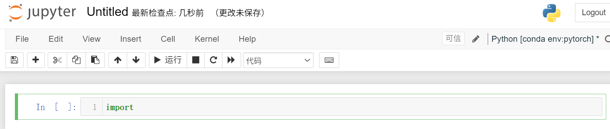
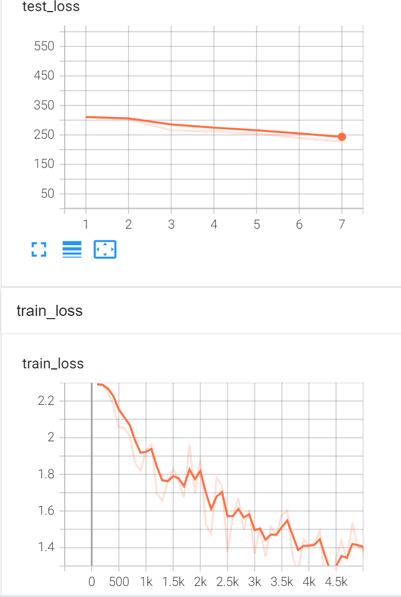
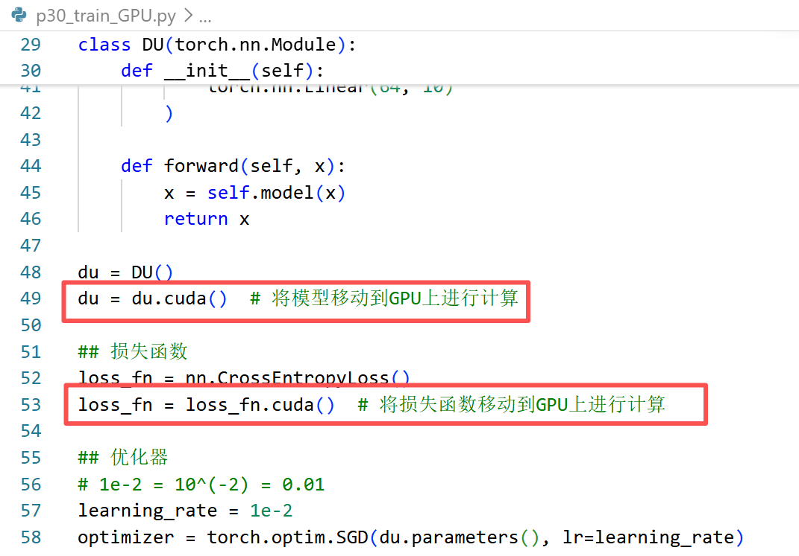
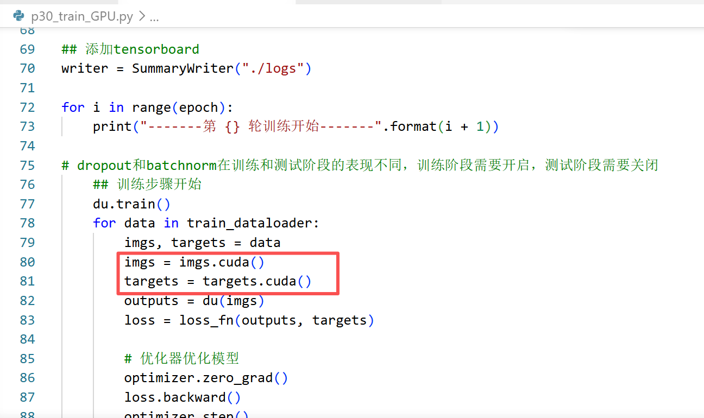
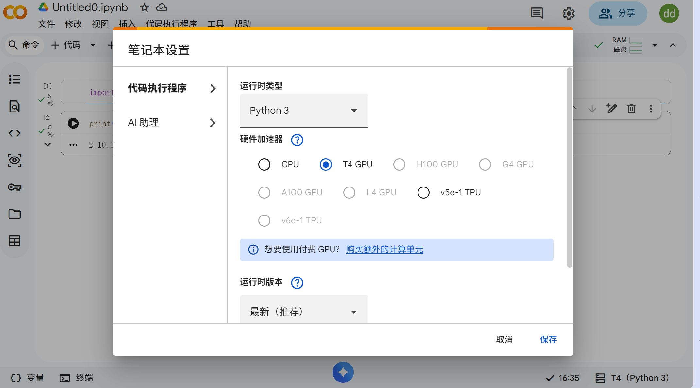
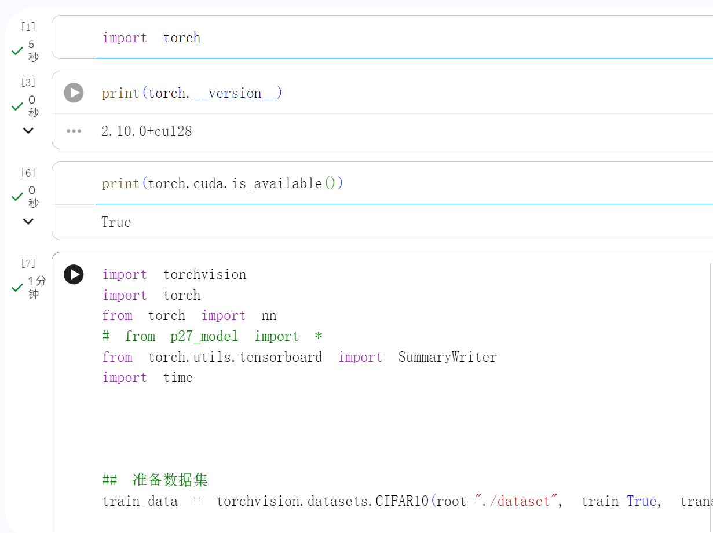
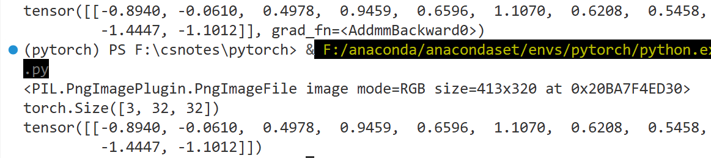

第2章 CNN算法原理            
第3章 pytorch框架和环境安装                    
| 章节                   | 看哪些                               | 为什么                                                             |
| -------------------- | --------------------------------- | --------------------------------------------------------------- |
| **第 2 章：神经网络基础**     | **2.1、2.3、2.6、2.8、2.9、2.10、2.11** | 搞懂前向传播、激活函数、损失函数、梯度下降、反向传播。面试会问，后面学 Transformer 也需要。            |
| **第 3 章：PyTorch 环境** | **3.1、3.3、3.5、3.6、3.7、3.8**       | 能把 PyTorch 跑起来。3.2 PyCharm 可跳过；3.4 显卡驱动只有你本地装 GPU 才看。           |
| **第 4 章：训练模板实战**     | **4.13–4.27 全看**                  | 这是最重要的部分：模型搭建、DataLoader、训练循环、验证、保存最优模型、测试、推理。大模型微调本质上也是类似训练流程。 |
| **第 4 章补充**          | **4.8 Dropout**                   | 正则化基础，后面理解深度学习训练有用。                                             |

## 常用的导入
```python
import torch
import torchvision
from torch.utils.data import DataLoader
from torch import nn
from torch.utils.tensorboard import SummaryWriter
```
 


## p1环境配置安装
打开Anaconda Prompt窗口，显示(base)            
创建环境 - ``conda create -n pytorch python=3.6``名为"pytorch"                  
激活环境 - ``conda activate pytorch``进入到该环境中          
查看包 - ``(pytorch) C:\Users\Air>pip list``
查看gpu - ``https://www.nvidia.cn/geforce/technologies/cuda/supported-gpus/``或 开始菜单搜索“设备管理器”显示适配器，我的是集显，命令``(pytorch) C:\Users\Air>pip install torch torchvision torchaudio``，记得关梯子。
验证是否成功 - ``python``，然后``import torch``未报错                
 
 ## p2编辑器安装
 jupyter和pycharm                    
 [略过]   

 问题：jupyter默认在base环境里，需要在新环境中再次安装jupyter，``(pytorch) C:\Users\Air>conda install nb_conda``，打开notebook``(pytorch) C:\Users\Air>jupyter notebook``直接跳转到默认的浏览器中。
              
在pycharm中settings-project-interpreter设置环境               

## p3重要函数
``dir()``打开，看见         
``help()``说明书    

## p4 pycharm和jupyter区别
[略过]              
python文件的“块”是所有行代码，每次从头运行；                 
控制台一行一行运行，shift+回车也可以人为分块，但是阅读性差；                
jupyter可以人为分割代码块。     

## p5 加载数据
两个类``Dataset``和``Dataloader``
- Dataset:获取数据的索引及其label 
- Dataloader:为网络提供不同的数据形式             
  
## p6 DataSet使用
``read_data.py``           
1. 定义dataset类，展示如何获取每个图片的相对路径
2. 根据文件夹名称，为图片添加label
3. 另一种数据集形式——分为image文件夹和含有其对应的txt文件的label文件夹  
       
   
## p8 TensorBoardr使用
1. TensorBoard = 深度学习训练可视化神器    
2. 用来画 loss、准确率、看图片、看网络结构                    
3. PyTorch 自带，不用额外安装         
4. 查看训练不同阶段是图象的输出

``SummaryWriter()``创建一个writer对象，指定日志文件的保存路径，默认是当前目录下的logs文件夹。
``(pytorch) PS F:\csnotes\pytorch> tensorboard --logdir=logs --port=6007``可打开，指定端口防止多人使用服务器时冲突。       
只要``writer = SummaryWriter("logs")``不改，所有训练结果都会在logs文件夹中，可以从同一个端口进入。      


   - ``writer.add_scalar()``添加标量数据，如训练损失、准确率等。
     - 参数包括标签（如"loss/train"）、数值(y轴)和全局步骤（如epoch数或迭代次数）。这些数据会被记录到日志文件中，可以在TensorBoard中可视化。
   - ``writer.add_image()``添加图像数据，如输入图像、特征图等。
     - 参数包括标签（如"input/image"）、图像数据（通常是一个**张量**，如果是numpy需要reshape）和全局步骤。这些图像会被记录到日志文件中，可以在TensorBoard中查看。
   - ``writer.add_graph()``添加模型结构图。
     - 参数是模型实例和一个示例输入张量。TensorBoard会根据模型的计算图生成可视化的网络结构图，帮助理解模型的层次关系和数据流动。

**注意！**要开两个独立终端，否则运行python文件时会自动终止tensorboard进程，导致无法查看结果。


## p9-13 Transforms的使用
通过transforms.ToTensor()把PIL图片转换成tensor数据类型
1. transforms如何使用
2. tensor数据类型
```python
# 1. transforms如何使用
# 先实例化一个类
tensor_trans = transforms.ToTensor()
# 再调用实例化的对象
tensor_img = tensor_trans(img)
print(tensor_img)
print(tensor_img.shape)
# torch.Size([3, 512, 768])

# 2. tensor数据类型
# 包括了神经网络所需要的数据类型和维度
import cv2
cv_img = cv2.imread(img_path)

```


**注意**：安装opencv时，python的3.6版本总报错，可使用``pip install opencv-python==3.4.9.31``

## p10 常见的transforms
**输入**:
  ```python
   PIL-Image.open()
   tensor-transforms.ToTensor()
   narray- cv2.imread()
  ```

- ``Compose``先中心裁剪，再转成tensor数据类型,图片像素会从 0~255 变成 0~1
- ``ToTensor()``把PIL图片转换成tensor数据类型
- ``ToPILImage()``把tensor数据类型转换成PIL图片
- ``Normalize()``把tensor数据类型进行归一化，参数是均值和标准差，将每个通道分别归一化[-1,1] (自己训练时不是算一张图片的均值和标准差，而是算整个训练集的每个通道均值和标准差)
- ``Resize()``调整图片大小，参数是目标大小，输入是PIL图片，输出也是PIL图片
- ``RandomCrop()``随机裁剪图片，输入是PIL图片，按列表裁剪，若只有1个参数则裁剪成正方形
  

**总结：**
1. 关注输入和输出数据类型，输出需要自己print一下或者debug调试
2. 多看官方文档
3. 进入类，看方法的参数说明


## p14 数据集与transforms应用
```python
import torchvision
from torch.utils.tensorboard import SummaryWriter

dataset_transform = torchvision.transforms.Compose([torchvision.transforms.ToTensor()])

train_set = torchvision.datasets.CIFAR10(root="./dataset", train=True, download=True, transform=dataset_transform)
test_set = torchvision.datasets.CIFAR10(root="./dataset", train=False, download=True, transform=dataset_transform)

# img, target = train_set[0]
# print(img)
# print(target)
# print(train_set.classes[target])
# img.show()

print(train_set[0]) # 输出为tensor数据类型

writer = SummaryWriter("p14")
for i in range(10):
    img, target = train_set[i]
    writer.add_image("train_set", img, i)

writer.close() 
```

如果自己下载，使用迅雷，把下载的压缩包放到dataset文件夹下，然后``download=True``，会被解压。

## p15 数据加载器DataLoader
从dataset中怎么取数据，一次取多少，等等。              
如果报错``Broken pipe``，可能是``num_workers``参数设置过大，改成0就行了。                 

```python
import torchvision
from torch.utils.data import DataLoader
from torch.utils.tensorboard import SummaryWriter

test_data = torchvision.datasets.CIFAR10(root="./dataset", train=False, transform = torchvision.transforms.ToTensor())

# test_loader = DataLoader(dataset = test_data, batch_size=4, shuffle=True, num_workers=0, drop_last=False)

# # 测试集中第一张图片
# img, target = test_data[0]
# print(img)
# print(img.shape)    # torch.Size([3, 32, 32])
# print(target)

test_loader = DataLoader(dataset = test_data, batch_size=64, shuffle=True, num_workers=0, drop_last=False)

writer = SummaryWriter("dataloader")
step = 0
for data in test_loader:
    imgs, targets = data
    # print(imgs.shape)   # torch.Size([4, 3, 32, 32])
    # print(targets)   # torch.Size([4]) 
    writer.add_images("test_data", imgs, step)   
    step += 1

writer.close()
```
?不知道为什么我的两个epoch不一样


## p16 神经网络基本骨架
``nn.Module``是所有神经网络的基类，所有自定义的神经网络都应该继承这个类。它提供了很多有用的方法和属性，使得构建和训练神经网络更加方便。

```python
from torch import nn
import torch


class DU(nn.Module):
    def __init__(self):
        super().__init__()

    def forward(self, input):
        output = input + 1
        return output
    
du = DU()
x = torch.tensor(1.0)
y = du(x)
print(y)

```

## p17 卷积操作
```
import torch
import torch.nn.functional as F

input = torch.tensor([[1, 2, 0, 3, 1],
                      [0, 1, 2, 3, 1],
                      [1, 2, 0, 0, 1],  
                      [0, 1, 2, 3, 1],
                      [1, 2, 0, 3, 1]])

kernel = torch.tensor([[1, 2, 1],
                        [0, 1, 0],
                        [2, 1, 0]])

# print(input.shape)  # torch.Size([5, 5])
# print(kernel.shape)  # torch.Size([3, 3])

# 卷积操作要求输入和卷积核都是4维的张量，分别表示(batch_size, channels, height, width)。
input = torch.reshape(input, (1, 1, 5, 5))
kernel = torch.reshape(kernel, (1, 1, 3, 3))

# print(input.shape)
# print(kernel.shape)

output1 = F.conv2d(input, kernel, stride=1, padding=0)
print(output1)

output3 = F.conv2d(input, kernel, stride=1, padding=1)
print(output3)
```

## p18 神经网络——卷积层
常用的是二维卷积``conv2d``，参数包括:                   
- ``in_channels(int)``输入图像的通道输数                      
- ``out_channels(int) ``输出图像的通道数
- ``kernel_size(int or tuple)``卷积核的尺寸
- ``stride``卷积步长
- ``padding``填充
- ``padding_mode``填充模式，默认为0，可以选择"zeros"、"reflect"、"replicate"或"circular"


比如若in_channels=1，而out_channels=2，kernel_size=3，则会有两个卷积核，每个卷积核的尺寸为3x3，输入图像的通道数为1，输出图像的通道数为2。


注意：kernal_size在训练过程中不断调整?

```python
import torch
import torchvision
from torch.utils.data import DataLoader
from torch import nn
from torch.utils.tensorboard import SummaryWriter

dataset = torchvision.datasets.CIFAR10(root="./dataset", train=False, transform=torchvision.transforms.ToTensor(), download=True)

dataloader = DataLoader(dataset, batch_size=64)

class DU(nn.Module):
    ## 初始化函数，定义卷积层
    def __init__(self):
        ## super()函数是用来调用父类（在这里是nn.Module）的初始化方法的。它确保了父类的初始化代码被正确执行，从而使得子类能够正确地继承和使用父类的功能。
        super(DU, self).__init__()
        self.conv1 = nn.Conv2d(in_channels=3, out_channels=6, kernel_size=3, stride=1, padding=0)
    ## forward函数定义了前向传播的过程，即输入数据如何通过网络层进行计算并得到输出结果。在这个函数中，我们将输入数据x传递给卷积层conv1，并返回卷积层的输出结果。
    def forward(self, x):
        x = self.conv1(x)
        return x

du = DU()
print(du)
# DU((conv1): Conv2d(3, 6, kernel_size=(3, 3), stride=(1, 1)))

writer = SummaryWriter("logs")
step = 0
for data in dataloader:
    imgs, targets = data # 原尺寸64*3*32*32
    output = du(imgs)
    print(output.shape)  # torch.Size([64, 6, 30, 30])
    writer.add_images("input", imgs, step)
    ## 由于tensorboard无法输出6通道照片，改变batchsize，使其成为3通道
    output = torch.reshape(output, (-1, 3, 30, 30)) #-1表示自动计算维度，3是通道数，30*30是卷积后的尺寸
    writer.add_images("output", output, step)
    step = step+1
```

?!有些step图片未成功显示，根据弹幕，在浏览器添加插件：https://chromewebstore.google.com/detail/header-editor-%E2%80%94-http-requ/cjeccfigffehhiggbegenenmchobeabj?hl=zh-CN&utm_source=ext_sidebar

## p19 最大池化层
【这节不写代码】                       
``nn.MaxPool2d``，参数包括：kernel_size表示池化窗口的大小，stride表示池化操作的步长(默认步长是池化核大小)，padding表示池化操作的填充，dilation表示池化窗口元素之间的间距，return_indices表示是否返回池化窗口内最大值的索引，ceil_mode表示是否使用ceil函数来计算输出尺寸(ceil向上取整, floor向下取整)。

## p20 非线性激活
【这节不写代码】
为神经网络引入一些非线性因素，使得神经网络能够学习和表示更复杂的函数关系。常见的激活函数包括ReLU、Sigmoid、Tanh等。激活函数通常在卷积层或全连接层之后使用，以增加模型的表达能力。                   
``ReLU``函数的定义是f(x) = max(0, x)，它将输入中的负值置为0，正值保持不变。ReLU函数在训练深度神经网络时非常常用，因为它能够有效地缓解梯度消失问题，并且计算效率较高。``inplace``参数表示是否进行原地操作，即直接修改输入数据而不是创建新的输出数据，默认为False。
        
``Sigmoid``函数的定义是f(x) = 1 / (1 + exp(-x))，它将输入映射到0和1之间，常用于二分类问题的输出层。                     
``Tanh``函数的定义是f(x) = (exp(x) - exp(-x)) / (exp(x) + exp(-x))，它将输入映射到-1和1之间，常用于隐藏层的激活函数。


对于图像而言，ReLU变化并不明显，因为它只将负值置为0，而正值保持不变。


## p21 线性层及其它层（略讲）
【这节不写代码】
1.  归一化层
``nn.BatchNorm2d``，参数包括num_features表示输入的特征数量，eps表示为了数值稳定性而添加到分母中的小值，momentum表示用于计算运行时均值和方差的动量，affine表示是否有可学习的仿射参数，track_running_stats表示是否跟踪运行时的均值和方差。               
``nn.LayerNorm``，参数包括normalized_shape表示输入的特征数量，eps表示为了数值稳定性而添加到分母中的小值，elementwise_affine表示是否有可学习的仿射参数。            

BN和LN的区别：BN是对每个batch进行归一化，LN是对每个样本进行归一化。BN适用于卷积层，LN适用于全连接层。BN在训练时会计算每个batch的均值和方差，而LN在训练时会计算每个样本的均值和方差。BN在测试时会使用训练时计算的均值和方差，而LN在测试时会使用当前样本的均值和方差。

2. Transform层

3. Dropout层
``nn.Dropout``，参数包括p表示丢弃的概率，inplace表示是否进行原地操作。Dropout层在训练过程中会随机丢弃一部分神经元，被设置为0，以防止过拟合，而其他神经元的输出会被除以(1-p)以保持整体的输出水平不变。

4. 全连接层
``nn.Linear``，参数包括in_features表示输入特征的数量，out_features表示输出特征的数量，bias表示是否使用偏置项。全连接层将输入的特征映射到输出特征空间中，每个输出特征都是输入特征的线性组合。          
在 PyTorch 的 CNN 中，卷积层输出的是四维张量，一般形状是：``[batch_size, channels, height, width]``，但是全连接层 ``nn.Linear`` 需要二维输入，于是保留batch_size维度，把后面三个维度展平，(先按通道 channel 排，再按行 height 排，再按列 width 排)————————直接用``torch.flatten(x, start_dim=1)``，x是输入的张量，start_dim=1表示从第1维开始展平，保留第0维（batch_size）。


## p22 神经网络搭建实战
复现一个神经网络，搭建并验证          
```python
from torch import nn
from torch.nn import Conv2d, MaxPool2d, Flatten, Linear
from torch import torch
from torch.utils.tensorboard import SummaryWriter

class DU(nn.Module):
    def __init__(self):
        super(DU, self).__init__()
        # # 根据要求的输入和输出尺寸定义卷积层的步长和填充
        # self.conv1 = Conv2d(3, 32, 5, stride=1, padding=2)
        # self.maxpool1 = MaxPool2d(kernel_size=2, stride=2)
        # self.conv2 = Conv2d(32, 32, 5, stride=1, padding=2)
        # self.maxpool2 = MaxPool2d(kernel_size=2, stride=2)
        # self.conv3 = Conv2d(32, 64, 5, stride=1, padding=2)
        # self.maxpool3 = self.maxpool2
        # self.flatten = Flatten()
        # self.relu = ReLU(inplace=True)
        # self.dropout = Dropout(p=0.5)
        # self.fc1 = Linear(64 * 4 * 4, 64) 
        # self.fc2 = Linear(64, 10)
        # # 输出类别数为10

        self.model1 = nn.Sequential(
            Conv2d(3, 32, 5, stride=1, padding=2),
            MaxPool2d(kernel_size=2, stride=2),
            Conv2d(32, 32, 5, stride=1, padding=2),
            MaxPool2d(kernel_size=2, stride=2),
            Conv2d(32, 64, 5, stride=1, padding=2),
            MaxPool2d(kernel_size=2, stride=2),
            Flatten(),
            Linear(64 * 4 * 4, 64),
            Linear(64, 10)
        )

    # def forward(self, x):
    #     x = self.conv1(x)  # 卷积层
    #     x = self.maxpool1(x)   # 池化层
    #     x = self.conv2(x)  # 卷积层
    #     x = self.maxpool2(x)   # 池化层
    #     x = self.conv3(x)  # 卷积层
    #     x = self.maxpool3(x)   # 池化层
    #     x = self.flatten(x)  # 展平操作
    #     x = self.fc1(x)     # 全连接层
    #     x = self.fc2(x)     # 全连接层
    #     return x

    def forward(self, x):
        x = self.model1(x)
        return x

du = DU()
print(du)

## 对网络进行简单的检验
input = torch.ones(64, 3, 32, 32)  
# 模拟一个输入图像，batch_size=64，channels=3，height=32，width=32
output = du(input)
print(output.shape)  
# 输出的形状应该是[64, 10]，表示64个样本，每个样本有10个类别的输出

writer = SummaryWriter("./logs_seq")
writer.add_graph(du, input)
writer.close()
```

## p23 损失函数与反向传播
1. 计算实际输出与目标之间的差距，衡量模型性能的指标。常见的损失函数包括均方误差（MSE）、交叉熵损失（CrossEntropyLoss）等。损失函数的选择取决于具体的任务和数据类型。
``L1Loss``：计算预测值与目标值之间的**绝对差**的(mean或sum或none);            
``MSELoss``：计算预测值与目标值之间的**平方差**的(mean或sum或none);            
``CrossEntropyLoss``交叉熵损失函数：用于多分类问题，结合了**softmax**和负对数似然损失，适用于分类任务。它计算预测类别概率分布与真实类别之间的差距。


2. 反向传播是神经网络训练中的关键步骤，通过计算损失函数相对于模型参数的梯度，来更新模型参数以最小化损失。PyTorch 中的自动求导机制使得反向传播的实现非常方便，只需要调用``loss.backward()``即可自动计算梯度。
   
```python
from torch import nn
from torch.nn import Conv2d, MaxPool2d, Flatten, Linear
from torch import torch
from torch.utils.tensorboard import SummaryWriter
import torchvision

dataset = torchvision.datasets.CIFAR10(root="./dataset", train=False, transform=torchvision.transforms.ToTensor(), download=False)
dataloader = torch.utils.data.DataLoader(dataset, batch_size=64)


class DU(nn.Module):
    def __init__(self):
        super(DU, self).__init__()
        self.model1 = nn.Sequential(
            Conv2d(3, 32, 5, stride=1, padding=2),
            MaxPool2d(kernel_size=2, stride=2),
            Conv2d(32, 32, 5, stride=1, padding=2),
            MaxPool2d(kernel_size=2, stride=2),
            Conv2d(32, 64, 5, stride=1, padding=2),
            MaxPool2d(kernel_size=2, stride=2),
            Flatten(),
            Linear(64 * 4 * 4, 64),
            Linear(64, 10)
        )


    def forward(self, x):
        x = self.model1(x)
        return x


loss = nn.CrossEntropyLoss()

du = DU()
for data in dataloader:
    imgs, targets = data
    outputs = du(imgs)
    result_loss = loss(outputs, targets)
    result_loss.backward()
    print(result_loss)

```

## p24 优化器
优化器是用于更新模型参数以最小化损失函数的算法。常见的优化器包括随机梯度下降（SGD）、Adam、RMSprop等。                 
优化器通过计算损失函数相对于模型参数的梯度，并根据这些梯度来调整参数的值，以提高模型的性能。
``torch.optim``模块提供了多种优化算法，可以根据具体任务和数据类型选择合适的优化器。使用优化器时，需要将模型参数传递给优化器，并在每次迭代中调用``optimizer.step()``来更新参数。

```python
du = DU()
optim = torch.optim.SGD(params=du.parameters(), lr=0.01)
for epoch in range(10):
    running_loss = 0.0
    for data in dataloader:
        imgs, targets = data
        outputs = du(imgs)
        result_loss = loss(outputs, targets)
        optim.zero_grad()
        result_loss.backward()
        optim.step()
        running_loss += result_loss.item()
    print(running_loss)
```
  
## p25 现有模型的使用及修改
可以下载别人训练好的模型，直接使用，也可以在此基础上进行修改和微调。PyTorch 提供了许多预训练的模型，如 VGG、ResNet、Inception 等，可以通过 torchvision.models 模块轻松加载和使用这些模型。预训练模型已经在大规模数据集上进行了训练，具有较好的特征提取能力，可以用于**迁移学习或作为基线模型**进行比较。

```python
import torchvision
vgg16_false = torchvision.models.vgg16(pretrained=False)
vgg16_true = torchvision.models.vgg16(pretrained=True)

# 添加层
vgg16_true.add_module("new_layer", nn.Linear(1000, 10))  # 添加一个新的全连接层，输入特征数为1000，输出特征数为10
vgg16_true.classifier.add_module("new_layer", nn.Linear(1000, 10))  # 修改原有的全连接层，输入特征数为1000，输出特征数为10

# 替换层
vgg16_true.classifier[6] = nn.Linear(4096, 10)  # 替换原有的全连接层，输入特征数为4096，输出特征数为10
# 
```

## p26 模型的保存和加载
- 保存
```python
import torchvision
import torch
vgg16 = torchvision.models.vgg16(pretrained=False)

# 保存方式1
torch.save(vgg16, 'vgg16_method1.pth')

# 保存方式2 只保存模型参数
torch.save(vgg16.state_dict(), 'vgg16_method2.pth')
```

- 加载
```python
import torch
import torchvision
## 保存和加载自己的模型时
from p26_model_save import *

# # 加载方式1
# model = torch.load('vgg16_method1.pth')
# print(model)

# 加载方式2
vgg16 = torchvision.models.vgg16(pretrained=False)
vgg16.load_state_dict(torch.load('vgg16_method2.pth'))
# model = torch.load('vgg16_method2.pth')
print(vgg16)
```

## p27-29 完整的模型训练讨论
行方向是第0维，表示不同图片；列方向是第1维，表示不同类别标签。          


dropout和batchnorm层在训练和测试阶段的表现不同，训练阶段需要开启，测试阶段需要关闭。                  


1. 准备数据集
2. 搭建神经网络
3. 定义损失函数和优化器
4. 训练和测试循环，取数据-优化-loss-测试-误差
5. 保存模型

```python
import torchvision
import torch
from torch import nn
from p27_model import *
from torch.utils.tensorboard import SummaryWriter

## 准备数据集
train_data = torchvision.datasets.CIFAR10(root="./dataset", train=True, transform=torchvision.transforms.ToTensor(), download=True)

test_data = torchvision.datasets.CIFAR10(root="./dataset", train=False, transform=torchvision.transforms.ToTensor(), download=True)

train_data_size = len(train_data)
test_data_size = len(test_data)
print("训练数据集的长度为：{}".format(train_data_size))
print("测试数据集的长度为：{}".format(test_data_size))

## 利用dataloader加载数据集
train_dataloader = torch.utils.data.DataLoader(train_data, batch_size=64)
test_dataloader = torch.utils.data.DataLoader(test_data, batch_size=64)

## 10分类搭建神经网络
du = DU()

## 损失函数
loss_fn = nn.CrossEntropyLoss()

## 优化器
# 1e-2 = 10^(-2) = 0.01
learning_rate = 1e-2
optimizer = torch.optim.SGD(du.parameters(), lr=learning_rate)

## 设置训练参数
# 记录训练的次数
total_train_step = 0
# 记录测试的次数
total_test_step = 0
# 训练的轮数
epoch = 10

## 添加tensorboard
writer = SummaryWriter("./logs")

for i in range(epoch):
    print("-------第 {} 轮训练开始-------".format(i + 1))

# dropout和batchnorm在训练和测试阶段的表现不同，训练阶段需要开启，测试阶段需要关闭
    ## 训练步骤开始
    du.train()
    for data in train_dataloader:
        imgs, targets = data
        outputs = du(imgs)
        loss = loss_fn(outputs, targets)

        # 优化器优化模型
        optimizer.zero_grad()
        loss.backward()
        optimizer.step()

        total_train_step += 1
        # print("训练次数：{}，Loss：{}".format(total_train_step, loss.item()))

        if total_train_step % 100 == 0:
            print("训练次数：{}，Loss：{}".format(total_train_step, loss.item()))
            # scalar(标量) -- 记录训练的次数和loss值
            writer.add_scalar("train_loss", loss.item(), total_train_step)

    ## 测试步骤开始
    du.eval()
    total_test_loss = 0
    total_accuracy = 0

    # torch.no_grad()表示在该代码块中不需要计算梯度，节省内存和计算资源
    with torch.no_grad():
        for data in test_dataloader:
            imgs, targets = data
            outputs = du(imgs)
            loss = loss_fn(outputs, targets)
            total_test_loss += loss.item()
            # argmax(1)表示在第1维度上取最大值的索引，即预测的类别标签
            accuracy = (outputs.argmax(1) == targets).sum()
            total_accuracy += accuracy

    print("整体测试集上的Loss：{}".format(total_test_loss))
    print("整体测试集上的正确率：{}".format(total_accuracy / test_data_size))
    total_test_step += 1
    writer.add_scalar("test_loss", total_test_loss, total_test_step)
    writer.add_scalar("test_accuracy", total_accuracy / test_data_size, total_test_step)


    ## 保存每一轮训练的模型
    torch.save(du, "du_{}.pth".format(i))
    print("模型已保存")
    # 保存方式2
    # torch.save(du.state_dict(), "du_{}.pth".format(i))

writer.close()
```


## p30-31 利用GPU训练(10:45)
### 方法1
**注意**：只有数据是必须重新赋值
- 网络模型
- 训练和测试的数据
- 损失函数
- .cuda()方法将数据或模型移动到GPU上进行计算




Google Colab免费提供GPU资源





### 方法2
``.to(device)``方法将数据或模型移动到指定的设备上进行计算，device可以是CPU或GPU。使用to(device)方法可以更灵活地管理设备资源，适用于需要在不同设备之间切换的情况。

```python
## 定义训练的设备
device = torch.device("cuda" if torch.cuda.is_available() else "cpu")

du = DU()
# du = du.cuda()  # 将模型移动到GPU上进行计算
du = du.to(device) 

## 损失函数
loss_fn = nn.CrossEntropyLoss()
# loss_fn = loss_fn.cuda()  # 将损失函数移动到GPU上进行计算
loss_fn = loss_fn.to(device)  


## 优化器
# 1e-2 = 10^(-2) = 0.01
learning_rate = 1e-2
optimizer = torch.optim.SGD(du.parameters(), lr=learning_rate)

    for data in train_dataloader:
        imgs, targets = data
        imgs = imgs.to(device)
        targets = targets.to(device)
    with torch.no_grad():
        for data in test_dataloader:
            imgs, targets = data
            imgs = imgs.to(device)
            targets = targets.to(device)

```
## p32 demo套路
利用已经训练好的模型，给它提供输入数据，得到输出结果，并对结果进行分析和解释。这个过程可以帮助我们理解模型的行为和性能，以及模型在实际应用中的表现。                     

对于输入的image，改变尺寸时注意batchsize设为1！                  

加载模型时，注意要和保存模型时的方式一致，如果保存的是**整个模型**，就**直接加载**；如果保存的是**模型参数**，就需要**先定义模型结构，再加载参数**。


【注意】：


### CPU版
```python
from PIL import Image
import torch
import torchvision
from torch import nn

## 输入的数据
### 一个点！
image_path = './dataset/dog.png'
image = Image.open(image_path)
print(image)    # mode=RGB size=413x320

transform = torchvision.transforms.Compose([
    torchvision.transforms.Resize((32, 32)),
    torchvision.transforms.ToTensor()
])
image = transform(image)
print(image.shape)    # [3, 32, 32]
image = torch.reshape(image, (1, 3, 32, 32))

## 因为保存的是模型结构和参数，所以加载的时候直接加载模型就行了
model = torch.load("p27_du_0.pth")
# 因为这两个文件在一个层级，不需要加路径
# print(model)

## 进入测试模式
model.eval()
with torch.no_grad():
    output = model(image)
print(output)
```

### GPU版
从colab下载利用GPU训练后保存的模型

```python
## 下载GPU版模型,需要指定map_location参数，否则会报错
model_gpu = torch.load("p30_du_9.pth", map_location=torch.device("cpu"))
```

## p33 github源码查看
1. 进入github，搜索pytorch，找star最多的
2. 看readme，了解这个项目的功能和使用方法
3. 查看示例代码，学习如何使用该框架
......


