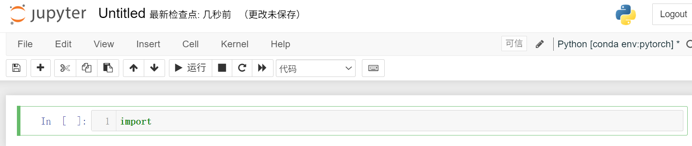

第2章 CNN算法原理            
第3章 pytorch框架和环境安装                    
| 章节                   | 看哪些                               | 为什么                                                             |
| -------------------- | --------------------------------- | --------------------------------------------------------------- |
| **第 2 章：神经网络基础**     | **2.1、2.3、2.6、2.8、2.9、2.10、2.11** | 搞懂前向传播、激活函数、损失函数、梯度下降、反向传播。面试会问，后面学 Transformer 也需要。            |
| **第 3 章：PyTorch 环境** | **3.1、3.3、3.5、3.6、3.7、3.8**       | 能把 PyTorch 跑起来。3.2 PyCharm 可跳过；3.4 显卡驱动只有你本地装 GPU 才看。           |
| **第 4 章：训练模板实战**     | **4.13–4.27 全看**                  | 这是最重要的部分：模型搭建、DataLoader、训练循环、验证、保存最优模型、测试、推理。大模型微调本质上也是类似训练流程。 |
| **第 4 章补充**          | **4.8 Dropout**                   | 正则化基础，后面理解深度学习训练有用。                                             |

## p1环境配置安装
打开Anaconda Prompt窗口，显示(base)            
创建环境 - ``conda create -n pytorch python=3.6``名为"pytorch"                  
激活环境 - ``conda activate pytorch``进入到该环境中          
查看包 - ``(pytorch) C:\Users\Air>pip list``
查看gpu - ``https://www.nvidia.cn/geforce/technologies/cuda/supported-gpus/``或 开始菜单搜索“设备管理器”显示适配器，我的是集显，命令``(pytorch) C:\Users\Air>pip install torch torchvision torchaudio``，记得关梯子。
验证是否成功 - ``python``，然后``import torch``未报错                
 
 ## p2编辑器安装
 jupyter和pycharm                    
 [略过]   

 问题：jupyter默认在base环境里，需要在新环境中再次安装jupyter，``(pytorch) C:\Users\Air>conda install nb_conda``，打开notebook``(pytorch) C:\Users\Air>jupyter notebook``直接跳转到默认的浏览器中。
              
在pycharm中settings-project-interpreter设置环境               

## p3重要函数
``dir()``打开，看见         
``help()``说明书    

## p4 pycharm和jupyter区别
[略过]              
python文件的“块”是所有行代码，每次从头运行；                 
控制台一行一行运行，shift+回车也可以人为分块，但是阅读性差；                
jupyter可以人为分割代码块。     

## p5 加载数据
两个类``Dataset``和``Dataloader``
- Dataset:获取数据的索引及其label 
- Dataloader:为网络提供不同的数据形式             
- 
