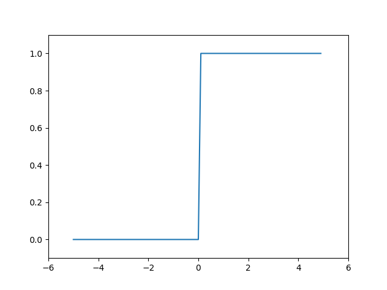
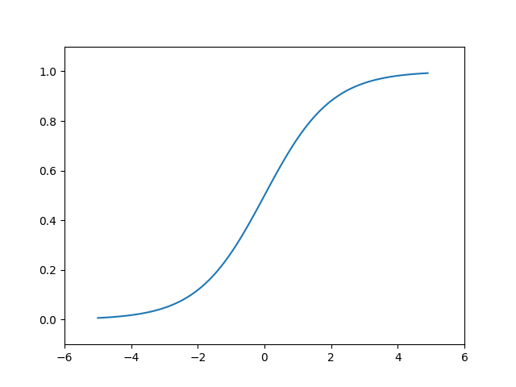
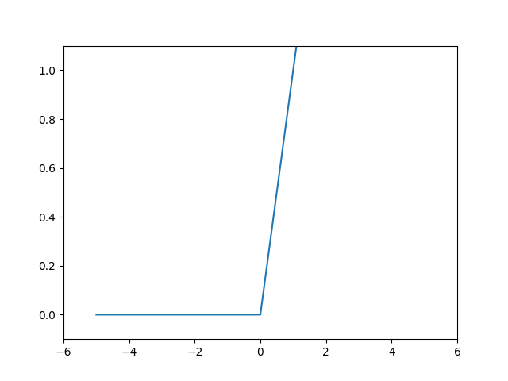

- [第一章 python入门](#第一章-python入门)
    - [1.4.2 类](#142-类)
  - [1.5 numpy](#15-numpy)
- [第2章 感知机](#第2章-感知机)
  - [2.1 是什么](#21-是什么)
  - [2.2 简单逻辑电路](#22-简单逻辑电路)
    - [2.2.1 与门](#221-与门)
    - [2.2.2 与非门和或门](#222-与非门和或门)
  - [2.3 感知机的实现](#23-感知机的实现)
  - [2.4 感知机局限性](#24-感知机局限性)
    - [2.4.1 异或门](#241-异或门)
    - [2.4.2 线性和非线性](#242-线性和非线性)
  - [2.5 多层感知机](#25-多层感知机)
- [第3章 神经网络](#第3章-神经网络)
  - [3.1 从感知机到神经网络](#31-从感知机到神经网络)
  - [3.2 激活函数](#32-激活函数)
  - [3.3 多维数组的运算](#33-多维数组的运算)
  - [3.4 3层神经网络的实现×](#34-3层神经网络的实现)
  - [3.5 输出层的设计](#35-输出层的设计)
    - [3.5.1 softmax函数](#351-softmax函数)
  - [3.6 手写数字识别应用](#36-手写数字识别应用)
    - [3.6.1 MNIST数据集](#361-mnist数据集)
    - [3.6.2 神经网络的推理处理](#362-神经网络的推理处理)
    - [3.6.3 批处理](#363-批处理)
- [第4章 神经网络的学习](#第4章-神经网络的学习)
  - [4.1 从数据中学习](#41-从数据中学习)
    - [4.1.1 数据驱动](#411-数据驱动)
    - [4.1.2 训练和测试](#412-训练和测试)
  - [4.2 损失函数](#42-损失函数)
    - [4.2.1 均方误差](#421-均方误差)
    - [4.2.2 交叉熵误差](#422-交叉熵误差)
    - [4.2.3 mini-batch学习](#423-mini-batch学习)
    - [4.2.4 mini-batch版交叉熵误差的实现](#424-mini-batch版交叉熵误差的实现)
    - [4.2.5 为什么设置损失函数](#425-为什么设置损失函数)
  - [4.3 数值微分](#43-数值微分)
    - [4.3.1 导数](#431-导数)
    - [4.3.2 × 数值微分的例子](#432--数值微分的例子)
    - [4.3.3 偏导数](#433-偏导数)
  - [4.4 梯度](#44-梯度)
    - [4.4.1 梯度法](#441-梯度法)
    - [4.4.2 神经网络的梯度](#442-神经网络的梯度)
  - [4.5 学习算法的实现](#45-学习算法的实现)
    - [4.5.1 2层神经网络的类](#451-2层神经网络的类)
    - [4.5.2 mini-batch的实现](#452-mini-batch的实现)
    - [4.5.3 基于测试数据的评价](#453-基于测试数据的评价)
- [第5章 误差反向传播法](#第5章-误差反向传播法)
  - [5.1 计算图](#51-计算图)
  - [5.2 链式法则](#52-链式法则)
  - [5.3 反向传播](#53-反向传播)
    - [5.3.1 加法节点的反向传播](#531-加法节点的反向传播)
    - [5.3.1 乘法节点的反向传播](#531-乘法节点的反向传播)
    - [5.3.3 苹果的例子](#533-苹果的例子)
  - [5.4 简单层的实现](#54-简单层的实现)
    - [5.4.1 乘法层的实现](#541-乘法层的实现)
    - [5.4.2 加法层的实现](#542-加法层的实现)
  - [5.5 激活函数层的实现](#55-激活函数层的实现)
    - [5.5.1 ReLU层](#551-relu层)
    - [5.5.2 Sigmoid层](#552-sigmoid层)
  - [5.6 Affine/Softmax层的实现](#56-affinesoftmax层的实现)
    - [5.6.2 批版本的Affine层](#562-批版本的affine层)
    - [5.6.3 Softmax-with-Loss层](#563-softmax-with-loss层)
  - [5.7 误差反向传播法的实现](#57-误差反向传播法的实现)
  - [5.8 小结](#58-小结)
- [第6章 与学习相关的技巧](#第6章-与学习相关的技巧)
  - [6.1 参数的更新](#61-参数的更新)
    - [6.1.1 探险家的故事](#611-探险家的故事)
    - [6.1.2 SGD](#612-sgd)
    - [6.1.2 SGD的缺点](#612-sgd的缺点)
    - [6.1.4 Momentum（保留惯性）](#614-momentum保留惯性)
    - [6.1.5 AdaGrad（学习率衰减）](#615-adagrad学习率衰减)
    - [6.1.6 Adam（融合 略讲）](#616-adam融合-略讲)
    - [6.1.7 使用哪种更新方法](#617-使用哪种更新方法)
    - [6.1.8 更新方法比较——基于MNIST数据集](#618-更新方法比较基于mnist数据集)
  - [6.2 权重的初始值](#62-权重的初始值)
    - [6.2.1 权重初始值可为0吗](#621-权重初始值可为0吗)
    - [6.2.2 隐藏层的激活值的分布（sigmoid）](#622-隐藏层的激活值的分布sigmoid)
    - [6.2.3 ReLU权重初始值](#623-relu权重初始值)
    - [6.2.4 权重初始值比较——基于MNIST数据集](#624-权重初始值比较基于mnist数据集)


# 第一章 python入门
### 1.4.2 类
用户自己定义新的类，可以自己创建数据类型、类的函数和属性。
```python
class 类名:
    def __init__(self, 参数, ...): #构造函数
        ...
    def 方法名1(self, 参数, ...): #方法1
```
``__init__``是进行初始化的方法，也称为**构造函数**，只有在生成类的实例时被调用一次。示例如下：  
类Man生成了实例m，类的构造函数（初始化方法）接收参数name，然后用这个参数初始化实例变量self.name。**实例变量**是存储在各个实例中的变量，通过在self后面添加属性名来生成或访问实例变量。  
```python
class Man:
    def __init__(self, name):
        self.name = name
        print("Initialized")
    def hello(self):
        print("Hello " + self.name + "!")
    def goodbye(self):
        print("Good-bye " + self.name + "!")

m = Man("David")
m.hello()
m.goodbye() 
```
cmd运行python文件：
```bash
C:\Users\Air>python F:\blogs\鱼书\man.py
Initialized
Hello David!
Good-bye David!
```

## 1.5 numpy
numpy数组可以进行“对应元素的”加减乘除运算（前提为数组元素个数相同），还可以和单一数值（标量）组合运算。   
``x = np.array([1.0, 2.0, 3.0])   
x-y  x/2``   

一维数组——向量，二维数组——矩阵。可将一般化后的向量或矩阵统称为**张量**。


**广播运算**：  
形状不同的数组之间的运算。


**访问元素**  
- 索引访问：

- for语句访问：

- 转为一维数组访问：

- 获取满足条件元素：
不等运算符后得到布尔型数组，利用它取出满足条件元素
    

# 第2章 感知机
## 2.1 是什么

$x_1$、$x_2$是输入信号，$y$是输出信号，$w_1$、$w_2$是权重，o是“神经元”或“节点”，它会计算传送过来的信号综合，超过“阈值$\theta$”才输出1，即神经元被激活。
## 2.2 简单逻辑电路  
- 人思考感知机的构造模型，并把训练数据交给计算机，计算机学习确定合适的参数。
- 3个门电路只有参数（权重和阈值）不同。   
  
### 2.2.1 与门   
| $x_1$ | $x_2$ | $y$ |  
| :-----:| :----: | :----: |    
| 0 | 0 | 0 |     
| 0 | 1 | 0 |  
| 1 | 0 | 0 |  
| 1 | 1 | 1 |    

用感知机表示这个门就是确定能满足上表的参数值组合。比如($w_1$，$w_2$，$\theta$)取(0.5,0.5,0.7)。
### 2.2.2 与非门和或门       
与非门：仅当$x_1$、$x_2$同时为1时输出0，其他输出1。比如($w_1$，$w_2$，$\theta$)取(-0.5,-0.5,-0.7)，只需把与门的参数取反。  
或门：只要有一个输入为1，就输出1。    

## 2.3 感知机的实现   


```python
# 定义接收参数x1和x2的AND函数 与门
def AND(x1, x2):
    # 初始化参数
    w1, w2, theta = 0.5, 0.5, 0.7
    tmp = x1*w1+x2*w2
    if tmp > theta:
        return 1
    else:
        return 0

AND(0, 0)
```


$w_1$、$w_2$是控制输入信号重要性的参数，偏置是调整神经元被激活的容易程度的参数。

```python
## 导入权重和偏置,计算2.2式
import numpy as np
x = np.array([0,1])
w = np.array([0.5, 0.5])
b = -0.7
print(w*x)
# [0.  0.5]
print(np.sum(w*x))
# 0.5
print(np.sum(w*x)+b)
# -0.19999999999999996

## 与门
def AND(x1, x2):
    x = np.array([x1, x2])
    w = np.array([0.5, 0.5])
    b = -0.7
    tmp = np.sum(w*x) + b
    if tmp <= 0:
       return 0
    else:
       return 1
```

## 2.4 感知机局限性
### 2.4.1 异或门
异或门也称为逻辑异或电路，仅当有1个1时输出1。
- 或门  
  参数为(-0.5, 1.0, 1.0)

- 异或门  
  无法用直线分割空间
   

### 2.4.2 线性和非线性
感知机的局限性在于它只能表示由一条直线分割的空间。曲线分割而成的空间称为**非线性**空间，直线分割而成的空间称为**线性**空间   

## 2.5 多层感知机
  
上、下、右分别为与非门、或门、与门。  
```python
def XOR(x1, x2):
    s1 = NAND(x1, x2)
    s2 = OR(x1, x2)
    y = AND(s1, s2)
    return y
```     
与门、或门是单层感知机，异或门是2层感知机。通过叠加层，感知机能更加灵活的表示，理论上还可以表示计算机进行的处理。
   


# 第3章 神经网络
## 3.1 从感知机到神经网络   
图中网络一共由3层神经元构成，其中中间层也称为隐藏层，但实际上只有2层神经元有权重。    


激活函数将输入信号的总和转换为输出。  
感知机中神经元之间流动的是0或1的二元信号，而神经网络中流动的是连续的实数值信号。  
**朴素感知机**指单层网络，指的是激活函数使用了阶跃函数的模型；  
**多层感知机**指神经网络，即使用sigmoid函数等平滑的激活函数的多层网络。

## 3.2 激活函数
神经网络的激活函数必须使用非线性函数，若使用线性函数的话，加深神经网络的层数没有意义了。   
例如：把$h(x)=c(x)$作为激活函数，添加隐藏层对应3层神经网络$y(x)=h(h(h(x)))$与$y(x)=a(x)$等价，其中$a=c^3$，无法发挥多层网络带来的优势。
1. **阶跃函数**  
以0为界，输出从0切换为1，它的值呈阶梯式变化。
    ```python
    ## 阶跃函数
    def step_function(x):
        if x > 0:
            return 1
        else:
            return 0
    ```
    但是这里的参数x只能接受实数（浮点数），不允许取numpy数组，考虑如下操作：  
    ```python
    import numpy as np
    def step_function(x):
        return np.array(x>0, dtype=np.int_)
        # y = x >0 #得到布尔型数组
        # return y.astype(np.int) #布尔型转换为int型
    ```
    <font color=red>报错原因！</font>最新的numpy已移除.int，应使用.int_。   
    绘制阶跃函数如下：    
    ```python
    x = np.arange(-5.0, 5.0, 0.1) 
    # 在-5.0到5.0范围内，以0.1为单位
    y = step_function(x)
    print(y)
    plt.plot(x, y)
    plt.xlim(-6, 6)
    plt.ylim(-0.1, 1.1)
    # 指定y轴范围
    plt.show()
    ```
    

2. **sigmoid函数**     

    $$h(x)=\frac{1}{1+exp(-x)}$$
    ```python
    def sigmoid(x):
        return 1/(1+np.exp(-x))
    x = np.arange(-5.0, 5.0, 0.1) # 在-5.0到5.0范围内，以0.1为单位
    y = sigmoid(x)
    print(y)
    plt.plot(x, y)
    plt.xlim(-6, 6)
    plt.ylim(-0.1, 1.1) #指定y轴范围
    plt.show()
    ```
      

3. ReLU函数
   输入大于0时，直接输出该值；输入小于等于0时，输出0。
   ```python
    def relu(x):
        return np.maximum(0, x)
    x = np.arange(-5.0, 5.0, 0.1) 
    y = relu(x)
    print(y)
    plt.plot(x, y)
    plt.xlim(-6, 6)
    plt.ylim(-0.1, 1.1) 
    plt.show()
   ```   
   

## 3.3 多维数组的运算  
  
上述网络省略了偏置和激活函数，只有权重。  
<font color=red>一维数组</font>维度(2,)到底是2×1还是1×2


## 3.4 3层神经网络的实现×


## 3.5 输出层的设计  
输出层所用激活函数：回归-恒等函数，二元分类-sigmoid函数，多元分类-softmax函数。  
### 3.5.1 softmax函数
假设输出层共有$n$个神经元，计算第$k$个神经元的输出$y_k$，分子是输入信号$a_k$的指数函数，分母是所有输入信号的指数函数的和。
$$y_k = \frac{exp(a_k)}{\sum_{i=1}^{n}exp(a_i)}$$   
由图可以看出，输出层的各个神经元都受到所有输入信号的影响。
   
可以根据函数公式实现softmax：
```python
def softmax(a):
    # 输入a是一个数组
    exp_a = np.exp(a)
    sum_exp_a = np.sum(exp_a)
    y = exp_a / sum_exp_a
    return y
```
但是当输入过大时，分子的结果会返回一个表示无穷大的inf，如果在这些超大值之间进行除法运算，结果会出现“不确定nan(not a number)”的情况，即**溢出**。于是对其进行改造，这里的$C'$可以使用任何值，但是为了防止溢出，一般使用输入信号中的最大值。
   
可以根据函数公式实现softmax：
```python
def softmax(a):
    c = np.max(a)
    exp_a = np.exp(a - c)
    sum_exp_a = np.sum(exp_a)
    y = exp_a / sum_exp_a 
    return y 
```
softmax函数输出0.0-1.0之间的实数，且输出值总和为1，所以可以把输出解释为“概率”。    
神经网络只把输出值最大的神经元所对应的类别作为识别结果，即使使用softmax函数，输出值最大的神经元位置也不会改变。  
对于分类问题，输出层神经元数量一般设定为类别的数量。   
**!** 求解机器学习问题的推理（分类）阶段一般会省略输出层的softmax函数。  

## 3.6 手写数字识别应用
假设学习（训练）已全部结束，使用学习到的参数先实现神经网络的“推理处理”，也称为**前向传播**。  
### 3.6.1 MNIST数据集
0到9的数字图像，6万张训练，1万张测试，28×28像素的灰度图像（1通道），各个像素取值在0到255之间。  
load_mnist函数以“（训练图像，训练标签），（测试图像，测试标签）”的形式返回读入的MNIST数据。此外，``load_mnist(flatten=True, normalize=False, one_hot_lable=False)``有3个参数。   
- `flatten`是否展开输入图像为一维数组，若为True——由784个元素构成的一维数组；若为False——为1×28×28的三维数组。
- `normalize`是否将输入图像正规化为0.0-1.0的值。本例中将图像的各个像素值除以255将其限制在0.0-1.0之间。
- `one_hot_label`是否将标签保存为独热编码，例如[0,0,1,0,0,0,0,0,0,0]，若为False，只简单保存为7、2等。
``` python
## 导入数据
import numpy as np
import sys
import os
sys.path.append('F:\\blogs\\鱼书')  # 将父目录（dataset所在的目录）添加到系统路径中
'''会添加路径是，要用双斜杠\\'''
# 现在尝试导入
from dataset.mnist import load_mnist
(x_train, t_train), (x_test, t_test) = load_mnist(flatten=True, normalize=False)
print(x_train.shape)
print(t_train.shape)
print(x_test.shape)
print(t_test.shape)
#(60000, 784)
#(60000,)
#(10000, 784)
#(10000,)

## 显示图像
import numpy as np
from PIL import Image
def img_show(img):
    # 参数img是一个NumPy数组格式的图像
    pil_img = Image.fromarray(np.uint8(img))
    # 将输入的img数组转换为无符号8位整数类型
    pil_img.show()
img = x_train[0]
label = t_train[0]
print(label)
print(img.shape)
# (784,)
img = img.reshape(28, 28)
img_show(img)
```


### 3.6.2 神经网络的推理处理
首先，定义3个主要函数。
``` python
def get_data():
    (x_train, t_train), (x_test, t_test) = \
        load_mnist(flatten=True, normalize=True, one_hot_label=False)
    return x_test, t_test
    # 因为只推理不学习，所以不需要训练集，只用测试集获得识别精度

## pkl文件见CSDN
import pickle 
def init_network():
    with open("F:\\blogs\\鱼书\\dataset\\sample_weight.pkl", 'rb') as f:
        network = pickle.load(f)
    return  network

def predict(network, x):
    W1, W2, W3 = network['W1'], network['W2'], network['W3']
    b1, b2, b3 = network['b1'], network['b2'], network['b3']
    a1 = np.dot(x, W1) + b1
    z1 = sigmoid(a1)
    a2 = np.dot(z1, W2) + b2
    z2 = sigmoid(a2)
    a3 = np.dot(z2, W3) + b3
    y = softmax(a3)

    return y
```
使用以上3个函数实现推理，评价识别精度。   
首先获得数据集，生成网络，然后用for语句逐一取出保存在x中的图像数据，用predict函数进行分类。以numpy数组形式输出各个标签对应的概率，取最高者作为预测标签，与正确标签比较将回答正确的概率作为识别精度。 
``` python 
x, t = get_data()
import numpy as np
network = init_network()

accuracy_cnt = 0
for i in range(len(x)):
    y = predict(network,x[i])
    p = np.argmax(y)
    # 获取概率最高的索引
    if p == t[i]:
        accuracy_cnt += 1
print("Accuracy:" + str(float(accuracy_cnt) / len(x)))
```
### 3.6.3 批处理
关注各层权重的形状，输入一个由784个元素构成的一维数组后，输出一个有10个元素的一维数组。
```python
x , _ = get_data()
network = init_network()
W1, W2, W3 = network['W1'], network['W2'], network['W3']
x.shape #(10000, 784)
x[0].shape #(784,)
W1.shape #(784, 50)
W2.shape #(50, 100)
W3.shape #(100, 10)
```
  

现在考虑打包输入多张图像的情形。这种打包式的输入数据称为**批**。批处理一次性计算大型数组要比分开逐步计算各个小型数组速度更快。   
   
```python
x, t = get_data()
network = init_network()

batch_size = 100 # 批数量
accuracy_cnt = 0
for i in range(0,len(x), batch_size):
    # range(start, end, step)生成start到end-1
    x_batch = x[i:i+batch_size]
    # 取出[0:100],[100:200]
    y_batch = predict(network,x_batch)
    # 维度为100×10
    p = np.argmax(y_batch, axis=1)
    # 指定在100×10的数组中，沿着第1维方向找值最大的元素的索引
    ## 矩阵第0维是列方向，第1维视行方向
    accuracy_cnt += np.sum(p == t[i:i+batch_size])
# print(y_batch.shape)    
print("Accuracy:" + str(float(accuracy_cnt) / len(x)))
```
批处理前后的识别精确度都是0.9352。


# 第4章 神经网络的学习
本章，首先为进行神经网络的学习，导入损失函数这一指标；以这个损失函数为基准，找出使它的值最小的权重参数；为找到尽可能小的损失函数值，介绍了使用函数斜率的梯度法。    

“学习”从训练数据中自动获取最优权重参数的过程，目的是利用函数斜率的梯度法使损失函数最小。
## 4.1 从数据中学习
对于线性可分问题，第2章的感知机可以利用数据自动学习，通过有限次迭代调整权重，一定能找到有效超平面，学习过程会终止。但是非线性可分问题无法通过学习来解决。
### 4.1.1 数据驱动
神经网络中，连图像中包含的重要特征量也都是由机器学习的，对所有的问题都可以用同样的流程解决。深度学习也称为端到端机器学习，从原始数据（输入）中获得目标结果（输出）。


### 4.1.2 训练和测试
为增却评价模型的泛化能力，划分出训练数据学习，寻找最优参数，然后使用测试数据评价训练得到的模型的实际能力。**泛化能力**指处理未被观察过的数据的能力。**过拟合**是只对某个数据集过度拟合的状态。

## 4.2 损失函数
**损失函数**表示神经网络性能的“恶劣程度”指标，即当前的神经网络对监督数据在多大程度上不拟合、不一致。   
神经网络的学习通过损失函数表示现在的状态，然后以这个指标为基础寻找最优权重参数。损失函数可以使用任意函数，一般用均方误差和交叉熵误差。

### 4.2.1 均方误差
$$E = \frac{1}{2}\sum_{k}(y_k - t_k)^2$$
$y_k$表示神经网络的输出，$t_k$表示监督数据，$k$表示数据的维数。$t$是监督数据，将正确标签设为1，其他均设为0，即 **one-hot表示**。


```python
def mean_squared_error(y, t):
    return 0.5*np.sum((y - t)**2)
```


### 4.2.2 交叉熵误差
$$E = - \sum_{k}t_k\log y_k$$
其中log表示以e为底数的自然对数，$y_k$是神经网络输出，$t_k$是正确解标签。交叉熵误差的值是由正确解标签所对应的输出结果决定的。    
**WHY?** 因为独热编码，其他标签的t为0。不是因为这个，交叉熵误差的定义就是只关注正确标签，具体理解件4.2.4mini-batch的交叉熵误差实现）   
<font color=red>$y_k$一定小于等于1，故$\log y_k$一定小于等于0</font>。交叉熵误差随输出增大而减小，正确解标签对应的输出越大，交叉熵误差大于且接近0。
```python
def cross_entropy_error(y, t):
    delta = 1e-7
    return -np.sum(t * np.log(y + delta))
```
<font color=red>加上一个微小值</font>，防止出现log(0)时得到inf，导致后续计算无法进行。

### 4.2.3 mini-batch学习
前面的例子都是针对单个数据的损失函数，如果要求所有训练数据的损失函数的总和，以交叉熵误差为例，可写成下式： 
$$E = - \frac{1}{N}\sum_{n}\sum_{k}t_{nk}\log y_{nk}$$ 
除以N来求单个数据的“平均损失函数”，通过平均化，可以获得和训练数据的数量无关的统一指标。    

另外，实际应用中如果以全部数据为对象求损失函数的和，计算过程要花费较长时间，因此选出一部分即**mini-batch**，作为全部数据的“近似”。
```python
import numpy as np
import sys
sys.path.append('F:\\blogs\\鱼书')  # 将父目录（dataset所在的目录）添加到系统路径中
from dataset.mnist import load_mnist
(x_train, t_train), (x_test, t_test) = load_mnist(normalize=True, one_hot_label=True)
print(x_train.shape) #(60000, 784)
print(t_train.shape) #(60000, 10)
```
如何从训练数据中随机抽取10笔数据?
```python
train_size = x_train.shape[0]
batch_size = 10
batch_mask = np.random.choice(train_size, batch_size)
# 从0-59999之间随机选择10个数字，即被选数据的索引
x_batch = x_train[batch_mask]
t_batch = t_train[batch_mask]
```
### 4.2.4 mini-batch版交叉熵误差的实现
- 独热编码版
  ```python
  def cross_entropy_error(y, t):
    if y.ndim == 1:
        t = t.reshape(1, t.size)
        y = y.reshape(1, y.size)
        # 通过reshape将y和t转换为二维数组（形状为[1, 特征数]），统一批量样本和单个样本的处理逻辑
    batch_size = y.shape[0]
    return - np.sum(t * np.log(y + 1e-7)) / batch_size
  ```
- 正常标签版
  ```python
  def cross_entropy_error(y, t):
    if y.ndim == 1:
        t = t.reshape(1, t.size)
        y = y.reshape(1, y.size)
    batch_size = y.shape[0]
    return - np.sum(np.log(y[np.arange(batch_size) , t] + 1e-7)) / batch_size
  ```
  y[np.arange(batch_size), t]能抽出各个数据的正确解标签对应的神经网络的输出（在这个例子中，会生成NumPy数组[y[0,2], y[1,7], y[2,0], y[3,9], y[4,4]]）

### 4.2.5 为什么设置损失函数
**识别精度**：预测正确的样本数占总样本数的比例  ，是离散的，无法直接用于参数优化；    
**参数导数**：损失函数对该参数的偏导数即梯度，导数的符号决定参数调整方向，导数的大小决定调整的幅度，若损失函数对某个权重的导数为正，就需要减小它来降低损失。    

识别精度对微小的参数变化几乎没反应，即便有，它的值也是不连续地、突然地变化。若以识别精度为指标，则参数的导数在绝大多数地方都变为0.  

## 4.3 数值微分
梯度法使用梯度的信息决定前进的方向。本节介绍梯度是什么、有什么性质。   
**数值微分**就是用数值方法近似求解函数的导数的过程，利用微小的差分求倒数。而在基于数学式的推导求导数的过程，则成为**解析性求导**，得到的导数是不含误差的。

### 4.3.1 导数
导数就是表示某个瞬间的变化量。  

不好的求函数导数的程序：
```python
def numerical_diff(f, x):
    h = 10e-50
    return (f(x+h) - f(x)) / h
```
两处需改进，首选10e-50是有50个连续的0的微小值，会产生舍入误差，超出计算机可计算的范围，故将微小值改为1e-4；上述差分方法是前向差分，为减小误差，使用**中心差分**，以x为中心。   


### 4.3.2 × 数值微分的例子

### 4.3.3 偏导数
偏导数需要将多个变量中的某一个变量定为目标变量，并将其他变量固定为某个值得到新函数，对新定义的函数应用之前的求数值微分的函数，得到偏导数。

## 4.4 梯度
上一节中，按变量分别计算了两个变量的偏导数，现在想要一起计算。
**梯度**：像这样$(\frac{\partial{f}}{\partial{x_0}},\frac{\partial{f}}{\partial{x_1}})$由全部变量的偏导数汇总而成的向量称为梯度。   
``` python
def numerical_gradient(f, x):
    h = 1e-4 # 0.0001 避免舍入误差
    # 生成和x形状相同的数组，存储梯度
    grad = np.zeros_like(x) 
    for idx in range(x.size):
        # 暂存当前自变量的值
        tmp_val = x[idx]
        # f(x+h) 的计算
        x[idx] = tmp_val + h
        fxh1 = f(x)
        # f(x-h) 的计算
        x[idx] = tmp_val - h
        fxh2 = f(x)
        # 中心差分计算偏导
        grad[idx] = (fxh1 - fxh2) / (2*h)
        x[idx] = tmp_val # 还原
    return grad

```
× 书101-102 pass  

### 4.4.1 梯度法
一般而言，损失函数很复杂，空间庞大，通过不断地沿梯度方向前进来寻找函数最小值或尽可能小的值的方法就是**梯度法**。  
<font color=red>注意</font>：梯度表示的是个点处的函数值减小最多的方向，无法保证指向函数最小值。   


因为函数极小值、最小值和**鞍点**处的梯度为0。极小值是局部最小值；鞍点是从某个方向上刊是极大值，从另一个方向上看则是极小值的点。此外当函数很复杂且扁平时，学习可能会进入一个几乎平坦的地区，陷入无法前进的“学习高原”。 

$$x_0 = x_0 - \eta\frac{\partial{f}}{\partial{x_0}}$$
$$x_1 = x_1 - \eta\frac{\partial{f}}{\partial{x_1}}$$  
式中的$\eta$称为**学习率**，它决定在一次学习中，应该学习多少，以及在多大程度上更新参数。上式表示更新一次的式子，该步骤会反复执行，逐渐减小函数值。     
学习率需要事先确定某个值，比如0.01或0.001.但是学习率过大，会从初始值发散成一个很大的值，若学习率过小，基本上没更新就结束了。     
<font color=red>注意：</font>学习率也是超参数，但是和权重、偏置性质不同，不需要通过训练数据和学习算法自动获得，而是人工尝试设定。
```python
# f是函数，init_x是初始值，lr是学习率，step_num是梯度法的重复次数
def gradient_descent(f, init_x, lr=0.01, step_num=100):
    x = init_x

    for i in range(step_num):
        # 求梯度
        grad = numerical_gradient(f, x)
        x -= lr *grad
    
    return x
```
使用上述函数可以求函数的极小值甚至最小值。     

### 4.4.2 神经网络的梯度
梯度指损失函数关于权重参数的梯度。   

如式4.8所示，梯度的形状和权重参数形状相同，
```python
## 以一个简单的神经网络为例，实现求梯度的代码
import sys, os
sys.path.append(os.pardir)
import numpy as np
from ch03 import softmax
## 定义一个类
class simpleNet:
    # 该类只有一个实例变量，即权重参数
    def __init__ (self):
        # 用高斯分布进行权重参数初始化
        self.W = np.random.randn(2, 3)
    # 用于预测的方法
    def predict(self, x):
        return np.dot(x, self.W)
    # 用于求损失函数的方法
    def loss(self, x, t):
        z = self.predict(x)
        y = softmax(z)
        loss = cross_entropy_error(y, t)
        return loss 
## 1.用一下
net = simpleNet()
print(net.W)
#[[-0.97737611  0.01903064  0.80267347]
# [ 0.05686275  0.78809771 -0.14143243]]
x = np.array([0.6, 0.9])
p = net.predict(x)
print(p)
print(np.argmax(p))
t = np.array([0, 0, 1])
print(net.loss(x, t))## 以一个简单的神经网络为例，实现求梯度的代码
import sys, os
sys.path.append(os.pardir)
import numpy as np
from ch03 import softmax
## 定义一个类
class simpleNet:
    # 该类只有一个实例变量，即权重参数
    def __init__ (self):
        # 用高斯分布进行权重参数初始化
        self.W = np.random.randn(2, 3)
    # 用于预测的方法
    def predict(self, x):
        return np.dot(x, self.W)
    # 用于求损失函数的方法
    def loss(self, x, t):
        z = self.predict(x)
        y = softmax(z)
        loss = cross_entropy_error(y, t)
        return loss 
## 1.用一下
net = simpleNet()
print(net.W)
#[[-0.97737611  0.01903064  0.80267347]
# [ 0.05686275  0.78809771 -0.14143243]]
x = np.array([0.6, 0.9])
p = net.predict(x)
print(p)
print(np.argmax(p))
t = np.array([0, 0, 1])
print(net.loss(x, t))
## 2.求梯度
# # 定义函数这没懂？？？
# def f(W):
#     return net.loss(x, t)
# # numerical直接运行不对，因为前面定义的是一维数组的函数，源代码在common/gradient.py
# dW = numerical_gradient(f, net.W)
# print(dW)
```
- 这一节因为ch03代码的运行报错卡了很久

## 4.5 学习算法的实现 
本章以2层神经网络为对象，使用MNIST数据集学习，实现手写数字识别的神经网络。    
复习神经网络的学习步骤：
- 前提：神经网络存在合适的权重和偏置，调整权重和偏置以便拟合训练数据的过程称为“学习”
- 1.mini-batch：从训练数据中随机选取一部分数据，目标是减小其损失函数的值
- 2.计算梯度：需要求出各个权重参数的梯度，梯度表示损失函数的值减小最多的方向
- 3.更新参数：将权重沿梯度方向进行微小更新
- 4.重复：重复步骤1、2、3   

**SGD 随机梯度下降法**：对随机选择的数据进行梯度下降法，因为mini-batch的数据是随机选取的。  

### 4.5.1 2层神经网络的类

```python
### 4.5.1 2层神经网络的类
import sys, os
sys.path.append(os.pardir)
from common.functions import *
from common.gradient import numerical_gradient

class TwoLayerNet:

    def __init__(self, input_size, hidden_size, output_size, weight_init_std=0.01):
        # 初始化权重
        self.params = {}
        # 生成对应维数的二维数组/矩阵
        self.params['W1'] = weight_init_std * np.random.randn(input_size, hidden_size)
        self.params['b1'] = np.zeros(hidden_size)
        self.params['W2'] = weight_init_std * np.random.randn(hidden_size, output_size)
        self.params['b2'] = np.zeros(output_size)

    def predict(self, x):
        W1, W2 = self.params['W1'], self.params['W2']
        b1, b2 = self.params['b1'], self.params['b2']

        a1 = np.dot(x, W1) + b1
        z1 = sigmoid(a1)
        a2 = np.dot(z1, W2) + b2
        y = softmax(a2)

        return y
    
    def loss(self, x, t):
        y =self.predict(x)
        return cross_entropy_error(y, t)
    
    def accuracy(self, x, t):
        y = self.predict(x)
        # 类别索引
        y = np.argmax(y, axis=1)
        t = np.argmax(t, axis=1)
        accuracy = np.sum(y==t) / float(x.shape[0])
        return accuracy
    
    def numerical_gradient(self, x, t):
        loss_W = lambda W: self.loss(x, t)

        grads = {}
        # 损失函数对各个参数的梯度
        grads['W1'] = numerical_gradient(loss_W, self.params['W1'])
        grads['b1'] = numerical_gradient(loss_W, self.params['b1'])
        grads['W2'] = numerical_gradient(loss_W, self.params['W2'])
        grads['b2'] = numerical_gradient(loss_W, self.params['b2'])

        return grads
```

输入图像的大小是784（28*28），输出为10个类别，隐藏层自行设置为一个合适的值即可。这里权重使用符合高斯分布的随机数初始化，偏置使用0初始化，后续会学习如何设置权重参数的初始值。另外，下一章使用**误差反向传播法**更快速地计算梯度。   

### 4.5.2 mini-batch的实现
mini-batch大小为100，每次从60000个训练数据中随机取出100个数据（图像数据和正确解标签数据）。然后对这个包含100笔数据的mini-batch求梯度，使用SGD随机梯度下降法更新参数，设置梯度更新次数为10000。每更新一次，都对训练数据计算损失函数的值并添加到数组中。
```python
### 4.5.2 mini-batch的实现
import numpy as np
from dataset.mnist import load_mnist
# from two_layer_net import TwoLayerNet
(x_train, t_train), (x_test, t_test) = load_mnist(normalize=True, one_hot_label=True)

train_loss_list = []

# 超参数
iters_num = 10000  #梯度更新迭代次数
train_size = x_train.shape[0]
batch_size = 100
learning_rate = 0.1
network = TwoLayerNet(input_size=784, hidden_size=50, output_size=10)

for i in range(iters_num):
    batch_mask = np.random.choice(train_size, batch_size)
    x_batch = x_train[batch_mask]
    t_batch = t_train[batch_mask]

    # 计算梯度
    grad = network.numerical_gradient(x_batch, t_batch)
    # 更新参数
    for key in ('W1', 'b1', 'W2', 'b2'):
        network.params[key] -= learning_rate * grad[key]
    # 记录学习过程
    loss = network.loss(x_batch, t_batch)
    train_loss_list.append(loss)
```
### 4.5.3 基于测试数据的评价
神经网络学习的最初目标是掌握泛化能力，必须曲儿是否能正确识别训练数据以外的其他数据，即确认是否存在过拟合，下面代码在学习过程中，会定期地对训练数据和测试数据记录识别经典。     
**epoch**：一个epoch表示学习中所有训练数据均被使用过一次时的更新次数。

**流程拆解**：假设训练集有 10000 条数据，我们选择 mini-batch 大小为 100（即每次选 100 条数据计算梯度）：
- 1：数据打乱与分批
将 10000 条训练数据随机打乱，然后分割成若干个 mini-batch，每个 batch 包含 100 条数据。  
总批次数 = 10000 ÷ 100 = 100 批。
- 2：单 epoch 内的“重复随机梯度下降”
对这 100 个 mini-batch，依次执行“计算梯度 → 更新参数”的流程：    
  第 1 批：取第 1 个 mini-batch（100 条数据），计算模型在这批数据上的损失，通过数值微分或反向传播得到参数梯度，然后用 SGD 更新模型参数（如权重、偏置）。   
  第 2 批：取第 2 个 mini-batch（下 100 条数据），重复“计算梯度 → 更新参数”的步骤。   
  ……   
  第 100 批：处理完最后一个 mini-batch 后，**所有 10000 条训练数据都被“看过”一次**，此时完成了**一个 epoch**。

- 3：多 epoch 循环（可选）
为了让模型充分学习数据规律，通常会重复多个 epoch（即重复步骤 1-2 的过程），直到模型收敛或达到预设的 epoch 数。


```python
    train_loss_list = []
    ######新加
    train_acc_list = []
    test_acc_list = []
    # 评价每个epoch的重复次数
    iter_per_epoch = max(train_size / batch_size, 1)
    #####

    #####新加
    # 当迭代次数是iter_per_epoch的整数倍时（即完成一个epoch）
    if i % iter_per_epoch == 0:
        train_acc = network.accuracy(x_train, t_train)
        test_acc = network.accuracy(x_test, t_test)
        train_acc_list.append(train_acc)
        test_acc_list.append(test_acc)
        print("train acc, test acc |" + str(train_acc) + ", " + str(test_acc))
```
每经过一个epoch，就对所有的训练数据和测试数据计算识别精度并记录结果，因为没必要频繁地记录，会花费很多时间。


# 第5章 误差反向传播法
数值微分简单容易实现但费时间，而误差反向传播法能够高效计算权重参数的梯度。可以通过数学式和计算图的形式理解改方法，本章使用计算图以便理解更直观。     
## 5.1 计算图

**问题1**：买2个100日元一个的苹果，消费税10%，计算支付金额。   
     

**问题2**：2个苹果、3个橘子，苹果100日元/个，橘子150日元/个，消费税10%，计算支付金额。   
    

计算图流程：构建计算图；从左向右计算。从计算图出发点到结束点称为**正向传播**，反之称为**反向传播**。   


计算图的特征是可以通过传递“局部计算”获得最终结果，各个节点处只需进行与自己有关的计算。    

思考问题1，如果想知道苹果价格的上涨会在多大程度上影响最终的支付金额，即求“支付金额关于苹果的价格的导数”。反向传播从右向左传递导数的值。   


## 5.2 链式法则
先来看一个使用计算图反向传播的例子。假设存在函数$y=f(x)$，反向传播如图所示。将信号E乘以节点的局部导数，局部导数指的是正向传播中函数f(x)的导数。   

复合函数求导遵循链式法则，反向传播的计算顺序是先将节点的输入信号乘以节点的局部导数（偏导数），然后再传递给下一个节点。    


## 5.3 反向传播
### 5.3.1 加法节点的反向传播
本例把从上游传过来的导数的值设为$\frac{\partial{L}}{\partial{z}}$


### 5.3.1 乘法节点的反向传播
考虑$z=xy$，乘法的反向传播会将上游的值乘以正向传播时的输入信号的“翻转值”后传递给下游。   


### 5.3.3 苹果的例子

解释为如果消费税和苹果的价格增加相同的值，则消费税将对最终价格产生200倍大小的影响，苹果的价格将缠上2.2倍大小的影响。


## 5.4 简单层的实现
层的实现有两个共通的方法（接口）foward()和backward()，分别对应正向传播和反向传播。
### 5.4.1 乘法层的实现
__init__()中会初始化实例变量x和y，它们用于保存正向传播时的输入值。foward()用于接收x和y两个参数，相乘后输出。backward()将上游传来的导数乘以正向传播的翻转值然后传给下游。
```python
class MulLar :
    def __init__(self):
        self.x = None
        self.y = None

    def foward(self, x, y):
        self.x = x
        self.y = y
        out = x * y

        return out
    
    def backward(self, dout):
        dx = dout * self.y
        dy = dout * self.x

        return dx, dy

        apple = 100
apple_num = 2
tax = 1.1
mul_apple_layer = MulLar()
mul_tax_layer = MulLar()
#foward
apple_price = mul_apple_layer.foward(apple, apple_num)
price = mul_tax_layer.foward(apple_price, tax)
print(price)
# backward
deprice = 1
dapple_price, dtax = mul_tax_layer.backward(deprice)
dapple, dapple_num = mul_apple_layer.backward(dapple_price)
print(dapple, dapple_num, dtax) #2.2 110 200
```
<font color=red>注意</font>：forward 就像 “记账”，把计算时用的 x 和 y 记在自己的小本本（self.x、self.y）上；backward 就像 “查账”，需要根据小本本上的记录来算梯度。如果没记账就查账，小本本是空的，自然算不了，会报错。   

### 5.4.2 加法层的实现
```python
class AddLayer:
    def __init__(self):
        pass

    def forward(self, x, y):
        out = x + y
        return out
    
    def backward(self, dout):
        dx = dout * 1
        dy = dout * 1
        return dx, dy
```

首先生成必要的层，以合适的顺序调用正向传播的forward()方法，再用相反的顺序调用反向传播的backward()方法，就可以求出想要的导数。
```python
apple_num = 2
apple = 100
orange_num = 3
orange = 150
tax = 1.1
#layer
mul_apple_layer = MulLar()
mul_orange_layer = MulLar()
add_apple_orange_layer = AddLayer()
mul_tax_layer = MulLar()
# forward
apple_price = mul_apple_layer.foward(apple, apple_num)
orange_price = mul_orange_layer.foward(orange, orange_num)
all_price = add_apple_orange_layer.forward(apple_price, orange_price)
price = mul_tax_layer.foward(all_price, tax)
# backward
dprice = 1
dall_price, dtax= mul_tax_layer.backward(dprice)
dapple_price, dorange_price = add_apple_orange_layer.backward(dall_price)
dorange, dorange_num = mul_orange_layer.backward(dorange_price)
dapple, dapple_num = mul_apple_layer.backward(dapple_price)

print(price)
print(dapple_num, dapple, dorange_num, dorange, dtax)
```
## 5.5 激活函数层的实现
将计算图的思路应用到神经网络中，把构成神经网络的层实现为一个类。

### 5.5.1 ReLU层
激活函数ReLU
$$
y = \begin{cases}
x & (x > 0) \\
0 & (x \leq 0)
\end{cases} \tag{5.7}
$$

可求出 \( y \) 关于 \( x \) 的导数如式(5.8)所示：
$$
\frac{\partial y}{\partial x} = \begin{cases}
1 & (x > 0) \\
0 & (x \leq 0)
\end{cases} \tag{5.8}
$$

计算图如下：


```python
# 一般假定forward()和backward()的参数是numpy数组
import numpy as np
# 1. 定义ReLU层
class ReLU:
    def __init__(self):
        self.mask = None
    def forward(self, x):
        self.mask = (x <= 0)
        out = x.copy()
        out[self.mask] = 0
        return out
    def backward(self, dout):
        dout[self.mask] = 0
        dx = dout
        return dx
# 2. 定义线性层（带参数，可计算参数梯度）
class Linear:
    def __init__(self, W, b):
        self.W = W  # 权重参数
        self.b = b  # 偏置参数
        self.x = None  # 保存前向输入x
        self.dW = None # 权重梯度
        self.db = None # 偏置梯度
    def forward(self, x):
        self.x = x  # 保存输入，供反向传播用
        out = np.dot(x, self.W) + self.b
        return out
    def backward(self, dout):
        # 用传入的dout（∂Loss/∂y）计算参数梯度,
        # 损失对当前层参数W和b的梯度，后续会用于参数更新
        self.dW = np.dot(self.x.T, dout)  # dW = x.T · dout
        self.db = np.sum(dout, axis=0)    # db = 求和dout（若有多个样本）
        dx = np.dot(dout, self.W.T) # 传给前一层的梯度（∂Loss/∂x）
        return dx
# 3. 初始化参数和数据
np.random.seed(42)
x = np.array([[1.0, 2.0]])  # 输入样本（1个样本，2个特征）
W = np.array([[0.1], [0.2]])# 线性层权重（2×1）
b = np.array([0.3])         # 线性层偏置（1）
learning_rate = 0.01        # 学习率
# 4. 初始化层
linear = Linear(W, b)
relu = ReLU()
# 5. 前向传播
y = linear.forward(x)  # 线性层输出：y = 1*0.1 + 2*0.2 + 0.3 = 0.8
z = relu.forward(y)    # ReLU输出：z = max(0, 0.8) = 0.8
# 6. 模拟损失（假设是回归任务，目标值为1.0）
loss = (z - 1.0)**2         # 损失：(0.8-1.0)² = 0.04
# 7. 反向传播（从损失开始推导dout）
# 第一步：损失对ReLU输出z的梯度（dout = ∂Loss/∂z = 2*(z-1.0)）
dout = 2 * (z - 1.0)        # dout = 2*(0.8-1.0) = -0.4
# 第二步：ReLU层反向，得到∂Loss/∂y
dy = relu.backward(dout)    # dy = -0.4（因为z>0，梯度不变）
# 第三步：线性层反向，计算参数梯度dW、db
dx = linear.backward(dy)    # 此时linear.dW和linear.db已被赋值
# 8. 用参数梯度更新参数（核心步骤）
linear.W -= learning_rate * linear.dW  # W = W - η*dW
linear.b -= learning_rate * linear.db  # b = b - η*db
# 打印结果
print("更新前W：", np.array([[0.1], [0.2]]))
print("更新后W：", linear.W)  # W会从[[0.1],[0.2]]变成[[0.104],[0.208]]
print("更新前b：", np.array([0.3]))
print("更新后b：", linear.b)  # b会从0.3变成0.304
```
### 5.5.2 Sigmoid层
$$
y=\frac{1}{1+exp(-x)} \tag{5.9}
$$
用计算图表示如下，由局部计算的传播构成

先复习一下乘法节点：

分步理解sigmoid的反向传播：


进一步整理反向传播的输出：

最终，sigmoid层计算图如下所示：

代码实现：
```python
class Sigmoid:
    def __init__(self):
        self.out = None
    def forward(self, x):
        out = 1 / (1 + np.exp(-x))
        self.out = out
        return out
    def backward(self, dout):
        dx = dout * self.out * (1.0 - self.out)
        return dx
#forward方法中的局部变量out在backward方法中无法访问，而self.out 是实例变量（对象的 “记忆”），可以在整个类的方法中共享
```


## 5.6 Affine/Softmax层的实现
神经网络的正向传播时，为了计算加权信号的总和，使用了矩阵的乘积运算，经过激活函数转换后，传递给下一层。其中矩阵的乘积运算在几何中称为仿射变换，包括一次线性变换和一次平移，将该处理实现为“Affine层”。  
   
要注意各个节点间传播的是矩阵。   
  
要注意$X$和$\frac{\partial{L}}{\partial{x}}$形状相同，$W$和 $\frac{\partial{L}}{\partial{W}}$形状相同。

### 5.6.2 批版本的Affine层
前面的Affine层的输入时以单个数据为对象的，现在考虑N个数据一起进行正向传播，即批版本的Affine层。

注意：正向传播时，偏置会被加到每一个数据上，因此反向传播时，各个数据的反向传播的值需要汇总为偏置的元素，`np.sum(数据, axis = 0)`。  

```python
class Affine:
    def __init__(self):
        self.W = W
        self.b = b
        self.x = None
        self.dW = None
        self.db = None

    def forward(self, x):
        self.x = x
        out = np.dot(x, self.W) + self.b
        return out
    def backward(self, dout):
        dx = np.dot(dout, self.W.T)
        self.dW = np.dot(self.x.T, dout)
        self.db = np.sum(dout, axis=0)
        return dx
```
### 5.6.3 Softmax-with-Loss层
softmax函数会将输入值正规化（将输入值的和调整为1）之后再输出，另外由于手写数字识别是10分类，所以向Softmax层的输入也有10个。  

神经网络的推理通常不使用softmax层，得到得分最大值即可，但是学习阶段需要softmax层。   
假设要进行3类分类，从前面的层接收3个输入（得分），softmax层将其正规化再输入cross entropy error层，结合教师标签输出损失$L$。计算图具体推导可参照附录A.

简易版计算图如下，其中softmax层的反向传播得到的结果，**本质**是其正向输出和教师标签的差分，神经网络的反向传播会把这个差分表示的误差传递给前面的层。

<font color=red> 注意</font>：反向传播的漂亮的结果并不是偶然，而是为了得到这样的结果特意设计了交叉熵误差函数，回归问题输出层用“恒等函数”，损失函数用“平方和误差”也是出于此理由。    
代码实现如下，注意反向传播时，将要传播的值除以**批次大小**，传递给前面的层的才是单个数据的误差。 假设批次大小为 10，10 个样本对梯度的总 “贡献” 是 100。如果直接用 100 更新参数，可能步子太大；而除以 10 后得到平均贡献 10，更新幅度更合理，且无论批次是 10 还是 20，平均贡献的量级更稳定。

```python
class SoftmaxWithLoss:
    def __init__(self):
        self.loss = None # 损失
        self.y = None # softmax的输出
        self.t = None # 监督数据形状为 (batch_size, 类别数)
    def forward(self, x, t):
        self.t = t
        self.y = softmax(x) #3.5.2
        self.loss = cross_entropy_error(self.y, self.t) #4.2.4
        return self.loss
    def backward(self, dout=1):
        batch_size = self.t.shape[0]
        dx = (self.y - self.t) / batch_size
        return dx
```

## 5.7 误差反向传播法的实现
   
复习神经网络的学习步骤：
- 前提：神经网络存在合适的权重和偏置，调整权重和偏置以便拟合训练数据的过程称为“学习”
- 1.mini-batch：从训练数据中随机选取一部分数据，目标是减小其损失函数的值
- 2.计算梯度：需要求出各个权重参数的梯度，梯度表示损失函数的值减小最多的方向
- 3.更新参数：将权重沿梯度方向进行微小更新
- 4.重复：重复步骤1、2、3   
**误差反向传播法**会在步骤2出现，上一章用数值微分求梯度，但是计算要耗费较多时间，而误差反向传播法可以快速高效地计算梯度。  
（代码见本章末尾）组装已实现的层来构建神经网络，把2层神经网络实现为TwoLayerNet。  

- 网络结构：输入层（784）→ Affine1 → ReLU → Affine2 → SoftmaxWithLoss（输出 10 类）。
- 前向传播：predict 计算预测值，loss 计算损失。
- 反向传播：gradient 高效计算参数梯度，用于更新权重和偏置。
- 训练过程：通过 mini-batch 随机抽取样本，用梯度下降法迭代更新参数，同时记录损失和精度以监控训练效果

## 5.8 小结
本章我们介绍了将计算过程可视化的计算图，并使用计算图，介绍了神
经网络中的误差反向传播法，并以层为单位实现了神经网络中的处理。我们
学过的层有ReLU层、Softmax-with-Loss层、Affine层、Softmax层等，这
些层中实现了forward和backward方法，通过将数据正向和反向地传播，可
以高效地计算权重参数的梯度。通过使用层进行模块化，神经网络中可以自
由地组装层，轻松构建出自己喜欢的网络。   


```python
##### 5.7.2 2层神经网络的实现
import sys, os
sys.path.append(os.pardir)  
import numpy as np
from common.layers import *
from common.gradient import numerical_gradient
from collections import OrderedDict

class TwoLayerNet:
# 1 初始化网络参数和层
    def __init__(self, input_size, hidden_size, output_size, weight_init_std = 0.01):
        # 初始化权重和偏置参数
        self.params = {}
        # 第1层权重：输入层→隐藏层（形状：输入特征数×隐藏层神经元数）
        self.params['W1'] = weight_init_std * np.random.randn(input_size, hidden_size)
        # 第1层偏置：隐藏层神经元数（初始化为0）
        self.params['b1'] = np.zeros(hidden_size)
        # 第2层权重：隐藏层→输出层（形状：隐藏层神经元数×输出类别数）
        self.params['W2'] = weight_init_std * np.random.randn(hidden_size, output_size) 
        # 第2层偏置：输出类别数（初始化为0）
        self.params['b2'] = np.zeros(output_size)

        # 按顺序定义网络层（OrderedDict保证层的执行顺序）
        self.layers = OrderedDict()
        # 第1个Affine层（线性变换：W1×x + b1）
        self.layers['Affine1'] = Affine(self.params['W1'], self.params['b1'])
        # ReLU激活函数层（引入非线性）
        self.layers['Relu1'] = Relu()
        # 第2个Affine层（线性变换：W2×x + b2）
        self.layers['Affine2'] = Affine(self.params['W2'], self.params['b2'])

        # 最后一层：Softmax+交叉熵损失（输出概率并计算损失）
        self.lastLayer = SoftmaxWithLoss()

# 2 前向传播预测        
    def predict(self, x):
        for layer in self.layers.values():  # 按顺序执行各层的前向传播
            x = layer.forward(x)  # 输入x经过每层后更新为输出
        return x  # 返回最终输出（未经过Softmax的原始分数）

# 3 计算损失    
# #SoftmaxWithLoss 层的 forward 方法中，cross_entropy_error 函数默认会对批量样本的损失进行平均化处理，所以此处得到的损失已经和批次大小无关了        
    def loss(self, x, t):
        y = self.predict(x)  # 前向传播得到预测值（原始分数）
        return self.lastLayer.forward(y, t)  # 通过Softmax+损失层计算损失
    
# 4 计算识别精度    
    def accuracy(self, x, t):
        y = self.predict(x)  # 得到原始分数
        y = np.argmax(y, axis=1)  # 取分数最大的索引作为预测类别（0-9）
        if t.ndim != 1:  # 若标签是one-hot编码（如t_train是(60000,10)）
            t = np.argmax(t, axis=1)  # 转换为类别索引（0-9）
        # 计算预测正确的样本数占总样本数的比例
        accuracy = np.sum(y == t) / float(x.shape[0])
        return accuracy

# 5 数值法计算梯度（用于验证）        
    def accuracy(self, x, t):
        y = self.predict(x)  # 得到原始分数
        y = np.argmax(y, axis=1)  # 取分数最大的索引作为预测类别（0-9）
        if t.ndim != 1:  # 若标签是one-hot编码（如t_train是(60000,10)）
            t = np.argmax(t, axis=1)  # 转换为类别索引（0-9）
        # 计算预测正确的样本数占总样本数的比例
        accuracy = np.sum(y == t) / float(x.shape[0])
        return accuracy
        
# 6 误差反向传播法计算梯度（高效）  
    def gradient(self, x, t):
        # 前向传播：计算损失（同时保存各层的中间结果，供反向传播使用）
        self.loss(x, t)

        # 反向传播：从损失层开始传递梯度
        dout = 1  # 损失对自身的导数为1（反向传播的起点）
        dout = self.lastLayer.backward(dout)  # 损失层反向传播，得到传给Affine2的梯度

        # 反向遍历网络层（从后往前传梯度）
        layers = list(self.layers.values())
        layers.reverse()  # 反转层顺序：Affine2 → Relu1 → Affine1
        for layer in layers:
            dout = layer.backward(dout)  # 每层反向传播，更新梯度

        # 从各Affine层提取计算好的权重和偏置梯度
        grads = {}
        grads['W1'], grads['b1'] = self.layers['Affine1'].dW, self.layers['Affine1'].db
        grads['W2'], grads['b2'] = self.layers['Affine2'].dW, self.layers['Affine2'].db
        return grads


##### 5.7.4 使用误差反向传播法的学习
# coding: utf-8
import sys, os
sys.path.append(os.pardir)

import numpy as np
from dataset.mnist import load_mnist
#from two_layer_net import TwoLayerNet

# 1 数据加载
# 加载MNIST数据集（归一化像素值到[0,1]，标签用one-hot编码）
(x_train, t_train), (x_test, t_test) = load_mnist(normalize=True, one_hot_label=True)

# 2 初始化网络
network = TwoLayerNet(input_size=784, hidden_size=50, output_size=10)

# 3 训练参数设置
iters_num = 10000  # 训练迭代次数
train_size = x_train.shape[0]  # 训练样本数（60000）
batch_size = 100  # 每次批量训练的样本数
learning_rate = 0.1  # 学习率（控制参数更新幅度）
# 记录训练过程的指标
train_loss_list = []  # 训练损失
train_acc_list = []   # 训练集精度
test_acc_list = []    # 测试集精度
iter_per_epoch = max(train_size / batch_size, 1)  # 每个epoch的迭代次数（60000/100=600）

# 4 训练循环
for i in range(iters_num):
    # 随机抽取批量样本（mini-batch）
    batch_mask = np.random.choice(train_size, batch_size)  
    # 从60000中选100个索引
    x_batch = x_train[batch_mask]  # 批量输入（100×784）
    t_batch = t_train[batch_mask]  # 批量标签（100×10）
    
    # 计算梯度（使用反向传播法，高效）
    grad = network.gradient(x_batch, t_batch)
    
    # 更新参数（梯度下降法）
    for key in ('W1', 'b1', 'W2', 'b2'):
        network.params[key] -= learning_rate * grad[key]  
        # 参数 = 参数 - 学习率×梯度
    
    # 记录当前批量的损失
    loss = network.loss(x_batch, t_batch)
    train_loss_list.append(loss)
    
    # 每个epoch结束后，计算并记录精度
    if i % iter_per_epoch == 0:  # 每600次迭代（1个epoch）执行一次
        train_acc = network.accuracy(x_train, t_train)#训练集精度
        test_acc = network.accuracy(x_test, t_test)   #测试集精度
        train_acc_list.append(train_acc)
        test_acc_list.append(test_acc)
        print(train_acc, test_acc)  # 打印当前精度（应逐渐升高）
```

# 第6章 与学习相关的技巧
本章涉及寻找最优权重参数的优化方法、权重参数的初始值、超参数的设定方法。   
为应对过拟合，介绍了权值衰减、Dropout等正则化方法。   
简单介绍Batch Normalization方法。   

## 6.1 参数的更新
**最优化**——神经网络通过学习找到使损失函数值尽可能小的参数。很难WHY？参数空间复杂，无法通过数学式一下子就求得最小值从而轻易找到最优解，而且参数数量庞大，导致最优化问题更加复杂。   
前面学习了**SGD随机梯度下降法**，使用参数的梯度，沿梯度方向更新参数，并重复这个步骤多次，从而逐渐靠近最优参数。   
接下来复习SGD及其缺点，并介绍其他最优化方法。   

### 6.1.1 探险家的故事
探险家在一个漆黑的世界，没有地图、不能睁眼，在广袤、复杂的地形中寻找“至深之地”，但是能通过脚底感受地面的倾斜状况，于是SGD即朝着所处位置坡度最大的方向前进。  

### 6.1.2 SGD
- 推箱子时保留上一次的 “惯性”（self.v），箱子会越推越快（沿稳定方向），遇到反向梯度时也不会立刻掉头，更新更平滑    

$W$是需要更新的权重参数，用损失函数关于参数的梯度和学习率更新。
$$W\leftarrow W-\eta\frac{\partial L}{\partial W} \tag{6.1}$$
将SGD实现为一个Python类：  
```python
class SGD:
    def __init__(self, lr=0.01):
        self.lr = lr
    def update(self, params, grads):
    # 参数params和grads依然是字典型变量，保存权重参数和梯度
        for key in params.keys():
            params[key] -= self.lr * grads[key]
```

通过单独实现进行最优化的类，使功能的模块化更简单，使用上述SGD类，神经网络的参数的更新的伪代码如下：  
```python
network = TwoLayerNet(...)
optimizer = SGD()       # 进行最优化的方式
for i in range(10000):
    ...
    ##### 在ch04_5，补充定义为函数
    def get_mini_batch(x_train, t_train, train_size, batch_size):
        batch_mask = np.random.choice(train_size, batch_size)
        x_batch = x_train[batch_mask]
        t_batch = t_train[batch_mask]
        return x_batch, t_batch    
    x_batch, t_batch = get_mini_batch(...)
    grads = network.gradient(x_batch, t_batch)
    params = network.params
    optimizer.update(params, grads)
    # 通过单独实现进行最优化的类，使功能的模块化更简单
    # 原版如下：
    # # 计算梯度（使用反向传播法，高效）
    # grad = network.gradient(x_batch, t_batch)
    # # 更新参数（梯度下降法）
    # for key in ('W1', 'b1', 'W2', 'b2'):
    #     network.params[key] -= learning_rate * grad[key]  
    #     # 参数 = 参数 - 学习率×梯度
```
### 6.1.2 SGD的缺点
如图所示为f(x,y)的梯度，如果函数的形状非均向，比如呈延伸状，搜索路径会非常低效，梯度的方向并没有指向最小值的方向。     
$$
f(x,y)=\frac{1}{20}x^2+y^2  
\tag{6.2}
$$

<font color=red>理解</font>：y 轴方向：梯度大（陡峭），每次更新步长很大，但因为函数是对称的，梯度方向会频繁反转（比如从正 y 到负 y 时，梯度从正变负），导致参数在 y 轴上来回震荡（“之” 字形），能量被浪费在无效震荡上；x 轴方向：梯度小（平缓），每次更新步长很小，虽然方向稳定（始终指向原点），但收敛速度极慢，需要很多步才能靠近最小值。


### 6.1.4 Momentum（保留惯性）
- 推箱子时保留上一次的 “惯性”（self.v），箱子会越推越快（沿稳定方向），遇到反向梯度时也不会立刻掉头，更新更平滑。    

用数学式表示该方法，
$$
\boldsymbol {v}\leftarrow \alpha \boldsymbol {v}-\eta\frac{\partial L}{\partial W} \tag{6.3}
$$
$$
W\leftarrow W+\boldsymbol {v} \tag{6.4}
$$
新变量$\boldsymbol {v}$表示物体在梯度方向上受力，在这个力的作用下，物体速度增加，在物体不受任何力时，该项承担使物体逐渐减速的任务（α设置为0.9等），对应物理上的地面摩擦力或空气阻力。    
```python
class Momentum:
    def __init__(self, lr=0.01, momentum=0.9):
        self.lr = lr
        self.momentum = momentum
        self.v = None
    def update(self, params, grads):
        if self.v is None:
            self.v = {} # 初始化空字典
            # items()方法返回字典的所有键值对，
            # key是参数名（如W1），val是参数的numpy数组
            for key, val in params.items():
                # 创建与val（参数数组）形状、数据类型完全相同的全0数组
                self.v[key] = np.zeros_like(val)
        
        for key in params.keys():
            self.v[key] = self.momentum*self.v - self.lr*grads[key]
            params[key] +=  self.v[key]
```
初始化时，v中什么都不保存，但当第一次调用update()时，v会以字典型变量的形式保存与参数结构相同的数据。
     
更新路径像小球在碗中滚动一样，因为虽然x轴方向上受到的力非常小，但是一直在同一个方向上受力，朝同一个方向会有一定的加速；反之虽然y轴上受到的力很大，但因为交互的受到正和反方向的力，他们会互相抵消，所以在y轴上的速度不稳定。因此和SGD相比，可以更快地朝x轴方向靠近，减弱“之”字形的变动程度。   

### 6.1.5 AdaGrad（学习率衰减）
学习率过小，导致花费过多时间；学习率过大，导致学习发散而不能正确进行。   
AdaGrad会为参数的每个元素适当调整学习率，与此同时进行学习。   
$$
\boldsymbol{h}\leftarrow \boldsymbol{h}+\frac{\partial L}{\partial W}\odot\frac{\partial L}{\partial W}
\tag{6.5}
$$
$$
W\leftarrow W-\eta\frac1{\sqrt{\boldsymbol{h}}}\frac{\partial L}{\partial W}
\tag{6.6}
$$
新变量$\boldsymbol{h}$，保存了以前的所有梯度值的平方和，然后在更新参数时，通过乘以$\frac1{\sqrt{\boldsymbol{h}}}$调整学习的尺度。这表示，参数中变动较大的元素学习率将变小（衰减）。   
但是如果无止境地学习，更新量就会变成0，完全不再更新，为改善该问题，可以使用RMSProp方法，它逐渐遗忘过去的梯度，在做加法运算时将新梯度的信息更多地反映出来，称为“指数移动平均”，呈指数函数式地减小过去的梯度的尺度。   
```python
class AdaGrad:
    def __init__(self, lr=0.01, momentum=0.9):
        self.lr = lr
        self.h = None
    def update(self, params, grads):
        if self.h is None:
            self.h = {} # 初始化空字典
            # items()方法返回字典的所有键值对，
            # key是参数名（如W1），val是参数的numpy数组
            for key, val in params.items():
                # 创建与val（参数数组）形状、数据类型完全相同的全0数组
                self.h[key] = np.zeros_like(val)
        
        for key in params.keys():
            self.h[key] += grads[key] * grads[key]
            params[key] -= self.lr * grads[key] / (np.sqrt(self.h[key]) + 1e-7)
            # 加上微小值，防止self.h[key]中有0，这个微小值也可以设置为参数
```

   
由于y轴方向上的梯度较大，因此刚开始变动较大，后面会根据这个较大的变动按比例进行调整，减小更新的步伐，“之”字形的变动程度有所衰减。

### 6.1.6 Adam（融合 略讲）
Momentum参照小球在碗中滚动的物理规则移动，AdaGrad为参数的每个元素适当地调整更新步伐，融合在一起即为**Adam**。   
(代码实现在common/optimizer.py)一般设置3个超参数，学习率α、一次momentum系数、二次momentum系数，论文里标准的设定值分别为0.9和0.999，大多数情况都能顺利进行。

与Momentum相比，左右摇晃的程度有所减轻，得益于学习的更新程度被适当调整了。

### 6.1.7 使用哪种更新方法
没有统一标准，本书主要使用SGD或Adam。
### 6.1.8 更新方法比较——基于MNIST数据集
5层神经网络，每层100个神经元，激活函数是ReLU，但是实验结果会随学习率等超参数、神经网络的结构不同而发生变化。    
(代码实现在`ch06/optimizer_compare_mnist.py`)


## 6.2 权重的初始值
本节介绍权重初始值的推荐值，并通过实验确认神经网络的学习是否会快速进行。   

**总结**：   
- 激活函数ReLU，权重初始值使用He初始值；
- 激活函数sigmoid或tanh等S型曲线函数时，初始值使用Xavier初始值。

### 6.2.1 权重初始值可为0吗
后面会介绍抑制过拟合、提高泛化能力的技巧——权值衰减。   
如果想减小权重的值，应该一开始就设为较小的值，实际上一般使用由高斯分布生成的值乘以0.01后得到的值（标准差为0.01的高斯分布）。   
如果权重初始值设为0，那在误差反向传播中，所有的权重值都会进行相同的更新，为防止“权重均一化”，瓦解权重的对称结构，必须**随机生成**初始值。  

### 6.2.2 隐藏层的激活值的分布（sigmoid）
观察激活函数的输出数据的分布。(代码`ch06/weight_init_activation_histogram.py`)    
实验：向一个5层神经网络（sigmoid作为激活函数）传入高斯分布随机生成的1000个输入数据，用直方图绘制各层激活值的数据分布。   
  
各层激活值偏向0和1，使用的sigmoid函数在靠近0或1时，其导数值逐渐接近0，造成反向传播中梯度的值不断变小，最后消失————**梯度消失**，层次加深的深度学习中，梯度消失的问题更加严重。    

各层激活值集中在0.5附近，但是这证明多个神经元都输出几乎相同的值，那么他们就没有存在的意义了，出现“表现力受限”的问题。    
- 各层的激活值分布都要求有适当广度     
  因为通过在各层间传递多样性的数据，神经网络可以高效学习；反之，如果传递的是有偏向的数据，就会出现梯度消失或表现力受限的问题，导致学习无法顺利进行。   

**Xavir的论文**中，为使各层的激活值呈现出具有相同广度的分布，推导得，若前一层的节点数为n，则初始值使用标准差为$\frac{1}{\sqrt{n}}$的高斯分布初始化。    

呈现了比之前更有广度的分布，激活函数用tanh函数优于sigmoid，因为前者关于原点对称。

### 6.2.3 ReLU权重初始值
Xavir初始值是以激活函数为线性函数为前提推导而来的，因为sigmoid和tanh函数左右对称且中央附近可以视为线性函数，所以使用Xavir初始值。   
当激活函数为ReLU时，推荐使用**Kaiming He**初始值，若当前层节点数为n时，He初始值使用标准差为为$\sqrt\frac{2}{{n}}$的高斯分布。   
两者直观上理解，因为ReLU的负值区域为0，为使其更有广度，需要2倍的系数。   

1各层激活值很小，std=0.01 → 权重极小 → 前向传播激活值极小 → 激活函数导数≈0 → 反向传播权重梯度≈0 → 权重几乎不更新 → 学习无进展；2层加深后，激活值偏向变大，会出现梯度消失的问题；3各层分布的广度相同，即使层加深，数据的广度也能保持不变。

### 6.2.4 权重初始值比较——基于MNIST数据集
(代码`ch06/weight_init_compare.py`)   

实验：一个5层神经网络，每层100个神经元，ReLU作为激活函数。


